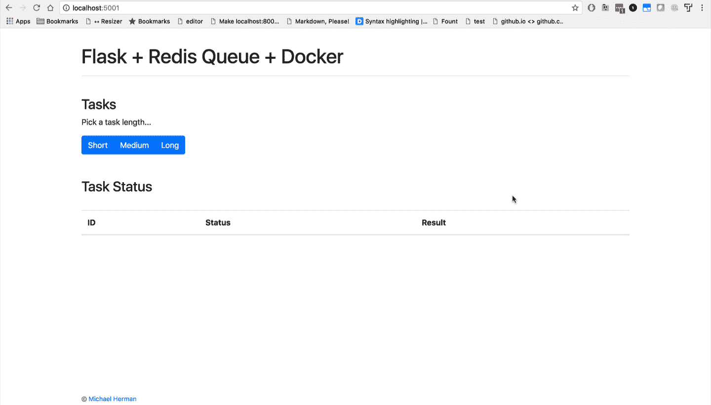
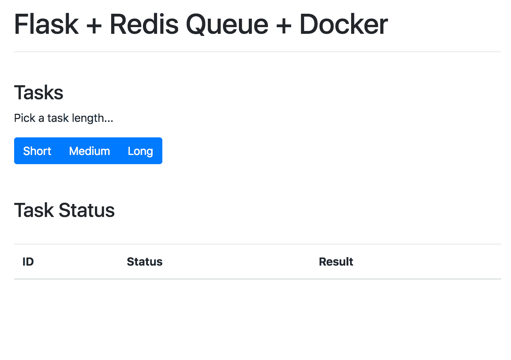
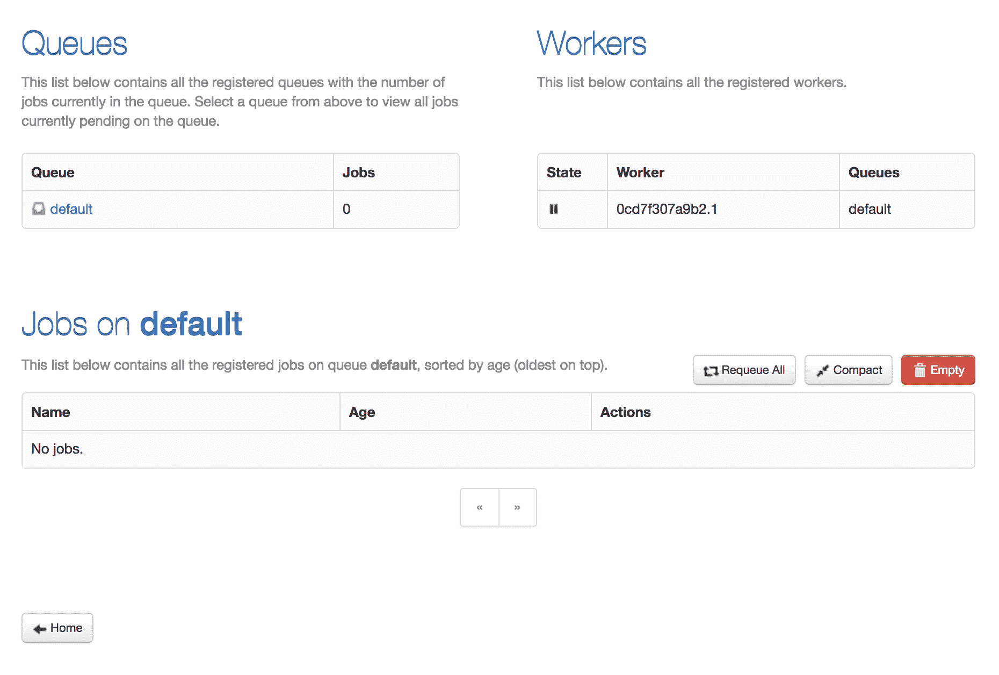

# 使用 Flask 和 Redis 队列的异步任务

> 原文：<https://testdriven.io/blog/asynchronous-tasks-with-flask-and-redis-queue/>

如果一个长时间运行的任务是你的应用程序工作流的一部分，你应该在正常流程之外的后台处理它。

也许您的 web 应用程序要求用户在注册时提交一个缩略图(可能需要重新调整大小)并确认他们的电子邮件。如果您的应用程序处理了图像并直接在请求处理程序中发送了确认电子邮件，那么最终用户将不得不等待两者都完成。相反，您会希望将这些任务传递给任务队列，并让一个单独的工作进程来处理它，这样您就可以立即将响应发送回客户端。最终用户可以在客户端做其他事情，您的应用程序可以自由地响应其他用户的请求。

本教程着眼于如何配置 [Redis 队列](http://python-rq.org/) (RQ)来处理 Flask 应用程序中长时间运行的任务。

> 芹菜也是一种可行的解决方案。查看使用 Flask 和 Celery 的[异步任务](/blog/flask-and-celery/)了解更多信息。

## 目标

本教程结束时，您将能够:

1.  将 Redis 队列集成到 Flask 应用程序中，并创建任务。
2.  用容器装烧瓶并用码头工人重新分发。
3.  使用单独的工作进程在后台运行长时间运行的任务。
4.  设置 [RQ 仪表板](https://github.com/eoranged/rq-dashboard)来监控队列、作业和工人。
5.  用 Docker 缩放工人计数。

## 工作流程

我们的目标是开发一个 Flask 应用程序，它与 Redis Queue 一起处理正常请求/响应周期之外的长时间运行的流程。

1.  最终用户通过向服务器端发送 POST 请求开始一项新任务
2.  在视图中，一个任务被添加到队列中，任务 id 被发送回客户端
3.  使用 AJAX，当任务本身在后台运行时，客户机继续轮询服务器以检查任务的状态


最终，该应用程序将如下所示:



## 项目设置

想跟着去吗？克隆基础项目，然后检查代码和项目结构:

```py
`$ git clone https://github.com/mjhea0/flask-redis-queue --branch base --single-branch
$ cd flask-redis-queue` 
```

因为我们总共需要管理三个进程(Flask、Redis、worker)，所以我们将使用 Docker 来简化我们的工作流，以便可以从一个终端窗口管理它们。

要进行测试，请运行:

```py
`$ docker-compose up -d --build` 
```

打开浏览器进入 [http://localhost:5004](http://localhost:5004) 。您应该看到:



## 触发任务

在*project/client/static/main . js*中设置了一个事件处理程序，它监听一个按钮点击，并用适当的任务类型向服务器发送一个 AJAX POST 请求:`1`、`2`或`3`。

```py
`$('.btn').on('click',  function()  { $.ajax({ url:  '/tasks', data:  {  type:  $(this).data('type')  }, method:  'POST' }) .done((res)  =>  { getStatus(res.data.task_id); }) .fail((err)  =>  { console.log(err); }); });` 
```

在服务器端，已经在*project/server/main/views . py*中配置了一个视图来处理请求:

```py
`@main_blueprint.route("/tasks", methods=["POST"])
def run_task():
    task_type = request.form["type"]
    return jsonify(task_type), 202` 
```

我们只需要接通 Redis 队列。

## 重复队列

因此，我们需要启动两个新流程:Redis 和一个 worker。将它们添加到 *docker-compose.yml* 文件中:

```py
`version:  '3.8' services: web: build:  . image:  web container_name:  web ports: -  5004:5000 command:  python manage.py run -h 0.0.0.0 volumes: -  .:/usr/src/app environment: -  FLASK_DEBUG=1 -  APP_SETTINGS=project.server.config.DevelopmentConfig depends_on: -  redis worker: image:  web command:  python manage.py run_worker volumes: -  .:/usr/src/app environment: -  APP_SETTINGS=project.server.config.DevelopmentConfig depends_on: -  redis redis: image:  redis:6.2-alpine` 
```

将任务添加到“项目/服务器/主目录”中名为 *tasks.py* 的新文件中:

```py
`# project/server/main/tasks.py

import time

def create_task(task_type):
    time.sleep(int(task_type) * 10)
    return True` 
```

更新视图以连接到 Redis，对任务进行排队，并使用 id 进行响应:

```py
`@main_blueprint.route("/tasks", methods=["POST"])
def run_task():
    task_type = request.form["type"]
    with Connection(redis.from_url(current_app.config["REDIS_URL"])):
        q = Queue()
        task = q.enqueue(create_task, task_type)
    response_object = {
        "status": "success",
        "data": {
            "task_id": task.get_id()
        }
    }
    return jsonify(response_object), 202` 
```

不要忘记进口:

```py
`import redis
from rq import Queue, Connection
from flask import render_template, Blueprint, jsonify, request, current_app

from project.server.main.tasks import create_task` 
```

更新`BaseConfig`:

```py
`class BaseConfig(object):
    """Base configuration."""

    WTF_CSRF_ENABLED = True
    REDIS_URL = "redis://redis:6379/0"
    QUEUES = ["default"]` 
```

你注意到我们在`REDIS_URL`中引用了`redis`服务(来自 *docker-compose.yml* )而不是`localhost`或其他 IP 吗？查看 Docker Compose [文档](https://docs.docker.com/compose/networking/)以获得更多关于通过主机名连接到其他服务的信息。

最后，我们可以使用一个 Redis 队列 [worker](http://python-rq.org/docs/workers/) ，来处理队列顶部的任务。

*manage.py* :

```py
`@cli.command("run_worker")
def run_worker():
    redis_url = app.config["REDIS_URL"]
    redis_connection = redis.from_url(redis_url)
    with Connection(redis_connection):
        worker = Worker(app.config["QUEUES"])
        worker.work()` 
```

这里，我们设置了一个定制的 CLI 命令来触发 worker。

值得注意的是，当命令被执行时，`@cli.command()`装饰器将提供对应用程序上下文以及来自 *project/server/config.py* 的相关配置变量的访问。

也添加导入:

```py
`import redis
from rq import Connection, Worker` 
```

将依赖项添加到需求文件中:

构建并旋转新容器:

```py
`$ docker-compose up -d --build` 
```

要触发新任务，请运行:

```py
`$ curl -F type=0 http://localhost:5004/tasks` 
```

您应该会看到类似这样的内容:

```py
`{
  "data": {
    "task_id": "bdad64d0-3865-430e-9cc3-ec1410ddb0fd"
  },
  "status": "success"
}` 
```

## 任务状态

回到客户端的事件处理程序:

```py
`$('.btn').on('click',  function()  { $.ajax({ url:  '/tasks', data:  {  type:  $(this).data('type')  }, method:  'POST' }) .done((res)  =>  { getStatus(res.data.task_id); }) .fail((err)  =>  { console.log(err); }); });` 
```

一旦最初的 AJAX 请求返回响应，我们就继续每秒调用带有任务 id 的`getStatus()`。如果响应成功，一个新行被添加到 DOM 上的表中。

```py
`function  getStatus(taskID)  { $.ajax({ url:  `/tasks/${taskID}`, method:  'GET', }) .done((res)  =>  { const  html  =  `
 <tr>
 <td>${res.data.task_id}</td>
 <td>${res.data.task_status}</td>
 <td>${res.data.task_result}</td>
 </tr>`; $('#tasks').prepend(html); const  taskStatus  =  res.data.task_status; if  (taskStatus  ===  'finished'  ||  taskStatus  ===  'failed')  return  false; setTimeout(function  ()  { getStatus(res.data.task_id); },  1000); }) .fail((err)  =>  { console.log(err); }); }` 
```

更新视图:

```py
`@main_blueprint.route("/tasks/<task_id>", methods=["GET"])
def get_status(task_id):
    with Connection(redis.from_url(current_app.config["REDIS_URL"])):
        q = Queue()
        task = q.fetch_job(task_id)
    if task:
        response_object = {
            "status": "success",
            "data": {
                "task_id": task.get_id(),
                "task_status": task.get_status(),
                "task_result": task.result,
            },
        }
    else:
        response_object = {"status": "error"}
    return jsonify(response_object)` 
```

向队列添加新任务:

```py
`$ curl -F type=1 http://localhost:5004/tasks` 
```

然后，从响应中获取`task_id`并调用更新的端点来查看状态:

```py
`$ curl http://localhost:5004/tasks/5819789f-ebd7-4e67-afc3-5621c28acf02

{
  "data": {
    "task_id": "5819789f-ebd7-4e67-afc3-5621c28acf02",
    "task_result": true,
    "task_status": "finished"
  },
  "status": "success"
}` 
```

也在浏览器中测试一下:


## 仪表盘

RQ Dashboard 是一个轻量级的、基于 web 的 Redis 队列监控系统。

要进行设置，首先在“项目”目录中添加一个名为“仪表板”的新目录。然后，将新的 *Dockerfile* 添加到新创建的目录中:

```py
`FROM  python:3.10-alpine

RUN  pip install rq-dashboard

# https://github.com/rq/rq/issues/1469
RUN  pip uninstall -y click
RUN  pip install click==7.1.2

EXPOSE  9181

CMD  ["rq-dashboard"]` 
```

简单地将服务添加到 *docker-compose.yml* 文件中，如下所示:

```py
`version:  '3.8' services: web: build:  . image:  web container_name:  web ports: -  5004:5000 command:  python manage.py run -h 0.0.0.0 volumes: -  .:/usr/src/app environment: -  FLASK_DEBUG=1 -  APP_SETTINGS=project.server.config.DevelopmentConfig depends_on: -  redis worker: image:  web command:  python manage.py run_worker volumes: -  .:/usr/src/app environment: -  APP_SETTINGS=project.server.config.DevelopmentConfig depends_on: -  redis redis: image:  redis:6.2-alpine dashboard: build:  ./project/dashboard image:  dashboard container_name:  dashboard ports: -  9181:9181 command:  rq-dashboard -H redis depends_on: -  redis` 
```

构建映像并旋转容器:

```py
`$ docker-compose up -d --build` 
```

导航到 [http://localhost:9181](http://localhost:9181) 查看仪表板:



开始几项工作来全面测试仪表板:


试着增加几个工人，看看会有什么影响:

```py
`$ docker-compose up -d --build --scale worker=3` 
```

## 结论

这是关于如何配置 Redis 队列以在 Flask 应用程序中运行长时间运行的任务的基本指南。您应该让队列处理任何可能阻塞或减慢面向用户的代码的进程。

寻找一些挑战？

1.  使用 Kubernetes 或 Docker Swarm 在多个[digital ocean](https://m.do.co/c/d8f211a4b4c2)droplet 上部署该应用程序。
2.  为新的端点编写单元测试。(用 [fakeredis](https://github.com/jamesls/fakeredis) 模拟 Redis 实例)
3.  尝试使用 [Flask-SocketIO](https://flask-socketio.readthedocs.io) 打开一个 websocket 连接，而不是轮询服务器。

从[回购](https://github.com/mjhea0/flask-redis-queue)中抓取代码。