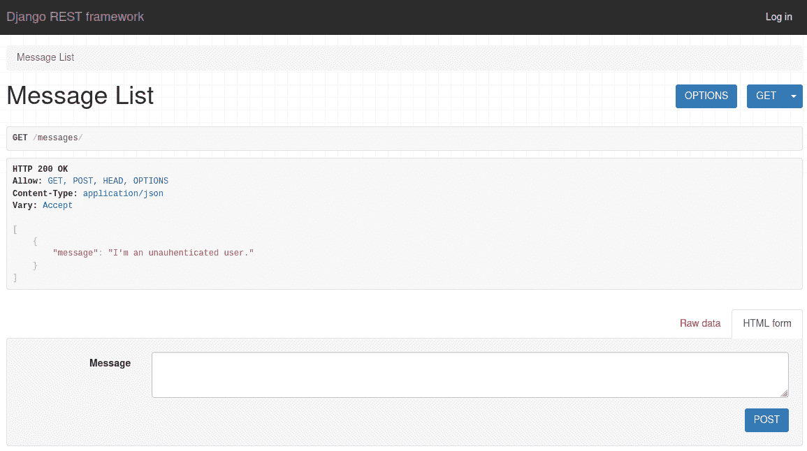
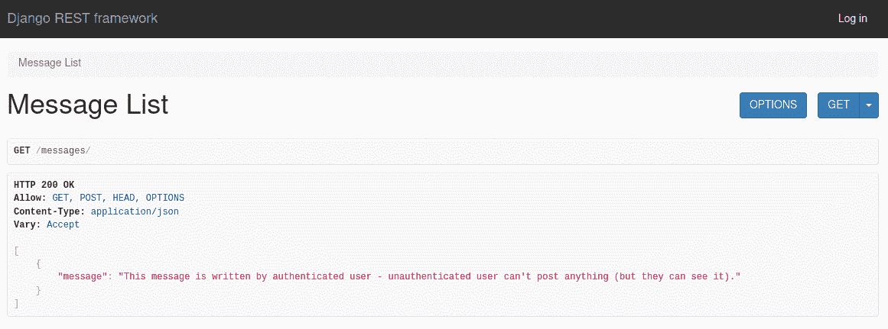
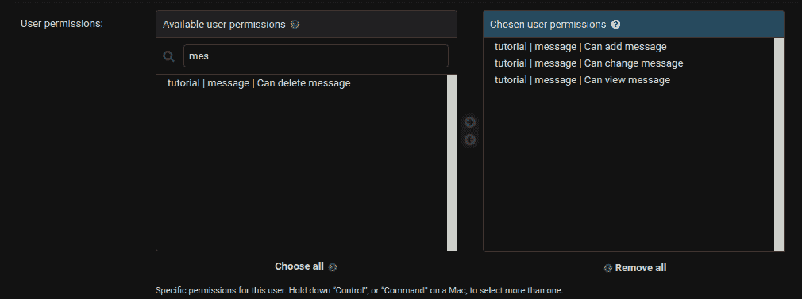
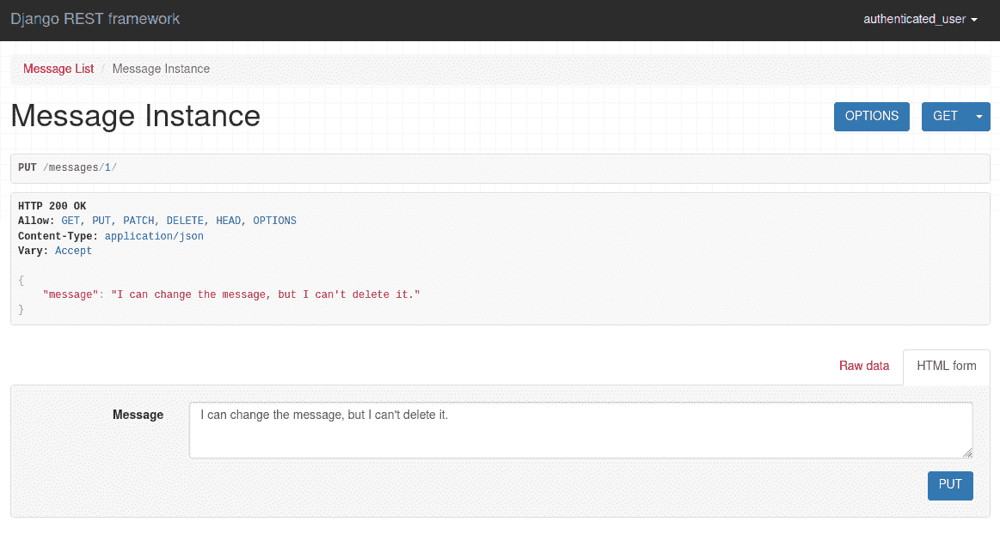
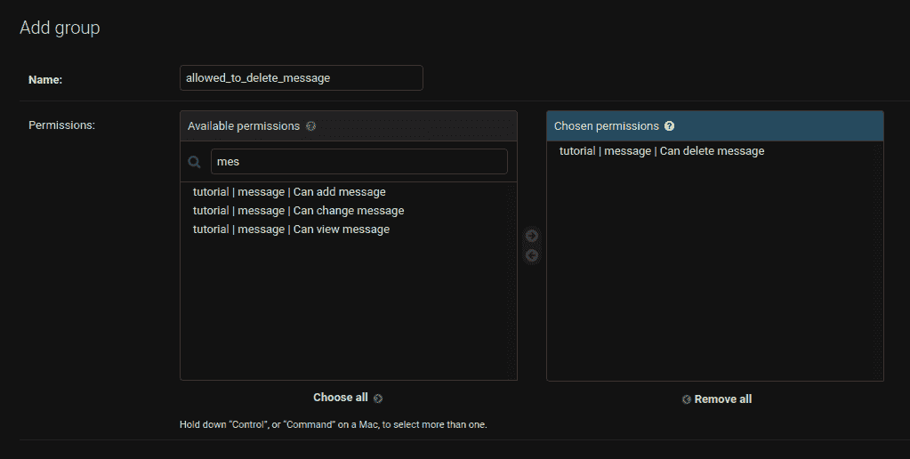
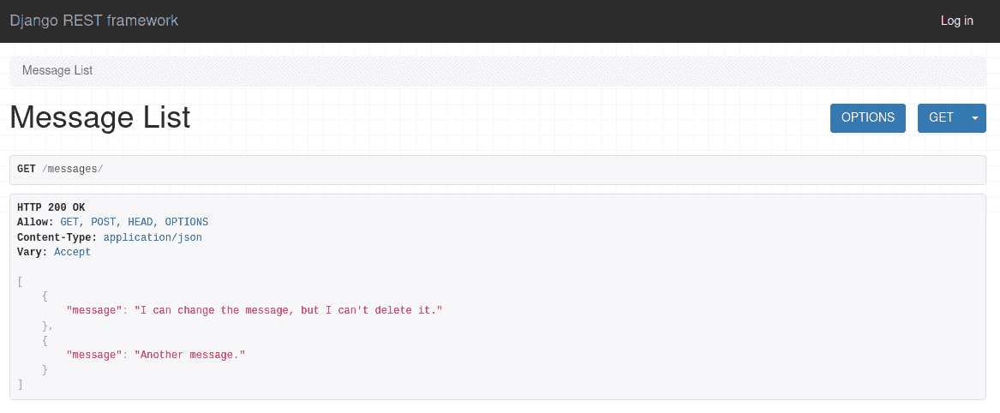
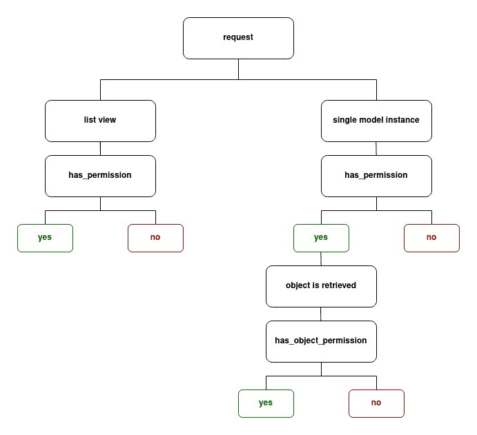
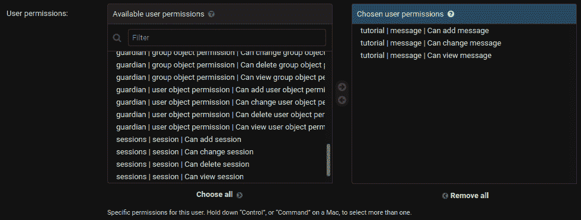

# Django REST 框架中内置的权限类

> 原文：<https://testdriven.io/blog/built-in-permission-classes-drf/>

本文着眼于 Django REST 框架(DRF)中内置的权限类是如何工作的。

--

**Django REST 框架权限系列:**

1.  [Django REST 框架中的权限](/blog/drf-permissions)
2.  [Django REST 框架中内置的权限类](/blog/built-in-permission-classes-drf)(本文！)
3.  [Django REST 框架中的自定义权限类](/blog/custom-permission-classes-drf)

## 目标

完成本文后，您应该能够:

1.  解释 DRF 的七个内置权限类之间的区别
2.  设置特定模型和对象的权限
3.  使用内置权限类来设置全局权限策略

## 内置类

虽然你可以创建自己的权限类，但 DRF 提供了七个内置类，旨在让你的生活更轻松:

1.  [允许](https://www.django-rest-framework.org/api-guide/permissions/#allowany)使用
2.  [被认证](https://www.django-rest-framework.org/api-guide/permissions/#isauthenticated)
3.  [isauthenticedorreadonly](https://www.django-rest-framework.org/api-guide/permissions/#isauthenticatedorreadonly)
4.  [是管理员](https://www.django-rest-framework.org/api-guide/permissions/#isadminuser)
5.  姜戈模型权限
6.  [djangodelpermissionsoranonreadonly](https://www.django-rest-framework.org/api-guide/permissions/#djangomodelpermissionsoranonreadonly)
7.  [DjangoObjectPermissions](https://www.django-rest-framework.org/api-guide/permissions/#djangoobjectpermissions)

使用它们就像在特定 API 视图的`permission_classes`列表中包含类一样简单。它们从完全开放(`AllowAny`)到只授予管理员用户的访问权限(`IsAdminUser`)。只需很少的额外工作，您就可以使用它们来实现细粒度的访问控制——无论是在模型上还是在对象级别上。您还可以为所有 API 端点全局设置权限。

除了最后一个类`DjangoObjectPermissions`，所有这些类都只覆盖了`has_permission`方法，并从`BasePermission`类继承了`has_object_permission`。`BasePermission`类中的`has_object_permission`总是返回`True`，所以它对对象级访问限制没有影响:

| 权限类别 | 拥有 _ 权限 | 拥有 _ 对象 _ 权限 |
| --- | --- | --- |
| 允许任何 | ✓ | ✗ |
| 已认证 | ✓ | ✗ |
| isauthentaicatedorreadonly | ✓ | ✗ |
| IsAdminUser | ✓ | ✗ |
| DjangoModelPermissions | ✓ | ✗ |
| djangodelpermissionsoranonreadonly | ✓ | ✗ |
| DjangoObjectPermissions | 通过扩展`DjangoModelPermissions` | ✓ |

> 关于`has_permission`与`has_object_permission`的更多信息，请务必阅读本系列的第一篇文章，Django REST 框架中的[权限](/blog/drf-permissions)。

## 允许任何

最开放的权限是`AllowAny`。`AllowAny`上的`has_permission`和`has_object_permission`方法总是不做任何检查就返回`True`。没有必要使用它(通过不设置 permission 类，您隐式地设置了这个类)，但您仍然应该使用它，因为它使意图变得明确，并有助于保持整个应用程序的一致性。

通过在视图中包含`permission_classes`来指定它:

```
`from rest_framework import viewsets
from rest_framework.permissions import AllowAny

from .models import Message
from .serializers import MessageSerializer

class MessageViewSet(viewsets.ModelViewSet):

    permission_classes = [AllowAny] # built-in permission class used

    queryset = Message.objects.all()
    serializer_class = MessageSerializer` 
```

任何人，甚至未经身份验证的用户，都可以使用任何 HTTP 请求方法访问 API 端点:



## 已认证

`IsAuthenticated`检查请求是否有用户，以及该用户是否被认证。将`permission_classes`设置为`IsAuthenticated`意味着**只有经过认证的**用户才能使用任何请求方法访问 API 端点。

```
`from rest_framework import viewsets
from rest_framework.permissions import IsAuthenticated

from .models import Message
from .serializers import MessageSerializer

class MessageViewSet(viewsets.ModelViewSet):

    permission_classes = [IsAuthenticated] # permission class changed

    queryset = Message.objects.all()
    serializer_class = MessageSerializer` 
```

未经身份验证的用户现在被拒绝访问:


## isauthentaicatedorreadonly

当权限设置为`IsAuthenticatedOrReadOnly`时，请求必须或者有一个经过验证的用户，或者使用一个安全/只读的 HTTP 请求方法(GET、HEAD、OPTIONS)。这意味着**每个用户**将能够**看到所有**的消息，但是只有登录的用户能够**添加、更改或删除**对象。

```
`from rest_framework import viewsets
from rest_framework.permissions import IsAuthenticatedOrReadOnly

from .models import Message
from .serializers import MessageSerializer

class MessageViewSet(viewsets.ModelViewSet):

    permission_classes = [IsAuthenticatedOrReadOnly] # ReadOnly added

    queryset = Message.objects.all()
    serializer_class = MessageSerializer` 
```

未经验证的用户可以查看由经过验证的用户发布的消息，但是他们不能对其进行任何操作或添加他们自己的消息:



## IsAdminUser

权限设置为`IsAdminUser`意味着请求需要有一个用户，并且该用户必须将[的 is_staff](https://docs.djangoproject.com/en/3.2/ref/contrib/auth/#django.contrib.auth.models.User.is_staff) 设置为`True`。这意味着只有管理员用户可以**查看、添加、更改或删除**对象。

```
`from rest_framework import viewsets
from rest_framework.permissions import IsAdminUser

from .models import Message
from .serializers import MessageSerializer

class MessageViewSet(viewsets.ModelViewSet):

    permission_classes = [IsAdminUser] # only for admin users

    queryset = Message.objects.all()
    serializer_class = MessageSerializer` 
```

有趣的是，未经身份验证的用户和没有管理员权限的经过身份验证的用户会得到不同的错误。

对于未经验证的用户，会引发一个`NotAuthenticated`异常:


同时，对于没有管理员访问权限的已验证用户，会引发一个`PermissionDenied`异常:


## DjangoModelPermissions

`DjangoModelPermissions`允许我们分别为每个用户设置任意权限组合。然后权限检查用户是否通过了身份验证，以及他们是否对模型拥有`add`、`change`或`delete`用户[权限](https://docs.djangoproject.com/en/3.2/topics/auth/default/#default-permissions)。

```
`from rest_framework import viewsets
from rest_framework.permissions import DjangoModelPermissions

from .models import Message
from .serializers import MessageSerializer

class MessageViewSet(viewsets.ModelViewSet):

    permission_classes = [DjangoModelPermissions]

    queryset = Message.objects.all()
    serializer_class = MessageSerializer` 
```

与其他权限不同，这并不是设置权限的结束。您需要为特定用户设置权限:



如果您查看帖子的单一视图，您可以看到该特定用户可以编辑帖子，但不能删除它:



`DjangoModelPermissions`不一定需要分配给单个用户。你可以用它获得[组](https://docs.djangoproject.com/en/3.2/topics/auth/default/#groups)的权限也可以。以下是允许删除邮件的群组:



您可以在这里看到，该组的成员可以删除该消息:


> `DjangoModelPermissions`必须仅应用于具有`queryset`属性或`get_queryset()`方法的视图。
> 
> 例如， [CreateAPIView](https://www.django-rest-framework.org/api-guide/generic-views/#createapiview) 通用视图不需要 queryset，所以如果你在它上面设置`DjangoModelPermissions`，你会得到一个断言错误。但是，如果您执行查询，即使您没有使用 queryset，`DjangoModelPermissions`也将工作:
> 
> ```
> class NewMessage(generics.CreateAPIView):
>     queryset = Message.objects.all()
>     permission_classes = [DjangoModelPermissions]
>     serializer_class = MessageSerializer 
> ```

## djangodelpermissionsoranonreadonly

`DjangoModelPermissionsOrAnonReadOnly`扩展了`DjangoModelPermissions`，只改变了一件事:将`authenticated_users_only`设置为`False`。

```
`from rest_framework import viewsets
from rest_framework.permissions import DjangoModelPermissionsOrAnonReadOnly

from .models import Message
from .serializers import MessageSerializer

class MessageViewSet(viewsets.ModelViewSet):

    permission_classes = [DjangoModelPermissionsOrAnonReadOnly]

    queryset = Message.objects.all()
    serializer_class = MessageSerializer` 
```

匿名用户可以看到这些对象，但不能与之交互:



## DjangoObjectPermissions

虽然`DjangoModelPermissions`限制了用户与模型(所有实例)交互的权限，但是`DjangoObjectPermissions`限制了与模型的单个实例(一个对象)的交互。要使用`DjangoObjectPermissions`，你需要一个支持对象级权限的权限后端。我们将看看[姜戈-卫报](https://github.com/django-guardian/django-guardian)。

> 虽然有相当多的[包](https://djangopackages.org/grids/g/perms/)覆盖了 Django 权限， [DRF 明确提到了 django-guardian](https://www.django-rest-framework.org/api-guide/permissions/#djangoobjectpermissions) ，这就是为什么我们在本文中使用它。
> 
> 处理对象级权限的其他包:
> 
> 1.  [drf-扩展](https://chibisov.github.io/drf-extensions/docs/#object-permissions)
> 2.  姜戈-奥索
> 3.  [姜戈-规则](https://github.com/dfunckt/django-rules)
> 4.  [django-角色-权限](https://django-role-permissions.readthedocs.io/en/stable/)

### 安装 django-guardian

要使用 django-guardian，首先需要安装它:

```
`$ pip install django-guardian` 
```

然后，将其添加到`INSTALLED_APPS`和`AUTHENTICATION_BACKENDS`:

```
`# settings.py

INSTALLED_APPS = [
    # ...
    'rest_framework',
    'guardian',
]

# ...

AUTHENTICATION_BACKENDS = (
    'django.contrib.auth.backends.ModelBackend',
    'guardian.backends.ObjectPermissionBackend',
)` 
```

最后，运行迁移:

```
`(venv)$ python manage.py migrate` 
```

如果你想查看单个对象的权限，你需要使用 [GuardedModelAdmin](https://django-guardian.readthedocs.io/en/stable/api/guardian.admin.html#guardedmodeladmin) 而不是 [ModelAdmin](https://docs.djangoproject.com/en/3.2/ref/contrib/admin/#django.contrib.admin.ModelAdmin) 。你可以在一个 *admin.py* 文件中这样做:

```
`# admin.py

from django.contrib import admin
from guardian.admin import GuardedModelAdmin
from tutorial.models import Message

class MessageAdmin(GuardedModelAdmin):
    pass

admin.site.register(Message, MessageAdmin)` 
```

现在，如果你在管理面板中打开一个单独的对象，在右上角会有一个新的按钮叫做“对象权限”。单击它，将打开“对象权限”面板:


### 使用 DjangoObjectPermissions

现在知道[`has_permission`和`has_object_permission`](/blog/drf-permissions/) 的区别将会派上用场。简而言之，DRF 首先检查请求是否有访问模型的权限。如果没有，DRF 不关心对象级权限。



这意味着如果您想要检查对象级权限，用户**必须拥有**模型权限。对象级权限的一个很好的用例是只允许对象的所有者更改或删除它。这里有一个视图，只允许对象的创建者删除它:

```
`# views.py

from guardian.shortcuts import assign_perm
from rest_framework import viewsets
from rest_framework.permissions import DjangoObjectPermissions

from .models import Message
from .serializers import MessageSerializer

class MessageViewSet(viewsets.ModelViewSet):

    permission_classes = [DjangoObjectPermissions] # class changed

    queryset = Message.objects.all()
    serializer_class = MessageSerializer

    def perform_create(self, serializer): # new function
        instance = serializer.save()
        assign_perm("delete_message", self.request.user, instance)` 
```

如您所见，有两个重要的变化:

1.  第一，权限类是`DjangoObjectPermissions`。
2.  接下来，我们开始创建模型实例。我们不能给一个不存在的对象分配权限，所以我们首先需要创建实例，然后通过 django-guardian 中的 [assign_perm](https://django-guardian.readthedocs.io/en/stable/api/guardian.shortcuts.html#assign-perm) 快捷方式给它分配对象权限。

`assign_perm`是一个 django-guardian 函数，用于向某些用户或组分配权限。它需要三个参数:

1.  权限:`delete_message`
2.  用户或组:`self.request.user`
3.  对象(默认为`None` ): `instance`

同样，为了使对象权限起作用，用户**必须拥有相应模型的**模型级权限。假设您有两个对模型拥有相同权限的用户:


您使用上面的代码将权限只分配给创建者。 *user_1* -对象的创建者-可以删除它，但是 *user_2* 不能删除它，尽管他们有模型级别的权限:


如果我们删除 *user_1* 在模型上删除任何对象的权限:



他们不能删除他们的邮件:


即使他们拥有删除该特定对象的权限:


## 全局权限

您可以使用内置的权限类在您的 *settings.py* 文件中轻松设置全局权限。例如:

```
`# settings.py

REST_FRAMEWORK = {
    'DEFAULT_PERMISSION_CLASSES': [
        'rest_framework.permissions.IsAuthenticated',
    ]
}` 
```

`DEFAULT_PERMISSION_CLASSES`仅适用于没有明确设置权限的视图或对象。

> 这里不一定需要使用内置类。你也可以使用你自己的定制类。

## 结论

就是这样。您现在应该知道如何使用 Django REST 框架的七个内置权限类。它们从完全打开(`AllowAny`)到基本关闭(`IsAdminUser`)不等。

您可以在模型(`DjangoModelPermissions`)或单个对象(`DjangoObjectPermissions`)上设置全局权限。还有一些类允许你限制“不安全”的 HTTP 方法，但是允许任何人使用安全的方法(`IsAuthenticatedOrReadOnly`、`DjangoModelPermissionsOrAnonReadOnly`)。

如果您没有任何特定的需求，内置的类应该可以满足大多数情况。另一方面，如果你有一些特殊的要求，你应该建立自己的权限类。

--

**Django REST 框架权限系列:**

1.  [Django REST 框架中的权限](/blog/drf-permissions)
2.  [Django REST 框架中内置的权限类](/blog/built-in-permission-classes-drf)(本文！)
3.  [Django REST 框架中的自定义权限类](/blog/custom-permission-classes-drf)