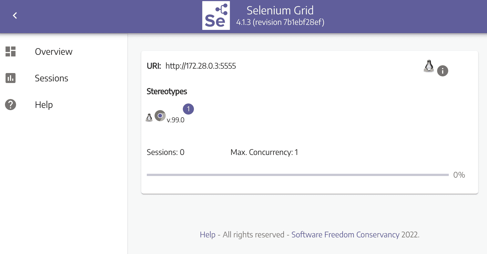
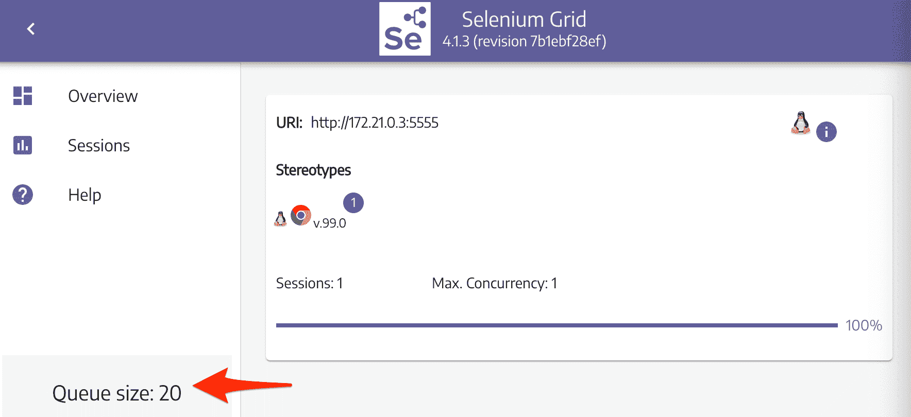
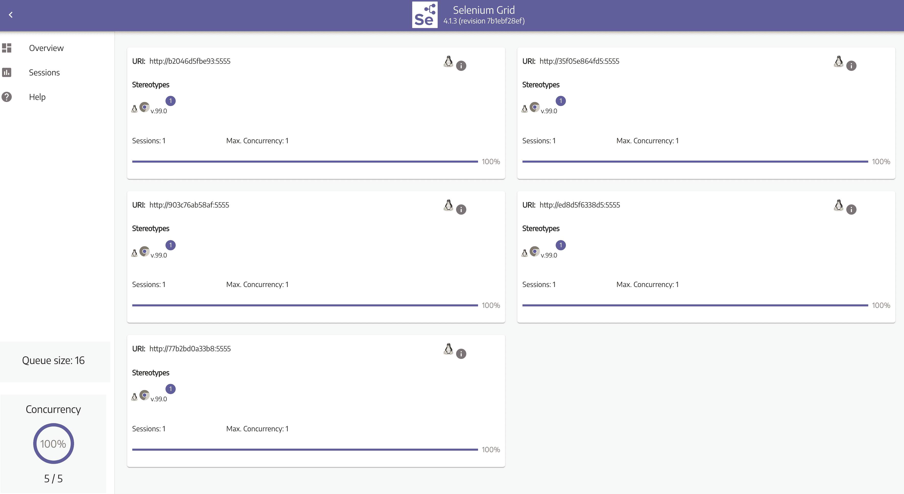

# 基于 Selenium Grid 和 Docker Swarm 的并行 Web 抓取

> 原文：<https://testdriven.io/blog/concurrent-web-scraping-with-selenium-grid-and-docker-swarm/>

在本教程中，我们将看看如何与 Selenium Grid 和 Docker 并行运行基于 Python 和 Selenium 的 web scraper。我们还将了解如何使用 Docker Swarm 快速扩展 DigitalOcean 上的 Selenium 网格，以提高刮刀的效率。最后，我们将创建一个 bash 脚本，自动启动和关闭数字海洋上的资源。

*依赖关系*:

1.  文档 v20.10.13
2.  python 3 . 10 . 4 版
3.  硒 4.1.3 版

## 学习目标

本教程结束时，您将能够:

1.  配置 Selenium Grid 以使用 Docker
2.  通过 Docker 机器将 Selenium 网格部署到数字海洋
3.  创建一个 Docker 集群
4.  在 Docker 集群上扩展 Selenium 网格
5.  自动部署 Selenium Grid 和 Docker Swarm

## 入门指南

从使用 web 抓取脚本克隆基础项目开始，创建并激活一个虚拟环境，并安装依赖项:

```
`$ git clone https://github.com/testdrivenio/selenium-grid-docker-swarm.git --branch base --single-branch
$ cd selenium-grid-docker-swarm
$ python3.10 -m venv env
$ source env/bin/activate
(env)$ pip install -r requirements.txt` 
```

> 根据您的环境，上述命令可能会有所不同。

测试刮刀:

```
`(env)$ python project/script.py` 
```

您应该会看到类似如下的内容:

```
`Scraping random Wikipedia page...
[
  {
    'url': 'https://en.wikipedia.org/wiki/Andreas_Reinke',
    'title': 'Andreas Reinke',
    'last_modified': ' This page was last edited on 10 January 2022, at 23:11\xa0(UTC).'
  }
]
Finished!` 
```

本质上，该脚本向 [Wikipedia:Random](https://en.wikipedia.org/wiki/Wikipedia:Random) - `https://en.wikipedia.org/wiki/Special:Random` -请求关于随机文章的信息，使用 [Selenium](http://www.seleniumhq.org/projects/webdriver/) 自动与站点交互，使用 [Beautiful Soup](https://www.crummy.com/software/BeautifulSoup/) 解析 HTML。

它是在[用 Python 和 Selenium 构建并发 Web scraper】教程中构建的 Scraper 的修改版本。请查看教程以及脚本中的代码以获取更多信息。](/blog/building-a-concurrent-web-scraper-with-python-and-selenium)

## 配置 Selenium 网格

接下来，让我们启动 [Selenium Grid](https://www.selenium.dev/documentation/en/grid/) 来简化脚本在多台机器上的并行运行。我们还将使用 Docker 和 Docker Compose 以最少的安装和配置来管理这些机器。

向根目录添加一个 *docker-compose.yml* 文件:

```
`version:  '3.8' services: hub: image:  selenium/hub:4.1.3 ports: -  4442:4442 -  4443:4443 -  4444:4444 chrome: image:  selenium/node-chrome:4.1.3 depends_on: -  hub environment: -  SE_EVENT_BUS_HOST=hub -  SE_EVENT_BUS_PUBLISH_PORT=4442 -  SE_EVENT_BUS_SUBSCRIBE_PORT=4443` 
```

这里，我们使用官方的 [Selenium Docker](https://hub.docker.com/r/selenium/) 图片来建立一个基本的 Selenium 网格，它由一个 hub 和一个 Chrome 节点组成。我们使用了`4.1.3`标签，它与以下版本的 Selenium、WebDriver、Chrome 和 Firefox 相关联:

*   硒:4.1.3
*   谷歌浏览器
*   chrome 驱动程序:99.0.4844.51
*   Mozilla Firefox: 98.0.2
*   壁虎:0 . 3 . 0

> 想用不同的版本？从[发布](https://github.com/SeleniumHQ/docker-selenium/releases)页面中找到合适的标签。

提取并运行图像:

在您的浏览器中导航到 [http://localhost:4444](http://localhost:4444) 以确保 hub 启动并运行一个 Chrome 节点:



由于 Selenium Hub 运行在不同的机器上(在 Docker 容器中)，我们需要在*项目/scrapers/scraper.py* 中配置远程驱动程序:

```
`def get_driver():
    options = webdriver.ChromeOptions()
    options.add_argument("--headless")

    # initialize driver
    driver = webdriver.Remote(
            command_executor='http://localhost:4444/wd/hub',
            desired_capabilities=DesiredCapabilities.CHROME)
    return driver` 
```

添加导入:

```
`from selenium.webdriver.common.desired_capabilities import DesiredCapabilities` 
```

再次运行刮刀:

```
`(env)$ python project/script.py` 
```

当 scraper 运行时，您应该看到“Sessions”变为 1，表明它正在使用中:


## 部署到数字海洋

如果您还没有 DigitalOcean 的帐户，请注册该帐户。要使用[数字海洋 API](https://developers.digitalocean.com/documentation/v2/) ，你还需要[生成](https://www.digitalocean.com/docs/apis-clis/api/create-personal-access-token/)一个访问令牌。

> 在此获得 10 美元的数字海洋信用点数[。](https://m.do.co/c/d8f211a4b4c2)

将令牌作为环境变量添加:

```
`(env)$ export DIGITAL_OCEAN_ACCESS_TOKEN=[your_token]` 
```

使用 Docker Machine 供应新的 droplet:

```
`(env)$ docker-machine create \
        --driver digitalocean \
        --digitalocean-access-token $DIGITAL_OCEAN_ACCESS_TOKEN \
        --digitalocean-region "nyc1" \
        --digitalocean-image "debian-10-x64" \
        --digitalocean-size "s-4vcpu-8gb" \
        --engine-install-url "https://releases.rancher.com/install-docker/19.03.9.sh" \
        selenium-hub;` 
```

> `--engine-install-url`是必需的，因为在撰写本文时，Docker v20.10.13 不能与 Docker 机器一起使用。

接下来，将 Docker 守护进程指向新创建的机器，并将其设置为活动机器:

```
`(env)$ docker-machine env selenium-hub
(env)$ eval $(docker-machine env selenium-hub)` 
```

旋转液滴上的两个容器:

```
`(env)$ docker-compose up -d` 
```

一旦启动，获取液滴的 IP:

```
`(env)$ docker-machine ip selenium-hub` 
```

确保 Selenium Grid 在 [http://YOUR_IP:4444](http://YOUR_IP:4444) 打开，然后更新*project/scrapers/scraper . py*中的 IP 地址:

```
`command_executor='http://YOUR_IP:4444/wd/hub',` 
```

运行刮刀:

```
`(env)$ python project/script.py` 
```

同样，导航到网格仪表板并确保会话处于活动状态。您应该在终端中看到以下输出:

```
`Scraping random Wikipedia page...
[
  {
    'url': 'https://en.wikipedia.org/wiki/David_Hidalgo',
    'title': 'David Hidalgo',
    'last_modified': ' This page was last edited on 11 November 2021, at 01:24\xa0(UTC).'
  }
]
Finished!` 
```

到目前为止，我们只在维基百科上搜集了一篇文章。如果我们想抓取多篇文章呢？

```
`(env)$ for i in {1..21}; do {
          python project/script.py &
        };
        done
        wait` 
```

再次导航到网格仪表板。您应该看到其中一个请求与 20 个排队请求一起运行:



因为我们只有一个节点在运行，所以需要一段时间才能完成(在我这边只需要 1.5 分钟)。我们可以增加几个节点的实例，但是每个节点都必须争用 droplet 上的资源。最好在几个 droplets 上部署 hub 和一些节点。这就是 Docker Swarm 发挥作用的地方。

## 运行码头群

因此，使用 [Docker Swarm](https://docs.docker.com/engine/swarm/) (或者“docker swarm mode”，如果你想更准确的话)，我们可以在许多机器上部署单个 Selenium 网格。

首先在当前机器上初始化 Docker Swarm:

```
`(env)$ docker swarm init --advertise-addr [YOUR_IP]` 
```

您应该会看到类似这样的内容:

```
`Swarm initialized: current node (mky1a6z8rjaeaeiucvzyo355l) is now a manager.

To add a worker to this swarm, run the following command:

    docker swarm join --token SWMTKN-1-2136awhbig93jh8xunp8yp2wn0pw9i946dvmfrpi05tnpbxula-633h28mn97sxhbfn8479mmpx5 134.122.20.39:2377

To add a manager to this swarm, run 'docker swarm join-token manager' and follow the instructions.` 
```

请注意 join 命令，因为它包含一个[令牌](https://docs.docker.com/edge/engine/reference/commandline/swarm_join-token/)，我们需要它来将工人添加到集群中。

> 查看官方[文档](https://docs.docker.com/engine/swarm/join-nodes/#join-as-a-worker-node)获取更多关于添加节点到群组的信息。

接下来，在数字海洋上旋转三个新的水滴:

```
`(env)$ for i in 1 2 3; do
            docker-machine create \
              --driver digitalocean \
              --digitalocean-access-token $DIGITAL_OCEAN_ACCESS_TOKEN \
              --digitalocean-region "nyc1" \
              --digitalocean-image "debian-10-x64" \
              --digitalocean-size "s-4vcpu-8gb" \
              --engine-install-url "https://releases.rancher.com/install-docker/19.03.9.sh" \
              node-$i;
        done` 
```

然后把它们作为工人加入到蜂群中:

```
`(env)$ for i in 1 2 3; do
            docker-machine ssh node-$i \
              -- docker swarm join --token YOUR_JOIN_TOKEN;
        done` 
```

您应该会看到类似这样的内容:

```
`(env)$ for i in 1 2 3; do
            docker-machine ssh node-$i \
              -- docker swarm join --token SWMTKN-1-2136awhbig93jh8xunp8yp2wn0pw9i946dvmfrpi05tnpbxula-633h28mn97sxhbfn8479mmpx5 134.122.20.39:2377
        done
This node joined a swarm as a worker.
This node joined a swarm as a worker.
This node joined a swarm as a worker.` 
```

更新 *docker-compose.yml* 文件，以 Swarm 模式部署 Selenium 网格:

```
`version:  '3.8' services: hub: image:  selenium/hub:4.1.3 ports: -  4442:4442 -  4443:4443 -  4444:4444 deploy: mode:  replicated replicas:  1 placement: constraints: -  node.role == worker chrome: image:  selenium/node-chrome:4.1.3 depends_on: -  hub environment: -  SE_EVENT_BUS_HOST=hub -  SE_EVENT_BUS_PUBLISH_PORT=4442 -  SE_EVENT_BUS_SUBSCRIBE_PORT=4443 -  NODE_MAX_SESSION=1 entrypoint:  bash -c 'SE_OPTS="--host $$HOSTNAME" /opt/bin/entry_point.sh' deploy: replicas:  1 placement: constraints: -  node.role == worker` 
```

主要变化:

1.  *布局约束*:我们设置了`node.role == worker`的[布局约束](https://docs.docker.com/engine/swarm/services/#placement-constraints)，这样所有的任务都将在 worker 节点上运行。通常最好让管理器节点远离 CPU 和/或内存密集型任务。
2.  *Entrypoint* :这里，我们更新了 *entry_point.sh* [脚本](https://github.com/SeleniumHQ/docker-selenium/blob/4.1.3-20220327/Base/entry_point.sh)中的`SE_OPTS`中的主机集，这样运行在不同主机上的节点将能够成功链接回 hub。

这样，我们就可以部署堆栈了:

```
`(env)$ docker stack deploy --compose-file=docker-compose.yml selenium` 
```

让我们再添加几个节点:

```
`(env)$ docker service scale selenium_chrome=5

selenium_chrome scaled to 5
overall progress: 5 out of 5 tasks
1/5: running   [==================================================>]
2/5: running   [==================================================>]
3/5: running   [==================================================>]
4/5: running   [==================================================>]
5/5: running   [==================================================>]
verify: Service converged` 
```

您可以像这样检查堆栈的状态:

```
`(env)$ docker stack ps selenium` 
```

您还需要获得运行 hub 的机器的 IP 地址:

```
`(env)$ docker-machine ip $(docker service ps --format "{{.Node}}" selenium_hub)` 
```

再次更新*project/scrapers/scraper . py*中的 IP 地址:

```
`command_executor='http://YOUR_IP:4444/wd/hub',` 
```

测试一下:

```
`(env)$ for i in {1..21}; do {
          python project/script.py &
        };
        done
        wait` 
```

回到网格仪表板上的 [http://YOUR_IP:4444/](http://YOUR_IP:4444/) ，您应该看到五个节点，每个节点运行一个会话。还应该有 16 个排队的请求:



这应该运行得更快了。在我这边，花了 25 秒才跑完。

### 命令

想要查看服务吗？

要获得关于 Chrome 节点的更多信息以及每个节点的运行位置，请运行:

```
`(env)$ docker service ps selenium_chrome` 
```

移除服务:

```
`(env)$ docker service rm selenium_chrome
(env)$ docker service rm selenium_hub` 
```

旋转水滴:

```
`(env)$ docker-machine rm node-1 node-2 node-3
(env)$ docker-machine rm selenium-hub` 
```

## 自动化工作流程

现在，我们必须手动上下旋转资源。让我们来自动化这个过程，以便当您想要运行一个刮擦作业时，资源会自动旋转起来，然后被拆除。

*project/create.sh* :

```
`#!/bin/bash

echo "Spinning up four droplets..."

for i in 1 2 3 4; do
    docker-machine create \
        --driver digitalocean \
        --digitalocean-access-token $DIGITAL_OCEAN_ACCESS_TOKEN \
        --digitalocean-region "nyc1" \
        --digitalocean-image "debian-10-x64" \
        --digitalocean-size "s-4vcpu-8gb" \
        --engine-install-url "https://releases.rancher.com/install-docker/19.03.9.sh" \
        node-$i;
done

echo "Initializing Swarm mode..."

docker-machine ssh node-1 -- docker swarm init --advertise-addr $(docker-machine ip node-1)

echo "Adding the nodes to the Swarm..."

TOKEN=`docker-machine ssh node-1 docker swarm join-token worker | grep token | awk '{ print $5 }'`

docker-machine ssh node-2 "docker swarm join --token ${TOKEN}  $(docker-machine ip node-1):2377"
docker-machine ssh node-3 "docker swarm join --token ${TOKEN}  $(docker-machine ip node-1):2377"
docker-machine ssh node-4 "docker swarm join --token ${TOKEN}  $(docker-machine ip node-1):2377"

echo "Deploying Selenium Grid to http://$(docker-machine ip node-1):4444"

eval $(docker-machine env node-1)
docker stack deploy --compose-file=docker-compose.yml selenium
docker service scale selenium_chrome=5` 
```

*project/destroy.sh* :

```
`#!/bin/bash

echo "Bringing down the services"

docker service rm selenium_chrome
docker service rm selenium_hub

echo "Bringing down the droplets"

docker-machine rm node-1 node-2 node-3 node-4 -y` 
```

更新*项目/scrapers/scraper.py* 中的`get_driver()`获取地址:

```
`def get_driver(address):
    options = webdriver.ChromeOptions()
    options.add_argument("--headless")

    # initialize driver
    driver = webdriver.Remote(
                command_executor=f'http://{address}:4444/wd/hub',
                desired_capabilities=DesiredCapabilities.CHROME)
    return driver` 
```

更新 *project/script.py* 中的主块:

```
`if __name__ == '__main__':
    browser = get_driver(sys.argv[1])
    data = run_process(browser)
    print(data)
    browser.quit()
    print(f'Finished!')` 
```

考验的时候到了！

```
`(env)$ sh project/create.sh` 
```

运行刮刀:

```
`(env)$ docker-machine env node-1
(env)$ eval $(docker-machine env node-1)
(env)$ NODE=$(docker service ps --format "{{.Node}}" selenium_hub)
(env)$ for i in {1..21}; do {
          python project/script.py $(docker-machine ip $NODE) &
        };
        done
        wait` 
```

完成后将资源带下来:

```
`(env)$ sh project/destroy.sh` 
```

## 后续步骤

尝试这些挑战:

1.  目前，我们没有对收集到的数据做任何事情。尝试运行一个数据库，并向抓取脚本添加一个函数，将数据写入数据库。
2.  Selenium 还用于基于浏览器的端到端测试。有了 Selenium Grid，你可以在不同的操作系统上运行不同版本的 Chrome 和 Firefox。换句话说，你可以运行多个节点，每个节点都有不同版本的 Chrome 和 Firefox，你可以对它们进行测试。自己尝试一下。*查看使用 Selenium Grid 和 Docker 的[分布式测试教程，看看这是怎么回事！](/blog/distributed-testing-with-selenium-grid)*
3.  将 Docker Swarm 从混合中分离出来，并添加 Kubernetes。

和往常一样，你可以在 [repo](https://github.com/testdrivenio/selenium-grid-docker-swarm) 中找到代码。