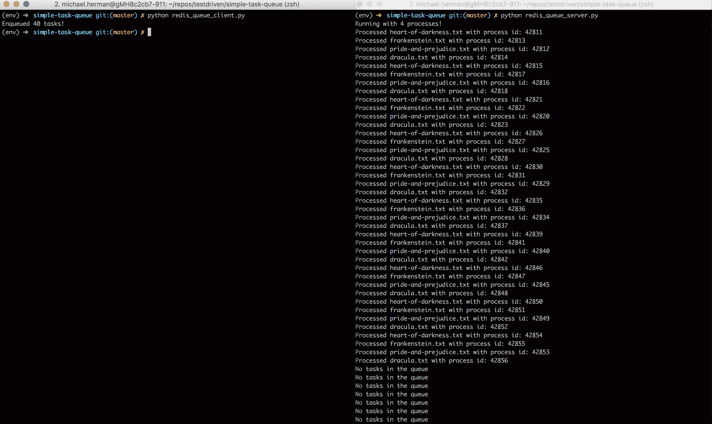
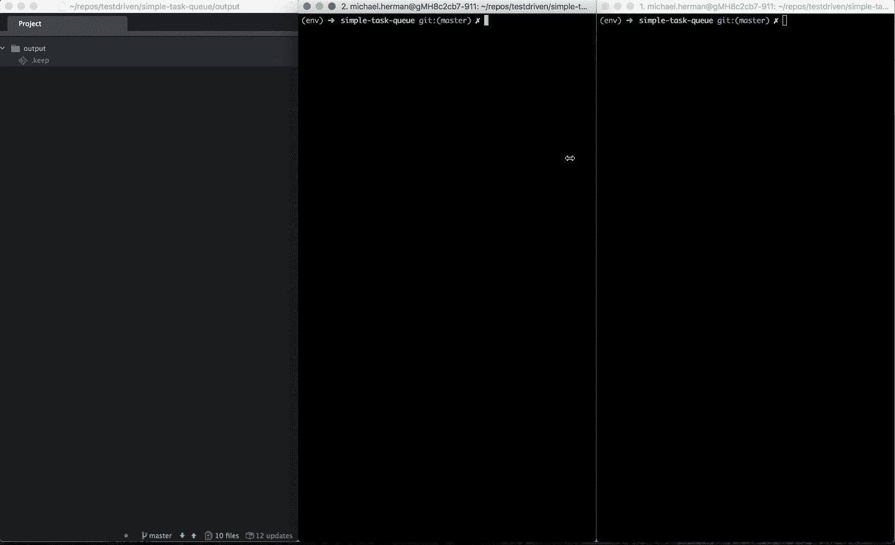

# 用 Python 开发异步任务队列

> 原文：<https://testdriven.io/blog/developing-an-asynchronous-task-queue-in-python/>

本教程着眼于如何使用 Python 的[多重处理](https://docs.python.org/3.10/library/multiprocessing.html)库和 [Redis](https://redis.io/) 实现几个异步任务队列。

## 队列数据结构

一个[队列](https://en.wikipedia.org/wiki/Queue_(abstract_data_type))是一个[先进先出](https://en.wikipedia.org/wiki/FIFO_(computing_and_electronics)) ( **FIFO** )的数据结构。

1.  在尾部添加一个项目(**入队**)
2.  在头部移除一个项目(**出列**)


当您编写本教程中的示例时，您会在实践中看到这一点。

## 工作

让我们从创建一个基本任务开始:

```py
`# tasks.py

import collections
import json
import os
import sys
import uuid
from pathlib import Path

from nltk.corpus import stopwords

COMMON_WORDS = set(stopwords.words("english"))
BASE_DIR = Path(__file__).resolve(strict=True).parent
DATA_DIR = Path(BASE_DIR).joinpath("data")
OUTPUT_DIR = Path(BASE_DIR).joinpath("output")

def save_file(filename, data):
    random_str = uuid.uuid4().hex
    outfile = f"{filename}_{random_str}.txt"
    with open(Path(OUTPUT_DIR).joinpath(outfile), "w") as outfile:
        outfile.write(data)

def get_word_counts(filename):
    wordcount = collections.Counter()
    # get counts
    with open(Path(DATA_DIR).joinpath(filename), "r") as f:
        for line in f:
            wordcount.update(line.split())
    for word in set(COMMON_WORDS):
        del wordcount[word]

    # save file
    save_file(filename, json.dumps(dict(wordcount.most_common(20))))

    proc = os.getpid()

    print(f"Processed {filename} with process id: {proc}")

if __name__ == "__main__":
    get_word_counts(sys.argv[1])` 
```

因此，`get_word_counts`从给定的文本文件中找到 20 个最常用的单词，并将它们保存到输出文件中。它还使用 Python 的 [os](https://docs.python.org/3/library/os.html) 库打印当前进程标识符(或 pid)。

### 跟着一起走？

创建一个项目目录和一个虚拟环境。然后，使用 pip 安装 [NLTK](https://pypi.org/project/nltk/) :

```py
`(env)$ pip install nltk==3.6.5` 
```

安装完成后，调用 Python shell 并下载`stopwords` [文集](https://www.nltk.org/data.html):

```py
`>>> import nltk
>>> nltk.download("stopwords")

[nltk_data] Downloading package stopwords to
[nltk_data]     /Users/michael/nltk_data...
[nltk_data]   Unzipping corpora/stopwords.zip.
True` 
```

> 如果您遇到 SSL 错误，请参考这篇文章。
> 
> 示例修复:
> 
> ```py
> >>> import nltk
> >>> nltk.download('stopwords')
> [nltk_data] Error loading stopwords: <urlopen error [SSL:
> [nltk_data]     CERTIFICATE_VERIFY_FAILED] certificate verify failed:
> [nltk_data]     unable to get local issuer certificate (_ssl.c:1056)>
> False
> >>> import ssl
> >>> try:
> ...     _create_unverified_https_context = ssl._create_unverified_context
> ... except AttributeError:
> ...     pass
> ... else:
> ...     ssl._create_default_https_context = _create_unverified_https_context
> ...
> >>> nltk.download('stopwords')
> [nltk_data] Downloading package stopwords to
> [nltk_data]     /Users/michael.herman/nltk_data...
> [nltk_data]   Unzipping corpora/stopwords.zip.
> True 
> ```

将上面的 *tasks.py* 文件添加到您的项目目录中，但是不要运行它。

## 多重处理池

我们可以使用[多处理](https://docs.python.org/3/library/multiprocessing.html)库并行运行这个任务:

```py
`# simple_pool.py

import multiprocessing
import time

from tasks import get_word_counts

PROCESSES = multiprocessing.cpu_count() - 1

def run():
    print(f"Running with {PROCESSES} processes!")

    start = time.time()
    with multiprocessing.Pool(PROCESSES) as p:
        p.map_async(
            get_word_counts,
            [
                "pride-and-prejudice.txt",
                "heart-of-darkness.txt",
                "frankenstein.txt",
                "dracula.txt",
            ],
        )
        # clean up
        p.close()
        p.join()

    print(f"Time taken = {time.time() - start:.10f}")

if __name__ == "__main__":
    run()` 
```

这里，使用[池](https://docs.python.org/3/library/multiprocessing.html#multiprocessing.pool.Pool)类，我们用两个进程处理了四个任务。

你注意到`map_async`方法了吗？将任务映射到流程基本上有四种不同的方法。当选择一个时，您必须考虑多参数、并发性、阻塞和排序:

| 方法 | 多参数 | 并发 | 阻塞 | 有序结果 |
| --- | --- | --- | --- | --- |
| `map` | 不 | 是 | 是 | 是 |
| `map_async` | 不 | 不 | 不 | 是 |
| `apply` | 是 | 不 | 是 | 不 |
| `apply_async` | 是 | 是 | 不 | 不 |

没有`close`和`join`，垃圾收集可能不会发生，这可能导致内存泄漏。

1.  `close`告知池不接受任何新任务
2.  `join`告知池在所有任务完成后退出

> 跟着一起走？从[简单任务队列](https://github.com/testdrivenio/simple-task-queue) repo 中的“数据”目录中抓取[项目古腾堡](http://www.gutenberg.org/)样本文本文件，然后添加一个“输出”目录。
> 
> 您的项目目录应该如下所示:
> 
> ```py
> ├── data
> │   ├── dracula.txt
> │   ├── frankenstein.txt
> │   ├── heart-of-darkness.txt
> │   └── pride-and-prejudice.txt
> ├── output
> ├── simple_pool.py
> └── tasks.py 
> ```

运行时间应该不到一秒钟:

```py
`(env)$ python simple_pool.py

Running with 15 processes!
Processed heart-of-darkness.txt with process id: 50510
Processed frankenstein.txt with process id: 50515
Processed pride-and-prejudice.txt with process id: 50511
Processed dracula.txt with process id: 50512

Time taken = 0.6383581161` 
```

> 这个脚本运行在 16 核的 i9 Macbook Pro 上。

因此，多重处理`Pool`类为我们处理排队逻辑。它非常适合运行 CPU 密集型任务或任何可以独立分解和分配的任务。如果您需要对队列进行更多的控制，或者需要在多个进程之间共享数据，您可能想看看`Queue`类。

> 关于这一点以及并行性(多处理)和并发性(多线程)之间的区别的更多信息，请回顾文章[用并发性、并行性和异步性加速 Python。](/blog/concurrency-parallelism-asyncio/)

## 多重处理队列

让我们看一个简单的例子:

```py
`# simple_queue.py

import multiprocessing

def run():
    books = [
        "pride-and-prejudice.txt",
        "heart-of-darkness.txt",
        "frankenstein.txt",
        "dracula.txt",
    ]
    queue = multiprocessing.Queue()

    print("Enqueuing...")
    for book in books:
        print(book)
        queue.put(book)

    print("\nDequeuing...")
    while not queue.empty():
        print(queue.get())

if __name__ == "__main__":
    run()` 
```

同样来自多处理库的[队列](https://docs.python.org/3/library/multiprocessing.html#exchanging-objects-between-processes)类是一个基本的 FIFO(先进先出)数据结构。它类似于[队列。Queue](https://docs.python.org/3/library/queue.html#queue.Queue) 类，但是是为进程间通信设计的。我们使用`put`将一个项目加入队列，使用`get`将一个项目出队。

> 查看`Queue` [源代码](https://github.com/python/cpython/blob/master/Lib/multiprocessing/queues.py)可以更好地理解这个类的机制。

现在，让我们看看更高级的例子:

```py
`# simple_task_queue.py

import multiprocessing
import time

from tasks import get_word_counts

PROCESSES = multiprocessing.cpu_count() - 1
NUMBER_OF_TASKS = 10

def process_tasks(task_queue):
    while not task_queue.empty():
        book = task_queue.get()
        get_word_counts(book)
    return True

def add_tasks(task_queue, number_of_tasks):
    for num in range(number_of_tasks):
        task_queue.put("pride-and-prejudice.txt")
        task_queue.put("heart-of-darkness.txt")
        task_queue.put("frankenstein.txt")
        task_queue.put("dracula.txt")
    return task_queue

def run():
    empty_task_queue = multiprocessing.Queue()
    full_task_queue = add_tasks(empty_task_queue, NUMBER_OF_TASKS)
    processes = []
    print(f"Running with {PROCESSES} processes!")
    start = time.time()
    for n in range(PROCESSES):
        p = multiprocessing.Process(target=process_tasks, args=(full_task_queue,))
        processes.append(p)
        p.start()
    for p in processes:
        p.join()
    print(f"Time taken = {time.time() - start:.10f}")

if __name__ == "__main__":
    run()` 
```

这里，我们将 40 个任务(每个文本文件 10 个)放入队列，通过`Process`类创建单独的进程，使用`start`开始运行进程，最后，使用`join`完成进程。

运行时间应该不到一秒钟。

> **挑战**:通过添加另一个队列来保存已完成的任务，检查您的理解。您可以在`process_tasks`函数中对它们进行排队。

## 记录

多处理库也支持日志记录:

```py
`# simple_task_queue_logging.py

import logging
import multiprocessing
import os
import time

from tasks import get_word_counts

PROCESSES = multiprocessing.cpu_count() - 1
NUMBER_OF_TASKS = 10

def process_tasks(task_queue):
    logger = multiprocessing.get_logger()
    proc = os.getpid()
    while not task_queue.empty():
        try:
            book = task_queue.get()
            get_word_counts(book)
        except Exception as e:
            logger.error(e)
        logger.info(f"Process {proc} completed successfully")
    return True

def add_tasks(task_queue, number_of_tasks):
    for num in range(number_of_tasks):
        task_queue.put("pride-and-prejudice.txt")
        task_queue.put("heart-of-darkness.txt")
        task_queue.put("frankenstein.txt")
        task_queue.put("dracula.txt")
    return task_queue

def run():
    empty_task_queue = multiprocessing.Queue()
    full_task_queue = add_tasks(empty_task_queue, NUMBER_OF_TASKS)
    processes = []
    print(f"Running with {PROCESSES} processes!")
    start = time.time()
    for w in range(PROCESSES):
        p = multiprocessing.Process(target=process_tasks, args=(full_task_queue,))
        processes.append(p)
        p.start()
    for p in processes:
        p.join()
    print(f"Time taken = {time.time() - start:.10f}")

if __name__ == "__main__":
    multiprocessing.log_to_stderr(logging.ERROR)
    run()` 
```

要进行测试，请将`task_queue.put("dracula.txt")`更改为`task_queue.put("drakula.txt")`。您应该会在终端中看到以下错误输出十次:

```py
`[ERROR/Process-4] [Errno 2] No such file or directory:
'simple-task-queue/data/drakula.txt'` 
```

想要记录到光盘吗？

```py
`# simple_task_queue_logging.py

import logging
import multiprocessing
import os
import time

from tasks import get_word_counts

PROCESSES = multiprocessing.cpu_count() - 1
NUMBER_OF_TASKS = 10

def create_logger():
    logger = multiprocessing.get_logger()
    logger.setLevel(logging.INFO)
    fh = logging.FileHandler("process.log")
    fmt = "%(asctime)s - %(levelname)s - %(message)s"
    formatter = logging.Formatter(fmt)
    fh.setFormatter(formatter)
    logger.addHandler(fh)
    return logger

def process_tasks(task_queue):
    logger = create_logger()
    proc = os.getpid()
    while not task_queue.empty():
        try:
            book = task_queue.get()
            get_word_counts(book)
        except Exception as e:
            logger.error(e)
        logger.info(f"Process {proc} completed successfully")
    return True

def add_tasks(task_queue, number_of_tasks):
    for num in range(number_of_tasks):
        task_queue.put("pride-and-prejudice.txt")
        task_queue.put("heart-of-darkness.txt")
        task_queue.put("frankenstein.txt")
        task_queue.put("dracula.txt")
    return task_queue

def run():
    empty_task_queue = multiprocessing.Queue()
    full_task_queue = add_tasks(empty_task_queue, NUMBER_OF_TASKS)
    processes = []
    print(f"Running with {PROCESSES} processes!")
    start = time.time()
    for w in range(PROCESSES):
        p = multiprocessing.Process(target=process_tasks, args=(full_task_queue,))
        processes.append(p)
        p.start()
    for p in processes:
        p.join()
    print(f"Time taken = {time.time() - start:.10f}")

if __name__ == "__main__":
    run()` 
```

同样，通过更改其中一个文件名来导致错误，然后运行它。看一下 *process.log* 。因为 Python 日志库不使用进程间的共享锁，所以它并不像它应该的那样有组织。为了解决这个问题，我们让每个进程写入自己的文件。为了保持有序，请在项目文件夹中添加一个日志目录:

```py
`#  simple_task_queue_logging_separate_files.py

import logging
import multiprocessing
import os
import time

from tasks import get_word_counts

PROCESSES = multiprocessing.cpu_count() - 1
NUMBER_OF_TASKS = 10

def create_logger(pid):
    logger = multiprocessing.get_logger()
    logger.setLevel(logging.INFO)
    fh = logging.FileHandler(f"logs/process_{pid}.log")
    fmt = "%(asctime)s - %(levelname)s - %(message)s"
    formatter = logging.Formatter(fmt)
    fh.setFormatter(formatter)
    logger.addHandler(fh)
    return logger

def process_tasks(task_queue):
    proc = os.getpid()
    logger = create_logger(proc)
    while not task_queue.empty():
        try:
            book = task_queue.get()
            get_word_counts(book)
        except Exception as e:
            logger.error(e)
        logger.info(f"Process {proc} completed successfully")
    return True

def add_tasks(task_queue, number_of_tasks):
    for num in range(number_of_tasks):
        task_queue.put("pride-and-prejudice.txt")
        task_queue.put("heart-of-darkness.txt")
        task_queue.put("frankenstein.txt")
        task_queue.put("dracula.txt")
    return task_queue

def run():
    empty_task_queue = multiprocessing.Queue()
    full_task_queue = add_tasks(empty_task_queue, NUMBER_OF_TASKS)
    processes = []
    print(f"Running with {PROCESSES} processes!")
    start = time.time()
    for w in range(PROCESSES):
        p = multiprocessing.Process(target=process_tasks, args=(full_task_queue,))
        processes.append(p)
        p.start()
    for p in processes:
        p.join()
    print(f"Time taken = {time.time() - start:.10f}")

if __name__ == "__main__":
    run()` 
```

## 雷迪斯

接下来，我们不使用内存队列，而是将 [Redis](https://redis.io/) 添加到混合队列中。

> 跟着一起走？ [下载](https://redis.io/download)并安装 Redis，如果你还没有安装的话。然后，安装 Python [接口](https://pypi.org/project/redis/):
> 
> ```py
> (env)$ pip install redis==4.0.2 
> ```

我们将把逻辑分成四个文件:

1.  *redis_queue.py* 分别通过`SimpleQueue`和`SimpleTask`类创建新的队列和任务。
2.  *redis_queue_client* 调查新任务。
3.  *redis_queue_worker* 出队并处理任务。
4.  *redis_queue_server* 产生工作进程。

```py
`# redis_queue.py

import pickle
import uuid

class SimpleQueue(object):
    def __init__(self, conn, name):
        self.conn = conn
        self.name = name

    def enqueue(self, func, *args):
        task = SimpleTask(func, *args)
        serialized_task = pickle.dumps(task, protocol=pickle.HIGHEST_PROTOCOL)
        self.conn.lpush(self.name, serialized_task)
        return task.id

    def dequeue(self):
        _, serialized_task = self.conn.brpop(self.name)
        task = pickle.loads(serialized_task)
        task.process_task()
        return task

    def get_length(self):
        return self.conn.llen(self.name)

class SimpleTask(object):
    def __init__(self, func, *args):
        self.id = str(uuid.uuid4())
        self.func = func
        self.args = args

    def process_task(self):
        self.func(*self.args)` 
```

这里，我们定义了两个类，`SimpleQueue`和`SimpleTask`:

1.  创建一个新队列，入队，出队，并获取队列的长度。
2.  `SimpleTask`创建新任务，由`SimpleQueue`类的实例用来将新任务排队，并处理新任务。

> 好奇`lpush()`、`brpop()`、`llen()`？参见[命令参考](https://redis.io/commands)页。(`The brpop()`函数特别酷，因为它阻塞连接，直到有值存在才弹出！)

```py
`# redis_queue_client.py

import redis

from redis_queue import SimpleQueue
from tasks import get_word_counts

NUMBER_OF_TASKS = 10

if __name__ == "__main__":
    r = redis.Redis()
    queue = SimpleQueue(r, "sample")
    count = 0
    for num in range(NUMBER_OF_TASKS):
        queue.enqueue(get_word_counts, "pride-and-prejudice.txt")
        queue.enqueue(get_word_counts, "heart-of-darkness.txt")
        queue.enqueue(get_word_counts, "frankenstein.txt")
        queue.enqueue(get_word_counts, "dracula.txt")
        count += 4
    print(f"Enqueued {count} tasks!")` 
```

这个模块将创建一个 Redis 和`SimpleQueue`类的新实例。然后，它将 40 个任务排队。

```py
`# redis_queue_worker.py

import redis

from redis_queue import SimpleQueue

def worker():
    r = redis.Redis()
    queue = SimpleQueue(r, "sample")
    if queue.get_length() > 0:
        queue.dequeue()
    else:
        print("No tasks in the queue")

if __name__ == "__main__":
    worker()` 
```

如果任务可用，则调用`dequeue`方法，然后反序列化任务并调用`process_task`方法(在 *redis_queue.py* 中)。

```py
`# redis_queue_server.py

import multiprocessing

from redis_queue_worker import worker

PROCESSES = 4

def run():
    processes = []
    print(f"Running with {PROCESSES} processes!")
    while True:
        for w in range(PROCESSES):
            p = multiprocessing.Process(target=worker)
            processes.append(p)
            p.start()
        for p in processes:
            p.join()

if __name__ == "__main__":
    run()` 
```

`run`方法产生了四个新的工作进程。

> 您可能不希望四个进程一直同时运行，但有时您可能需要四个或更多的进程。考虑如何根据需求有计划地增加和减少额外的工作人员。

要进行测试，请在单独的终端窗口中运行 *redis_queue_server.py* 和 *redis_queue_client.py* :

[](/static/images/blog/simple-task-queue/example.png)

[](/static/images/gifs/blog/simple-task-queue/example.gif)

> 通过将日志添加到上面的应用程序中，再次检查您的理解。

## 结论

在本教程中，我们研究了 Python 中的许多异步任务队列实现。如果需求足够简单，以这种方式开发队列可能会更容易。也就是说，如果您正在寻找更高级的功能——如任务调度、批处理、作业优先级和失败任务的重试——您应该寻找一个成熟的解决方案。看看[芹菜](https://docs.celeryq.dev/en/stable/)， [RQ](http://python-rq.org/) ，或者 [Huey](http://huey.readthedocs.io/) 。

从[简单任务队列](https://github.com/testdrivenio/simple-task-queue) repo 中获取最终代码。