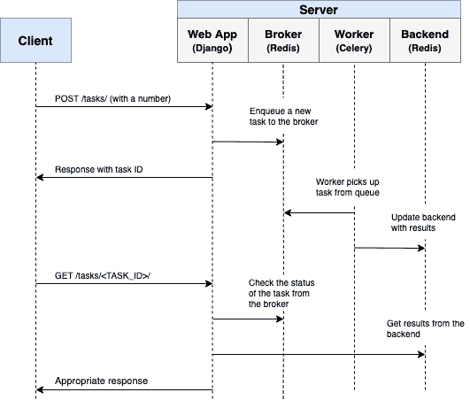
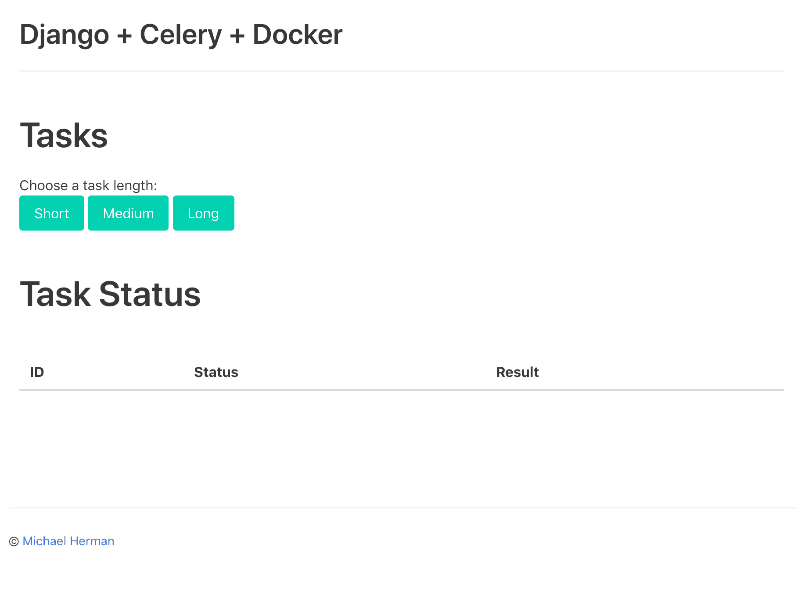
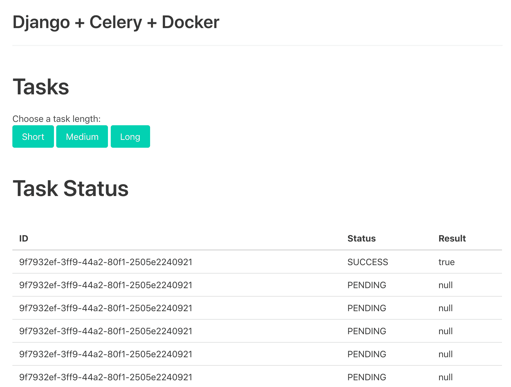
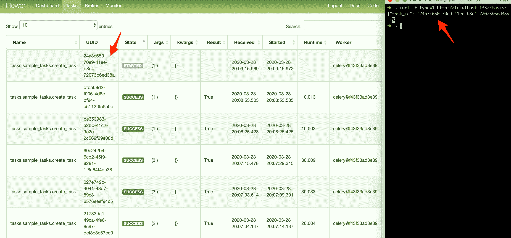

# Django 和 Celery 的异步任务

> 原文：<https://testdriven.io/blog/django-and-celery/>

如果长时间运行的流程是应用程序工作流的一部分，而不是阻塞响应，您应该在后台处理它，在正常的请求/响应流之外。

也许您的 web 应用程序要求用户在注册时提交一个缩略图(可能需要重新调整大小)并确认他们的电子邮件。如果您的应用程序处理了图像并直接在请求处理程序中发送了确认电子邮件，那么最终用户将不得不在页面加载或更新之前不必要地等待他们完成处理。相反，您会希望将这些进程传递给任务队列，并让一个单独的工作进程来处理它，这样您就可以立即将响应发送回客户端。最终用户可以在处理过程中在客户端做其他事情。您的应用程序还可以自由地响应来自其他用户和客户端的请求。

为了实现这一点，我们将带您完成设置和配置 [Celery](https://docs.celeryq.dev/en/stable/) 和 Redis 的过程，以便在 Django 应用程序中处理长时间运行的流程。我们还将使用 Docker 和 Docker Compose 将所有内容联系在一起。最后，我们将看看如何用单元测试和集成测试来测试 Celery 任务。

> 姜戈+芹菜系列:
> 
> 1.  [与 Django 和芹菜的异步任务](/blog/django-and-celery/)(本文！)
> 2.  [在 Django 用芹菜和码头工人处理定期任务](/blog/django-celery-periodic-tasks/)
> 3.  [自动重试失败的芹菜任务](/blog/retrying-failed-celery-tasks/)
> 4.  [处理芹菜和数据库事务](/blog/celery-database-transactions/)

## 目标

完成本文后，您将能够:

1.  将芹菜集成到 Django 应用程序中并创建任务
2.  集装箱化姜戈、Celery，并与码头工重归于好
3.  使用单独的工作进程在后台运行进程
4.  将芹菜日志保存到文件中
5.  设置 [Flower](https://flower.readthedocs.io/en/latest/) 来监控和管理芹菜作业和工人
6.  用单元测试和集成测试来测试芹菜任务

## 后台任务

同样，为了改善用户体验，长时间运行的流程应该在正常的 HTTP 请求/响应流程之外，在后台进程中运行。

示例:

1.  运行机器学习模型
2.  发送确认电子邮件
3.  刮擦和爬行
4.  分析数据
5.  处理图像
6.  生成报告

当你构建一个应用程序时，试着区分应该在请求/响应生命周期中运行的任务(比如 CRUD 操作)和应该在后台运行的任务。

## 工作流程

我们的目标是开发一个 Django 应用程序，它与 Celery 一起处理正常请求/响应周期之外的长时间运行的流程。

1.  最终用户通过向服务器端发送 POST 请求开始一项新任务。
2.  在视图中，一个任务被添加到队列中，任务 id 被发送回客户端。
3.  使用 AJAX，当任务本身在后台运行时，客户机继续轮询服务器以检查任务的状态。



## 项目设置

从 [django-celery](https://github.com/testdrivenio/django-celery) repo 中克隆出基础项目，然后将 [v1](https://github.com/testdrivenio/django-celery/tree/v1) 标签签出到主分支:

```
`$ git clone https://github.com/testdrivenio/django-celery --branch v1 --single-branch
$ cd django-celery
$ git checkout v1 -b master` 
```

由于我们总共需要管理三个进程(Django、Redis、worker)，我们将使用 Docker 来简化我们的工作流，方法是将它们连接起来，以便它们都可以通过一个命令从一个终端窗口运行。

从项目根目录，创建映像并启动 Docker 容器:

```
`$ docker-compose up -d --build` 
```

构建完成后，导航到 [http://localhost:1337](http://localhost:1337) :



确保测试也通过:

```
`$ docker-compose exec web python -m pytest

=============================== test session starts ===============================
platform linux -- Python 3.11.1, pytest-7.2.0, pluggy-1.0.0
django: settings: core.settings (from ini)
rootdir: /usr/src/app, configfile: pytest.ini
plugins: django-4.5.2
collected 1 item

tests/test_tasks.py .                                                       [100%]

================================ 1 passed in 0.17s ================================` 
```

在继续之前，快速浏览一下项目结构:

```
`├── .gitignore
├── LICENSE
├── README.md
├── docker-compose.yml
└── project
    ├── Dockerfile
    ├── core
    │   ├── __init__.py
    │   ├── asgi.py
    │   ├── settings.py
    │   ├── urls.py
    │   └── wsgi.py
    ├── entrypoint.sh
    ├── manage.py
    ├── pytest.ini
    ├── requirements.txt
    ├── static
    │   ├── bulma.min.css
    │   ├── jquery-3.4.1.min.js
    │   ├── main.css
    │   └── main.js
    ├── tasks
    │   ├── __init__.py
    │   ├── apps.py
    │   ├── migrations
    │   │   └── __init__.py
    │   ├── templates
    │   │   └── home.html
    │   └── views.py
    └── tests
        ├── __init__.py
        └── test_tasks.py` 
```

> 想学习如何构建这个项目吗？查看关于 Django 与 Postgres、Gunicorn 和 Nginx 的文章。

## 触发任务

在 *project/static/main.js* 中设置了一个事件处理程序来监听按钮点击。点击时，一个 AJAX POST 请求被发送到具有适当任务类型的服务器:`1`、`2`或`3`。

```
`$('.button').on('click',  function()  { $.ajax({ url:  '/tasks/', data:  {  type:  $(this).data('type')  }, method:  'POST', }) .done((res)  =>  { getStatus(res.task_id); }) .fail((err)  =>  { console.log(err); }); });` 
```

在服务器端，已经配置了一个视图来处理 *project/tasks/views.py* 中的请求:

```
`@csrf_exempt
def run_task(request):
    if request.POST:
        task_type = request.POST.get("type")
        return JsonResponse({"task_type": task_type}, status=202)` 
```

现在有趣的部分来了:给芹菜布线！

## 芹菜装置

首先将 Celery 和 Redis 添加到 *project/requirements.txt* 文件中:

```
`Django==4.1.4
pytest==7.2.0
pytest-django==4.5.2

celery==5.2.7
redis==4.4.0` 
```

Celery 使用消息[代理](https://docs.celeryq.dev/en/stable/getting-started/backends-and-brokers/index.html) - [RabbitMQ](https://www.rabbitmq.com/) 、 [Redis](https://redis.io/) 或 [AWS 简单队列服务(SQS)](https://aws.amazon.com/sqs/) -来促进 Celery worker 和 web 应用程序之间的通信。消息被添加到代理中，然后由工作人员进行处理。一旦完成，结果被添加到后端。

Redis 将被用作代理和后端。将 Redis 和芹菜[工人](https://docs.celeryq.dev/en/latest/userguide/workers.html)添加到 *docker-compose.yml* 文件中，如下所示:

```
`version:  '3.8' services: web: build:  ./project command:  python manage.py runserver 0.0.0.0:8000 volumes: -  ./project:/usr/src/app/ ports: -  1337:8000 environment: -  DEBUG=1 -  SECRET_KEY=dbaa1_i7%*[[email protected]](/cdn-cgi/l/email-protection)(-a_r([[email protected]](/cdn-cgi/l/email-protection)%m -  DJANGO_ALLOWED_HOSTS=localhost 127.0.0.1 [::1] -  CELERY_BROKER=redis://redis:6379/0 -  CELERY_BACKEND=redis://redis:6379/0 depends_on: -  redis celery: build:  ./project command:  celery --app=core worker --loglevel=info volumes: -  ./project:/usr/src/app environment: -  DEBUG=1 -  SECRET_KEY=dbaa1_i7%*[[email protected]](/cdn-cgi/l/email-protection)(-a_r([[email protected]](/cdn-cgi/l/email-protection)%m -  DJANGO_ALLOWED_HOSTS=localhost 127.0.0.1 [::1] -  CELERY_BROKER=redis://redis:6379/0 -  CELERY_BACKEND=redis://redis:6379/0 depends_on: -  web -  redis redis: image:  redis:7-alpine` 
```

请注意`celery --app=core worker --loglevel=info`:

1.  `celery worker`是用来开动芹菜[的工人](https://docs.celeryq.dev/en/stable/userguide/workers.html#starting-the-worker)
2.  `--app=core`运行`core`芹菜[应用程序](https://docs.celeryq.dev/en/stable/userguide/application.html)(我们稍后会定义)
3.  `--loglevel=info`将[记录级别](https://docs.celeryq.dev/en/v4.4.7/reference/celery.bin.worker.html#cmdoption-celery-worker-l)设置为信息

在项目的设置模块中，在底部添加以下内容，告诉 Celery 使用 Redis 作为代理和后端:

```
`CELERY_BROKER_URL = os.environ.get("CELERY_BROKER", "redis://redis:6379/0")
CELERY_RESULT_BACKEND = os.environ.get("CELERY_BROKER", "redis://redis:6379/0")` 
```

接下来，在“项目/任务”中创建一个名为 *sample_tasks.py* 的新文件:

```
`# project/tasks/sample_tasks.py

import time

from celery import shared_task

@shared_task
def create_task(task_type):
    time.sleep(int(task_type) * 10)
    return True` 
```

这里，使用 [shared_task](https://docs.celeryq.dev/en/latest/django/first-steps-with-django.html#using-the-shared-task-decorator) 装饰器，我们定义了一个名为`create_task`的新芹菜任务函数。

> 请记住，任务本身将*而不是*从 Django 流程中执行；它将由芹菜工人来执行。

现在，向“项目/核心”添加一个 *celery.py* 文件:

```
`import os

from celery import Celery

os.environ.setdefault("DJANGO_SETTINGS_MODULE", "core.settings")
app = Celery("core")
app.config_from_object("django.conf:settings", namespace="CELERY")
app.autodiscover_tasks()` 
```

这里发生了什么事？

1.  首先，我们为环境变量`DJANGO_SETTINGS_MODULE`设置一个默认值，这样 Celery 将知道如何找到 Django 项目。
2.  接下来，我们创建了一个名为`core`的新 Celery 实例，并将值赋给一个名为`app`的变量。
3.  然后我们从`django.conf`的 settings 对象中加载 celery 配置值。我们使用了`namespace="CELERY"`来防止与其他 Django 场景的冲突。换句话说，芹菜的所有配置设置都必须以`CELERY_`为前缀。
4.  最后，`app.autodiscover_tasks()`告诉 Celery 从`settings.INSTALLED_APPS`中定义的应用程序中寻找 Celery 任务。

更新*项目/核心/__init__。py* 以便在 Django 启动时自动导入 Celery 应用程序:

```
`from .celery import app as celery_app

__all__ = ("celery_app",)` 
```

## 触发任务

更新视图以启动任务，并使用 id:

```
`# project/tasks/views.py

@csrf_exempt
def run_task(request):
    if request.POST:
        task_type = request.POST.get("type")
        task = create_task.delay(int(task_type))
        return JsonResponse({"task_id": task.id}, status=202)` 
```

不要忘记导入任务:

```
`from tasks.sample_tasks import create_task` 
```

构建映像并旋转新容器:

```
`$ docker-compose up -d --build` 
```

要触发新任务，请运行:

```
`$ curl -F type=0 http://localhost:1337/tasks/` 
```

您应该会看到类似这样的内容:

```
`{
  "task_id": "6f025ed9-09be-4cbb-be10-1dce919797de"
}` 
```

## 任务状态

回到客户端的事件处理程序:

```
`// project/static/main.js $('.button').on('click',  function()  { $.ajax({ url:  '/tasks/', data:  {  type:  $(this).data('type')  }, method:  'POST', }) .done((res)  =>  { getStatus(res.task_id); }) .fail((err)  =>  { console.log(err); }); });` 
```

当响应从最初的 AJAX 请求返回时，我们继续每秒调用带有任务 id 的`getStatus()`:

```
`function  getStatus(taskID)  { $.ajax({ url:  `/tasks/${taskID}/`, method:  'GET' }) .done((res)  =>  { const  html  =  `
 <tr>
 <td>${res.task_id}</td>
 <td>${res.task_status}</td>
 <td>${res.task_result}</td>
 </tr>` $('#tasks').prepend(html); const  taskStatus  =  res.task_status; if  (taskStatus  ===  'SUCCESS'  ||  taskStatus  ===  'FAILURE')  return  false; setTimeout(function()  { getStatus(res.task_id); },  1000); }) .fail((err)  =>  { console.log(err) }); }` 
```

如果响应成功，一个新行被添加到 DOM 上的表中。

更新`get_status`视图以返回状态:

```
`# project/tasks/views.py

@csrf_exempt
def get_status(request, task_id):
    task_result = AsyncResult(task_id)
    result = {
        "task_id": task_id,
        "task_status": task_result.status,
        "task_result": task_result.result
    }
    return JsonResponse(result, status=200)` 
```

导入[异步结果](https://docs.celeryq.dev/en/latest/reference/celery.result.html):

```
`from celery.result import AsyncResult` 
```

更新容器:

```
`$ docker-compose up -d --build` 
```

触发新任务:

```
`$ curl -F type=1 http://localhost:1337/tasks/` 
```

然后，从响应中获取`task_id`并调用更新的端点来查看状态:

```
`$ curl http://localhost:1337/tasks/25278457-0957-4b0b-b1da-2600525f812f/

{
    "task_id": "25278457-0957-4b0b-b1da-2600525f812f",
    "task_status": "SUCCESS",
    "task_result": true
}` 
```

也在浏览器中测试一下:



## 芹菜原木

更新 *docker-compose.yml* 中的`celery`服务，以便将芹菜日志转储到一个日志文件:

```
`celery: build:  ./project command:  celery --app=core worker --loglevel=info --logfile=logs/celery.log volumes: -  ./project:/usr/src/app environment: -  DEBUG=1 -  SECRET_KEY=dbaa1_i7%*[[email protected]](/cdn-cgi/l/email-protection)(-a_r([[email protected]](/cdn-cgi/l/email-protection)%m -  DJANGO_ALLOWED_HOSTS=localhost 127.0.0.1 [::1] -  CELERY_BROKER=redis://redis:6379/0 -  CELERY_BACKEND=redis://redis:6379/0 depends_on: -  web -  redis` 
```

向“项目”添加一个名为“日志”的新目录。然后，将名为 *celery.log* 的新文件添加到新创建的目录中。

更新:

```
`$ docker-compose up -d --build` 
```

由于我们设置了一个卷，您应该看到日志文件在本地被填满:

```
`[2022-12-15 18:15:20,338: INFO/MainProcess] Connected to redis://redis:6379/0
[2022-12-15 18:15:21,328: INFO/MainProcess] mingle: searching for neighbors
[2022-12-15 18:15:23,342: INFO/MainProcess] mingle: all alone
[2022-12-15 18:15:24,214: WARNING/MainProcess] /usr/local/lib/python3.11/site-packages/celery/fixups/django.py:203: UserWarning: Using settings.DEBUG leads to a memory
            leak, never use this setting in production environments!
  warnings.warn('''Using settings.DEBUG leads to a memory

[2022-12-15 18:15:25,080: INFO/MainProcess] [[email protected]](/cdn-cgi/l/email-protection) ready.
[2022-12-15 18:15:40,132: INFO/MainProcess] Task tasks.sample_tasks.create_task[c4589a0d-f718-4d75-a673-fe3626827385] received
[2022-12-15 18:15:40,153: INFO/ForkPoolWorker-1] Task tasks.sample_tasks.create_task[c4589a0d-f718-4d75-a673-fe3626827385] succeeded in 0.016174572000181797s: True` 
```

## 花卉仪表板

[Flower](https://flower.readthedocs.io/en/latest/) 是一个轻量级的、实时的、基于网络的芹菜监控工具。您可以监控当前正在运行的任务，增加或减少工作池，查看图表和一些统计数据，等等。

添加到 *requirements.txt* :

```
`Django==4.1.4
pytest==7.2.0
pytest-django==4.5.2

celery==5.2.7
redis==4.4.0
flower==1.2.0` 
```

然后，向 *docker-compose.yml* 添加一个新服务:

```
`dashboard: build:  ./project command:  celery flower -A core --port=5555 --broker=redis://redis:6379/0 ports: -  5555:5555 environment: -  DEBUG=1 -  SECRET_KEY=dbaa1_i7%*[[email protected]](/cdn-cgi/l/email-protection)(-a_r([[email protected]](/cdn-cgi/l/email-protection)%m -  DJANGO_ALLOWED_HOSTS=localhost 127.0.0.1 [::1] -  CELERY_BROKER=redis://redis:6379/0 -  CELERY_BACKEND=redis://redis:6379/0 depends_on: -  web -  redis -  celery` 
```

测试一下:

```
`$ docker-compose up -d --build` 
```

导航到 [http://localhost:5555](http://localhost:5555) 查看仪表板。您应该看到一名员工准备就绪:


开始几项任务来全面测试仪表板:



试着增加几个工人，看看会有什么影响:

```
`$ docker-compose up -d --build --scale celery=3` 
```

## 试验

让我们从最基本的测试开始:

```
`def test_task():
    assert sample_tasks.create_task.run(1)
    assert sample_tasks.create_task.run(2)
    assert sample_tasks.create_task.run(3)` 
```

将上述测试用例添加到*project/tests/test _ tasks . py*中，然后添加以下导入:

```
`from tasks import sample_tasks` 
```

单独运行测试:

```
`$ docker-compose exec web python -m pytest -k "test_task and not test_home"` 
```

运行应该需要大约一分钟:

```
`=============================== test session starts ===============================
platform linux -- Python 3.11.1, pytest-7.2.0, pluggy-1.0.0
django: settings: core.settings (from ini)
rootdir: /usr/src/app, configfile: pytest.ini
plugins: django-4.5.2
collected 2 items / 1 deselected / 1 selected

tests/test_tasks.py .                                                       [100%]

=================== 1 passed, 1 deselected in 60.69s (0:01:00) ====================` 
```

值得注意的是，在上面的断言中，我们使用了`.run`方法(而不是`.delay`)来直接运行任务，而没有芹菜工人。

想要模仿`.run`方法来加快速度吗？

```
`@patch("tasks.sample_tasks.create_task.run")
def test_mock_task(mock_run):
    assert sample_tasks.create_task.run(1)
    sample_tasks.create_task.run.assert_called_once_with(1)

    assert sample_tasks.create_task.run(2)
    assert sample_tasks.create_task.run.call_count == 2

    assert sample_tasks.create_task.run(3)
    assert sample_tasks.create_task.run.call_count == 3` 
```

导入:

```
`from unittest.mock import patch` 
```

测试:

```
`$ docker-compose exec web python -m pytest -k "test_mock_task"

=============================== test session starts ===============================
platform linux -- Python 3.11.1, pytest-7.2.0, pluggy-1.0.0
django: settings: core.settings (from ini)
rootdir: /usr/src/app, configfile: pytest.ini
plugins: django-4.5.2
collected 3 items / 2 deselected / 1 selected

tests/test_tasks.py .                                                       [100%]

========================= 1 passed, 2 deselected in 0.64s =========================` 
```

快多了！

全面整合测试怎么样？

```
`def test_task_status(client):
    response = client.post(reverse("run_task"), {"type": 0})
    content = json.loads(response.content)
    task_id = content["task_id"]
    assert response.status_code == 202
    assert task_id

    response = client.get(reverse("get_status", args=[task_id]))
    content = json.loads(response.content)
    assert content == {"task_id": task_id, "task_status": "PENDING", "task_result": None}
    assert response.status_code == 200

    while content["task_status"] == "PENDING":
        response = client.get(reverse("get_status", args=[task_id]))
        content = json.loads(response.content)
    assert content == {"task_id": task_id, "task_status": "SUCCESS", "task_result": True}` 
```

请记住，这个测试使用开发中使用的相同的代理和后端。您可能想要实例化一个新的 Celery 应用程序来进行测试:

```
`app = celery.Celery('tests', broker=CELERY_TEST_BROKER, backend=CELERY_TEST_BACKEND)` 
```

添加导入:

确保测试通过。

## 结论

这是关于如何在 Django 应用程序中配置 Celery 来运行长时间运行的任务的基本指南。您应该让队列处理任何可能阻塞或减慢面向用户的代码的进程。

Celery 还可以用于执行可重复的任务，分解复杂的资源密集型任务，以便将计算工作量分布到多个机器上，从而减少(1)完成时间和(2)处理客户端请求的机器上的负载。

最后，如果你想知道如何使用 WebSockets(通过 Django 通道)来检查芹菜任务的状态，而不是使用 AJAX 轮询，请查看[芹菜和 Django](/courses/django-celery/) 课程的权威指南。

从[回购](https://github.com/testdrivenio/django-celery)中抓取代码。

> 姜戈+芹菜系列:
> 
> 1.  [与 Django 和芹菜的异步任务](/blog/django-and-celery/)(本文！)
> 2.  [在 Django 用芹菜和码头工人处理定期任务](/blog/django-celery-periodic-tasks/)
> 3.  [自动重试失败的芹菜任务](/blog/retrying-failed-celery-tasks/)
> 4.  [处理芹菜和数据库事务](/blog/celery-database-transactions/)