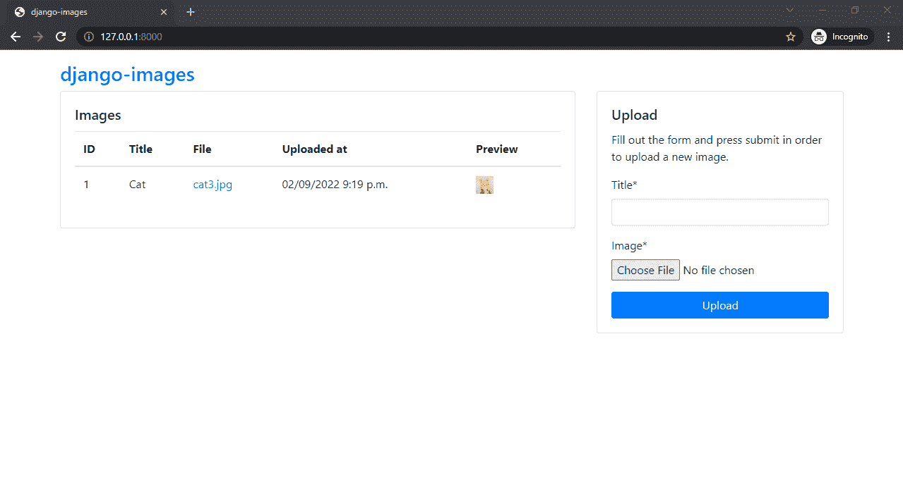
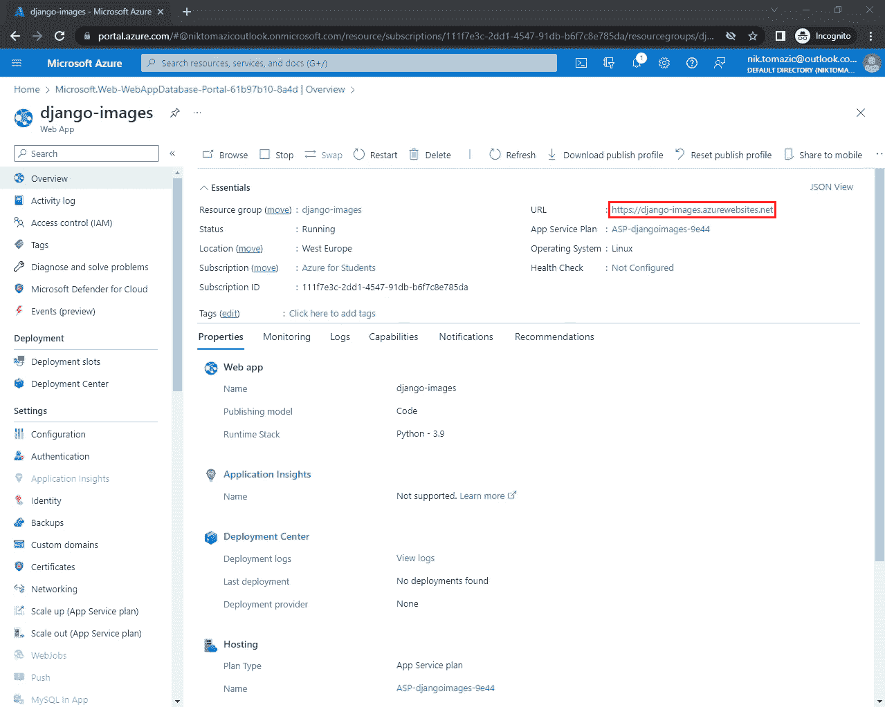
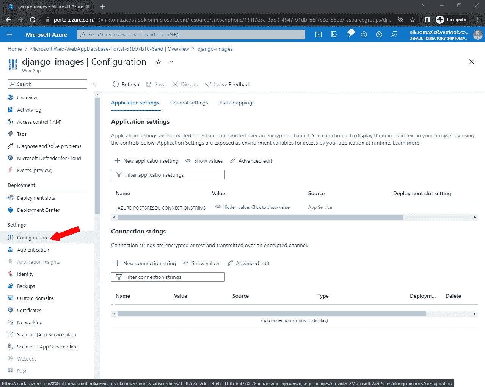
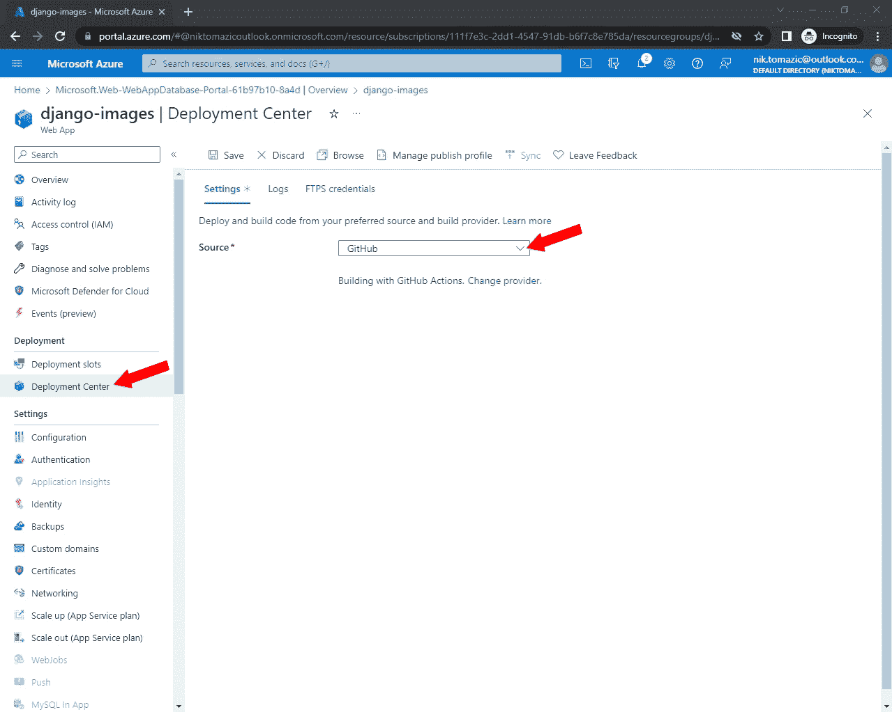
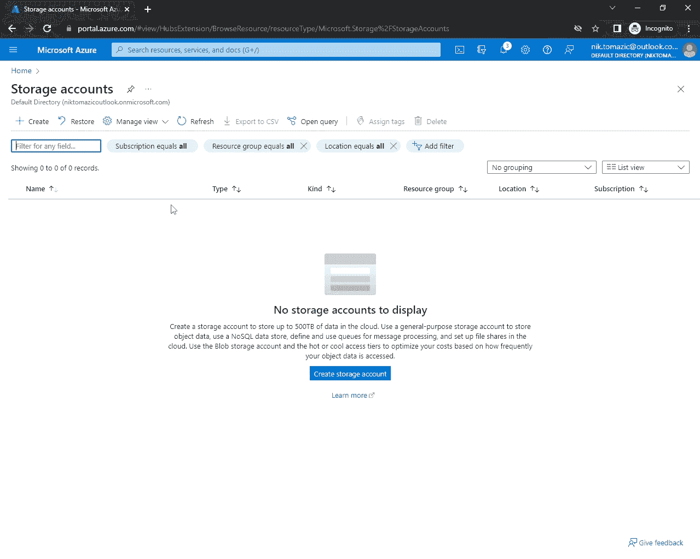
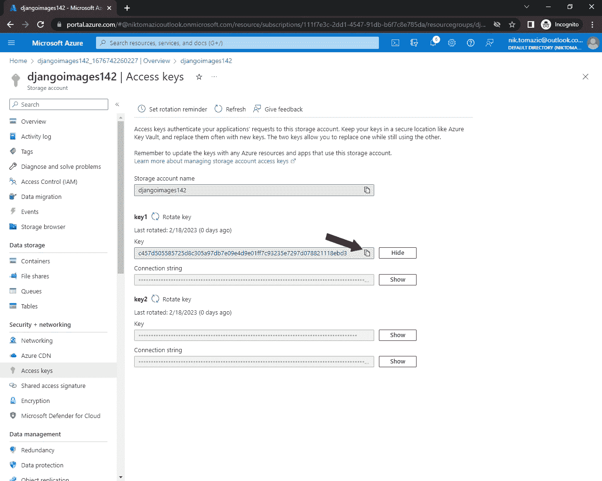

# 将 Django 应用部署到 Azure 应用服务

> 原文：<https://testdriven.io/blog/django-azure-app-service/>

在本教程中，我们将看看如何安全地部署一个 [Django](https://www.djangoproject.com/) 应用到 [Azure 应用服务](https://azure.microsoft.com/en-us/products/app-service/)。

## 目标

学完本教程后，您应该能够:

1.  解释什么是 Azure App Service 以及它是如何工作的。
2.  将 Django 应用程序部署到 Azure 应用程序服务。
3.  在 Azure 上运行一个 Postgres 实例。
4.  用 [Azure Storage](https://azure.microsoft.com/en-us/products/category/storage/) 设置持久存储。
5.  将自定义域链接到您的 web 应用程序，并在 HTTPS 上提供服务。

## 什么是 Azure App 服务？

[Azure App Service](https://azure.microsoft.com/en-us/products/app-service/) 允许您快速轻松地为任何平台或设备创建企业级 web 和移动应用，并将其部署在可扩展且可靠的云基础设施上。它本身支持 Python。网，。NET Core，Node.js，Java，PHP，容器。它们具有内置的 CI/CD、安全功能和零停机部署。

Azure App Service 提供了强大的扩展能力，允许应用程序根据流量和使用模式自动扩展或缩减。Azure 还保证了 99.95%的 SLA。

如果你是新客户，你可以获得 200 美元的免费积分来测试 Azure。

### 为什么选择 App 服务？

*   强大的扩展能力
*   与 Visual Studio 很好地集成
*   通过 [Azure Active Directory 进行认证](https://azure.microsoft.com/services/active-directory/)
*   内置 SSL/TLS 证书
*   监控和警报

## 项目设置

在本教程中，我们将部署一个简单的图像托管应用程序，名为 [django-images](https://github.com/duplxey/django-images) 。

> 在学习教程的过程中，通过部署您自己的 Django 应用程序来检查您的理解。

首先，从 GitHub 上的[库获取代码。](https://github.com/duplxey/django-images)

创建新的虚拟环境并激活它:

```py
`$ python3 -m venv venv && source venv/bin/activate` 
```

安装需求并迁移数据库:

```py
`(venv)$ pip install -r requirements.txt
(venv)$ python manage.py migrate` 
```

运行服务器:

```py
`(venv)$ python manage.py runserver` 
```

打开您最喜欢的网络浏览器，导航到 [http://localhost:8000](http://localhost:8000) 。使用右边的表格上传图像，确保一切正常。上传图像后，您应该会看到它显示在表格中:



## 配置 Django 项目

在本节教程中，我们将配置 Django 项目来使用 App Service。

### 环境变量

我们不应该在源代码中存储秘密，所以让我们利用环境变量。最简单的方法是使用名为 [python-dotenv](https://saurabh-kumar.com/python-dotenv/) 的第三方 Python 包。首先将其添加到 *requirements.txt* :

> 随意使用不同的包来处理环境变量，如 [django-environ](https://github.com/joke2k/django-environ) 或 [python-decouple](https://github.com/henriquebastos/python-decouple/) 。

对于 Django 来说，要初始化环境更改，请更新 *settings.py* 的顶部，如下所示:

```py
`# core/settings.py

import os
from pathlib import Path

from dotenv import load_dotenv

# Build paths inside the project like this: BASE_DIR / 'subdir'.
BASE_DIR = Path(__file__).resolve().parent.parent

load_dotenv(BASE_DIR / '.env')` 
```

接下来，从环境中加载`SECRET_KEY`、`DEBUG`、`ALLOWED_HOSTS`和其他设置:

```py
`# core/settings.py

# SECURITY WARNING: keep the secret key used in production secret!
SECRET_KEY = os.getenv('SECRET_KEY')

# SECURITY WARNING: don't run with debug turned on in production!
DEBUG = os.getenv('DEBUG', '0').lower() in ['true', 't', '1']

ALLOWED_HOSTS = os.getenv('ALLOWED_HOSTS').split(' ')
CSRF_TRUSTED_ORIGINS = os.getenv('CSRF_TRUSTED_ORIGINS').split(' ')

SECURE_SSL_REDIRECT = \
    os.getenv('SECURE_SSL_REDIRECT', '0').lower() in ['true', 't', '1']
if SECURE_SSL_REDIRECT:
    SECURE_PROXY_SSL_HEADER = ('HTTP_X_FORWARDED_PROTO', 'https')` 
```

### 数据库ˌ资料库

要使用 Postgres 代替 SQLite，我们首先需要安装数据库适配器。

将下面一行添加到 *requirements.txt* 中:

稍后，当我们启动 Postgres 实例时，Azure 将为我们提供一个数据库连接字符串。它将具有以下格式:

```py
`dbname=<db_name> host=<db_host> port=5432 user=<db_user> password=<db_password>` 
```

由于这个字符串在 Django 中使用起来相当笨拙，我们将把它分成以下几个 env 变量:`DBNAME`、`DBHOST`、`DBUSER`、`DBPASS`。

导航到 *core/settings.py* 并像这样更改`DATABASES`:

```py
`# core/settings.py

DATABASES = {
    'default': {
        'ENGINE': 'django.db.backends.postgresql',
        'NAME': os.environ.get('DBNAME'),
        'HOST': os.environ.get('DBHOST'),
        'USER': os.environ.get('DBUSER'),
        'PASSWORD': os.environ.get('DBPASS'),
        'OPTIONS': {'sslmode': 'require'},
    }
}` 
```

Azure 应用服务也需要`sslmode`，所以一定要启用它。

### 格尼科恩

接下来，让我们安装 [Gunicorn](https://gunicorn.org/) ，这是一个生产级的 WSGI 服务器，它将用于生产，而不是 Django 的开发服务器。

添加到 *requirements.txt* :

Django 配置到此为止！

## 部署应用程序

在教程的这一部分，我们将把 web 应用部署到 Azure App Service。如果你还没有 Azure 账户，就去注册一个吧。

### 项目初始化

从[仪表盘](https://portal.azure.com/)中，使用搜索栏搜索“Web App +数据库”。您应该会在“市场”部分看到它:


单击它，您应该会被重定向到应用程序创建表单。

使用该表单创建项目、应用程序和数据库。

#### 项目详情

1.  订阅:**保留默认设置**
2.  资源组: **django-images-group**
3.  地区:**离你最近的地区**

#### Web 应用程序详细信息

1.  名称:**姜戈图像**
2.  运行时堆栈: **Python 3.11**

#### 数据库ˌ资料库

1.  数据库引擎: **PostgreSQL -灵活服务器**
2.  服务器名称: **django-images-db**
3.  数据库名称: **django-images**
4.  主持:**由你决定**

填写完所有详细信息后，单击“查看”按钮，然后单击“创建”。

设置大约需要五分钟。完成后，通过单击“转到资源”按钮导航到新创建的资源。



记下应用程序的 URL，因为我们将需要它来配置`ALLOWED_HOSTS`、`CSRF_TRUSTED_ORIGINS`和其他一些 Django 设置。

### 应用程序配置

为了让应用程序工作，我们需要添加我们在 Django 项目中使用的所有环境变量。

导航至您的应用服务应用，并选择边栏上的“设置>配置”。



您会注意到已经添加了一个名为`AZURE_POSTGRESQL_CONNECTIONSTRING`的应用程序设置。这是因为我们使用了“Web App +数据库”来初始化项目。

连接字符串包含连接到数据库所需的所有信息。如前所述，让我们将其拆分为多个变量，并将它们作为单独的应用程序设置进行添加:

```py
`DBNAME=<db_name>
DBHOST=<db_host>
DBUSER=<db_user>
DBPASS=<db_pass>` 
```

确保用您的实际凭据替换占位符。

> 如果您的密码以`$`结尾，请确保包含它。那个`$`是密码的一部分，而不是正则表达式锚。

接下来，添加以下附加变量:

```py
`DEBUG=1 SECRET_KEY=w7a8a@lj8nax7tem0caa2f2rjm2ahsascyf83sa5alyv68vea ALLOWED_HOSTS=localhost  127.0.0.1  [::1]  <your_app_url> CSRF_TRUSTED_ORIGINS=https://<your_app_url> SECURE_SSL_REDIRECT=0` 
```

确保将`<your_app_url>`替换为上一步中的应用 URL。

> 不用担心`DEBUG`等不安全的设定。我们以后再换！

添加完所有应用程序设置后，单击“保存”更新并重新启动应用程序服务应用程序。等待一两分钟，让重启完成，然后进入下一步。

### 部署代码

要将你的代码部署到 Azure App Service，你首先需要将其推送到 [GitHub](https://github.com/) 、 [Bitbucket](https://bitbucket.org/product/) 、 [Azure Repos](https://azure.microsoft.com/en-us/products/devops/repos) 或另一个基于 git 的版本控制系统。如果你还没有这样做，那就去做吧。

> 我们将在本教程中使用 GitHub。

导航至您的应用服务应用，并在侧边栏上选择“部署>部署中心”。选择您想要使用的来源，并使用您的第三方帐户进行鉴定(如果您还没有)。



接下来，填写表格:

1.  来源: **GitHub**
2.  组织:**您的个人账户或组织**
3.  存储库:**您想要部署的存储库**
4.  分支:**您想要部署的分支**

最后，点击“保存”。

Azure 现在将设置 GitHub 动作部署管道，用于部署您的应用程序。从现在开始，每次你把代码推送到选中的分支，你的 app 都会自动重新部署。

如果你导航到你的 GitHub 库，你会注意到一个名为。github/工作流”。还会有 GitHub 动作工作流运行。工作流运行完成后，尝试在您喜爱的 web 浏览器中访问您的应用程序 URL。

> 当您第一次访问新部署的应用程序时，应用程序服务可能需要一点时间来“唤醒”。给它几分钟，再试一次。

如果您的应用程序依赖于数据库迁移，您可能会得到一个错误，因为我们还没有迁移数据库。我们将在下一步中做它。

### 嘘

App Service 让我们可以轻松地从浏览器 SSH 到我们的服务器。

要使用 SSH，请导航到您的应用服务应用，然后在边栏上选择“开发工具> SSH”。接下来，单击“Go”按钮。Azure 将打开一个新的浏览器窗口，其中包含到服务器的活动 SSH 连接:

```py
 `_____
  /  _  \ __________ _________   ____
 /  /_\  \\___   /  |  \_  __ \_/ __ \
/    |    \/    /|  |  /|  | \/\  ___/
\____|__  /_____ \____/ |__|    \___  >
        \/      \/                  \/
A P P   S E R V I C E   O N   L I N U X

Documentation: http://aka.ms/webapp-linux
Python 3.9.16
Note: Any data outside '/home' is not persisted
(antenv) [[email protected]](/cdn-cgi/l/email-protection):/tmp/8db11d9b11cc42a#` 
```

让我们迁移数据库并创建一个超级用户:

```py
`(antenv)$ python manage.py migrate
(antenv)$ python manage.py createsuperuser` 
```

不错！此时，您的 web 应用程序应该完全正常工作。

## 持久存储

Azure 应用服务提供了一个短暂的文件系统。这意味着您的数据不是持久的，可能会在应用程序关闭或重新部署时消失。如果你的应用程序需要保留文件，这是非常糟糕的。

要为静态和媒体文件设置持久存储，我们可以使用 [Azure Storage](https://azure.microsoft.com/en-us/products/category/storage/) 。

导航到你的 Azure 仪表盘，搜索“Azure Storage”。然后选择“存储帐户”。



### 创建存储帐户

要使用 Azure 存储，您首先需要创建一个存储帐户。单击“创建存储帐户”，并使用以下详细信息创建一个新的存储帐户:

1.  订阅:**保留默认设置**
2.  资源组: **django-images-group**
3.  存储帐户名称:**选择一个自定义名称**
4.  地区:**与您的应用相同的地区**
5.  性能:**由你决定**
6.  冗余:**保留默认设置**

将其他内容保留为默认值，检查并保存。记下存储帐户名，因为我们将在本教程的后面用到它。

成功创建存储帐户后，导航至该帐户。然后在侧边栏选择“安全+网络>访问密钥”并抓取其中一个密钥。



### 创建容器

为了更好地组织我们的存储，我们将创建两个独立的容器。

首先，导航回“概述”，然后单击“Blob 服务”。

继续创建两个容器，一个名为“静态”，另一个名为“媒体”。它们都应该将“公共访问级别”设置为“Blob(仅限 Blob 的匿名读取访问)”。

### 配置应用程序

接下来，导航至您的应用程序服务应用程序配置，并添加以下两个应用程序设置:

```py
`AZURE_ACCOUNT_NAME=<your_storage_account_name>
AZURE_ACCOUNT_KEY=<your_storage_account_key>` 
```

单击“保存”并等待您的应用程序重新启动。

### 配置 Django

为了利用 Azure 存储，我们将使用一个名为 [django-storages](https://django-storages.readthedocs.io/en/latest/) 的第三方包。

将以下几行添加到 *requirements.txt*

```py
`django-storages==1.13.2
azure-core==1.26.3
azure-storage-blob==12.14.1` 
```

接下来，转到 *core/settings.py* 并更改静态和媒体文件设置，如下所示:

```py
`# core/settings.py

DEFAULT_FILE_STORAGE = 'core.azure_storage.AzureMediaStorage'
STATICFILES_STORAGE = 'core.azure_storage.AzureStaticStorage'

AZURE_ACCOUNT_NAME = os.getenv('AZURE_ACCOUNT_NAME')
AZURE_ACCOUNT_KEY = os.getenv('AZURE_ACCOUNT_KEY')
AZURE_CUSTOM_DOMAIN = f'{AZURE_ACCOUNT_NAME}.blob.core.windows.net'

STATIC_URL = f'https://{AZURE_CUSTOM_DOMAIN}/static/'
STATIC_ROOT = BASE_DIR / 'staticfiles'

MEDIA_URL = f'https://{AZURE_CUSTOM_DOMAIN}/media/'
MEDIA_ROOT = BASE_DIR / 'mediafiles'` 
```

因为我们使用两个独立的容器，我们需要定义自己的`AzureMediaStorage`和`AzureStaticStorage`。在“核心”目录下(在 *settings.py* 旁边)新建一个名为 *azure_storage.py* 的文件，内容如下:

```py
`# core/azure_storage.py

import os
from storages.backends.azure_storage import AzureStorage

class AzureMediaStorage(AzureStorage):
    account_name = os.getenv('AZURE_ACCOUNT_NAME')
    account_key = os.getenv('AZURE_ACCOUNT_KEY')
    azure_container = 'media'
    expiration_secs = None

class AzureStaticStorage(AzureStorage):
    account_name = os.getenv('AZURE_ACCOUNT_NAME')
    account_key = os.getenv('AZURE_ACCOUNT_KEY')
    azure_container = 'static'
    expiration_secs = None` 
```

提交您的代码并将其推送到 VCS。

在您的应用程序重新部署后，SSH 进入服务器并尝试收集静态文件:

```py
`(antenv)$ python manage.py collectstatic

You have requested to collect static files at the destination
location as specified in your settings.

This will overwrite existing files!
Are you sure you want to do this?

Type 'yes' to continue, or 'no' to cancel: yes

141 static files copied.` 
```

为了确保静态和媒体文件正常工作，请导航到您的应用程序的`/admin`并检查 CSS 是否已加载。接下来，试着上传一张图片。

## 自定义域

要将自定义域链接到你的应用，首先导航到你的应用仪表板，然后选择边栏上的“设置>自定义域”。之后，点击“添加自定义域”。

然后，添加一个包含以下详细信息的自定义域:

1.  域提供者:**所有其他域服务**
2.  TLS/SSL 证书: **App 服务托管证书**
3.  TLS/SSL 类型:sni SSL
4.  域:**你的域(如 azure.testdriven.io)**
5.  主机名记录类型: **CNAME**

输入所有细节后，Azure 会要求您验证您的域所有权。为此，您需要导航到您的域名注册商的 DNS 设置，并添加一个新的“CNAME 记录”，指向您的应用程序 URL 和一个 TXT 记录，如下所示:

```py
`+----------+--------------+------------------------------------+-----------+ | Type     | Host         | Value                              | TTL       |
+----------+--------------+------------------------------------+-----------+ | CNAME    | <some host> | <your_app_url> | Automatic |
+----------+--------------+------------------------------------+-----------+ | TXT      | asuid.azure  | <your_txt_value> | Automatic |
+----------+--------------+------------------------------------+-----------+` 
```

示例:

```py
`+----------+--------------+------------------------------------+-----------+ | Type     | Host         | Value                              | TTL       |
+----------+--------------+------------------------------------+-----------+ | CNAME    | azure        | django-images.azurewebsites.net    | Automatic |
+----------+--------------+------------------------------------+-----------+ | TXT      | asuid.azure  | BXVJAHNLY3JLDG11Y2H3B3C6KQASDFF    | Automatic |
+----------+--------------+------------------------------------+-----------+` 
```

等待几分钟，让 DNS 更改传播开来，然后单击“验证”。验证完成后，单击“添加”。

Azure 将一个自定义域链接到应用程序，并颁发 SSL 证书。您的自定义域应该以“安全”状态显示在表格中。

> 如果您的域的状态为“无绑定”，或者您收到错误消息“无法为创建应用程序服务管理的证书……”，单击“添加绑定”，将所有内容保留为默认设置，然后单击“验证”。如果失败，请在几分钟后重试。

我们需要做的最后一件事是改变`ALLOWED_HOSTS`和`CSRF_TRUSTED_ORIGINS`并启用`SECURE_SSL_REDIRECT`。导航至您的应用程序服务应用程序配置，并按如下方式进行更改:

```py
`ALLOWED_HOSTS=localhost 127.0.0.1 [::1] <your_custom_domain>
CSRF_TRUSTED_ORIGINS=https://<your_custom_domain>
SECURE_SSL_REDIRECT=1` 
```

现在，您应该可以在 HTTPS 上的自定义域中访问您的 web 应用。

## 结论

在本教程中，我们已经成功地将 Django 应用部署到 Azure 应用服务。我们已经处理了 Postgres 数据库，配置了静态和媒体文件服务，链接了自定义域名，并启用了 HTTPS。现在你应该对 Azure 的工作原理有了基本的了解，并且能够部署你自己的 Django 应用了。

从 [GitHub repo](https://github.com/duplxey/django-app-service) 中抓取最终的源代码。

### 未来的步骤

1.  查看 [Azure 应用服务监控和记录](https://learn.microsoft.com/en-us/azure/app-service/monitor-app-service)。
2.  学习如何使用 Azure 命令行界面。