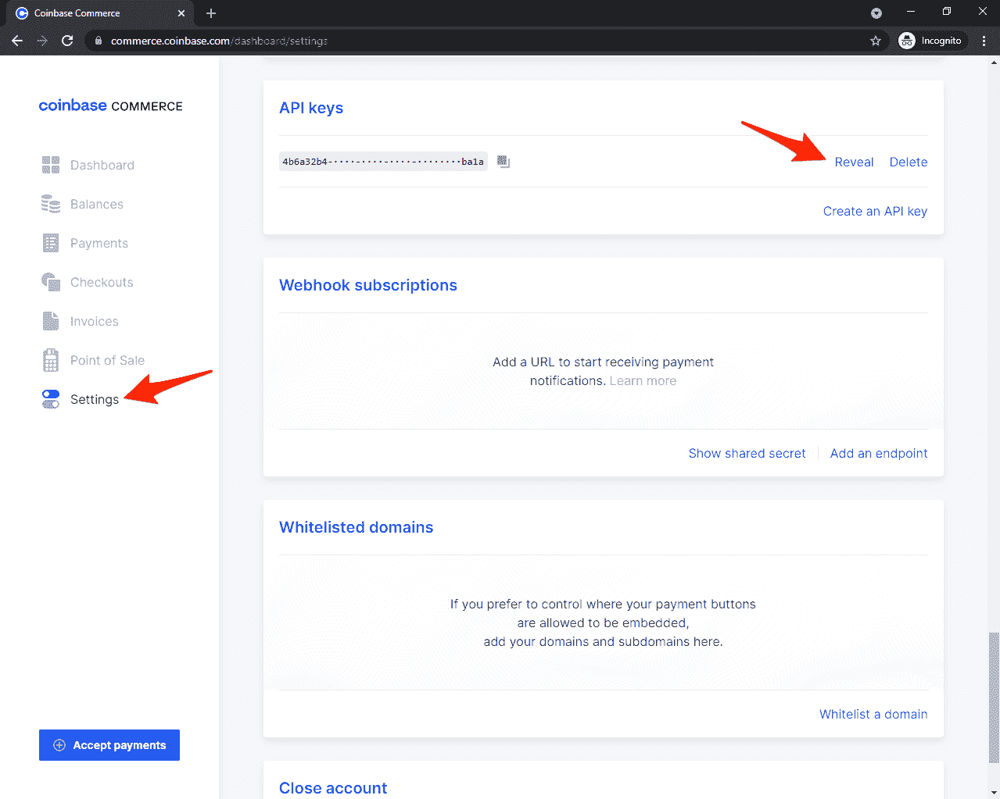
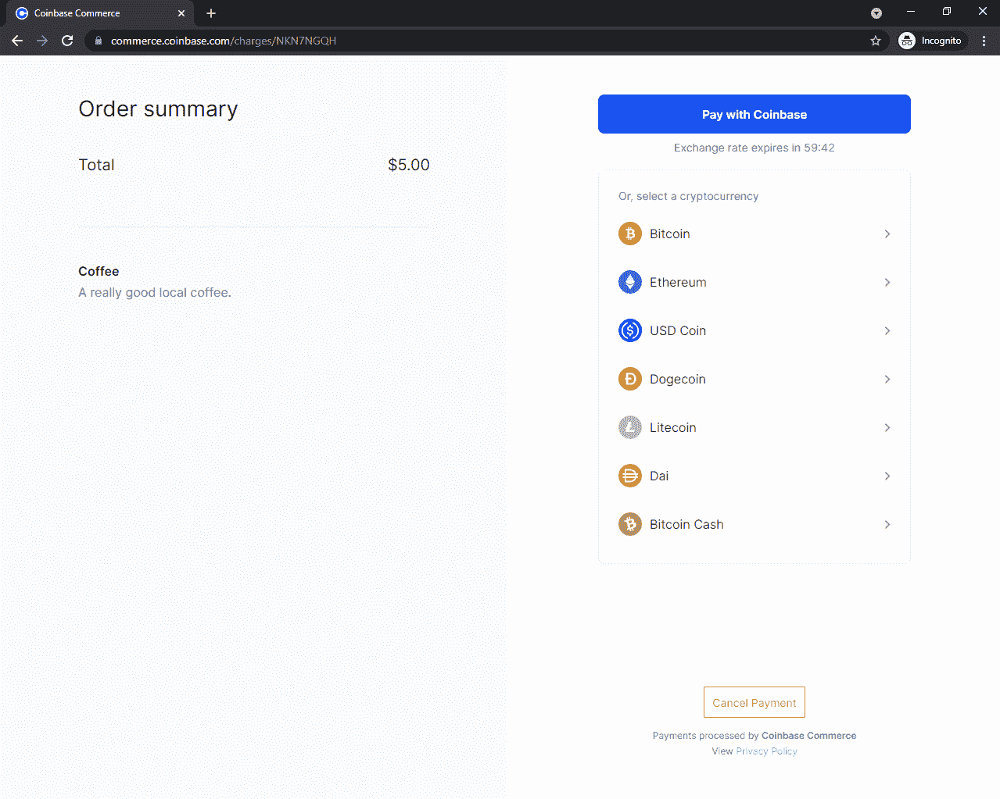
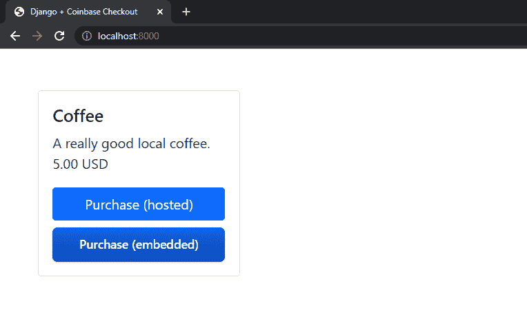
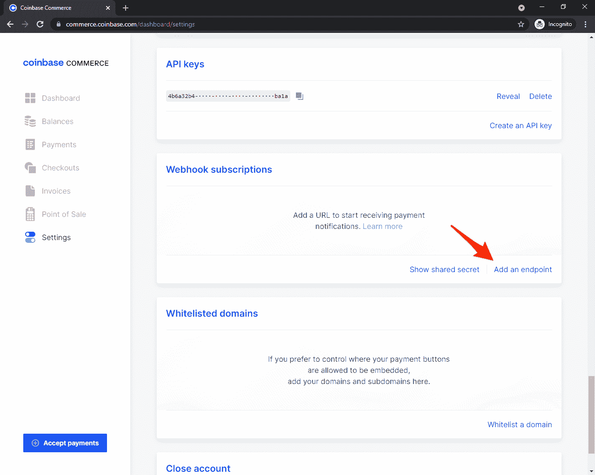
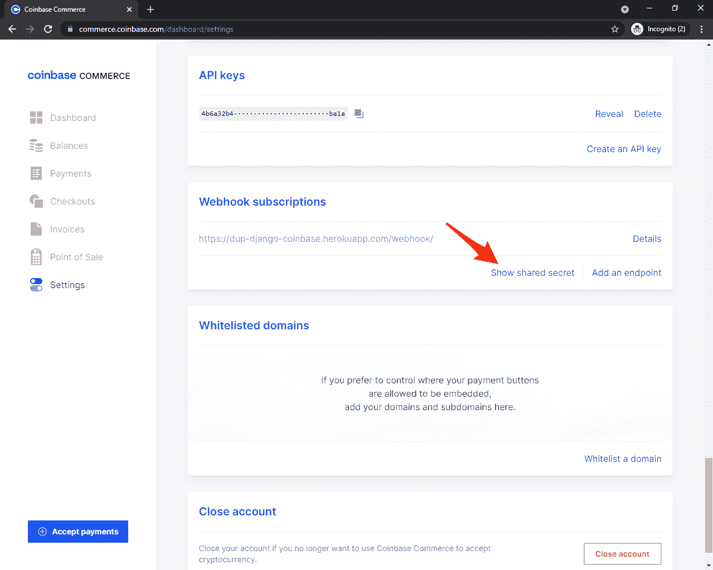
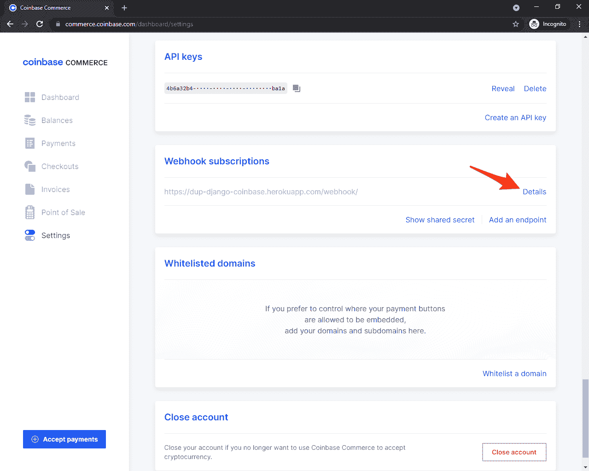
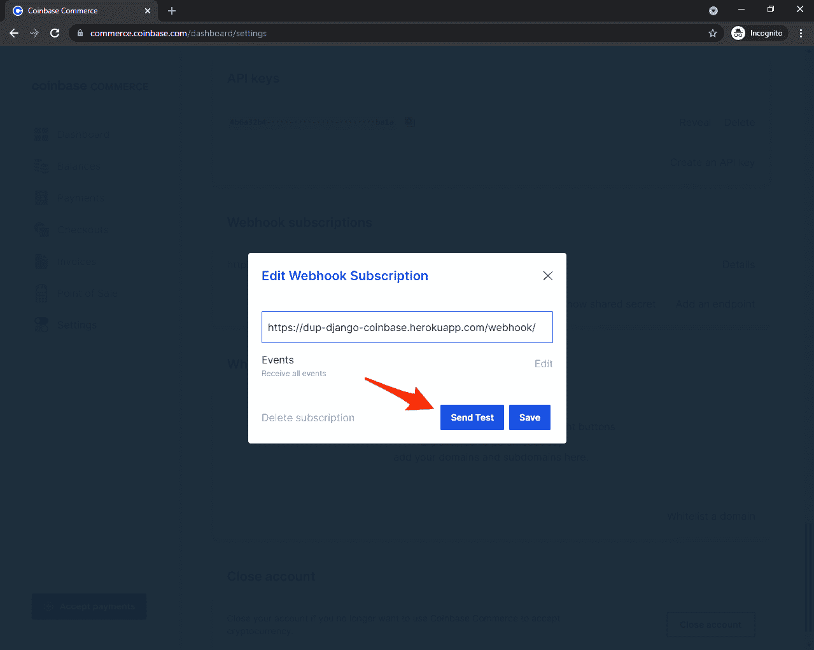

# 接受姜戈和比特币基地的加密付款

> 原文：<https://testdriven.io/blog/django-coinbase/>

在本教程中，我们将把 Django 与[比特币基地商务](https://commerce.coinbase.com/)集成起来，以接受不同的加密支付。我们来看看两种不同的方法:[比特币基地收费](https://commerce.coinbase.com/docs/api/#charges)和[比特币基地结账](https://commerce.coinbase.com/docs/api/#checkouts)。

## 什么是比特币基地商业？

[比特币基地商务](https://commerce.coinbase.com/)是由[比特币基地](https://www.coinbase.com/)提供的企业数字支付服务，允许商家接受不同数字货币的加密支付。在撰写本文时，[支持](https://commerce.coinbase.com/faq#which-cryptocurrencies-can-i-accept-do-i-have-to-accept-all-of-the-cryptocurrencies-that-coinbase-commerce-offers)比特币、比特币现金、戴币、以太币、莱特币、Dogecoin 和美元币。比特币基地商务很容易集成到您的 web 应用程序中，并消除了处理加密支付的麻烦。

> [比特币基地](https://www.coinbase.com/)和[比特币基地商贸](https://commerce.coinbase.com/)不是一回事。比特币基地是一家加密交易所和钱包管理公司，而比特币基地商业是一家面向商家的数字支付服务提供商。

比特币基地商业 API 提供了两种不同的接受加密支付的方式:[比特币基地收费](https://commerce.coinbase.com/docs/api/#charges)和[比特币基地结账](https://commerce.coinbase.com/docs/api/#checkouts)。

比特币基地收费的优势:

*   高度可定制
*   能够以编程方式附加元数据

比特币基地收银台的优势:

*   开箱即用
*   仪表板产品管理
*   嵌入式结帐

对于大多数应用程序，我们推荐 Charges API，因为它可以定制。这比结帐 API 提供的简单性更重要。如果你在销售一个固定的产品，定制并没有发挥很大的作用，请放心使用结帐 API。

## 项目设置

在本教程中，我们将展示如何让这两种方法，比特币基地收费和比特币基地结帐，启动和运行。我们将从相同的项目设置开始。一旦设置好了，就可以随意遵循其中一种或两种方法。

### Django 项目设置

首先创建一个新目录，并建立一个新的 Django 项目:

```py
`$ mkdir django-coinbase && cd django-coinbase
$ python3.9 -m venv env
$ source env/bin/activate

(env)$ pip install django==3.2.8
(env)$ django-admin startproject core .` 
```

之后，创建一个名为`payments`的新应用:

```py
`(env)$ python manage.py startapp payments` 
```

在`INSTALLED_APPS`下的 *core/settings.py* 中注册 app:

```py
`# core/settings.py

INSTALLED_APPS = [
    'django.contrib.admin',
    'django.contrib.auth',
    'django.contrib.contenttypes',
    'django.contrib.sessions',
    'django.contrib.messages',
    'django.contrib.staticfiles',
    'payments.apps.PaymentsConfig', # new
]` 
```

向 *payments/views.py* 添加一个名为`home_view`的简单功能视图:

```py
`# payments/views.py

from django.shortcuts import render

def home_view(request):
    return render(request, 'home.html', {})` 
```

在`payments` app 里面创建一个 *urls.py* 文件:

```py
`# payments/urls.py

from django.urls import path

from . import views

urlpatterns = [
    path('', views.home_view, name='payments-home'),
]` 
```

使用`payments`应用程序更新项目级 URL 文件:

```py
`# core/urls.py

from django.contrib import admin
from django.urls import path, include

urlpatterns = [
    path('', include('payments.urls')), # new
    path('admin/', admin.site.urls),
]` 
```

为主页创建一个专用的“模板”文件夹和一个文件:

```py
`(env)$ mkdir templates
(env)$ touch templates/home.html` 
```

然后，将以下 HTML 添加到 *templates/home.html* :

```py
`<!-- templates/home.html -->

<!DOCTYPE html>
<html lang="en">
  <head>
    <meta charset="utf-8">
    <meta name="viewport" content="width=device-width, initial-scale=1">
    <title>Django + Coinbase</title>
    <link rel="stylesheet" href="https://cdn.jsdelivr.net/npm/[[email protected]](/cdn-cgi/l/email-protection)/dist/css/bootstrap.min.css" crossorigin="anonymous">
    <script src="https://cdn.jsdelivr.net/npm/[[email protected]](/cdn-cgi/l/email-protection)/dist/js/bootstrap.min.js" crossorigin="anonymous"></script>
  </head>
  <body>
    <div class="container mt-5">
      <a class="btn btn-primary" href="#">Purchase</a>
    </div>
  </body>
</html>` 
```

确保更新 settings.py 文件，以便 Django 知道要查找“templates”文件夹:

```py
`# core/settings.py

TEMPLATES = [
    {
        'BACKEND': 'django.template.backends.django.DjangoTemplates',
        'DIRS': ['templates'], # new
        ...` 
```

最后运行`migrate`来同步数据库，运行`runserver`来启动 Django 的本地 web 服务器:

```py
`(env)$ python manage.py migrate
(env)$ python manage.py runserver` 
```

就是这样！在自己喜欢的浏览器中打开 [http://localhost:8000/](http://localhost:8000/) 。您应该会看到主页:


### 添加比特币基地商务

接下来，安装`coinbase-commerce`:

```py
`(env)$ pip install coinbase-commerce==1.0.1` 
```

为了使用[比特币基地商务 API](https://commerce.coinbase.com/docs/api/) ，你需要[创建一个账户](https://commerce.coinbase.com/signup)(如果你还没有的话)。创建帐户后，登录并导航至您的设置。向下滚动到“API 密钥”部分，单击“创建 API 密钥”，然后单击“显示”。将 API 密钥复制到剪贴板。



然后将密钥添加到 *settings.py* 文件中:

```py
`# core/settings.py

COINBASE_COMMERCE_API_KEY = '<your coinbase api key here>'` 
```

在进入下一步之前，让我们测试一下是否可以从 API 中检索数据。使用以下命令输入 Python shell:

```py
`(env)$ python manage.py shell` 
```

导入以下内容:

```py
`>>> from core import settings
>>> from coinbase_commerce.client import Client` 
```

初始化新客户端并列出费用:

```py
`>>> client = Client(api_key=settings.COINBASE_COMMERCE_API_KEY)
>>> for charge in client.charge.list_paging_iter():
...     print("{!r}".format(charge))` 
```

如果一切正常，`client.charge.list_paging_iter()`应该是一个空列表。只要您没有看到以下错误，就可以认为一切正常:

```py
`coinbase_commerce.error.AuthenticationError: Request id 10780b77-1021-4b09-b53b-a590ea044380: No such API key.` 
```

使用比特币基地 API 的有用页面:

有了这个，决定你想采取哪种方法，比特币基地收费或比特币基地结帐。

## 比特币基地收费

> 教程的这一部分展示了如何使用[比特币基地收费 API](https://commerce.coinbase.com/docs/api/#charges) 接受付款。

比特币基地收费是收集加密支付的最可定制的方法。使用这种方法，您可以完全控制费用。

工作流程:

1.  使用客户端连接到比特币基地商务 API
2.  创建费用(来自 JSON)
3.  获取新创建的费用，并将其传递给模板
4.  将用户重定向到比特币基地商务网站
5.  (可选)使用 webhooks 验证费用

### 创建一个收费

要请求加密货币支付，您需要创建一个[费用](https://commerce.coinbase.com/docs/api/#charges)。由于加密货币支付是[推送支付](https://commerce.coinbase.com/docs/#cryptocurrency-payments)，如果没有检测到支付，则在等待期后收费将到期。费用由一个独特的 8 字符代码识别。

将`home_view`更新为[创建费用](https://commerce.coinbase.com/docs/api/#create-a-charge):

```py
`# payments/views.py

from coinbase_commerce.client import Client
from django.shortcuts import render

from core import settings

def home_view(request):
    client = Client(api_key=settings.COINBASE_COMMERCE_API_KEY)
    domain_url = 'http://localhost:8000/'
    product = {
        'name': 'Coffee',
        'description': 'A really good local coffee.',
        'local_price': {
            'amount': '5.00',
            'currency': 'USD'
        },
        'pricing_type': 'fixed_price',
        'redirect_url': domain_url + 'success/',
        'cancel_url': domain_url + 'cancel/',
    }
    charge = client.charge.create(**product)

    return render(request, 'home.html', {
        'charge': charge,
    })` 
```

我们首先通过向客户端传递`COINBASE_COMMERCE_API_KEY`来初始化它。然后，我们创建了一个代表我们产品的 JSON 对象(我们提供了名称、描述等。).我们还将`redirect_url`和`cancel_url`传递给了 charge，稍后我们将在这里实现它。然后，我们解包 JSON 对象，并使用客户机创建一个费用。最后，我们将它作为上下文传递给 home 模板。

我们现在可以访问 *templates/home.html* 中的费用信息。像这样更新模板:

```py
`<!-- templates/home.html -->

<!DOCTYPE html>
<html lang="en">
  <head>
    <meta charset="utf-8">
    <meta name="viewport" content="width=device-width, initial-scale=1">
    <title>Django + Coinbase Charge</title>
    <link rel="stylesheet" href="https://cdn.jsdelivr.net/npm/[[email protected]](/cdn-cgi/l/email-protection)/dist/css/bootstrap.min.css" crossorigin="anonymous">
    <script src="https://cdn.jsdelivr.net/npm/[[email protected]](/cdn-cgi/l/email-protection)/dist/js/bootstrap.min.js" crossorigin="anonymous"></script>
  </head>
  <body>
    <div class="container mt-5">
      <div class="card w-25">
        <div class="card-body">
          <h5 class="card-title">{{ charge.name }}</h5>
          <p class="card-text">
            <span>{{ charge.description }}</span>
            <br>
            <span>${{ charge.pricing.local.amount }} {{ charge.pricing.local.currency }}</span>
          </p>
          <div>
            <a class="btn btn-primary w-100" href="{{ charge.hosted_url }}">Purchase</a>
          </div>
        </div>
      </div>
    </div>
  </body>
</html>` 
```

> 请参考[收费 API](https://commerce.coinbase.com/docs/api/#charges) 文档，了解您可以在模板上显示的所有收费相关信息。

运行开发服务器:

```py
`(env)$ python manage.py runserver` 
```

[http://localhost:8000/](http://localhost:8000/) 现在应该是这样的:


先不要测试。我们很快就会这么做。

### 创建重定向视图

让我们实现传递给 charge 的视图`redirect_url`和`cancel_url`。

在 *payments/views.py* 中创建两个新视图:

```py
`# payments/views.py

def success_view(request):
    return render(request, 'success.html', {})

def cancel_view(request):
    return render(request, 'cancel.html', {})` 
```

在 *payments/urls.py* 中注册新视图:

```py
`# payments/urls.py

from django.urls import path

from . import views

urlpatterns = [
    path('', views.home_view, name='payments-home'),
    path('success/', views.success_view, name='payments-success'), # new
    path('cancel/', views.cancel_view, name='payments-cancel'), # new
]` 
```

以及 *templates/success.html* :

```py
`<!-- templates/success.html -->

<!DOCTYPE html>
<html lang="en">
  <head>
    <meta charset="utf-8">
    <meta name="viewport" content="width=device-width, initial-scale=1">
    <title>Django + Coinbase Charge</title>
    <link rel="stylesheet" href="https://cdn.jsdelivr.net/npm/[[email protected]](/cdn-cgi/l/email-protection)/dist/css/bootstrap.min.css" crossorigin="anonymous">
    <script src="https://cdn.jsdelivr.net/npm/[[email protected]](/cdn-cgi/l/email-protection)/dist/js/bootstrap.min.js" crossorigin="anonymous"></script>
  </head>
  <body>
    <div class="container mt-5">
      <p>Your payment has been successful.</p>
    </div>
  </body>
</html>` 
```

以及 *templates/cancel.html* :

```py
`<!-- templates/cancel.html -->

<!DOCTYPE html>
<html lang="en">
  <head>
    <meta charset="utf-8">
    <meta name="viewport" content="width=device-width, initial-scale=1">
    <title>Django + Coinbase Charge</title>
    <link rel="stylesheet" href="https://cdn.jsdelivr.net/npm/[[email protected]](/cdn-cgi/l/email-protection)/dist/css/bootstrap.min.css" crossorigin="anonymous">
    <script src="https://cdn.jsdelivr.net/npm/[[email protected]](/cdn-cgi/l/email-protection)/dist/js/bootstrap.min.js" crossorigin="anonymous"></script>
  </head>
  <body>
    <div class="container mt-5">
      <p>Your payment has been cancelled.</p>
    </div>
  </body>
</html>` 
```

现在确认支付后，用户会被重定向到`redirect_url`。如果他们取消支付(或收费超时)，他们将被重定向到`cancel_url`。

### 测试

> 不幸的是，比特币基地商务不支持沙盒账户测试，这意味着你需要使用真正的加密来测试你的应用。

运行服务器，导航到 [http://localhost:8000/](http://localhost:8000/) ，点击“购买”按钮。您将被重定向到比特币基地商业托管网站:



当您选择要支付的加密货币时，将显示钱包地址(和二维码):


然后你有 60 分钟的时间在充电超时前转移密码。

在您发送加密后，矿工将需要几分钟(取决于您使用的加密货币)来确认您的交易。在交易获得所需数量的确认(基于加密货币)后，您将被重定向到与`redirect_url`相关联的 URL。

付款将出现在[商务仪表板](https://commerce.coinbase.com/dashboard/payments)的“付款”下:


跳到“用 Webhooks 确认付款”部分，了解付款确认。

## 比特币基地收银台

> 教程的这一部分展示了如何使用[比特币基地结账 API](https://commerce.coinbase.com/docs/api/#checkouts) 接受付款。如果您决定使用比特币基地收费，请随意跳过这一部分，转到“用 Webhooks 确认付款”部分。

比特币基地结帐是用比特币基地商业收集加密付款的最简单的方法。通过这种方式，将自动为您生成费用。这种方法适用于处理固定产品。

工作流程:

1.  使用客户端连接到比特币基地商务 API
2.  从比特币基地商业 API 获取一个结帐并将其传递给模板
3.  (可选)如果处理嵌入式签出，请将所需的 HTML 代码添加到模板中
4.  将用户重定向到比特币基地商业托管网站或使用嵌入式结帐
5.  (可选)使用 webhooks 验证费用

### 创建结帐

创建签出有两种方式:

1.  通过 [coinbase-commerce](https://github.com/coinbase/coinbase-commerce-python#create) 库进行编程
2.  在比特币基地商务控制板中人工操作

为简单起见，我们将使用[商务仪表板](https://commerce.coinbase.com/dashboard/settings)。

导航至“结帐”并点击“创建结帐”:


点击“销售产品”。输入产品名称、描述和价格。点击“下一步”。在“客户信息”下，选择“不收集任何信息”。然后，点击“完成”。

比特币基地商务生成了所有必要的 HTML 代码，您需要添加到您的主页模板。你可以在“嵌入”标签下看到这个。为了使 web 应用程序更加模块化和可重用，我们将在`home_view`中获取结帐信息，而不是在模板中硬编码。为此，我们首先需要通过复制托管页面的 URL 来获取结帐 ID:


永久链接应该是这样的:

```py
`https://commerce.coinbase.com/checkout/df2d7c68-145e-4537-86fa-1cac705eb748` 
```

我们只对 URL 的最后一段感兴趣，它表示结账 ID:

```py
`df2d7c68-145e-4537-86fa-1cac705eb748` 
```

将它保存在 *core/settings.py* 文件中，如下所示:

```py
`# core/settings.py

COINBASE_CHECKOUT_ID = '<your checkout id>'` 
```

更新*支付/查看. py* :

```py
`# payments/views.py

from coinbase_commerce.client import Client
from django.shortcuts import render

from core import settings

def home_view(request):
    client = Client(api_key=settings.COINBASE_COMMERCE_API_KEY)
    checkout = client.checkout.retrieve(settings.COINBASE_CHECKOUT_ID)
    checkout_link = f'https://commerce.coinbase.com/checkout/{checkout.id}'

    return render(request, 'home.html', {
        'checkout': checkout,
        'checkout_link': checkout_link,
    })` 
```

这段代码获取结帐并将其传递给模板。

最后，我们需要修改 home 模板来使用 checkout。您可以使用:

1.  托管页面——用户被重定向到比特币基地结账网站
2.  嵌入式页面-一切都发生在你的网站上

出于教育目的，我们将使用这两种方法。

更新 *templates/home.html* :

```py
`<!-- templates/home.html -->

<!DOCTYPE html>
<html lang="en">
  <head>
    <meta charset="utf-8">
    <meta name="viewport" content="width=device-width, initial-scale=1">
    <title>Django + Coinbase Checkout</title>
    <link rel="stylesheet" href="https://cdn.jsdelivr.net/npm/[[email protected]](/cdn-cgi/l/email-protection)/dist/css/bootstrap.min.css" crossorigin="anonymous">
    <script src="https://cdn.jsdelivr.net/npm/[[email protected]](/cdn-cgi/l/email-protection)/dist/js/bootstrap.min.js" crossorigin="anonymous"></script>
  </head>
  <body>
    <div class="container mt-5">
      <div class="card w-25">
        <!-- Coinbase checkout details -->
        <div class="card-body">
          <h5 class="card-title">{{ checkout.name }}</h5>
          <p class="card-text">
            {{ checkout.description }}<br>
            {{ checkout.local_price.amount }} {{ checkout.local_price.currency }}
          </p>
          <div>
            <!-- Coinbase hosted approach (script not required) -->
            <a class="btn btn-primary w-100" href="{{ checkout_link }}">Purchase (hosted)</a>
            <!-- Coinbase embedded approach (script required) -->
            <div class="mt-2">
              <a class="btn btn-primary buy-with-crypto w-100" href="{{ checkout_link }}">Purchase (embedded)</a>
              <script src="https://commerce.coinbase.com/v1/checkout.js?version=201807"></script>
            </div>
          </div>
        </div>
      </div>
    </div>
  </body>
</html>` 
```

运行服务器并导航到 [http://localhost:8000/](http://localhost:8000) :



此时，应用程序完全正常工作。但是现在不要测试任何东西。我们将在下一节中介绍这一点。

### 测试

> 不幸的是，比特币基地商务不支持沙盒账户测试，这意味着你需要使用真正的加密来测试你的应用。

在服务器运行的情况下，导航到 [http://localhost:8000/](http://localhost:8000/) 。您可以使用比特币基地托管的网站或嵌入式结帐测试。你的选择。

当您选择要支付的加密货币时，将显示钱包地址(和二维码):


然后你有 60 分钟的时间在充电超时前转移密码。

在您发送加密后，矿工将需要几分钟(取决于您使用的加密货币)来确认您的交易。在交易获得所需数量的确认(基于加密货币)后，您将收到一条“支付完成”消息。

付款将出现在[商务仪表板](https://commerce.coinbase.com/dashboard/payments)的“付款”下:


## 用 Webhooks 确认付款

我们的应用程序在这一点上运行良好，但我们还不能以编程方式确认付款。我们只是在用户结帐后将他们重定向到成功页面，但我们不能只依赖该页面，因为支付确认是异步发生的。

> 在编程时，您经常要处理两种不同类型的事件:同步事件，它们会产生即时的效果和结果(例如，创建收费)，异步事件，它们不会产生即时的结果(例如，确认付款)。因为支付确认是异步完成的，用户可能会在他们的支付被确认之前*和*我们收到他们的资金之前*被重定向到成功页面。*

为了在付款完成时得到通知，您需要创建一个 [webhook](https://commerce.coinbase.com/docs/api/#webhooks) 。我们需要在应用程序中创建一个简单的端点，每当事件发生时(即确认收费时)，比特币基地商务部都会调用这个端点。通过使用 webhooks，我们可以确保支付成功。

为了使用 webhooks，我们需要:

1.  在应用程序中设置 webhook 端点
2.  在比特币基地商务仪表板中注册端点

### 配置端点

在 *payments/views.py* 中创建`coinbase_webhook`视图:

```py
`# payments/views.py

@csrf_exempt
@require_http_methods(['POST'])
def coinbase_webhook(request):
    logger = logging.getLogger(__name__)

    request_data = request.body.decode('utf-8')
    request_sig = request.headers.get('X-CC-Webhook-Signature', None)
    webhook_secret = settings.COINBASE_COMMERCE_WEBHOOK_SHARED_SECRET

    try:
        event = Webhook.construct_event(request_data, request_sig, webhook_secret)

        # List of all Coinbase webhook events:
        # https://commerce.coinbase.com/docs/api/#webhooks

        if event['type'] == 'charge:confirmed':
            logger.info('Payment confirmed.')
            # TODO: run some custom code here

    except (SignatureVerificationError, WebhookInvalidPayload) as e:
        return HttpResponse(e, status=400)

    logger.info(f'Received event: id={event.id}, type={event.type}')
    return HttpResponse('ok', status=200)` 
```

这个代码块验证请求的签名和有效负载，然后从中生成一个事件。现在，您可以检查事件类型，并根据类型执行不同的操作。

更新导入:

```py
`import logging

from coinbase_commerce.client import Client
from coinbase_commerce.error import SignatureVerificationError, WebhookInvalidPayload
from coinbase_commerce.webhook import Webhook
from django.http import HttpResponse
from django.shortcuts import render
from django.views.decorators.csrf import csrf_exempt
from django.views.decorators.http import require_http_methods

from core import settings` 
```

> 忽略`COINBASE_COMMERCE_WEBHOOK_SHARED_SECRET`还不存在的错误。我们将在下一步中添加它。

在 *payments/urls.py* 中注册网址:

```py
`# payments/urls.py

from django.urls import path

from . import views

urlpatterns = [
    path('', views.home_view, name='payments-home'),
    path('success/', views.success_view, name='payments-success'),   # only for the Coinbase charges approach
    path('cancel/', views.cancel_view, name='payments-cancel'),      # only for the Coinbase charges approach
    path('webhook/', views.coinbase_webhook),  # new
]` 
```

`coinbase_webhook`视图现在充当我们的 webhook 端点，当事件发生时，比特币基地商务会将事件发送到该端点。

> 如果你遵循比特币基地结帐方法，不要包含`success/`或`cancel/`URL。

### 识别用户

为了识别 webhook 中的用户，您需要在创建费用或开始结帐会话时传递一些元数据。然后，您将能够在 webhook 中获取这些元数据。

根据您使用的方法，传递元数据的方式会有所不同:

1.  **收费 API** -你必须将元数据附加到产品上
2.  **check out API**——你必须将元数据作为 HTML 属性传递

#### 使用费用 API 确定用户

要使用收费 API 识别用户，首先将以下内容添加到`home_view`内的`product`字典中:

```py
`# payments/views.py

product = {
    ...
    'metadata': {
        'customer_id': request.user.id if request.user.is_authenticated else None,
        'customer_username': request.user.username if request.user.is_authenticated else None,
    },
    ...
}` 
```

这段代码附加了经过身份验证的用户的用户 ID 和用户名。

您现在可以像这样访问`coinbase_webhook`视图中的元数据:

```py
`# payments/views.py

@csrf_exempt
@require_http_methods(['POST'])
def coinbase_webhook(request):
    logger = logging.getLogger(__name__)

    request_data = request.body.decode('utf-8')
    request_sig = request.headers.get('X-CC-Webhook-Signature', None)
    webhook_secret = settings.COINBASE_COMMERCE_WEBHOOK_SHARED_SECRET

    try:
        event = Webhook.construct_event(request_data, request_sig, webhook_secret)

        # List of all Coinbase webhook events:
        # https://commerce.coinbase.com/docs/api/#webhooks

        if event['type'] == 'charge:confirmed':
            logger.info('Payment confirmed.')
            customer_id = event['data']['metadata']['customer_id'] # new
            customer_username = event['data']['metadata']['customer_username'] # new
            # TODO: run some custom code here
            # you can also use 'customer_id' or 'customer_username'
            # to fetch an actual Django user

    except (SignatureVerificationError, WebhookInvalidPayload) as e:
        return HttpResponse(e, status=400)

    logger.info(f'Received event: id={event.id}, type={event.type}')
    return HttpResponse('ok', status=200)` 
```

#### 使用结帐 API 识别用户

为了使用结帐 API 识别用户，我们需要将元数据作为一个数据属性添加到 *templates/home.html* 中的锚点:

例如:

```py
`<div>
  <!-- Coinbase hosted approach (script not required) -->
  <a
    class="btn btn-primary w-100"
    data-custom="{{ user.pk }}"
    href="{{ checkout_link }}"
  >Purchase (hosted)</a>
  <!-- Coinbase embedded approach (script required) -->
  <div class="mt-2">
    <a
      class="btn btn-primary buy-with-crypto w-100"
      data-custom="{{ user.pk }}"
      href="{{ checkout_link }}"
    >Purchase (embedded)</a>
    <script src="https://commerce.coinbase.com/v1/checkout.js?version=201807"></script>
  </div>
</div>` 
```

然后，您可以在`coinbase_webhook`视图中检索元数据，如下所示:

```py
`# payments/views.py

@csrf_exempt
@require_http_methods(['POST'])
def coinbase_webhook(request):
    import logging

    request_data = request.body.decode('utf-8')
    request_sig = request.headers.get('X-CC-Webhook-Signature', None)
    webhook_secret = settings.COINBASE_COMMERCE_WEBHOOK_SHARED_SECRET

    try:
        event = Webhook.construct_event(request_data, request_sig, webhook_secret)

        # List of all Coinbase webhook events:
        # https://commerce.coinbase.com/docs/api/#webhooks

        if event['type'] == 'charge:confirmed':
            logger.info('Payment confirmed.')
            customer_id = event['data']['metadata']['custom'] # new
            # TODO: run some custom code here
            # you can also use 'customer_id'
            # to fetch an actual Django user

    except (SignatureVerificationError, WebhookInvalidPayload) as e:
        return HttpResponse(e, status=400)

    logger.info(f'Received event: id={event.id}, type={event.type}')
    return HttpResponse('ok', status=200)` 
```

> 请记住，webhook 以纯文本形式接收`data-custom`。在使用它从数据库中获取用户之前，一定要将它解析为一个整数。

### 注册端点

导航至[https://commerce.coinbase.com/dashboard/settings](https://commerce.coinbase.com/dashboard/settings)，向下滚动至“Webhook 订阅”并点击“添加端点”:



输入您的端点 URL，然后按“保存”。

> 该网址需要以 HTTPS 开头，这意味着您需要部署您的应用程序，然后才能测试它。

接下来，点击“显示共享密码”并复制密码:



将共享密钥添加到 *settings.py* 文件中，如下所示:

```py
`# core/settings.py

COINBASE_COMMERCE_WEBHOOK_SHARED_SECRET = '<your coinbase webhook secret here>'` 
```

### 测试端点

部署好应用程序后，您可以从 [Commerce Dashboard](https://commerce.coinbase.com/dashboard/settings) 发送一个测试 webhook 请求。导航至“Webhook 订阅”,点击 webhook 端点下的“详细信息”:



然后点击“发送测试”:



最后，选择“充电:确认”并再次点击“发送测试”。您应该会看到“支付已成功”日志消息。

## 结论

在本教程中，您学习了如何接受比特币基地商务加密支付。您现在应该能够将其与 Django 集成，并通过 webhook 验证支付。

您可以在 GitHub 上的以下 repos 中找到代码:

1.  [django-coinbase-charges](https://github.com/testdrivenio/django-coinbase-charges)
2.  [django-coinbase-checkout](https://github.com/testdrivenio/django-coinbase-checkout)