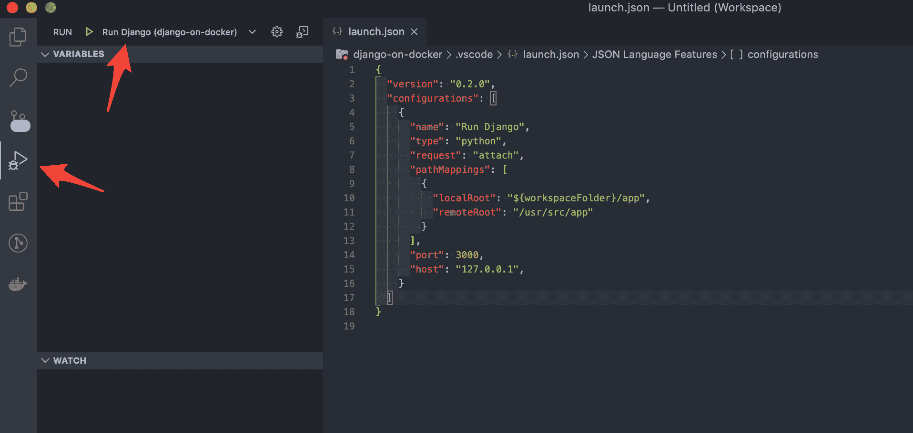

# 用 VS 代码调试一个容器化的 Django 应用程序

> 原文：<https://testdriven.io/blog/django-debugging-vs-code/>

本教程着眼于如何用 [Visual Studio 代码](https://code.visualstudio.com) (VS 代码)调试一个容器化的 Django 应用。

## 目标

学完本教程后，您应该能够:

1.  创建 VS 代码运行配置以附加到 Docker 容器
2.  修改 *manage.py* 来启动一个[Debug py](https://github.com/microsoft/debugpy/)(Python Tools for Visual Studio Debug Server)调试服务器
3.  用 VS 代码调试一个容器化的 Django 项目

## 创建运行配置

如果你还没有为你的项目设置一个[运行配置](https://code.visualstudio.com/docs/python/debugging)，添加一个*。vscode/launch.json* 文件:

```py
`{ "version":  "0.2.0", "configurations":  [ { "name":  "Run Django", "type":  "python", "request":  "attach", "pathMappings":  [ { "localRoot":  "${workspaceFolder}/app", "remoteRoot":  "/usr/src/app" } ], "port":  3000, "host":  "127.0.0.1", } ] }` 
```

确保更新`localRoot`和`remoteRoot`值，VS 代码使用它们在您的[工作区](https://stackoverflow.com/a/57134632/1799408)和远程主机的文件系统之间映射源文件。尽管这些值会因项目设置方式的不同而有所不同，但您通常可以从 Docker 卷配置中获得这些信息。

例如，假设您的 Docker 合成文件中有以下配置:

```py
`volumes: -  ./app/:/usr/src/app/` 
```

本地文件夹路径`./app/`是`localRoot`应该设置的路径(如`"${workspaceFolder}/app"`)，而`remoteRoot`应该设置为容器内的文件夹(如`"/usr/src/app"`)。值得注意的是，容器中的这个文件夹也可能是您的工作目录:

表示我们想要将 VS 代码的调试器连接到一个已经在运行的进程。在上面的配置中，我们告诉它连接到 127.0.0.1 上的端口 3000。我们将很快配置 debugpy 在`127.0.0.1:3000`上运行。

完成后，单击最左侧活动栏中的“Run”图标。您现在应该可以在侧边栏的播放按钮旁边看到`Run Django`配置:



## 修改 manage.py

将 VS 代码设置为附加到 debugpy，让我们将它集成到我们的应用程序中。

首先，将 [debugpy](https://github.com/microsoft/debugpy/) 包添加到您的需求文件中:

由于 debugpy 与 Django 应用程序一起运行，我们需要将其配置为在我们的 *manage.py* 文件中运行:

```py
`from django.conf import settings

if settings.DEBUG:
    if os.environ.get('RUN_MAIN') or os.environ.get('WERKZEUG_RUN_MAIN'):
        import debugpy
        debugpy.listen(("0.0.0.0", 3000))
        print('Attached!')` 
```

您的文件将类似于:

```py
`#!/usr/bin/env python
"""Django's command-line utility for administrative tasks."""
import os
import sys

def main():
    os.environ.setdefault('DJANGO_SETTINGS_MODULE', 'core.settings')

    # start new section
    from django.conf import settings

    if settings.DEBUG:
        if os.environ.get('RUN_MAIN') or os.environ.get('WERKZEUG_RUN_MAIN'):
            import debugpy
            debugpy.listen(("0.0.0.0", 3000))
            print('Attached!')
    # end new section

    try:
        from django.core.management import execute_from_command_line
    except ImportError as exc:
        raise ImportError(
            "Couldn't import Django. Are you sure it's installed and "
            "available on your PYTHONPATH environment variable? Did you "
            "forget to activate a virtual environment?"
        ) from exc
    execute_from_command_line(sys.argv)

if __name__ == '__main__':
    main()` 
```

这里，我们首先确定项目是否在`DEBUG`模式下运行。如果是这样，那么我们要确保调试器没有被附加，如果它是 Django 的重载(如果你在服务器运行时修改了一些代码)。

`debugpy.listen()`方法启动调试服务器。您还可以阻塞执行，直到调试器附加了`wait_for_client()`:

```py
`from django.conf import settings

if settings.DEBUG:
    if os.environ.get('RUN_MAIN') or os.environ.get('WERKZEUG_RUN_MAIN'):
        import debugpy
        debugpy.listen(("0.0.0.0", 3000))
        debugpy.wait_for_client()
        print('Attached!')` 
```

因为 debugpy 将在端口 3000 上运行，所以您需要向主机公开该端口。如果您正在使用 Docker Compose，您可以像这样公开端口:

```py
`version:  '3.8' services: web: build:  ./app command:  python manage.py runserver 0.0.0.0:8000 volumes: -  ./app/:/usr/src/app/ ports: -  8000:8000 -  3000:3000` 
```

如果您没有使用 Compose，请确保在运行容器时公开端口:

```py
`$ docker run -d -p 8000:8000 -p 3000:3000 web` 
```

## 调试容器化的 Django 应用

在构建新的映像来安装 debugpy 之后，启动新的容器。

在代码中的某个地方设置断点。然后在 VS 代码中再次打开“Run”视图，确保我们之前创建的`Run Django`配置被选中。单击“播放”按钮开始调试会话。

现在，您应该能够到达断点并开始调试运行在 Docker 容器中的 Django 应用程序了。


## 结论

在本教程中，我们向您展示了如何配置 VS 代码来调试运行在 Docker 中的 Django 应用程序。

> 提示:如果您使用的是 Python 3.7 或更高版本，debugpy 也支持 Python 的`breakpoint()`函数。