# 用 Docker 将 Django 部署到 AWS，让我们加密

> 原文：<https://testdriven.io/blog/django-docker-https-aws/>

在本教程中，我们将使用 Docker 将 Django 应用程序部署到 AWS EC2。该应用程序将运行在 HTTPS Nginx 代理后面，该代理使用 Let's 加密 SSL 证书。我们将使用 AWS RDS 来服务我们的 Postgres 数据库，并使用 AWS ECR 来存储和管理我们的 Docker 图像。

> 姜戈码头系列:
> 
> 1.  [用 Postgres、Gunicorn 和 Nginx 将 Django 归档](/blog/dockerizing-django-with-postgres-gunicorn-and-nginx/)
> 2.  [用加密保护容器化的 Django 应用](/blog/django-lets-encrypt/)
> 3.  [用 Docker 把 Django 部署到 AWS，让我们加密](/blog/django-docker-https-aws/)(本文！)

## 目标

本教程结束时，您将能够:

1.  设置新的 EC2 实例
2.  在 EC2 实例上安装 Docker
3.  配置和使用弹性 IP 地址
4.  设置 IAM 角色
5.  利用 Amazon 弹性容器注册(ECR)图像注册来存储构建的图像
6.  为数据持久性配置 AWS RDS
7.  配置 AWS 安全组
8.  使用 Docker 将 Django 部署到 AWS EC2
9.  在 HTTPS Nginx 代理后面运行 Django 应用程序，让我们加密 SSL 证书

## 先决条件

这篇文章建立在用 Postgres、Gunicorn 和 Nginx 和[保护容器化 Django 应用程序的基础上，用 Let's Encrypt](/blog/django-lets-encrypt/) 文章。

它假设您可以:

1.  将 Django 应用与 Postgres、Nginx 和 Gunicorn 一起容器化。
2.  用[加密](https://letsencrypt.org/) SSL 证书来保护运行在 HTTPS Nginx 代理后面的容器化 Django 应用。
3.  使用 SSH 连接到远程服务器，使用 SCP 将文件复制到服务器。

## AWS EC2

首先，创建一个 [AWS](https://portal.aws.amazon.com/billing/signup#/start) 账户，如果你还没有的话。

接下来，导航到 [EC2 控制台](https://console.aws.amazon.com/ec2/)并点击**启动实例**:


使用**Ubuntu Server 18.04 LTS(HVM)**作为服务器镜像(AMI):

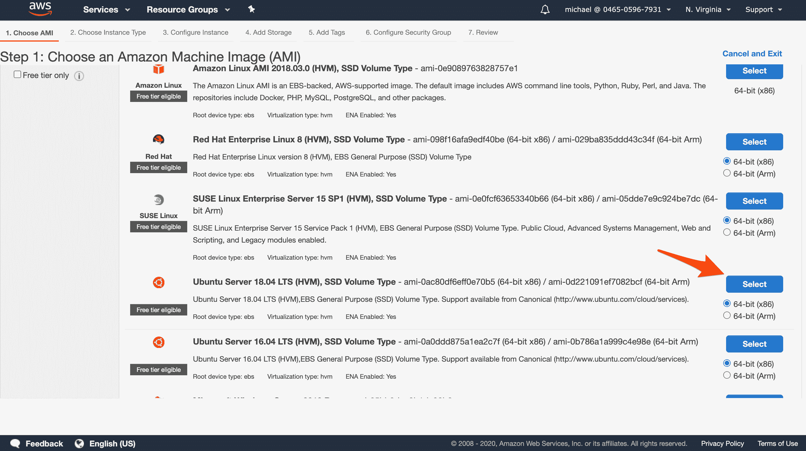

在下一步中，坚持使用 **t2.micro** 实例。点击**下一步:配置实例详情**:

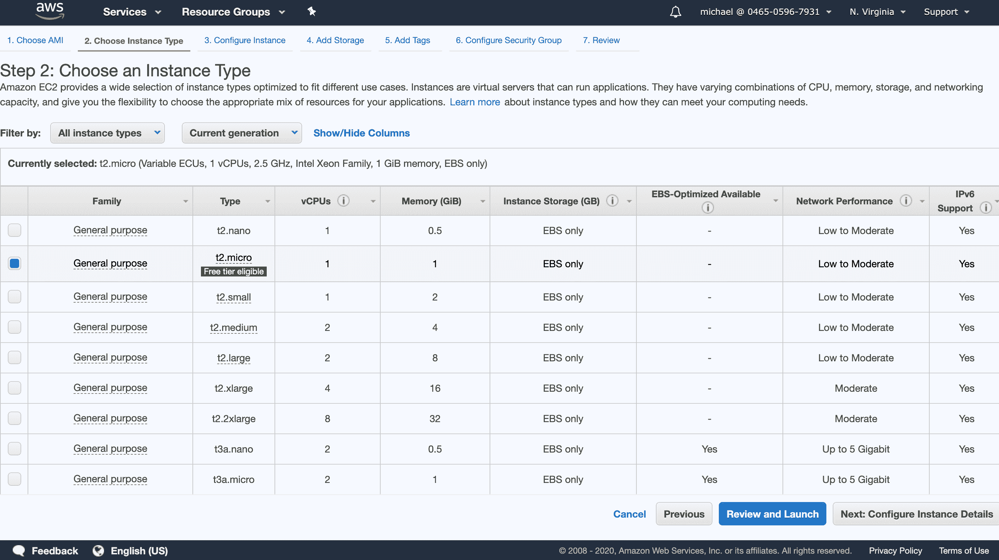

在**配置实例细节**步骤，让一切保持原样以保持简单。然后点击**下一步**几次，直到你在**配置安全组**步骤。

选择**创建新的安全组**，将名称和描述设置为`django-ec2`，并添加两条规则:

*   HTTP ->任何地方
*   HTTPS ->任何地方

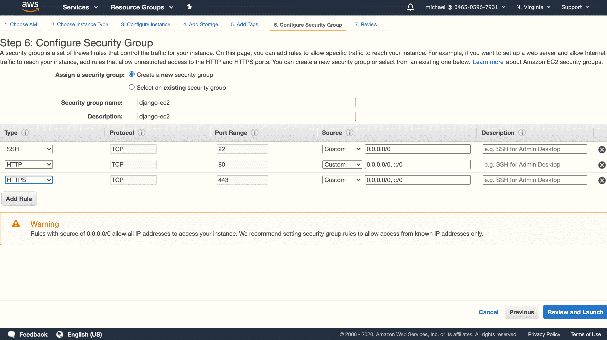

颁发证书和访问应用程序需要这些规则。

> 安全组*入站*规则用于限制从互联网对您的实例的访问。除非您有一些额外的安全需求，否则您可能希望允许来自任何地方的 HTTP 和 HTTPS 流量来托管 web 应用程序。为了设置和部署，必须允许 SSH 连接到实例。

点击**查看并启动**。在下一个屏幕上，点击**发射**。

系统会提示您选择一个密钥对。您需要它来通过 SSH 连接到您的实例。选择**创建一个新的密钥对**，并将其命名为`djangoletsencrypt`。然后点击**下载密钥对**。下载密钥对后，点击**启动实例**:

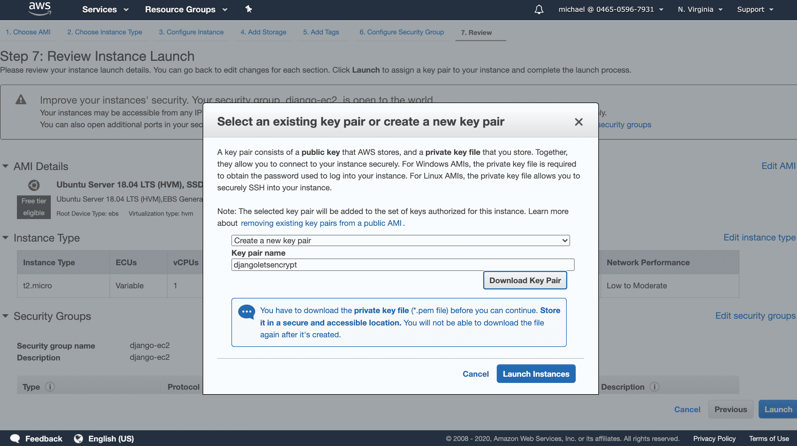

该实例将需要几分钟时间才能启动。

## 配置 EC2 实例

在本节中，我们将在实例上安装 Docker，添加一个弹性 IP，并配置一个 IAM 角色。

### 安装 Docker

导航回 [EC2 控制台](https://console.aws.amazon.com/ec2/)，选择新创建的实例，并获取公共 IP 地址:


使用我们在“AWS EC2”步骤中下载的`.pem`键连接到您的 EC2 实例。

> 您的`.pem`可能被下载到了像~/Downloads/djangoletsencrypt . PEM 这样的路径中。如果您不确定在哪里存储它，请将它移到 *~/中。ssh* 目录。您可能还需要更改权限，即`chmod 400 -i /path/to/your/djangoletsencrypt.pem`。

首先安装 Docker 的最新版本和 Docker Compose 的 1.29.2 版本:

```
`$ sudo apt update
$ sudo apt install apt-transport-https ca-certificates curl software-properties-common
$ curl -fsSL https://download.docker.com/linux/ubuntu/gpg | sudo apt-key add -
$ sudo add-apt-repository "deb [arch=amd64] https://download.docker.com/linux/ubuntu bionic stable"
$ sudo apt update
$ sudo apt install docker-ce
$ sudo usermod -aG docker ${USER}
$ sudo curl -L "https://github.com/docker/compose/releases/download/1.29.2/docker-compose-$(uname -s)-$(uname -m)" -o /usr/local/bin/docker-compose
$ sudo chmod +x /usr/local/bin/docker-compose

$ docker -v
Docker version 20.10.8, build 3967b7d

$ docker-compose -v
docker-compose version 1.29.2, build 5becea4c` 
```

### 安装 AWS CLI

首先，安装 unzip:

下载 AWS CLI ZIP:

```
`$ curl "https://awscli.amazonaws.com/awscli-exe-linux-x86_64.zip" -o "awscliv2.zip"` 
```

解压缩其内容:

安装 AWS CLI:

验证安装:

### 弹性 IP

默认情况下，实例每次启动和重新启动时都会收到新的公共 IP 地址。

[弹性 IP](https://docs.aws.amazon.com/AWSEC2/latest/UserGuide/elastic-ip-addresses-eip.html) 允许您为 EC2 实例分配静态 IP，因此 IP 始终保持不变，并且可以在实例之间重新关联。建议为您的生产设置使用一个。

导航到[弹性 IP](https://console.aws.amazon.com/ec2/v2/home?#Addresses)，点击**分配弹性 IP 地址**:


然后，点击**分配**:

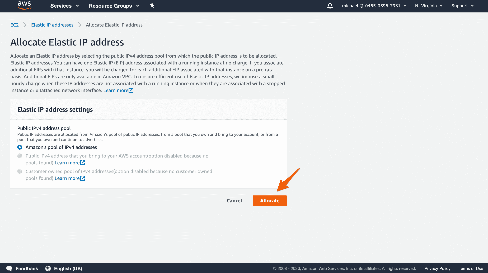

点击**关联此弹性 IP 地址**:

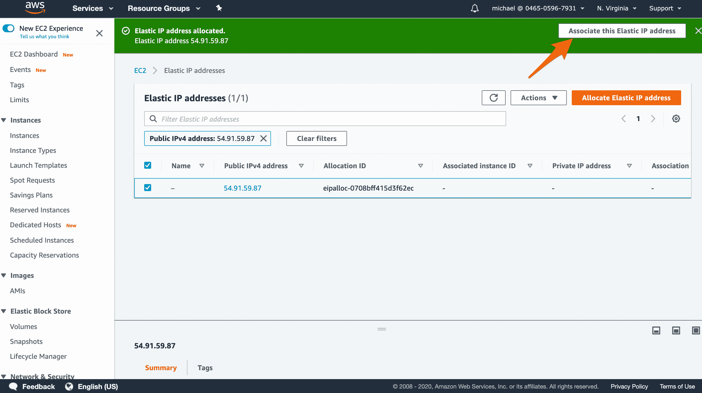

选择您的实例并点击**关联**:

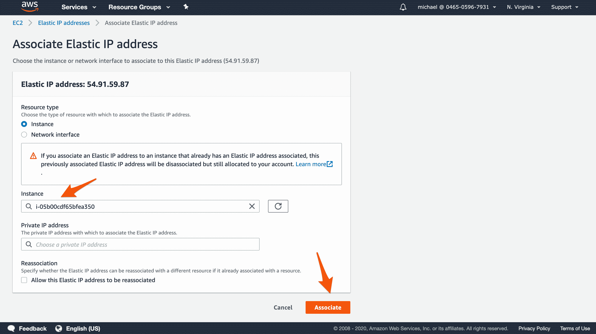

### IAM 角色

在部署期间，我们将使用 AWS ECR 将图像从 AWS ECR 拉至我们的 EC2 实例。因为我们不允许公众访问 ECR 上的 Docker 映像，所以您需要创建一个 IAM 角色，该角色拥有从 ECR 中提取 Docker 映像并将其附加到 EC2 实例的权限。

导航到 [IAM 控制台](https://console.aws.amazon.com/iam/home#/home)。

点击左侧工具条中的**角色**，然后**创建角色**:


选择 **AWS 服务**和 **EC2** ，然后点击**下一步:权限**:


在搜索框中输入`container`，选择**amazonec 2 containerregistrypoweruser**策略，点击**下一步:标签**:


点击**下一页:回顾**。使用`django-ec2`作为名称，点击**创建角色**:

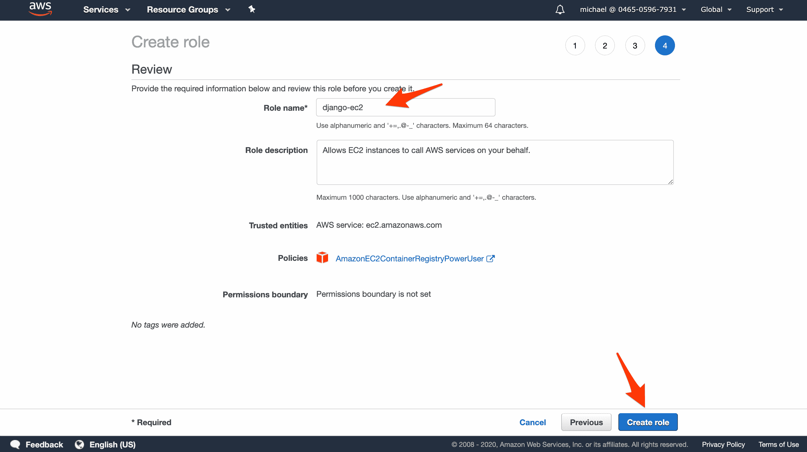

现在您需要将新角色附加到您的 EC2 实例。

回到 [EC2 控制台](https://console.aws.amazon.com/ec2/)，点击**实例**，然后选择你的实例。点击**动作**下拉菜单->实例设置->附加/替换 IAM 角色:


选择 **django-ec2** 角色，然后点击**应用**。

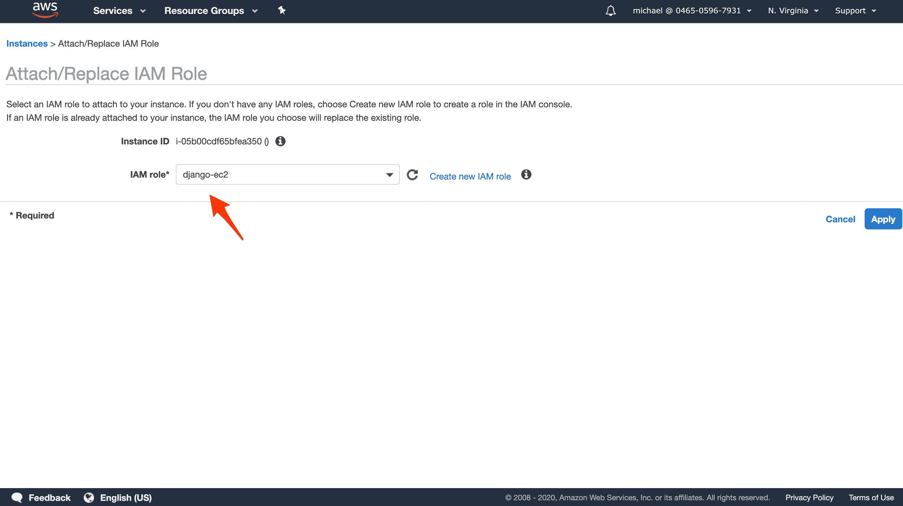

点击**关闭**。

## 添加 DNS 记录

为您正在使用的域向 DNS 添加一个 A 记录，以指向您的 EC2 实例的公共 IP。

它是您关联到实例的弹性 IP。

## AWS ECR

[Amazon Elastic Container Registry](https://aws.amazon.com/ecr/)(ECR)是一个完全托管的 Docker 图像注册表，可以让开发者轻松存储和管理图像。对于私有映像，通过 IAM 用户和角色来管理访问。

导航到[集控室控制台](https://console.aws.amazon.com/ecr/)。点击工具条中的**库**，然后点击**创建库**:

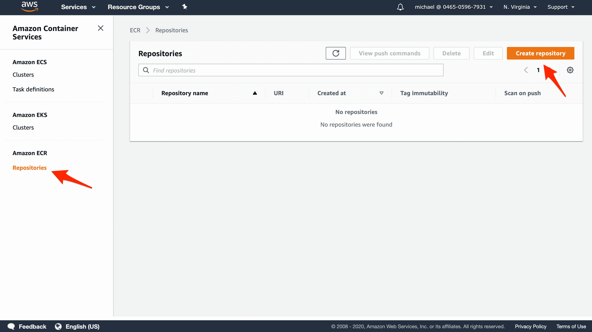

将名称设置为`django-ec2`并点击**创建存储库**:


## AWS RDS

现在我们可以配置一个 RDS Postgres 数据库。

虽然您可以在容器中运行自己的 Postgres 数据库，但由于数据库是[关键服务](https://vsupalov.com/database-in-docker/)，添加额外的层，如 Docker，会增加生产中不必要的风险。为了简化次要版本更新、定期备份和扩展等任务，建议使用托管服务。所以，我们将使用 [RDS](https://aws.amazon.com/rds/) 。

导航至 [RDS 控制台](https://console.aws.amazon.com/rds/)。点击**创建数据库**:

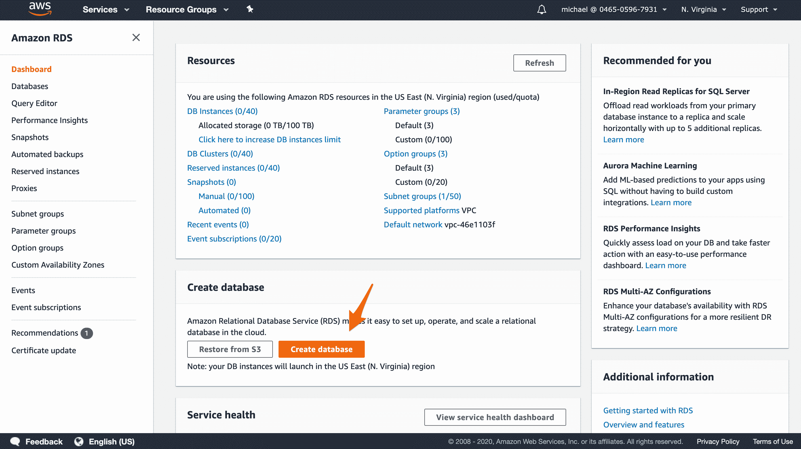

使用**自由层**模板选择最新版本的 Postgres:

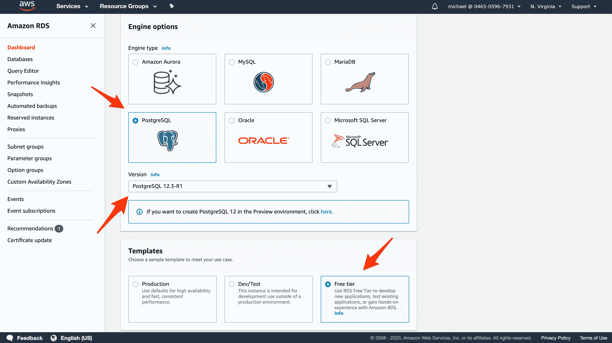

在**设置**下，设置:

*   数据库实例标识符:`djangoec2`
*   主用户名:`webapp`
*   选择**自动生成密码**

坚持使用默认设置:

*   数据库实例大小
*   储存；储备
*   可用性和耐用性

跳到**连接**部分，设置以下内容:

*   虚拟私有云(VPC):默认
*   子网组:默认
*   可公开访问:否
*   VPC 安全组:`django-ec2`
*   数据库端口:5432


让**数据库认证**保持原样。

打开**附加配置**，将**初始数据库名称**改为`djangoec2`:


保持其他设置不变。

最后，点击**创建数据库**。

点击**查看凭证详情**查看为 **webapp** 用户生成的密码:


请将此密码存放在安全的地方。您需要在这里将它提供给 Django 应用程序。

该实例将需要几分钟的时间才能启动。启动后，单击新创建的数据库的 DB 标识符以查看其详细信息。记下数据库端点；你需要在你的 Django 应用中设置它。

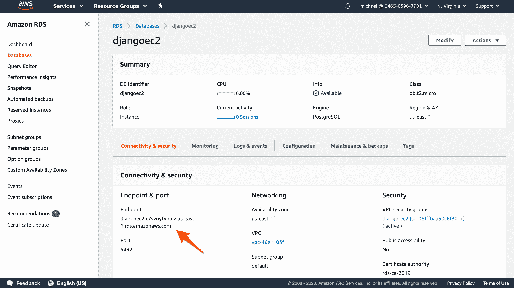

## AWS 安全组

在 [EC2 控制台](https://console.aws.amazon.com/ec2/)中，点击侧边栏中的**安全组**。找到并点击 **django-ec2** 组的 ID 以编辑其详细信息。

点击**编辑入站规则**:


添加允许 Postgres 连接到该安全组内实例的入站规则。为此:

*   点击**添加规则**
*   为规则类型选择 **PostgreSQL**
*   为规则源选择**自定义**
*   点击搜索字段并选择 **django-ec2** 安全组
*   点击**保存规则**

> 为了限制对数据库的访问，只允许来自同一个安全组内的实例的连接。我们的应用程序可以连接，因为我们为 RDS 和 ec2 实例设置了相同的安全组 *django-ec2* 。因此，不允许其他安全组中的实例进行连接。

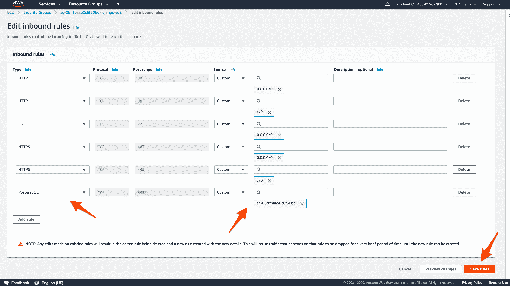

## 项目配置

随着 AWS 基础设施的建立，我们现在需要在部署 Django 项目之前在本地配置它。

首先，克隆 GitHub 项目报告的内容:

```
`$ git clone https://github.com/testdrivenio/django-on-docker-letsencrypt django-on-docker-letsencrypt-aws
$ cd django-on-docker-letsencrypt-aws` 
```

这个库包含了部署 Dockerized Django 和加密 HTTPS 证书所需的一切。

### 复合坞站

首次部署应用程序时，您应该遵循以下两个步骤来避免证书问题:

1.  首先从 Let's Encrypt 的登台环境中颁发证书
2.  然后，当一切按预期运行时，切换到 Let's Encrypt 的生产环境

> 你可以在上一篇文章[的](/blog/django-lets-encrypt/)[让我们加密](/blog/django-lets-encrypt/#lets-encrypt)部分，阅读更多关于让我们加密对生产环境的限制。

对于测试，更新*docker-compose . staging . yml .*文件，如下所示:

```
`version:  '3.8' services: web: build: context:  ./app dockerfile:  Dockerfile.prod image:  <aws-account-id>.dkr.ecr.<aws-region>.amazonaws.com/django-ec2:web command:  gunicorn hello_django.wsgi:application --bind 0.0.0.0:8000 volumes: -  static_volume:/home/app/web/staticfiles -  media_volume:/home/app/web/mediafiles expose: -  8000 env_file: -  ./.env.staging nginx-proxy: container_name:  nginx-proxy build:  nginx image:  <aws-account-id>.dkr.ecr.<aws-region>.amazonaws.com/django-ec2:nginx-proxy restart:  always ports: -  443:443 -  80:80 volumes: -  static_volume:/home/app/web/staticfiles -  media_volume:/home/app/web/mediafiles -  certs:/etc/nginx/certs -  html:/usr/share/nginx/html -  vhost:/etc/nginx/vhost.d -  /var/run/docker.sock:/tmp/docker.sock:ro depends_on: -  web nginx-proxy-letsencrypt: image:  jrcs/letsencrypt-nginx-proxy-companion env_file: -  ./.env.staging.proxy-companion volumes: -  /var/run/docker.sock:/var/run/docker.sock:ro -  certs:/etc/nginx/certs -  html:/usr/share/nginx/html -  vhost:/etc/nginx/vhost.d -  acme:/etc/acme.sh depends_on: -  nginx-proxy volumes: static_volume: media_volume: certs: html: vhost: acme:` 
```

对于`web`和`nginx-proxy`服务，更新`image`属性以使用来自 ECR 的图像(我们将很快添加)。

示例:

```
`image:  123456789.dkr.ecr.us-east-1.amazonaws.com/django-ec2:web image:  123456789.dkr.ecr.us-east-1.amazonaws.com/django-ec2:nginx-proxy` 
```

这些值由存储库 URL ( `123456789.dkr.ecr.us-east-1.amazonaws.com`)以及图像名称(`django-ec2`)和标签(`web`和`nginx-proxy`)组成。

> 为了简单起见，我们使用一个注册表来存储两个图像。我们使用`web`和`nginx-proxy`来区分这两者。理想情况下，您应该使用两个注册中心:一个用于`web`，一个用于`nginx-proxy`。如果你喜欢，请自行更新。

除了`image`属性，我们还删除了`db`服务(和相关的卷),因为我们使用 RDS 而不是在容器中管理 Postgres。

### 环境

是时候为`web`和`nginx-proxy-letsencrypt`容器设置环境文件了。

首先，为`web`容器添加一个 *.env.staging* 文件:

```
`DEBUG=0
SECRET_KEY=change_me
DJANGO_ALLOWED_HOSTS=<YOUR_DOMAIN.COM>
SQL_ENGINE=django.db.backends.postgresql
SQL_DATABASE=djangoec2
SQL_USER=webapp
SQL_PASSWORD=<PASSWORD-FROM-AWS-RDS>
SQL_HOST=<DATABASE-ENDPOINT-FROM-AWS-RDS>
SQL_PORT=5432
DATABASE=postgres
VIRTUAL_HOST=<YOUR_DOMAIN.COM>
VIRTUAL_PORT=8000
LETSENCRYPT_HOST=<YOUR_DOMAIN.COM>` 
```

注意事项:

1.  将`<YOUR_DOMAIN.COM>`更改为您的实际域名。
2.  更改`SQL_PASSWORD`和`SQL_HOST`以匹配 RDS 部分中创建的内容。
3.  将`SECRET_KEY`改为某个长的随机字符串。
4.  `nginx-proxy`容器需要`VIRTUAL_HOST`和`VIRTUAL_PORT`来自动创建反向代理配置。
5.  `LETSENCRYPT_HOST`有没有办法让`nginx-proxy-companion`为你的域名颁发加密证书。

> 出于测试/调试的目的，您可能希望在第一次部署时使用一个`*`来代替`DJANGO_ALLOWED_HOSTS`,以简化事情。只是不要忘记在测试完成后限制允许的主机。

其次，添加一个*. env . staging . proxy-companion*文件，确保更新`DEFAULT_EMAIL`值:

```
`DEFAULT_EMAIL=youremail@yourdomain.com ACME_CA_URI=https://acme-staging-v02.api.letsencrypt.org/directory NGINX_PROXY_CONTAINER=nginx-proxy` 
```

> 回顾来自[的【让我们加密容器化的 Django 应用程序】的](/blog/django-lets-encrypt/)[让我们加密 Nginx 代理伙伴服务](/blog/django-lets-encrypt/#lets-encrypt-nginx-proxy-companion-service)部分，以了解更多关于上述环境变量的信息。

## 构建和推送 Docker 映像

现在我们准备构建 Docker 图像:

```
`$ docker-compose -f docker-compose.staging.yml build` 
```

可能需要几分钟来构建。完成后，我们就可以把图像上传到 ECR 了。

首先，假设您已经安装了[AWS CLI](https://docs.aws.amazon.com/cli/latest/userguide/install-cliv2.html)，并且已经设置了 [AWS 凭证](https://docs.aws.amazon.com/cli/latest/userguide/cli-chap-configure.html)，登录 ECR Docker 存储库:

```
`$ aws ecr get-login-password --region <aws-region> | docker login --username AWS --password-stdin <aws-account-id>.dkr.ecr.<aws-region>.amazonaws.com
# aws ecr get-login-password --region us-east-1 | docker login --username AWS --password-stdin 123456789.dkr.ecr.us-east-1.amazonaws.com` 
```

您应该看到:

然后将图像推送到集控室:

```
`$ docker-compose -f docker-compose.staging.yml push` 
```

打开您的 django-ec2 ECR 存储库来查看推送的图像:

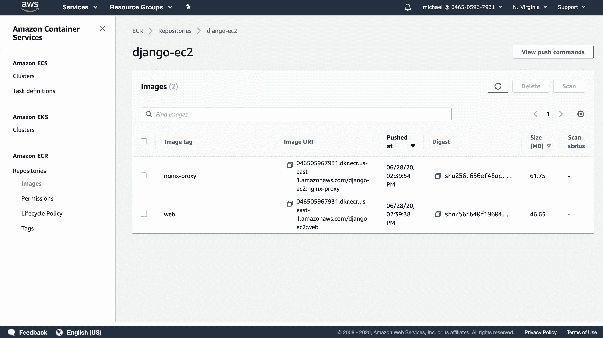

## 运行容器

一切都为部署做好了准备。

是时候转移到 EC2 实例了。

假设您在实例上创建了一个项目目录，如*/home/Ubuntu/django-on-docker*，使用 SCP 复制文件和文件夹:

```
`$ scp -i /path/to/your/djangoletsencrypt.pem \
      -r $(pwd)/{app,nginx,.env.staging,.env.staging.proxy-companion,docker-compose.staging.yml} \
      [[email protected]](/cdn-cgi/l/email-protection):/path/to/django-on-docker` 
```

接下来，通过 SSH 连接到您的实例，并移动到项目目录:

```
`$ ssh -i /path/to/your/djangoletsencrypt.pem [[email protected]](/cdn-cgi/l/email-protection)
$ cd /path/to/django-on-docker` 
```

登录 ECR Docker 存储库。

```
`$ aws ecr get-login-password --region <aws-region> | docker login --username AWS --password-stdin <aws-account-id>.dkr.ecr.<aws-region>.amazonaws.com` 
```

提取图像:

```
`$ docker pull <aws-account-id>.dkr.ecr.<aws-region>.amazonaws.com/django-ec2:web
$ docker pull <aws-account-id>.dkr.ecr.<aws-region>.amazonaws.com/django-ec2:nginx-proxy` 
```

这样，您就可以开始旋转容器了:

```
`$ docker-compose -f docker-compose.staging.yml up -d` 
```

一旦容器启动并运行，在浏览器中导航到您的域。您应该会看到类似这样的内容:


这是意料之中的。显示该屏幕是因为证书是从[暂存环境](https://letsencrypt.org/docs/staging-environment/)发布的。

你怎么知道一切是否正常？

点击“高级”,然后点击“继续”。您现在应该可以看到您的应用程序了。上传图像，然后确保您可以在`https://yourdomain.com/media/IMAGE_FILE_NAME`查看图像。

## 颁发生产证书

现在，一切都按预期运行，我们可以切换到 Let's Encrypt 的生产环境。

关闭现有容器并退出实例:

```
`$ docker-compose -f docker-compose.staging.yml down -v
$ exit` 
```

回到您的本地机器，打开 *docker-compose.prod.yml* 并进行与您对 staging 版本所做的相同的更改:

1.  更新`ìmage`属性，使之与`ẁeb`和`nginx-proxy`服务的 AWS ECR URLs 相匹配
2.  移除`db`服务以及相关的卷

```
`version:  '3.8' services: web: build: context:  ./app dockerfile:  Dockerfile.prod image:  046505967931.dkr.ecr.us-east-1.amazonaws.com/django-ec2:web command:  gunicorn hello_django.wsgi:application --bind 0.0.0.0:8000 volumes: -  static_volume:/home/app/web/staticfiles -  media_volume:/home/app/web/mediafiles expose: -  8000 env_file: -  ./.env.prod nginx-proxy: container_name:  nginx-proxy build:  nginx image:  046505967931.dkr.ecr.us-east-1.amazonaws.com/django-ec2:nginx-proxy restart:  always ports: -  443:443 -  80:80 volumes: -  static_volume:/home/app/web/staticfiles -  media_volume:/home/app/web/mediafiles -  certs:/etc/nginx/certs -  html:/usr/share/nginx/html -  vhost:/etc/nginx/vhost.d -  /var/run/docker.sock:/tmp/docker.sock:ro depends_on: -  web nginx-proxy-letsencrypt: image:  jrcs/letsencrypt-nginx-proxy-companion env_file: -  ./.env.prod.proxy-companion volumes: -  /var/run/docker.sock:/var/run/docker.sock:ro -  certs:/etc/nginx/certs -  html:/usr/share/nginx/html -  vhost:/etc/nginx/vhost.d -  acme:/etc/acme.sh depends_on: -  nginx-proxy volumes: static_volume: media_volume: certs: html: vhost: acme:` 
```

接下来通过复制 *.env.staging* 文件创建一个 *.env.prod* 文件。您不需要对其进行任何更改。

最后，添加一个*. env . prod . proxy-companion*文件:

```
`DEFAULT_EMAIL=youremail@yourdomain.com NGINX_PROXY_CONTAINER=nginx-proxy` 
```

再次构建和推送图像:

```
`$ docker-compose -f docker-compose.prod.yml build
$ aws ecr get-login-password --region <aws-region> | docker login --username AWS --password-stdin <aws-account-id>.dkr.ecr.<aws-region>.amazonaws.com
$ docker-compose -f docker-compose.prod.yml push` 
```

使用 SCP 将新文件和文件夹复制到您的实例中:

```
`$ scp -i /path/to/your/djangoletsencrypt.pem \
      $(pwd)/{.env.prod,.env.prod.proxy-companion,docker-compose.prod.yml} \
      [[email protected]](/cdn-cgi/l/email-protection):/path/to/django-on-docker` 
```

像前面一样，通过 SSH 连接到您的实例，并移动到项目目录:

```
`$ ssh -i /path/to/your/djangoletsencrypt.pem [[email protected]](/cdn-cgi/l/email-protection)
$ cd /path/to/django-on-docker` 
```

再次登录您的 ECR Docker 存储库:

```
`$ aws ecr get-login-password --region <aws-region> | docker login --username AWS --password-stdin <aws-account-id>.dkr.ecr.<aws-region>.amazonaws.com` 
```

提取图像:

```
`$ docker pull <aws-account-id>.dkr.ecr.<aws-region>.amazonaws.com/django-ec2:web
$ docker pull <aws-account-id>.dkr.ecr.<aws-region>.amazonaws.com/django-ec2:nginx-proxy` 
```

最后旋转容器:

```
`$ docker-compose -f docker-compose.prod.yml up -d` 
```

再次导航到您的域。您应该不会再看到警告。

恭喜你。现在，您正在为运行在 AWS EC2 上的 Django 应用程序使用一个生产证书。

> 想要查看证书创建过程的运行情况，请查看日志:
> 
> ```
> `$ docker-compose -f docker-compose.prod.yml logs nginx-proxy-letsencrypt` 
> ```

## 结论

在本教程中，您将一个容器化的 Django 应用程序部署到 EC2。该应用程序运行在 HTTPS Nginx 代理后面，让我们加密 SSL 证书。您还使用了一个 RDS Postgres 实例，并将 Docker 图像存储在 ECR 上。

下一步是什么？

1.  [设置 S3 并配置 Django 将静态和媒体文件存储在 Docker 卷之外的桶中](/blog/storing-django-static-and-media-files-on-amazon-s3)
2.  [在 GitLab 上设置 CI/CD 管道](/blog/deploying-django-to-ec2-with-docker-and-gitlab/)
3.  [配置一个运行在 EC2 实例上的容器化 Django 应用程序，将日志发送到 Amazon CloudWatch](/blog/django-logging-cloudwatch/)

部署愉快！

> 姜戈码头系列:
> 
> 1.  [用 Postgres、Gunicorn 和 Nginx 将 Django 归档](/blog/dockerizing-django-with-postgres-gunicorn-and-nginx/)
> 2.  [用加密保护容器化的 Django 应用](/blog/django-lets-encrypt/)
> 3.  [用 Docker 把 Django 部署到 AWS，让我们加密](/blog/django-docker-https-aws/)(本文！)