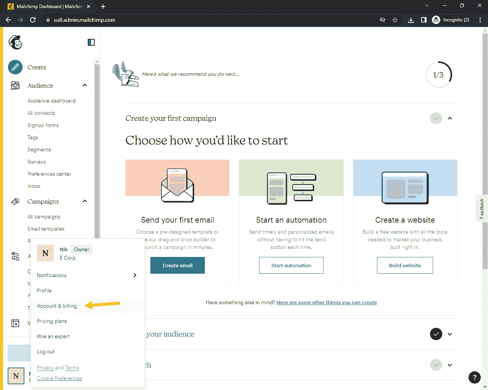
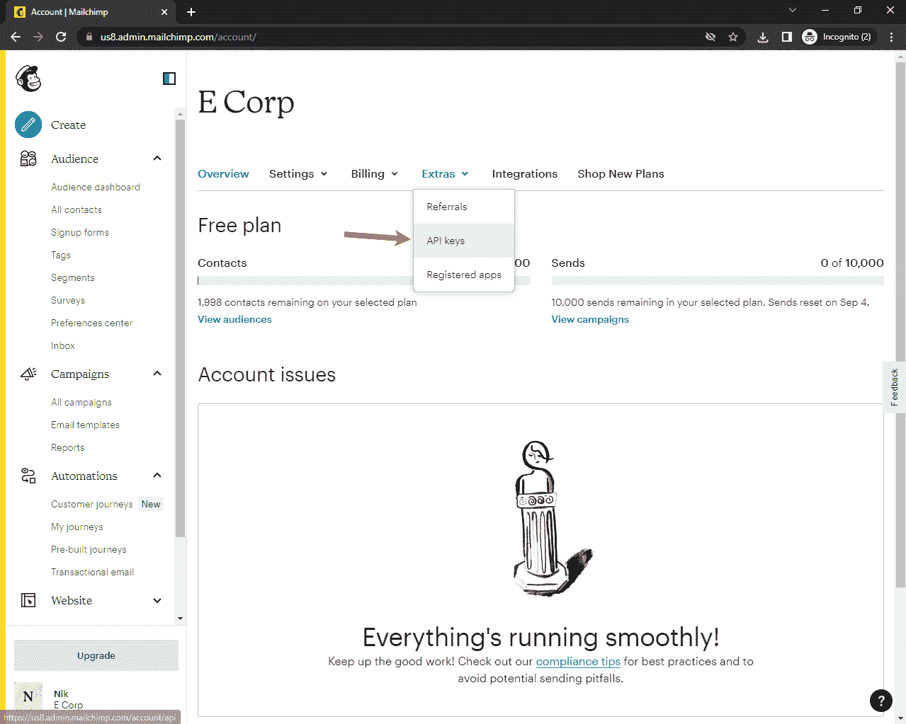
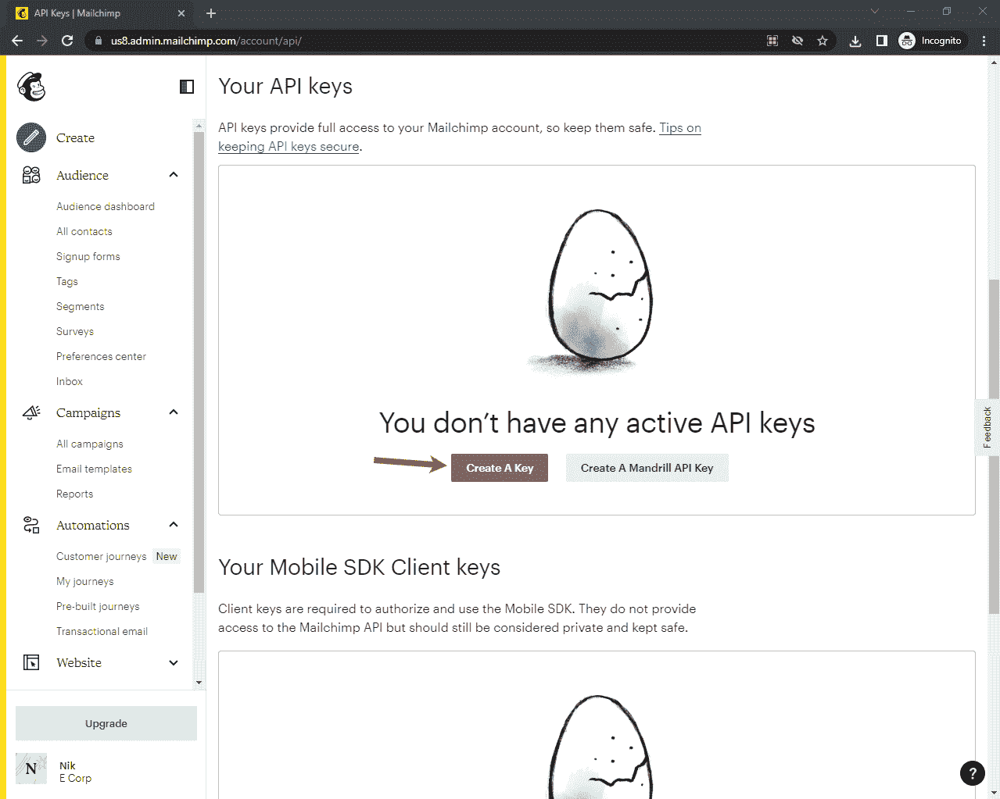
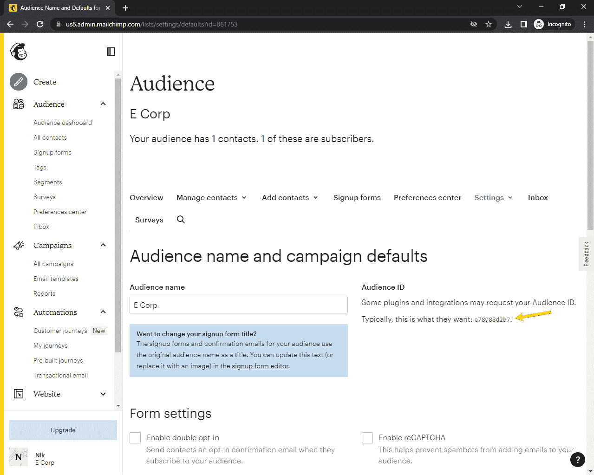
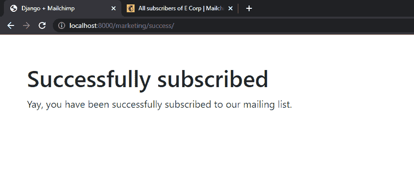
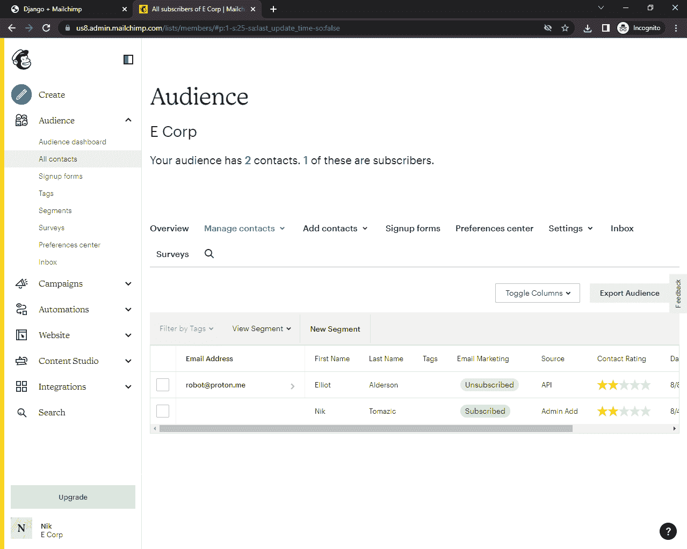
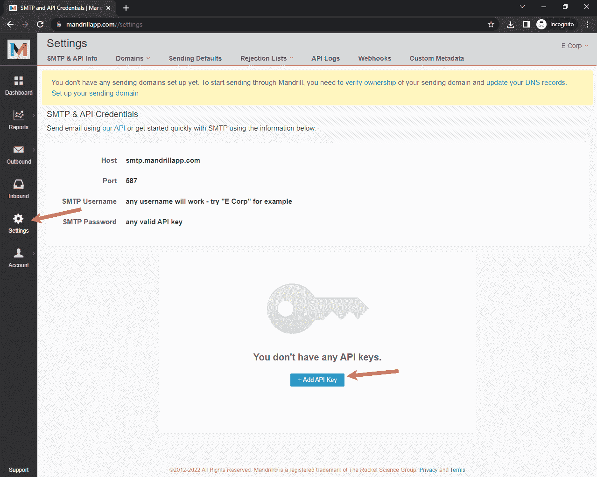
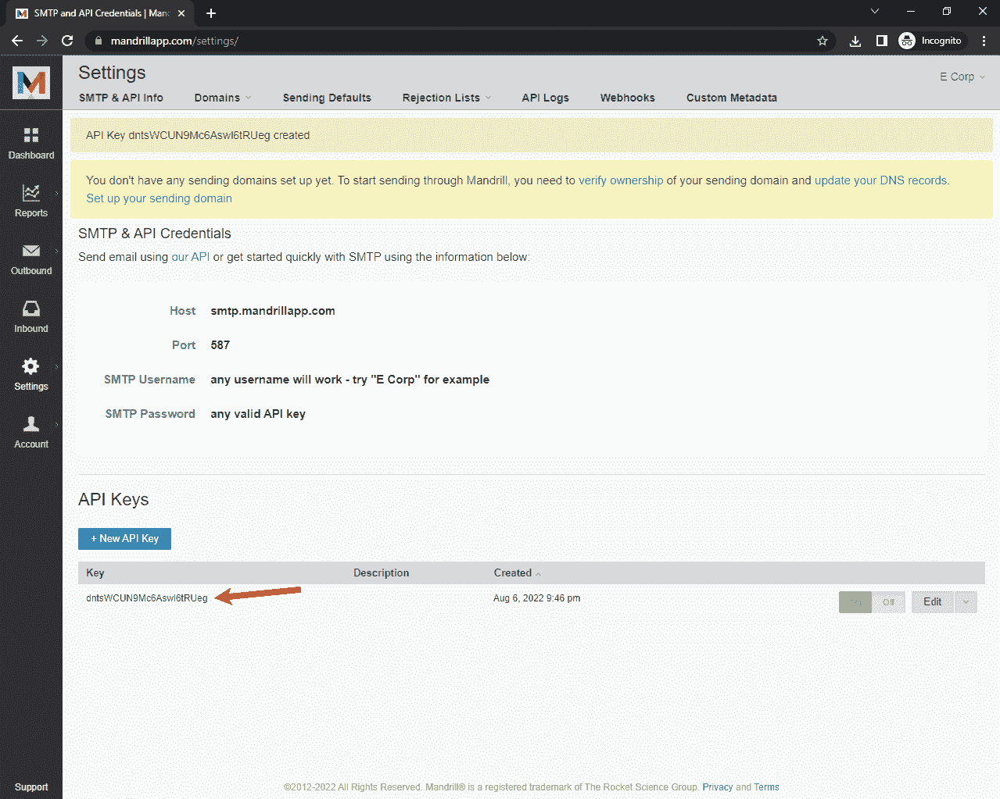
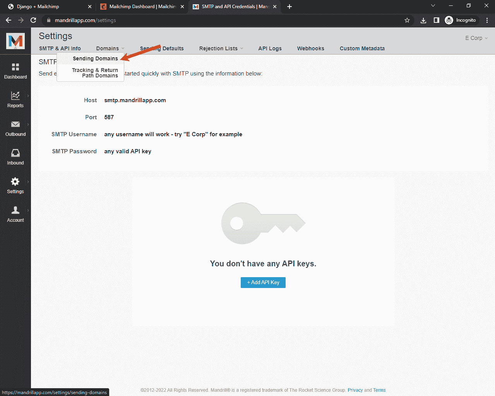
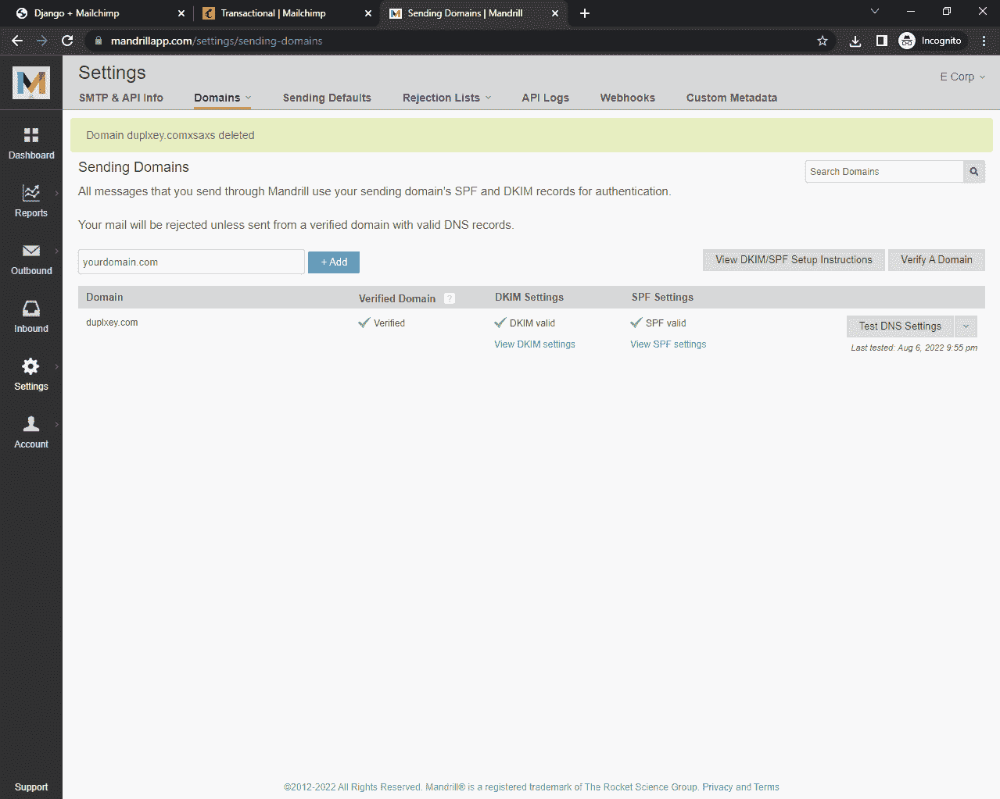

# 整合 Mailchimp 和 Django

> 原文：<https://testdriven.io/blog/django-mailchimp/>

在本文中，我们将了解如何将 [Mailchimp](https://mailchimp.com/) 与 [Django](https://www.djangoproject.com/) 集成，以便处理新闻订阅和发送事务性电子邮件。

## 目标

在本文结束时，您将能够:

1.  解释 Mailchimp 的营销和交易电子邮件 API 之间的区别
2.  将 Mailchimp 的营销 API 与 Django 集成
3.  管理 Mailchimp 受众和联系人
4.  设置并使用合并字段发送个性化活动
5.  使用 Mailchimp 的事务性电子邮件 API 发送事务性电子邮件

## Mailchimp 是什么？

Mailchimp 是一个营销自动化平台，允许您创建、发送和分析电子邮件和广告活动。此外，它还允许您管理联系人、创建自定义电子邮件模板和生成报告。这是企业最常用的电子邮件营销解决方案之一。

Mailchimp 为开发人员提供了以下 API:

1.  [营销 API](https://mailchimp.com/developer/marketing/docs/fundamentals/)
2.  [交易电子邮件 API](https://mailchimp.com/developer/transactional/docs/fundamentals/) (又名 [Mandrill](https://mandrillapp.com/) )
3.  [Mailchimp 开放商业](https://mailchimp.com/developer/open-commerce/docs/fundamentals/)

### 营销 API 与交易电子邮件 API

营销和交易电子邮件 API 都可以用于发送电子邮件...那么有什么区别呢？

营销 API 用于发送批量电子邮件，通常用于营销目的。其用途包括时事通讯、产品促销和欢迎系列。

另一方面，事务性电子邮件 API 用于在电子邮件触发操作后向单个收件人发送电子邮件。其用途包括帐户创建电子邮件、订单通知和密码重置电子邮件。

> 如需详细解释，请查看官方文档。

在本文的第一部分，我们将使用营销 API 来创建一个时事通讯。之后，我们将演示如何通过事务性电子邮件 API 发送电子邮件。

## 项目设置

创建一个新的项目目录以及一个名为`djangomailchimp`的新 Django 项目:

```py
`$ mkdir django-mailchimp && cd django-mailchimp
$ python3.10 -m venv env
$ source env/bin/activate

(env)$ pip install django==4.1
(env)$ django-admin startproject djangomailchimp .` 
```

> 你可以随意把 virtualenv 和 Pip 换成诗歌[或](https://python-poetry.org/) [Pipenv](https://github.com/pypa/pipenv) 。更多信息，请查看[现代 Python 环境](/blog/python-environments/)。

接下来，迁移数据库:

```py
`(env)$ python manage.py migrate` 
```

这就是基本的设置。

## Mailchimp 营销 API

在本节中，我们将使用[营销 API](https://mailchimp.com/developer/marketing/) 来创建一份时事通讯。

> 有了一个免费的 Mailchimp 账户，你可以拥有多达 2000 个联系人，每月发送多达 10000 封电子邮件(每天最多 2000 封)。

### 设置

出于组织目的，让我们创建一个名为`marketing`的新 Django 应用程序:

```py
`(env)$ python manage.py startapp marketing` 
```

将 app 添加到 *settings.py* 中的`INSTALLED_APPS`配置中:

```py
`# djangomailchimp/settings.py

INSTALLED_APPS = [
    'django.contrib.admin',
    'django.contrib.auth',
    'django.contrib.contenttypes',
    'django.contrib.sessions',
    'django.contrib.messages',
    'django.contrib.staticfiles',
    'marketing.apps.MarketingConfig',  # new
]` 
```

接下来，用`marketing`应用程序更新项目级的 *urls.py* :

```py
`# djangomailchimp/urls.py

from django.contrib import admin
from django.urls import path, include

urlpatterns = [
    path('admin/', admin.site.urls),
    path('marketing/', include('marketing.urls')),  # new
]` 
```

在`marketing`应用程序中创建一个 *urls.py* 文件并填充它:

```py
`# marketing/urls.py

from django.urls import path

from . import views

urlpatterns = [
    path('', views.subscribe_view, name='subscribe'),
    path('success/', views.subscribe_success_view, name='subscribe-success'),
    path('fail/', views.subscribe_fail_view, name='subscribe-fail'),
    path('unsubscribe/', views.unsubscribe_view, name='unsubscribe'),
    path('unsubscribe/success/', views.unsubscribe_success_view, name='unsubscribe-success'),
    path('unsubscribe/fail/', views.unsubscribe_fail_view, name='unsubscribe-fail'),
]` 
```

记下网址。它们应该是不言自明的:

*   索引将显示订阅表单。
*   如果用户成功订阅，他们将被重定向到`/success`，否则将被重定向到`/fail`。
*   取消订阅网址的工作方式相同。

在处理视图之前，让我们创建一个名为 *forms.py* 的新文件:

```py
`# marketing/forms.py

from django import forms

class EmailForm(forms.Form):
    email = forms.EmailField(label='Email', max_length=128)` 
```

我们创建了一个简单的`EmailForm`，用于在用户订阅时事通讯时收集联系数据。

> 随意添加您想要收集的可选信息，如`first_name`、`last_name`、`address`、`phone_number`等。

现在将以下内容添加到 *views.py* 中:

```py
`# marketing/views.py

from django.http import JsonResponse
from django.shortcuts import render, redirect

from djangomailchimp import settings
from marketing.forms import EmailForm

def subscribe_view(request):
    if request.method == 'POST':
        form = EmailForm(request.POST)
        if form.is_valid():
            form_email = form.cleaned_data['email']
            # TODO: use Mailchimp API to subscribe
            return redirect('subscribe-success')

    return render(request, 'subscribe.html', {
        'form': EmailForm(),
    })

def subscribe_success_view(request):
    return render(request, 'message.html', {
        'title': 'Successfully subscribed',
        'message': 'Yay, you have been successfully subscribed to our mailing list.',
    })

def subscribe_fail_view(request):
    return render(request, 'message.html', {
        'title': 'Failed to subscribe',
        'message': 'Oops, something went wrong.',
    })

def unsubscribe_view(request):
    if request.method == 'POST':
        form = EmailForm(request.POST)
        if form.is_valid():
            form_email = form.cleaned_data['email']
            # TODO: use Mailchimp API to unsubscribe
            return redirect('unsubscribe-success')

    return render(request, 'unsubscribe.html', {
        'form': EmailForm(),
    })

def unsubscribe_success_view(request):
    return render(request, 'message.html', {
        'title': 'Successfully unsubscribed',
        'message': 'You have been successfully unsubscribed from our mailing list.',
    })

def unsubscribe_fail_view(request):
    return render(request, 'message.html', {
        'title': 'Failed to unsubscribe',
        'message': 'Oops, something went wrong.',
    })` 
```

接下来，让我们为这些视图提供 HTML 模板。在根目录下创建一个“模板”文件夹。然后添加以下文件...

*subscribe.html*:

```py
`<!-- templates/subscribe.html -->

<!DOCTYPE html>
<html lang="en">
    <head>
        <meta charset="utf-8">
        <meta name="viewport" content="width=device-width, initial-scale=1">
        <title>Django + Mailchimp</title>
        <link rel="stylesheet" href="https://cdn.jsdelivr.net/npm/[[email protected]](/cdn-cgi/l/email-protection)/dist/css/bootstrap.min.css" crossorigin="anonymous">
        <script src="https://cdn.jsdelivr.net/npm/[[email protected]](/cdn-cgi/l/email-protection)/dist/js/bootstrap.min.js" crossorigin="anonymous"></script>
    </head>
    <body>
        <div class="container mt-5">
            <h1>Subscribe</h1>
            <p>Enter your email address to subscribe to our mailing list.</p>
            <form method="post">
                
                {{ form.as_p }}
                <button type="submit" class="btn btn-primary">Subscribe</button>
            </form>
            <p class="mt-2"><a href="">Unsubscribe form</a></p>
        </div>
    </body>
</html>` 
```

*unsubscribe.html*:

```py
`<!-- templates/unsubscribe.html -->

<!DOCTYPE html>
<html lang="en">
    <head>
        <meta charset="utf-8">
        <meta name="viewport" content="width=device-width, initial-scale=1">
        <title>Django + Mailchimp</title>
        <link rel="stylesheet" href="https://cdn.jsdelivr.net/npm/[[email protected]](/cdn-cgi/l/email-protection)/dist/css/bootstrap.min.css" crossorigin="anonymous">
        <script src="https://cdn.jsdelivr.net/npm/[[email protected]](/cdn-cgi/l/email-protection)/dist/js/bootstrap.min.js" crossorigin="anonymous"></script>
    </head>
    <body>
        <div class="container mt-5">
            <h1>Unsubscribe</h1>
            <p>Enter your email address to unsubscribe from our mailing list.</p>
            <form method="post">
                
                {{ form.as_p }}
                <button type="submit" class="btn btn-danger">Unsubscribe</button>
            </form>
            <p class="mt-2"><a href="">Subscribe form</a></p>
        </div>
    </body>
</html>` 
```

*message.html*:

```py
`<!-- templates/message.html -->

<!DOCTYPE html>
<html lang="en">
    <head>
        <meta charset="utf-8">
        <meta name="viewport" content="width=device-width, initial-scale=1">
        <title>Django + Mailchimp</title>
        <link rel="stylesheet" href="https://cdn.jsdelivr.net/npm/[[email protected]](/cdn-cgi/l/email-protection)/dist/css/bootstrap.min.css" crossorigin="anonymous">
        <script src="https://cdn.jsdelivr.net/npm/[[email protected]](/cdn-cgi/l/email-protection)/dist/js/bootstrap.min.js" crossorigin="anonymous"></script>
    </head>
    <body>
        <div class="container mt-5">
            <h1>{{ title }}</h1>
            <p>{{ message }}</p>
        </div>
    </body>
</html>` 
```

确保更新 *settings.py* 文件，以便 Django 知道要查找“模板”文件夹:

```py
`# djangomailchimp/settings.py

TEMPLATES = [
    {
        'BACKEND': 'django.template.backends.django.DjangoTemplates',
        'DIRS': ['templates'], # new
        ...` 
```

最后，运行`runserver`命令启动 Django 的本地 web 服务器:

```py
`(env)$ python manage.py runserver` 
```

在浏览器中导航至[http://localhost:8000/marketing/](http://localhost:8000/marketing/)。您应该会看到订阅表单:


通过点击“退订表单”锚，您将被重定向到退订表单。

太好了！我们完成了姜戈的设置。

### 添加 Mailchimp 营销客户端

首先，安装 mailchimp-marketing 包，这是 Mailchimp Marketing API 的官方客户端库:

```py
`(env)$ pip install mailchimp-marketing==3.0.75` 
```

接下来，我们需要创建/获取一个 API 密钥。

> 如果你还没有 Mailchimp 账户，那就去注册。

登录 Mailchimp 帐户后，通过点击链接或点击您的帐户(左下角)>“帐户&计费”，导航至[帐户 API 键](https://us8.admin.mailchimp.com/account/api/):



然后单击“附加功能”>“API 密钥”:



最后，单击“创建密钥”以生成 API 密钥:



获得 API 密钥后，复制它。

要使用营销 API，我们还需要了解我们所在的地区。最简单的方法是查看 Mailchimp URL 的开头。

例如:

```py
`https://us8.admin.mailchimp.com/
        ^^^` 
```

在我这里，地区是:`us8`。


将 Mailchimp API 密钥和区域存储在 *settings.py* 的底部，如下所示:

```py
`# djangomailchimp/settings.py

MAILCHIMP_API_KEY = '<your mailchimp api key>'
MAILCHIMP_REGION = '<your mailchimp region>'` 
```

接下来，我们将在 *marketing/views.py* 中初始化营销 API 客户端，并创建一个 ping API 的端点:

```py
`# marketing/views.py

mailchimp = Client()
mailchimp.set_config({
  'api_key': settings.MAILCHIMP_API_KEY,
  'server': settings.MAILCHIMP_REGION,
})

def mailchimp_ping_view(request):
    response = mailchimp.ping.get()
    return JsonResponse(response)` 
```

不要忘记在文件顶部导入`Client`:

```py
`from mailchimp_marketing import Client` 
```

在 *marketing/urls.py* 中注册新创建的端点:

```py
`# marketing/urls.py

from django.urls import path

from . import views

urlpatterns = [
    path('ping/', views.mailchimp_ping_view),  # new
    path('', views.subscribe_view, name='subscribe'),
    path('success/', views.subscribe_success_view, name='subscribe-success'),
    path('fail/', views.subscribe_fail_view, name='subscribe-fail'),
    path('unsubscribe/', views.unsubscribe_view, name='unsubscribe'),
    path('unsubscribe/success/', views.unsubscribe_success_view, name='unsubscribe-success'),
    path('unsubscribe/fail/', views.unsubscribe_fail_view, name='unsubscribe-fail'),
]` 
```

再次运行服务器，访问[http://localhost:8000/marketing/ping/](http://localhost:8000/marketing/ping/)看看能否 ping 通 API。

```py
`{ "health_status":  "Everything's Chimpy!" }` 
```

如果你看到上面的消息，那么一切正常。

### 创造观众

要创建简讯，我们需要使用受众。受众(或列表)是您可以向其发送活动电子邮件的联系人列表。

> Mailchimp 的免费计划只允许你有一个(默认)受众。如果您有付费计划，请随意创建专门针对此演示新闻稿的受众。你可以通过[网络界面](https://us8.admin.mailchimp.com/lists/)或[编程](https://mailchimp.com/developer/marketing/api/lists/add-list/)来创建一个。

导航至您的 [Mailchimp 仪表盘](https://us8.admin.mailchimp.com/)。在“受众”下，点击“所有联系人”。然后点击【设置】>【受众名称及默认】:


在屏幕右侧，复制“观众 ID”:



粘贴在 *settings.py* 的末尾，API 键和区域下:

```py
`# djangomailchimp/settings.py

MAILCHIMP_API_KEY = '<your mailchimp api key>'
MAILCHIMP_REGION = '<your mailchimp region>'
MAILCHIMP_MARKETING_AUDIENCE_ID = '<your mailchimp audience id>'  # new` 
```

在下一部分中，我们将向受众添加用户。

### 订阅视图

转到 *marketing/views.py* ，用以下代码替换`subscribe_view`:

```py
`# marketing/views.py

def subscribe_view(request):
    if request.method == 'POST':
        form = EmailForm(request.POST)
        if form.is_valid():
            try:
                form_email = form.cleaned_data['email']
                member_info = {
                    'email_address': form_email,
                    'status': 'subscribed',
                }
                response = mailchimp.lists.add_list_member(
                    settings.MAILCHIMP_MARKETING_AUDIENCE_ID,
                    member_info,
                )
                logger.info(f'API call successful: {response}')
                return redirect('subscribe-success')

            except ApiClientError as error:
                logger.error(f'An exception occurred: {error.text}')
                return redirect('subscribe-fail')

    return render(request, 'subscribe.html', {
        'form': EmailForm(),
    })` 
```

不要忘记像这样导入`ApiClientError`:

```py
`from mailchimp_marketing.api_client import ApiClientError` 
```

另外，添加记录器:

```py
`import logging

logger = logging.getLogger(__name__)` 
```

因此，我们首先创建了一个字典，其中包含了我们想要存储的所有用户信息。字典需要包含`email`和`status`。我们可以使用多种[状态类型](https://mailchimp.com/help/about-your-contacts/)，但最重要的是:

1.  `subscribed` -立即添加联系人
2.  `pending` -用户将在被添加为联系人之前收到一封验证电子邮件

如果我们想要附加额外的用户信息，我们必须使用[合并字段](https://mailchimp.com/developer/marketing/docs/merge-fields/)。合并字段之后，我们可以发送个性化的电子邮件。它们由一个`name`和一个`type`组成(如`text`、`number`、`address`)。

默认的合并字段有:`ADDRESS`、`BIRTHDAY`、`FNAME`、`LNAME`、`PHONE`。

> 如果您想使用自定义合并字段，您可以使用 Mailchimp 仪表板或通过 [Marketing API](https://mailchimp.com/developer/marketing/api/list-merges/) 添加它们。

让我们将用户的名字和姓氏硬连接到`member_info`:

```py
`member_info = {
    'email_address': form_email,
    'status': 'subscribed',
    'merge_fields': {
      'FNAME': 'Elliot',
      'LNAME': 'Alderson',
    }
}` 
```

发送活动时，您可以通过占位符访问合并字段，例如，`*|FNAME|*`将替换为`Elliot`。

> 如果您在第一步中向`EmailForm`添加了额外的字段，请随意将它们添加为合并字段，如示例所示。
> 
> 关于合并字段的更多信息可以在[正式文档](https://mailchimp.com/developer/marketing/docs/merge-fields/)中找到。
> 
> [lists.add_list_member() API 引用](https://mailchimp.com/developer/marketing/api/list-members/add-member-to-list/)

我们已经完成了订阅视图。我们来测试一下。

运行服务器并导航到[http://localhost:8000/marketing/](http://localhost:8000/marketing/)。然后，使用订阅表单进行订阅。您应该被重定向到`success/`:



接下来，打开你的 [Mailchimp 仪表盘](https://us8.admin.mailchimp.com/)，导航至“观众”>“所有联系人”。您应该可以看到您的第一个简讯订阅者:


### 取消订阅视图

要启用取消订阅功能，请用以下代码替换`unsubscribe_view`:

```py
`# marketing/views.py

def unsubscribe_view(request):
    if request.method == 'POST':
        form = EmailForm(request.POST)
        if form.is_valid():
            try:
                form_email = form.cleaned_data['email']
                form_email_hash = hashlib.md5(form_email.encode('utf-8').lower()).hexdigest()
                member_update = {
                    'status': 'unsubscribed',
                }
                response = mailchimp.lists.update_list_member(
                    settings.MAILCHIMP_MARKETING_AUDIENCE_ID,
                    form_email_hash,
                    member_update,
                )
                logger.info(f'API call successful: {response}')
                return redirect('unsubscribe-success')

            except ApiClientError as error:
                logger.error(f'An exception occurred: {error.text}')
                return redirect('unsubscribe-fail')

    return render(request, 'unsubscribe.html', {
        'form': EmailForm(),
    })` 
```

在此，我们:

1.  通过表单获取用户的电子邮件。
2.  使用`md5`散列用户的电子邮件并生成订户散列。哈希允许我们操作用户数据。
3.  用我们想要更改的所有数据创建了一个名为`member_update`的字典。在我们的例子中，我们只是改变了状态。
4.  将所有这些数据传递给`lists.update_list_member()`——瞧！

> 您可以使用相同的方法来更改其他用户数据，如合并字段。

添加导入:

让我们测试一下是否一切正常。

再次运行服务器，导航到[http://localhost:8000/marketing/unsubscribe/](http://localhost:8000/marketing/unsubscribe/)并使用表单取消订阅。打开“所有联系人”，您会注意到状态从“已订阅”变为“未订阅”:



> [lists . update _ list _ member()API 引用](https://mailchimp.com/developer/marketing/api/list-members/update-list-member/)

### 获取订阅信息

以下是如何获取用户订阅状态的代码示例:

```py
`member_email = '[[email protected]](/cdn-cgi/l/email-protection)'
member_email_hash = hashlib.md5(member_email.encode('utf-8').lower()).hexdigest()

try:
    response = mailchimp.lists.get_list_member(
        settings.MAILCHIMP_MARKETING_AUDIENCE_ID,
        member_email_hash
    )
    print(f'API call successful: {response}')
except ApiClientError as error:
    print(f'An exception occurred: {error.text}')` 
```

正如我们在上一节中看到的，每当我们想要获取/修改某个用户时，我们需要散列他们的电子邮件并将其提供给 API。

响应看起来会像这样:

```py
`{ "id":  "f4ce663018fefacfe5c327869be7485d", "email_address":  "[[email protected]](/cdn-cgi/l/email-protection)", "unique_email_id":  "ec7bdadf19", "contact_id":  "67851f34b33195292b2977590007e965", "full_name":  "Elliot Alderson", "web_id":  585506089, "email_type":  "html", "status":  "unsubscribed", "unsubscribe_reason":  "N/A (Unsubscribed by admin)", "consents_to_one_to_one_messaging":  true, "merge_fields":  { "FNAME":  "Elliot", "LNAME":  "Alderson", "ADDRESS":  "", "PHONE":  "", "BIRTHDAY":  "" }, ... }` 
```

> [lists.get_list_member() API 引用](https://mailchimp.com/developer/marketing/api/list-members/get-member-info/)

--

我们的时事通讯差不多完成了。我们创建了一个受众，并启用了订阅和取消订阅功能。现在，剩下唯一要做的就是获得一些实际用户，并开始发送竞选电子邮件！

## Mailchimp 事务 API

在本节中，我们将演示如何使用 [Mailchimp 事务性电子邮件 API](https://mailchimp.com/developer/transactional/docs/fundamentals/) 来发送事务性电子邮件。

> 有了一个免费的 [Mailchimp 交易账户](https://mailchimp.com/features/transactional-email/) / [Mandrill 账户](https://mandrillapp.com/)，你可以发送多达 500 封测试邮件。不过，测试邮件只能*发送到经过验证的域名。*

要使用 Mailchimp 事务性电子邮件 API，您需要拥有一个域名，并有权访问其高级 DNS 设置。

### 设置

出于组织目的，让我们创建另一个名为`transactional`的 Django 应用程序:

```py
`(env)$ python manage.py startapp transactional` 
```

将 app 添加到 *settings.py* 中的`INSTALLED_APPS`配置中:

```py
`# djangomailchimp/settings.py

INSTALLED_APPS = [
    'django.contrib.admin',
    'django.contrib.auth',
    'django.contrib.contenttypes',
    'django.contrib.sessions',
    'django.contrib.messages',
    'django.contrib.staticfiles',
    'marketing.apps.MarketingConfig',
    'transactional.apps.TransactionalConfig',  # new
]` 
```

用`transactional` app 更新项目级 *urls.py* :

```py
`# djangomailchimp/urls.py

from django.contrib import admin
from django.urls import path, include

urlpatterns = [
    path('admin/', admin.site.urls),
    path('marketing/', include('marketing.urls')),
    path('transactional/', include('transactional.urls')),  # new
]` 
```

现在，在`transactional`应用程序中创建一个 *urls.py* 文件:

```py
`# transactional/urls.py

from django.urls import path

from . import views

urlpatterns = [
    path('send/', views.send_view, name='mailchimp-send'),
]` 
```

接下来，在 *transactional/views.py* 中创建一个`send_view`:

```py
`# transactional/views.py

from django.http import JsonResponse

def send_view(request):
    return JsonResponse({
        'detail': 'This view is going to send an email.',
    })` 
```

运行服务器并导航到[http://localhost:8000/transactional/send/](http://localhost:8000/transactional/send/)。您应该会得到这样的回应:

```py
`{ "detail":  "This view is going to send an email." }` 
```

### 添加交易电子邮件客户端

接下来，让我们安装 [mailchimp-transactional](https://github.com/mailchimp/mailchimp-transactional-python) 包:

```py
`pip install mailchimp-transactional==1.0.47` 
```

这个包使得向事务性电子邮件 API 发送请求变得很容易。

> 如果你还没有 Mailchimp 账户，那就去注册。

我们现在需要创建一个新的事务 API 键。

登录您的 Mailchimp 帐户，进入“自动操作”>“交易电子邮件”，然后按“启动”(在窗口的右上角):


在那之后，你将被重定向到 Mandrill，在那里你将被询问你是否想用你的帐户登录。按“使用 Mailchimp 登录”。

然后导航至“设置”并点击“添加 API 密钥”:



生成密钥后，复制它:



将生成的密钥存储在 *settings.py* 的底部，如下所示:

```py
`# djangomailchimp/settings.py

MAILCHIMP_MARKETING_API_KEY = '<your mailchimp marketing api key>'
MAILCHIMP_MARKETING_REGION = '<your mailchimp marketing region>'
MAILCHIMP_MARKETING_AUDIENCE_ID = '<your mailchimp audience id>'

MAILCHIMP_TRANSACTIONAL_API_KEY = '<your mailchimp transactional api key>'  # new` 
```

接下来，回到 Mandrill 设置，点击“域”，然后“发送域”。



添加您的域名，并通过 TXT 记录或电子邮件验证所有权。验证域所有权后，还应该为 DKIM 和 SPF 设置添加 TXT 记录。接下来，点击“测试 DNS 设置”,看看是否一切正常:



应该只有绿色的扁虱。

接下来，让我们在 *transactional/views.py* 中初始化 Mailchimp 事务电子邮件客户端，并创建一个端点来测试我们是否可以成功 ping 通 API:

```py
`import mailchimp_transactional
from django.http import JsonResponse
from mailchimp_transactional.api_client import ApiClientError

from djangomailchimp import settings

mailchimp = mailchimp_transactional.Client(
    api_key=settings.MAILCHIMP_TRANSACTIONAL_API_KEY,
)

def mailchimp_transactional_ping_view(request):
    try:
        mailchimp.users.ping()
        return JsonResponse({
            'detail': 'Everything is working fine',
        })
    except ApiClientError as error:
        return JsonResponse({
            'detail': 'Something went wrong',
            'error': error.text,
        })` 
```

确保不要忘记任何进口。

在 *urls.py* 中注册新创建的 URL:

```py
`# transactional/urls.py

from django.urls import path

from . import views

urlpatterns = [
    path('ping/', views.mailchimp_transactional_ping_view),  # new
    path('send/', views.send_view, name='mailchimp-send'),
]` 
```

再次运行服务器，访问[http://localhost:8000/transactional/ping/](http://localhost:8000/transactional/ping/)查看 ping 是否通过。

```py
`{ "detail":  "Everything is working fine" }` 
```

如果你看到上面的消息，那么一切正常。

### 发送交易电子邮件

用以下代码替换我们的`send_view`:

```py
`def send_view(request):
    message = {
        'from_email': '<YOUR_SENDER_EMAIL>',
        'subject': 'My First Email',
        'text': 'Hey there, this email has been sent via Mailchimp Transactional API.',
        'to': [
            {
                'email': '<YOUR_RECIPIENT_EMAIL>',
                'type': 'to'
            },
        ]
    }
    try:
        response = mailchimp.messages.send({
            'message': message,
        })
        return JsonResponse({
            'detail': 'Email has been sent',
            'response': response,
        })
    except ApiClientError as error:
        return JsonResponse({
            'detail': 'Something went wrong',
            'error': error.text,
        })` 
```

> 确保用您的实际电子邮件地址替换`<YOUR_SENDER_EMAIL>`和`<YOUR_RECIPIENT_EMAIL>`。也可以随意改变主题和/或文字。

在此，我们:

1.  创建了一个包含所有电子邮件信息的字典。
2.  将新创建的字典传递给`mailchimp.messages.send`。

你应该一直把它包在袋子里，以防出错。

> 如果你使用的是免费的 Mailchimp 计划，而你的电子邮件被拒绝`'reject_reason': 'recipient-domain-mismatch'`，你很可能试图发送一封电子邮件到一个未经验证的域名。如果您只验证了一个域，您只能向该域发送电子邮件。

运行服务器，访问[http://localhost:8000/transactional/send/](http://localhost:8000/transactional/send/)。如果一切顺利，您应该会看到以下响应:

```py
`{ "detail":  "Email has been sent" }` 
```

接下来，检查你的收件箱，邮件应该在那里。

这只是一个如何发送交易邮件的演示。在现实世界的应用程序中，您可以使用该代码发送电子邮件进行密码重置和电子邮件验证等。

## 结论

在本文中，我们研究了如何利用 Mailchimp 的营销和交易电子邮件 API。我们创建了一个简单的时事通讯，并学习了如何发送交易电子邮件。现在，您应该对 Mailchimp APIs 的工作原理以及如何在您的应用程序中实现其他 API 端点有了相当好的理解。