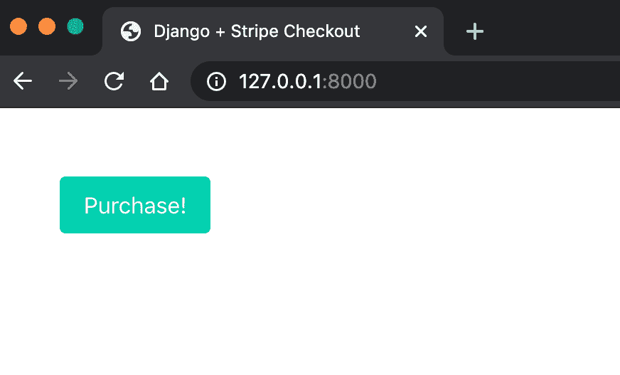
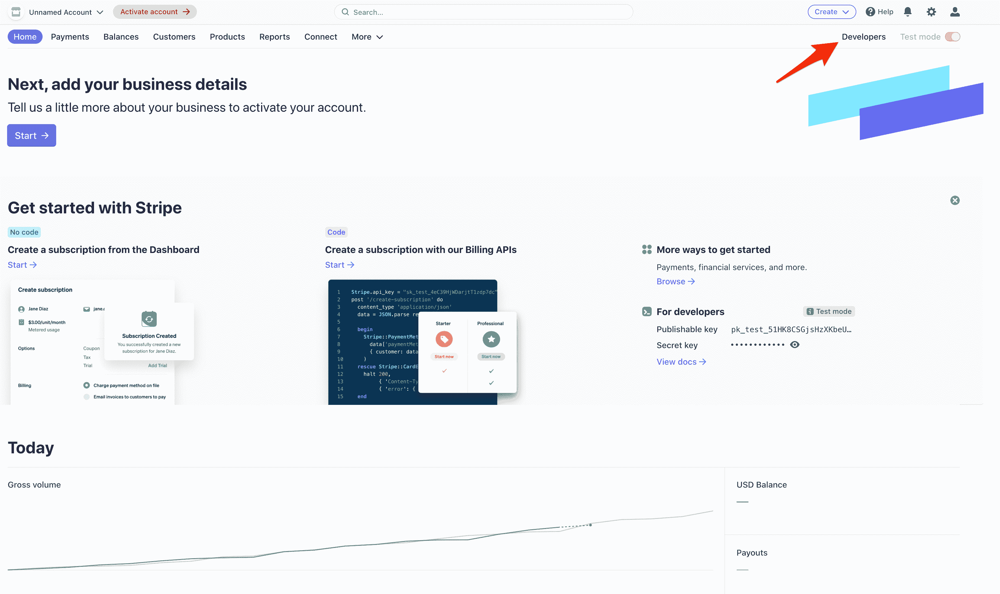
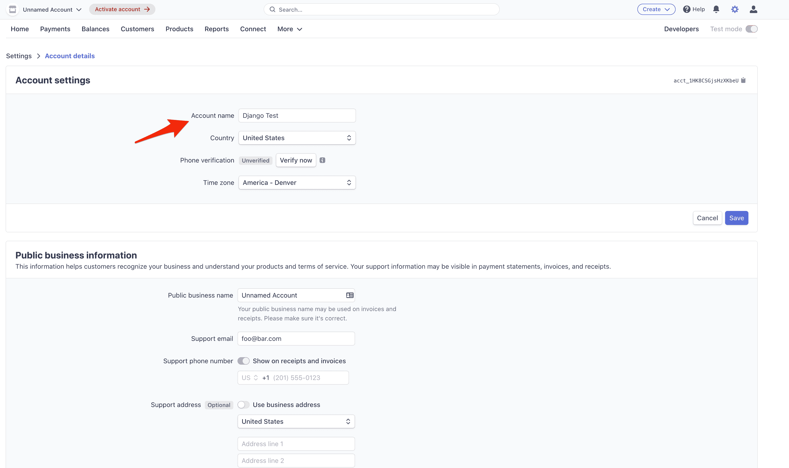
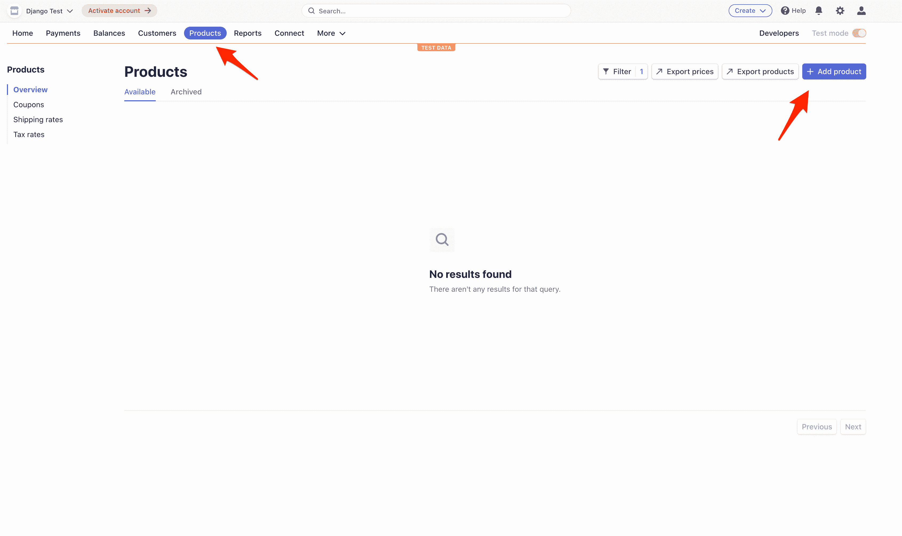
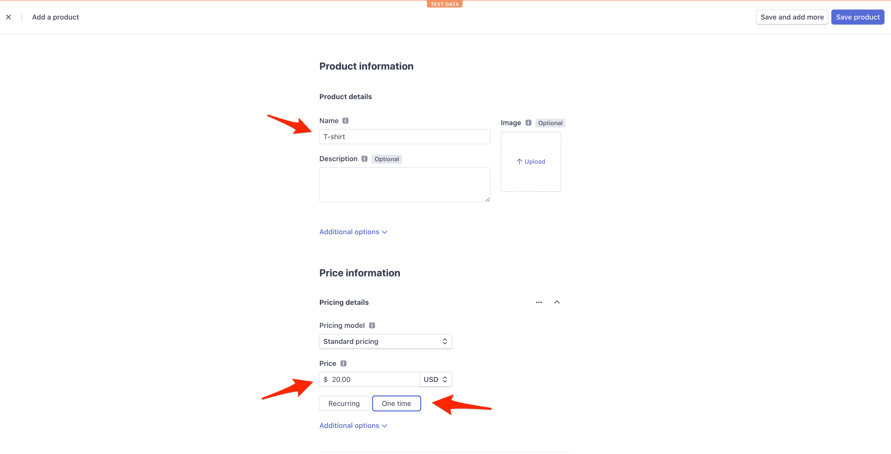
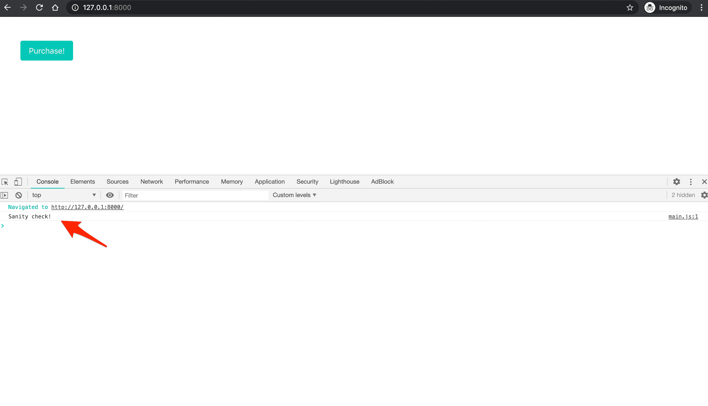
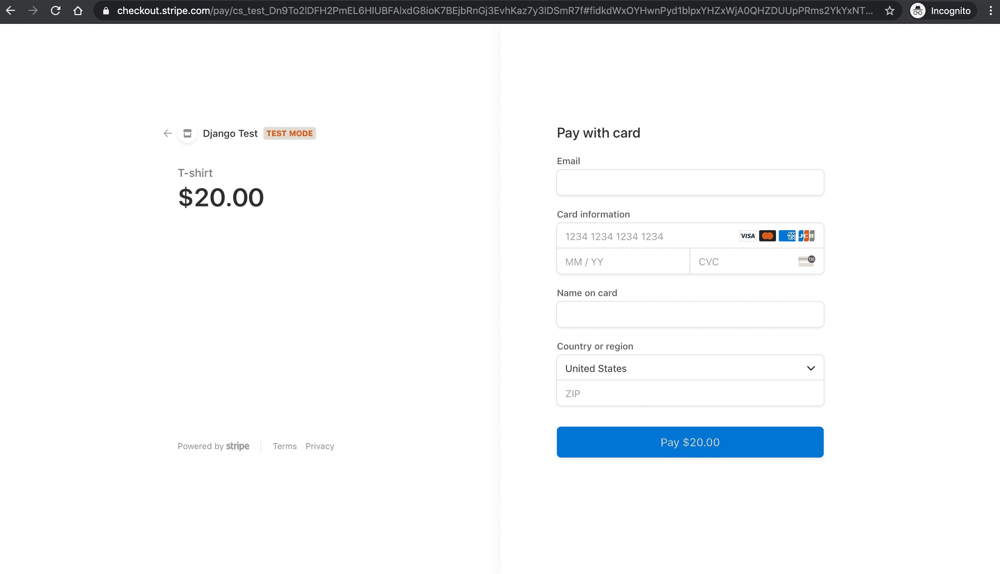
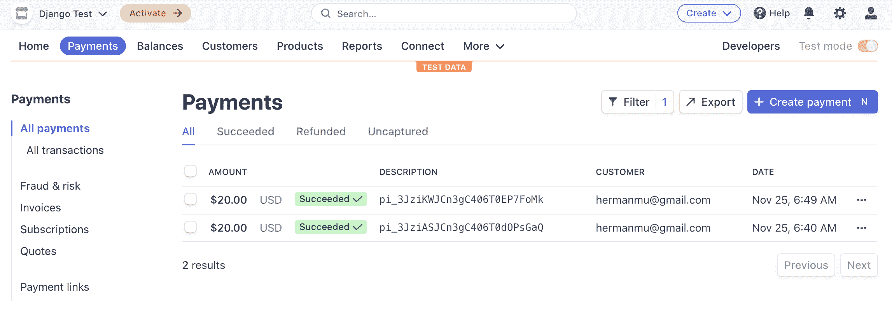

# 姜戈条纹教程

> 原文：<https://testdriven.io/blog/django-stripe-tutorial/>

在本教程中，我将演示如何从头开始配置一个新的 Django 网站，以接受带有 [Stripe](https://stripe.com/) 的一次性付款。

> 需要处理订阅付款？查看 [Django Stripe 订阅](/blog/django-stripe-subscriptions/)。

## 条纹支付选项

目前有三种方式接受 Stripe 的一次性付款:

1.  [收费 API](https://stripe.com/docs/payments/charges-api) (遗留)
2.  [条纹检测](https://stripe.com/payments/checkout)(本教程的重点)
3.  [支付意向 API](https://stripe.com/docs/payments/payment-intents) (通常与[条纹元素](https://stripe.com/payments/elements)相结合)

你应该用哪一个？

1.  如果您想快速启动并运行，请使用 Checkout。如果你熟悉 Checkout 的旧版本[模态版本](/static/images/blog/django/django-stripe/legacy_stripe_checkout.png),这是正确的方法。它提供了大量开箱即用的功能，支持多种语言，并包括一个实现[定期支付](https://stripe.com/docs/payments/checkout/set-up-a-subscription)的简单途径。最重要的是，Checkout 为您管理整个付款过程，因此您甚至无需添加任何表单就可以开始接受付款！
2.  如果您希望为最终用户提供更加定制的体验，请使用付款意向 API。

虽然您仍然可以使用 Charges API，但是如果您是 Stripe 的新手，请不要使用它，因为它不支持最新的银行法规(如 [SCA](https://stripe.com/docs/strong-customer-authentication) )。你会看到很高的下降率。如需了解更多信息，请查看官方 Stripe 文档中的[费用与付款意向 API](https://stripe.com/docs/payments/payment-intents/migration/charges)页面。

> 还在用收费 API？如果你的大多数客户都在美国或加拿大，你还不需要迁移。查看[结帐迁移指南](https://stripe.com/docs/payments/checkout/migration)指南了解更多信息。

## 项目设置

创建一个新的项目目录以及一个名为`djangostripe`的新 Django 项目:

```
`$ mkdir django-stripe-checkout && cd django-stripe-checkout
$ python3.10 -m venv env
$ source env/bin/activate

(env)$ pip install django==3.2.9
(env)$ django-admin startproject djangostripe .` 
```

> 你可以随意把 virtualenv 和 Pip 换成诗歌[或](https://python-poetry.org) [Pipenv](https://github.com/pypa/pipenv) 。更多信息，请查看[现代 Python 环境](/blog/python-environments/)。

接下来，创建一个名为`payments`的新应用:

```
`(env)$ python manage.py startapp payments` 
```

现在将新应用添加到 *settings.py* 中的`INSTALLED_APPS`配置中:

```
`# djangostripe/settings.py

INSTALLED_APPS = [
    'django.contrib.admin',
    'django.contrib.auth',
    'django.contrib.contenttypes',
    'django.contrib.sessions',
    'django.contrib.messages',
    'django.contrib.staticfiles',

    # Local
    'payments.apps.PaymentsConfig', # new
]` 
```

用`payments` app 更新项目级 *urls.py* 文件:

```
`# djangostripe/urls.py

from django.contrib import admin
from django.urls import path, include # new

urlpatterns = [
    path('admin/', admin.site.urls),
    path('', include('payments.urls')), # new
]` 
```

在新应用中也创建一个 *urls.py* 文件:

```
`(env)$ touch payments/urls.py` 
```

然后按如下方式填充它:

```
`# payments/urls.py

from django.urls import path

from . import views

urlpatterns = [
    path('', views.HomePageView.as_view(), name='home'),
]` 
```

现在添加一个 *views.py* 文件:

```
`# payments/views.py

from django.views.generic.base import TemplateView

class HomePageView(TemplateView):
    template_name = 'home.html'` 
```

并为我们的主页创建一个专用的“模板”文件夹和文件。

```
`(env)$ mkdir templates
(env)$ touch templates/home.html` 
```

然后，添加以下 HTML:

```
`<!-- templates/home.html -->

<!DOCTYPE html>
<html>
  <head>
    <meta charset="utf-8">
    <meta name="viewport" content="width=device-width, initial-scale=1">
    <title>Django + Stripe Checkout</title>
    <link rel="stylesheet" href="https://cdn.jsdelivr.net/npm/[[email protected]](/cdn-cgi/l/email-protection)/css/bulma.min.css">
    <script defer src="https://use.fontawesome.com/releases/v5.15.4/js/all.js"></script>
  </head>
  <body>
  <section class="section">
    <div class="container">
      <button class="button is-primary" id="submitBtn">Purchase!</button>
    </div>
  </section>
  </body>
</html>` 
```

确保更新 *settings.py* 文件，以便 Django 知道要查找“模板”文件夹:

```
`# djangostripe/settings.py

TEMPLATES = [
    {
        'BACKEND': 'django.template.backends.django.DjangoTemplates',
        'DIRS': ['templates'], # new
        ...` 
```

最后运行`migrate`来同步数据库，运行`runserver`来启动 Django 的本地 web 服务器。

```
`(env)$ python manage.py migrate
(env)$ python manage.py runserver` 
```

就是这样！查看 [http://localhost:8000/](http://localhost:8000/) 你会看到主页:



## 添加条纹

条纹时间到了。从安装开始:

```
`(env)$ pip install stripe==2.63.0` 
```

接下来，[注册一个 Stripe 账户的](https://dashboard.stripe.com/register)(如果你还没有这样做的话)并导航到[仪表板](https://dashboard.stripe.com/test/dashboard)。点击“开发者”:



然后在左侧栏中点击“API keys”:


每个条带帐户有四个 [API 密钥](https://stripe.com/docs/keys):两个用于测试，两个用于生产。每一对都有一个“秘密密钥”和一个“可公开密钥”。不要向任何人透露密钥；可发布的密钥将被嵌入到任何人都可以看到的页面上的 JavaScript 中。

目前右上角的“查看测试数据”开关表示我们正在使用测试键。这就是我们想要的。

在您的 *settings.py* 文件的底部，添加以下两行，包括您自己的测试秘密和测试可发布密钥。确保在实际的键周围包含`''`字符。

```
`# djangostripe/settings.py

STRIPE_PUBLISHABLE_KEY = '<your test publishable key here>'
STRIPE_SECRET_KEY = '<your test secret key here>'` 
```

最后，您需要在[https://dashboard.stripe.com/settings/account](https://dashboard.stripe.com/settings/account)的“帐户设置”中指定一个“帐户名称”:



## 创造产品

接下来，我们需要创造一个产品来销售。

单击“产品”，然后单击“添加产品”:



添加产品名称，输入价格，然后选择“一次性”:



点击“保存产品”。

## 用户流量

在用户点击购买按钮后，我们需要做以下事情:

1.  获取可发布密钥

    *   从客户端向服务器发送请求可发布密钥的 XHR 请求
    *   用键回应
    *   使用键创建 Stripe.js 的新实例
2.  创建签出会话

    *   向服务器发送另一个 XHR 请求，请求新的结帐会话 ID
    *   生成新的签出会话并发回 ID
    *   重定向到用户完成购买的结帐页面
3.  适当地重定向用户

    *   成功付款后重定向到成功页面
    *   取消付款后重定向到取消页面
4.  用条纹网钩确认付款

    *   设置 webhook 端点
    *   使用条带 CLI 测试端点
    *   用条带注册端点

## 获取可发布密钥

### JavaScript 静态文件

让我们首先创建一个新的静态文件来保存我们所有的 JavaScript:

```
`(env)$ mkdir static
(env)$ touch static/main.js` 
```

向新的 *main.js* 文件添加快速健全检查:

```
`// static/main.js console.log("Sanity check!");` 
```

然后更新 *settings.py* 文件，这样 Django 就知道在哪里可以找到静态文件:

```
`# djangostripe/settings.py

STATIC_URL = '/static/'

# for django >= 3.1
STATICFILES_DIRS = [BASE_DIR / 'static']  # new

# for django < 3.1
# STATICFILES_DIRS = [os.path.join(BASE_DIR, 'static')]  # new` 
```

在 HTML 模板中添加静态模板标签和新的脚本标签:

```
`<!-- templates/home.html -->

 <!-- new -->

<!DOCTYPE html>
<html>
  <head>
    <meta charset="utf-8">
    <meta name="viewport" content="width=device-width, initial-scale=1">
    <title>Django + Stripe Checkout</title>
    <link rel="stylesheet" href="https://cdn.jsdelivr.net/npm/[[email protected]](/cdn-cgi/l/email-protection)/css/bulma.min.css">
    <script src=""></script>   <!-- new -->
    <script defer src="https://use.fontawesome.com/releases/v5.15.4/js/all.js"></script>
  </head>
  <body>
  <section class="section">
    <div class="container">
      <button class="button is-primary" id="submitBtn">Purchase!</button>
    </div>
  </section>
  </body>
</html>` 
```

再次运行开发服务器。导航到 [http://localhost:8000/](http://localhost:8000/) ，打开 JavaScript 控制台。您应该看到健全性检查:



### 视角

接下来，向 *payments/views.py* 添加一个新视图来处理 XHR 请求:

```
`# payments/views.py

from django.conf import settings # new
from django.http.response import JsonResponse # new
from django.views.decorators.csrf import csrf_exempt # new
from django.views.generic.base import TemplateView

class HomePageView(TemplateView):
    template_name = 'home.html'

# new
@csrf_exempt
def stripe_config(request):
    if request.method == 'GET':
        stripe_config = {'publicKey': settings.STRIPE_PUBLISHABLE_KEY}
        return JsonResponse(stripe_config, safe=False)` 
```

也添加一个 URL:

```
`# payments/urls.py

from django.urls import path

from . import views

urlpatterns = [
    path('', views.HomePageView.as_view(), name='home'),
    path('config/', views.stripe_config),  # new
]` 
```

### XHR 请求

接下来，使用[获取 API](https://developer.mozilla.org/en-US/docs/Web/API/Fetch_API) 向 *static/main.js* 中的新`/config/`端点发出 XHR (XMLHttpRequest)请求:

```
`// static/main.js console.log("Sanity check!"); // new // Get Stripe publishable key fetch("/config/") .then((result)  =>  {  return  result.json();  }) .then((data)  =>  { // Initialize Stripe.js const  stripe  =  Stripe(data.publicKey); });` 
```

来自`fetch`请求的响应是一个[可读流](https://developer.mozilla.org/en-US/docs/Web/API/ReadableStream)。`result.json()`返回一个承诺，我们将其解析为一个 JavaScript 对象——例如`data`。然后我们使用点符号来访问`publicKey`以获得可发布的密钥。

将 [Stripe.js](https://stripe.com/docs/js) 包含在 *templates/home.html* 中像这样:

```
`<!-- templates/home.html -->



<!DOCTYPE html>
<html>
  <head>
    <meta charset="utf-8">
    <meta name="viewport" content="width=device-width, initial-scale=1">
    <title>Django + Stripe Checkout</title>
    <link rel="stylesheet" href="https://cdn.jsdelivr.net/npm/[[email protected]](/cdn-cgi/l/email-protection)/css/bulma.min.css">
    <script src="https://js.stripe.com/v3/"></script>  <!-- new -->
    <script src=""></script>
    <script defer src="https://use.fontawesome.com/releases/v5.15.4/js/all.js"></script>
  </head>
  <body>
  <section class="section">
    <div class="container">
      <button class="button is-primary" id="submitBtn">Purchase!</button>
    </div>
  </section>
  </body>
</html>` 
```

现在，在页面加载之后，将调用`/config/`，它将使用 Stripe publish key 进行响应。然后，我们将使用这个键创建 Stripe.js 的新实例。

流量:

1.  ~~获取可发布密钥~~

    *   ~~从客户端向服务器发送 XHR 请求，请求可发布密钥~~
    *   ~~用~~键响应
    *   ~~使用键创建 Stripe.js 的新实例~~
2.  创建签出会话

    *   向服务器发送另一个 XHR 请求，请求新的结帐会话 ID
    *   生成新的签出会话并发回 ID
    *   重定向到用户完成购买的结帐页面
3.  适当地重定向用户

    *   成功付款后重定向到成功页面
    *   取消付款后重定向到取消页面
4.  用条纹网钩确认付款

    *   设置 webhook 端点
    *   使用条带 CLI 测试端点
    *   用条带注册端点

## 创建签出会话

接下来，我们需要为按钮的 click 事件附加一个事件处理程序，该事件将向服务器发送另一个 XHR 请求，以生成新的结帐会话 ID。

### 视角

首先，添加新视图:

```
`# payments/views.py

@csrf_exempt
def create_checkout_session(request):
    if request.method == 'GET':
        domain_url = 'http://localhost:8000/'
        stripe.api_key = settings.STRIPE_SECRET_KEY
        try:
            # Create new Checkout Session for the order
            # Other optional params include:
            # [billing_address_collection] - to display billing address details on the page
            # [customer] - if you have an existing Stripe Customer ID
            # [payment_intent_data] - capture the payment later
            # [customer_email] - prefill the email input in the form
            # For full details see https://stripe.com/docs/api/checkout/sessions/create

            # ?session_id={CHECKOUT_SESSION_ID} means the redirect will have the session ID set as a query param
            checkout_session = stripe.checkout.Session.create(
                success_url=domain_url + 'success?session_id={CHECKOUT_SESSION_ID}',
                cancel_url=domain_url + 'cancelled/',
                payment_method_types=['card'],
                mode='payment',
                line_items=[
                    {
                        'name': 'T-shirt',
                        'quantity': 1,
                        'currency': 'usd',
                        'amount': '2000',
                    }
                ]
            )
            return JsonResponse({'sessionId': checkout_session['id']})
        except Exception as e:
            return JsonResponse({'error': str(e)})` 
```

这里，如果请求方法是`GET`，我们定义了一个`domain_url`，将条带密钥分配给`stripe.api_key`(因此当我们请求创建一个新的签出会话时，它将被自动发送)，创建了签出会话，并在响应中发回了 ID。注意`success_url`和`cancel_url`。在成功支付或取消的情况下，用户将分别被重定向回这些 URL。我们将很快设置这些视图。

不要忘记重要的一点:

添加 URL:

```
`# payments/urls.py

from django.urls import path

from . import views

urlpatterns = [
    path('', views.HomePageView.as_view(), name='home'),
    path('config/', views.stripe_config),
    path('create-checkout-session/', views.create_checkout_session), # new
]` 
```

### XHR 请求

将事件处理程序和后续的 XHR 请求添加到 *static/main.js* :

```
`// static/main.js console.log("Sanity check!"); // Get Stripe publishable key fetch("/config/") .then((result)  =>  {  return  result.json();  }) .then((data)  =>  { // Initialize Stripe.js const  stripe  =  Stripe(data.publicKey); // new // Event handler document.querySelector("#submitBtn").addEventListener("click",  ()  =>  { // Get Checkout Session ID fetch("/create-checkout-session/") .then((result)  =>  {  return  result.json();  }) .then((data)  =>  { console.log(data); // Redirect to Stripe Checkout return  stripe.redirectToCheckout({sessionId:  data.sessionId}) }) .then((res)  =>  { console.log(res); }); }); });` 
```

在这里，在解析了`result.json()`承诺之后，我们调用了 [redirectToCheckout](https://stripe.com/docs/js/checkout/redirect_to_checkout) ,其中的结帐会话 ID 来自解析的承诺。

导航到 [http://localhost:8000/](http://localhost:8000/) 。点击按钮后，您将被重定向到 Stripe Checkout 实例(一个 Stripe 托管页面，用于安全收集支付信息),其中包含 t 恤产品信息:



我们可以使用 Stripe 提供的几个[测试卡号](https://stripe.com/docs/testing#cards)中的一个来测试表单。还是用`4242 4242 4242 4242`吧。请确保到期日期在未来。为 CVC 添加任意 3 个数字，为邮政编码添加任意 5 个数字。输入任何电子邮件地址和名称。如果一切顺利，付款应该被处理，但是重定向将失败，因为我们还没有设置`/success/` URL。

流量:

1.  ~~获取可发布密钥~~

    *   ~~从客户端向服务器发送 XHR 请求，请求可发布密钥~~
    *   ~~用~~键响应
    *   ~~使用键创建 Stripe.js 的新实例~~
2.  ~~创建结账会话~~

    *   ~~向服务器发送另一个 XHR 请求，请求新的结账会话 ID~~
    *   ~~生成新的结账会话并发回 ID~~
    *   ~~重定向到用户完成购买的结账页面~~
3.  适当地重定向用户

    *   成功付款后重定向到成功页面
    *   取消付款后重定向到取消页面
4.  用条纹网钩确认付款

    *   设置 webhook 端点
    *   使用条带 CLI 测试端点
    *   用条带注册端点

## 适当地重定向用户

最后，让我们连接用于处理成功和取消重定向的模板、视图和 URL。

成功模板:

```
`<!-- templates/success.html -->

<!DOCTYPE html>
<html>
  <head>
    <meta charset="utf-8">
    <meta name="viewport" content="width=device-width, initial-scale=1">
    <title>Django + Stripe Checkout</title>
    <link rel="stylesheet" href="https://cdn.jsdelivr.net/npm/[[email protected]](/cdn-cgi/l/email-protection)/css/bulma.min.css">
    <script defer src="https://use.fontawesome.com/releases/v5.15.4/js/all.js"></script>
  </head>
  <body>
  <section class="section">
    <div class="container">
      <p>Your payment succeeded.</p>
    </div>
  </section>
  </body>
</html>` 
```

已取消的模板:

```
`<!-- templates/cancelled.html -->

<!DOCTYPE html>
<html>
  <head>
    <meta charset="utf-8">
    <meta name="viewport" content="width=device-width, initial-scale=1">
    <title>Django + Stripe Checkout</title>
    <link rel="stylesheet" href="https://cdn.jsdelivr.net/npm/[[email protected]](/cdn-cgi/l/email-protection)/css/bulma.min.css">
    <script defer src="https://use.fontawesome.com/releases/v5.15.4/js/all.js"></script>
  </head>
  <body>
  <section class="section">
    <div class="container">
      <p>Your payment was cancelled.</p>
    </div>
  </section>
  </body>
</html>` 
```

视图:

```
`# payments/views.py

class SuccessView(TemplateView):
    template_name = 'success.html'

class CancelledView(TemplateView):
    template_name = 'cancelled.html'` 
```

URL:

```
`# payments/urls.py

from django.urls import path

from . import views

urlpatterns = [
    path('', views.HomePageView.as_view(), name='home'),
    path('config/', views.stripe_config),
    path('create-checkout-session/', views.create_checkout_session),
    path('success/', views.SuccessView.as_view()), # new
    path('cancelled/', views.CancelledView.as_view()), # new
]` 
```

好的，在[刷新网页 http://localhost:8000/](http://localhost:8000/) 。点击支付按钮，再次使用信用卡号`4242 4242 4242 4242`和其他虚拟信息。提交付款。你应该被重定向回[http://localhost:8000/success/](http://localhost:8000/success/)。

要确认实际收费，请返回“支付”下的 Stripe 仪表盘:



回顾一下，我们使用密钥在服务器上创建一个惟一的签出会话 ID。这个 ID 随后被用来创建一个结帐实例，最终用户在点击支付按钮后被重定向到这个实例。收费发生后，他们会被重定向回成功页面。

流量:

1.  ~~获取可发布密钥~~

    *   ~~从客户端向服务器发送 XHR 请求，请求可发布密钥~~
    *   ~~用~~键响应
    *   ~~使用键创建 Stripe.js 的新实例~~
2.  ~~创建结账会话~~

    *   ~~向服务器发送另一个 XHR 请求，请求新的结账会话 ID~~
    *   ~~生成新的结账会话并发回 ID~~
    *   ~~重定向到用户完成购买的结账页面~~
3.  ~~适当地重定向用户~~

    *   ~~支付成功后重定向至成功页面~~
    *   ~~取消付款后重定向至取消页面~~
4.  用条纹网钩确认付款

    *   设置 webhook 端点
    *   使用条带 CLI 测试端点
    *   用条带注册端点

## 用条纹网钩确认付款

我们的应用程序在这一点上工作得很好，但我们仍然不能以编程方式确认支付，或者在支付成功时运行一些代码。我们已经在用户结帐后将他们重定向到成功页面，但是我们不能只依赖那个页面，因为付款确认是异步发生的。

> Stripe 和一般编程中有两种类型的事件:同步事件，具有即时效果和结果(例如，创建一个客户)，异步事件，没有即时结果(例如，确认付款)。因为支付确认是异步完成的，用户可能会在他们的支付被确认之前*和*我们收到他们的资金之前*被重定向到成功页面。*

当支付完成时，获得通知的最简单的方法之一是使用回调或所谓的 [Stripe webhook](https://stripe.com/docs/webhooks) 。我们需要在应用程序中创建一个简单的端点，每当事件发生时(例如，当用户购买 t 恤时)，Stripe 就会调用这个端点。通过使用 webhooks，我们可以绝对肯定支付成功。

为了使用 webhooks，我们需要:

1.  设置 webhook 端点
2.  使用[条带 CLI](https://stripe.com/docs/stripe-cli) 测试端点
3.  用条带注册端点

> 这一部分由尼克·托马兹奇撰写。

### 端点

创建一个名为`stripe_webhook`的新视图，它会在每次付款成功时打印一条消息:

```
`# payments/views.py

@csrf_exempt
def stripe_webhook(request):
    stripe.api_key = settings.STRIPE_SECRET_KEY
    endpoint_secret = settings.STRIPE_ENDPOINT_SECRET
    payload = request.body
    sig_header = request.META['HTTP_STRIPE_SIGNATURE']
    event = None

    try:
        event = stripe.Webhook.construct_event(
            payload, sig_header, endpoint_secret
        )
    except ValueError as e:
        # Invalid payload
        return HttpResponse(status=400)
    except stripe.error.SignatureVerificationError as e:
        # Invalid signature
        return HttpResponse(status=400)

    # Handle the checkout.session.completed event
    if event['type'] == 'checkout.session.completed':
        print("Payment was successful.")
        # TODO: run some custom code here

    return HttpResponse(status=200)` 
```

`stripe_webhook`现在作为我们的 webhook 端点。这里，我们只寻找每当结帐成功时调用的`checkout.session.completed`事件，但是您可以对其他[条带事件](https://stripe.com/docs/api/events)使用相同的模式。

确保将`HttpResponse`导入添加到顶部:

```
`from django.http.response import JsonResponse, HttpResponse` 
```

要使端点可访问，唯一要做的就是在 *urls.py* 中注册它:

```
`# payments/urls.py

from django.urls import path

from . import views

urlpatterns = [
    path('', views.HomePageView.as_view(), name='home'),
    path('config/', views.stripe_config),
    path('create-checkout-session/', views.create_checkout_session),
    path('success/', views.SuccessView.as_view()),
    path('cancelled/', views.CancelledView.as_view()),
    path('webhook/', views.stripe_webhook), # new
]` 
```

### 测试 webhook

我们将使用 [Stripe CLI](https://stripe.com/docs/stripe-cli) 来测试 webhook。

一旦[下载并安装了](https://stripe.com/docs/stripe-cli#install)，在新的终端窗口中运行以下命令，登录到您的 Stripe 帐户:

此命令应生成一个配对代码:

```
`Your pairing code is: peach-loves-classy-cozy
This pairing code verifies your authentication with Stripe.
Press Enter to open the browser (^C to quit)` 
```

通过按 Enter，CLI 将打开您的默认 web 浏览器，并请求访问您的帐户信息的权限。请继续并允许访问。回到您的终端，您应该看到类似于以下内容的内容:

```
`> Done! The Stripe CLI is configured for Django Test with account id acct_<ACCOUNT_ID>

Please note: this key will expire after 90 days, at which point you'll need to re-authenticate.` 
```

接下来，我们可以开始侦听条带事件，并使用以下命令将它们转发到我们的端点:

```
`$ stripe listen --forward-to localhost:8000/webhook/` 
```

这也将生成一个 webhook 签名密码:

```
`> Ready! Your webhook signing secret is whsec_xxxxxxxxxxxxxxxxxxxxxxxxxxxxxx (^C to quit)` 
```

为了初始化端点，将秘密添加到 *settings.py* 文件中:

```
`# djangostripe/settings.py

STRIPE_ENDPOINT_SECRET = '<your webhook signing secret here>'` 
```

Stripe 现在会将事件转发到我们的端点。要测试，通过`4242 4242 4242 4242`运行另一个测试支付。在您的终端中，您应该会看到`Payment was successful.`消息。

一旦完成，停止`stripe listen --forward-to localhost:8000/webhook/`过程。

> 如果您想识别进行购买的用户，可以使用 [client_reference_id](https://stripe.com/docs/api/checkout/sessions/object) 将某种用户标识符附加到条带会话。
> 
> 例如:
> 
> ```
> # payments/views.py
> 
> @csrf_exempt
> def create_checkout_session(request):
>     if request.method == 'GET':
>         domain_url = 'http://localhost:8000/'
>         stripe.api_key = settings.STRIPE_SECRET_KEY
>         try:
>             checkout_session = stripe.checkout.Session.create(
>                 # new
>                 client_reference_id=request.user.id if request.user.is_authenticated else None,
>                 success_url=domain_url + 'success?session_id={CHECKOUT_SESSION_ID}',
>                 cancel_url=domain_url + 'cancelled/',
>                 payment_method_types=['card'],
>                 mode='payment',
>                 line_items=[
>                     {
>                         'name': 'T-shirt',
>                         'quantity': 1,
>                         'currency': 'usd',
>                         'amount': '2000',
>                     }
>                 ]
>             )
>             return JsonResponse({'sessionId': checkout_session['id']})
>         except Exception as e:
>             return JsonResponse({'error': str(e)}) 
> ```

### 注册端点

最后，在部署你的应用程序后，你可以在 Stripe 仪表板中注册端点，在[开发者> Webhooks](https://dashboard.stripe.com/test/webhooks) 下。这将生成一个 webhook 签名密码，用于您的生产应用程序。

例如:


流量:

1.  ~~获取可发布密钥~~

    *   ~~从客户端向服务器发送 XHR 请求，请求可发布密钥~~
    *   ~~用~~键响应
    *   ~~使用键创建 Stripe.js 的新实例~~
2.  ~~创建结账会话~~

    *   ~~向服务器发送另一个 XHR 请求，请求新的结账会话 ID~~
    *   ~~生成新的结账会话并发回 ID~~
    *   ~~重定向到用户完成购买的结账页面~~
3.  ~~适当地重定向用户~~

    *   ~~支付成功后重定向至成功页面~~
    *   ~~取消付款后重定向至取消页面~~
4.  ~~用条纹网钩确认付款~~

    *   ~~设置 webhook 端点~~
    *   ~~使用条带 CLI 测试端点~~
    *   ~~用条带注册端点~~

## 下一步是什么

在实时网站上，需要有 HTTPS，这样你的连接是安全的。此外，虽然为了简单起见，我们硬编码了 API 密钥和 webhook 签名密码，但它们实际上应该存储在环境变量中。您可能还想将`domain_url`存储为一个环境变量。

从 GitHub 上的[django-stripe-check out](https://github.com/testdrivenio/django-stripe-checkout)repo 中获取代码。