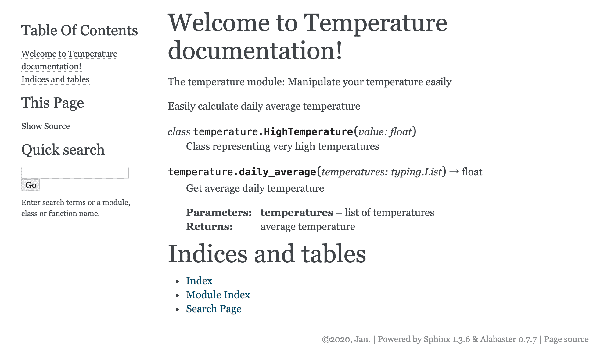
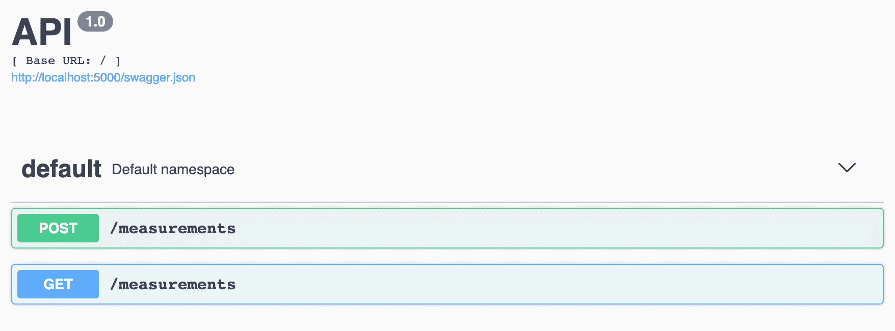
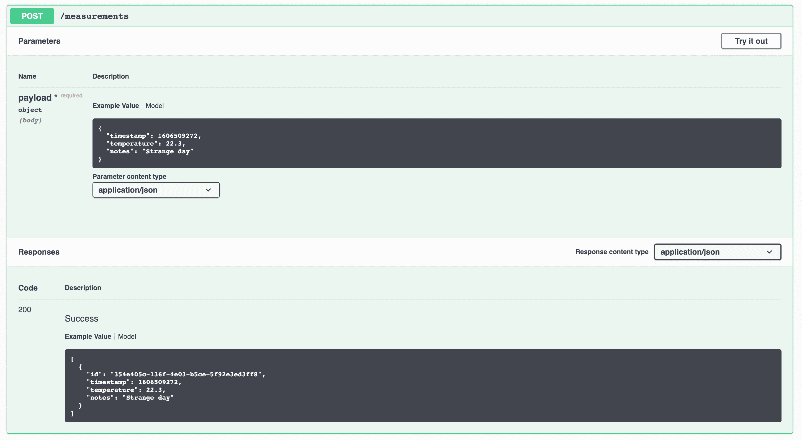

# 记录 Python 代码和项目

> 原文：<https://testdriven.io/blog/documenting-python/>

为什么您需要记录您的 Python 代码？你的项目文档应该包括什么？你如何编写和生成文档？

文档是软件开发的重要组成部分。没有适当的文档，内部和外部的涉众很难或者不可能使用和/或维护您的代码。这也使得招募新的开发者变得更加困难。更进一步说，如果没有一种记录和学习的文化，你将会一次又一次地犯同样的错误。不幸的是，许多开发人员将文档视为事后的想法——就像黑胡椒一样，没有经过太多的考虑。

本文着眼于为什么您应该记录您的 Python 代码，以及如何着手去做。

> [完整 Python](/guides/complete-python/) 指南:
> 
> 1.  [现代 Python 环境——依赖性和工作空间管理](/blog/python-environments/)
> 2.  [Python 中的测试](/blog/testing-python/)
> 3.  [Python 中的现代测试驱动开发](/blog/modern-tdd/)
> 4.  [Python 代码质量](/blog/python-code-quality/)
> 5.  [Python 类型检查](/blog/python-type-checking/)
> 6.  [记录 Python 代码和项目](/blog/documenting-python/)(本文！)
> 7.  [Python 项目工作流程](/blog/python-project-workflow/)

代码注释和文档有什么区别？

文档是一个独立的资源，可以帮助其他人使用你的 API、包、库或框架，而不必阅读源代码。另一方面，注释是为阅读你的源代码的开发者准备的。文档是应该一直存在的东西，但是注释就不一样了。拥有它们很好，但不是必须的。文档应该告诉其他人*如何*和*何时*使用某物，而注释应该回答*为什么*的问题:

1.  为什么要这样做？
2.  为什么这是这里而不是那里？

哪些问题应该由你的干净代码来回答:

1.  这是什么？
2.  这个方法是做什么的？

| 类型 | 答案 | 利益相关者 |
| --- | --- | --- |
| 证明文件 | 何时和如何 | 用户 |
| 代码注释 | 为什么 | 开发商 |
| 干净的代码 | 什么 | 开发商 |

## 文档字符串

正如 [PEP-257](https://www.python.org/dev/peps/pep-0257/) 所规定的，Python [文档字符串](https://docs.python.org/3/tutorial/controlflow.html#documentation-strings)(或 docstring)是一种特殊的“作为模块、函数、类或方法定义中的第一条语句出现的字符串文字”来形成给定对象的`__doc__`属性。它允许您将文档直接嵌入到源代码中。

例如，假设您有一个名为 *temperature.py* 的模块，它有一个计算日平均温度的函数。使用 docstrings，您可以像这样记录它:

```
`"""
The temperature module: Manipulate your temperature easily

Easily calculate daily average temperature
"""

from typing import List

class HighTemperature:
    """Class representing very high temperatures"""

    def __init__(self, value: float):
        """
 :param value: value of temperature
 """

        self.value = value

def daily_average(temperatures: List[float]) -> float:
    """
 Get average daily temperature

 Calculate average temperature from multiple measurements

 :param temperatures: list of temperatures
 :return: average temperature
 """

    return sum(temperatures)/len(temperatures)` 
```

您可以通过访问`__doc__`属性来查看为`daily_average`函数指定的文档字符串:

```
`>>> from temperature import daily_average
>>>
>>> print(daily_average.__doc__)

    Get average daily temperature

    :param temperatures: list of temperatures
    :return: average temperature` 
```

您还可以通过使用内置的 [help](https://docs.python.org/3/library/functions.html#help) 函数来查看完整的模块级文档字符串:

```
`>>> import temperature
>>>
>>> help(temperature)` 
```

值得注意的是，您可以使用带有内置关键字(int、float、def 等等)、类、函数和模块的`help`函数。

### 单线与多线

文档字符串可以是单行或多行。无论哪种方式，第一行总是被视为摘要。[摘要行](https://www.python.org/dev/peps/pep-0257/#multi-line-docstrings)可能会被自动索引工具使用，所以它适合一行是很重要的。当使用单行文档字符串时，所有内容都应该在同一行:开始引号、摘要和结束引号。

```
`class HighTemperature:
    """Class representing very high temperatures"""

    # code starts here` 
```

当使用多行文档字符串时，结构是这样的:开始引号、摘要、空行、更详细的描述和结束引号。

```
`def daily_average(temperatures: List[float]) -> float:
    """
 Get average daily temperature

 Calculate average temperature from multiple measurements

 :param temperatures: list of temperatures
 :return: average temperature
 """

    return sum(temperatures) / len(temperatures)` 
```

除了描述特定函数、类、方法或模块的作用，您还可以指定:

1.  函数参数
2.  函数返回
3.  类别属性
4.  引发的错误
5.  限制
6.  代码示例

### 格式

四种最常见的格式是:

1.  谷歌
2.  [重组文本](https://docutils.sourceforge.io/rst.html)
3.  [NumPy](https://numpydoc.readthedocs.io/en/latest/format.html)
4.  [Epytext](http://epydoc.sourceforge.net/epytext.html)

选择一个最适合你的，并在整个项目中保持一致。

通过使用 docstrings，你可以用口语明确地表达你的意图来帮助别人(和你未来的自己！)更好地理解何时、何地以及如何使用某些代码。

### 林挺

您可以像处理代码一样处理文档字符串。Linters 确保文档字符串格式良好，并且与实际实现相匹配，这有助于保持文档的新鲜。

Darglint 是一个流行的 Python 文档 linter。

让我们对 *temperature.py* 模块进行 lint 处理:

```
`def daily_average(temperatures: List[float]) -> float:
    """
 Get average daily temperature

 Calculate average temperature from multiple measurements

 :param temperatures: list of temperatures
 :return: average temperature
 """

    return sum(temperatures) / len(temperatures)` 
```

棉绒:

```
`$ darglint --docstring-style sphinx temperature.py` 
```

如果把参数名从`temperatures`改成`temperatures_list`会怎么样？

```
`$ darglint --docstring-style sphinx temperature.py

temperature.py:daily_average:27: DAR102: + temperatures
temperature.py:daily_average:27: DAR101: - temperatures_list` 
```

### 代码示例

还可以向 docstrings 添加代码示例，显示函数、方法或类的示例用法。

例如:

```
`def daily_average(temperatures: List[float], new_param=None) -> float:
    """
 Get average daily temperature

 Calculate average temperature from multiple measurements

 >>> daily_average([10.0, 12.0, 14.0])
 12.0

 :param temperatures: list of temperatures
 :return: Average temperature
 """

    return sum(temperatures)/len(temperatures)` 
```

代码示例也可以由 [pytest](https://docs.pytest.org/) 通过 [doctest](https://docs.python.org/3/library/doctest.html) 像任何其他测试一样执行。与林挺一起，这也有助于确保您的文档保持最新，与代码同步。

> 查看 [doctest —通过文档进行测试](https://pymotw.com/3/doctest/)，了解更多关于`doctest`的信息。

因此，在上面的例子中，pytest 将断言`daily_average([10.0, 12.0, 14.0])`等于`12.0`。要将这个代码示例作为测试运行，您只需使用 [doctest-modules](https://docs.pytest.org/en/stable/doctest.html) 选项运行 pytest:

```
`$ python -m pytest --doctest-modules temperature.py

=============================== test session starts ===============================
platform darwin -- Python 3.11.0, pytest-7.2.1, pluggy-1.0.0
rootdir: /Users/michael/repos/testdriven/documenting-python
collected 1 item

temperature.py .                                                            [100%]

================================ 1 passed in 0.01s ================================` 
```

如果将代码示例更改为:

```
`>>> daily_average([10.0, 12.0, 14.0])
13.0` 
```

```
`$ python -m pytest --doctest-modules temperature.py

=============================== test session starts ===============================
platform darwin -- Python 3.11.0, pytest-7.2.1, pluggy-1.0.0
rootdir: /Users/michael/repos/testdriven/documenting-python
collected 1 item

temperature.py F                                                            [100%]

==================================== FAILURES =====================================
_______________________ [doctest] temperature.daily_average _______________________
022
023     Get average daily temperature
024
025     Calculate average temperature from multiple measurements
026
027     >>> daily_average([10.0, 12.0, 14.0])
Expected:
    13.0
Got:
    12.0

/Users/michael/repos/testdriven/documenting-python/temperature.py:27: DocTestFailure
============================= short test summary info =============================
FAILED temperature.py::temperature.daily_average
================================ 1 failed in 0.01s ================================` 
```

> 关于 pytest 的更多信息，请查看 Python 文章中的[测试。](/blog/testing-python/)

## 狮身人面像

将 docstrings 添加到代码中很好，但是您仍然需要将它呈现给用户。

这就是像 [Sphinx](https://www.sphinx-doc.org/) 、 [Epydoc](http://epydoc.sourceforge.net/) 和 [MKDocs](https://www.mkdocs.org/) 这样的工具发挥作用的地方，它们将把你的项目的文档字符串转换成 HTML 和 CSS。

斯芬克斯是迄今为止最受欢迎的。它用于为许多开源项目生成文档，如 [Python](https://docs.python.org/3/) 和 [Flask](https://flask.palletsprojects.com/) 。它也是由[Read Docs](https://docs.readthedocs.io/en/stable/intro/getting-started-with-sphinx.html)支持的文档工具之一，被数以千计的开源项目使用，例如 [Requests](https://requests.readthedocs.io/) 、 [Flake8](https://flake8.pycqa.org/) 和 [pytest](https://docs.pytest.org/) 等等。

让我们看看它的实际效果。首先按照官方[指南](https://www.sphinx-doc.org/en/master/usage/installation.html)下载并安装 Sphinx。

```
`$ sphinx-quickstart --version

sphinx-quickstart 6.1.3` 
```

创建新的项目目录:

```
`$ mkdir sphinx_example
$ cd sphinx_example` 
```

接下来，添加一个名为 *temperature.py* 的新文件:

```
`"""
The temperature module: Manipulate your temperature easily

Easily calculate daily average temperature
"""

from typing import List

class HighTemperature:
    """Class representing very high temperatures"""

    def __init__(self, value: float):
        """
 :param value: value of temperature
 """

        self.value = value

def daily_average(temperatures: List[float]) -> float:
    """
 Get average daily temperature

 :param temperatures: list of temperatures
 :return: average temperature
 """

    return sum(temperatures)/len(temperatures)` 
```

要为 Sphinx 搭建文件和文件夹，以便在项目根目录中为 *temperature.py* 创建文档，请运行:

你会被提升几个问题:

```
`> Separate source and build directories (y/n) [n]: n
> Project name: Temperature
> Author name(s): Your Name
> Project release []: 1.0.0
> Project language [en]: en` 
```

完成后,“docs”目录应该包含以下文件和文件夹:

```
`docs
├── Makefile
├── _build
├── _static
├── _templates
├── conf.py
├── index.rst
└── make.bat` 
```

接下来，让我们更新项目配置。打开 *docs/conf.py* ，在顶部添加以下内容:

```
`import os
import sys
sys.path.insert(0, os.path.abspath('..'))` 
```

现在， [autodoc](https://www.sphinx-doc.org/en/master/usage/quickstart.html#autodoc) ，用于从 docstrings 中拉入文档，会在“docs”的父文件夹中搜索模块。

将以下扩展名添加到`extensions`列表中:

```
`extensions = [
    'sphinx.ext.autodoc',
]` 
```

打开 *docs/index.rst* 并编辑它，如下所示:

```
`Welcome to Temperature documentation!
=====================================

.. automodule:: temperature
    :members:

Indices and tables
==================

* :ref:`genindex`
* :ref:`modindex`
* :ref:`search`` 
```

*index.rst* 的内容写在 [reStructuredText](https://www.sphinx-doc.org/en/master/usage/restructuredtext/) 中，这是一种类似于 [Markdown](https://en.wikipedia.org/wiki/Markdown) 的文本数据文件格式，但功能更强大，因为它是为编写技术文档而设计的。

注意事项:

1.  [标题](https://devguide.python.org/documenting/#sections)是通过在标题下加一个`=`字符(至少和文本一样长)来创建的:
2.  [automodule](https://www.sphinx-doc.org/en/master/usage/extensions/autodoc.html#directive-automodule) 指令用于从 Python 模块中收集文档字符串。因此，`.. automodule:: temperature`告诉 Sphinx 从 *temperature.py* 模块收集文档字符串。
3.  `genindex`、`modindex`和`search`指令被[用于](https://www.sphinx-doc.org/en/master/usage/restructuredtext/directives.html#special-names)分别生成通用索引、文档模块索引和搜索页面。

从“docs”目录中，构建文档:

在浏览器中打开*docs/_ build/html/index . html*。您应该看到:



现在，你可以使用类似于 [Netlify](https://www.netlify.com/) 的工具或者通过类似于[Read Docs](https://readthedocs.org/)的服务自己提供文件。

## API 文档

当谈到文档时，不要忘记 API 的文档。您拥有端点及其 URL、URL 参数、查询参数、状态代码、请求正文和响应正文。即使一个简单的 API 也可能有许多难以记忆的参数。

OpenAPI 规范(以前的 Swagger 规范)提供了一种描述、生产、消费和可视化 RESTful APIs 的标准格式。该规范用于使用 [Swagger UI](https://swagger.io/tools/swagger-ui/) 或 [ReDoc](https://github.com/Redocly/redoc) 生成文档。也可以导入到 [Postman](https://learning.postman.com/docs/integrations/available-integrations/working-with-openAPI/) 之类的工具中。您可以使用像 [Swagger Codegen](https://swagger.io/tools/swagger-codegen/) 和 [OpenAPI Generator](https://openapi-generator.tech/) 这样的工具生成服务器存根和客户端 SDK。

> 要获得 OpenAPI 的编辑器、linters、解析器、代码生成器、文档、测试和模式/数据验证工具的完整列表，请查看 [OpenAPI 工具](https://openapi.tools/)。

规范本身必须用 YAML 或 JSON 编写。例如:

```
`--- openapi:  3.0.2 info: title:  Swagger Petstore - OpenAPI 3.0 description:  |- This is a sample Open API version:  1.0.0 servers: -  url:  "/api/v3" paths: "/pet": post: summary:  Add a new pet to the store description:  Add a new pet to the store operationId:  addPet requestBody: description:  Create a new pet in the store content: application/json: schema: "$ref":  "#/components/schemas/Pet" required:  true responses: '200': description:  Successful operation content: application/json: schema: "$ref":  "#/components/schemas/Pet" '405': description:  Invalid input components: schemas: Pet: required: -  name -  photoUrls type:  object properties: id: type:  integer format:  int64 example:  10 name: type:  string example:  doggie photoUrls: type:  array items: type:  string status: type:  string description:  pet status in the store enum: -  available -  pending -  sold requestBodies: Pet: description:  Pet object that needs to be added to the store content: application/json: schema: "$ref":  "#/components/schemas/Pet"` 
```

手工编写这样的模式非常枯燥，而且容易出错。幸运的是，有许多工具可以帮助自动化这一过程:

## 作为文档的测试

到目前为止，我们已经讨论了用户文档(项目文档)和开发人员文档(代码注释)。开发人员的另一种文档来自测试本身。

作为一名项目开发人员，你需要知道的不仅仅是如何使用一个方法。你需要知道它是否像预期的那样工作，以及如何使用它来进一步开发。虽然在 docstrings 中添加代码示例会有所帮助，但是这些示例只是简单的示例。您需要添加测试来覆盖不仅仅是函数的快乐路径。

测试记录了三件事:

1.  给定输入的预期输出是什么
2.  如何处理异常路径
3.  如何使用给定的函数、方法或类

当你编写测试时，一定要使用正确的命名，并清楚地说明你要测试的是什么。这将使开发人员更容易审查测试套件，以便找出应该如何使用特定的功能或方法。

更重要的是，在编写测试时，您基本上定义了应该在您的文档字符串中包含什么。将[给定，WHEN，THEN](https://martinfowler.com/bliki/GivenWhenThen.html) 结构可以很容易地转换成函数的 docstrings。

例如:

*   给定温度测量列表-> `:param temperatures: list of temperatures`
*   当调用“每日平均”时-> `>>> daily_average([10.0, 12.0, 14.0])`
*   然后返回平均温度-> `Get average temperature, :return: Average temperature`

```
`def daily_average(temperatures: List[float]) -> float:
    """
 Get average temperature

 Calculate average temperature from multiple measurements

 >>> daily_average([10.0, 12.0, 14.0])
 12.0

 :param temperatures: list of temperatures
 :return: Average temperature
 """

    return sum(temperatures)/len(temperatures)` 
```

因此，您可以将[测试驱动开发](/test-driven-development/) (TDD)视为文档驱动开发的一种形式，方法是将您的文档字符串创建为代码:

1.  写一个测试
2.  确保测试失败
3.  写代码
4.  确保测试通过
5.  重构并添加文档字符串

> 关于 TDD 的更多信息，请查看 Python 中的[现代测试驱动开发](/blog/modern-tdd/)文章。

## 记录 Flask REST API

到目前为止，我们已经讨论了理论，所以让我们来看一个真实的例子。我们将用 Flask 创建一个 RESTful API 来测量温度。每次测量都有以下属性:时间戳、温度、注释。 [Flask-RESTX](https://flask-restx.readthedocs.io/) 将用于自动生成 OpenAPI 规范。

那么，我们开始吧。首先，创建一个新文件夹:

```
`$ mkdir flask_temperature
$ cd flask_temperature` 
```

接下来，用[诗歌](https://python-poetry.org)初始化你的项目:

```
`$ poetry init
Package name [flask_temperature]:
Version [0.1.0]:
Description []:
Author [Your name <[[email protected]](/cdn-cgi/l/email-protection)>, n to skip]:
License []:
Compatible Python versions [^3.11]:

Would you like to define your main dependencies interactively? (yes/no) [yes] no
Would you like to define your development dependencies interactively? (yes/no) [yes] no
Do you confirm generation? (yes/no) [yes]` 
```

之后，添加 Flask 和 Flask-RESTX:

```
`$ poetry add flask flask-restx` 
```

现在，让我们创建文档化的 API。为 Flask 应用程序添加一个名为 *app.py* 的文件:

```
`import uuid

from flask import Flask, request
from flask_restx import Api, Resource

app = Flask(__name__)
api = Api(app)

measurements = []

@api.route('/measurements')
class Measurement(Resource):
    def get(self):
        return measurements

    def post(self):
        measurement = {
            'id': str(uuid.uuid4()),
            'timestamp': request.json['timestamp'],
            'temperature': request.json['temperature'],
            'notes': request.json.get('notes'),
        }
        measurements.append(measurement)

        return measurement

if __name__ == '__main__':
    app.run()` 
```

Flask-RESTX 使用基于类的视图来组织资源、路由和 HTTP 方法。在上面的例子中，`Measurement`类支持 HTTP GET 和 POST 方法。其他方法，会返回一个`MethodNotAllowed`错误。当应用程序运行时，Flask-RESTX 还将生成 OpenAPI 模式。

可以在[http://localhost:5000/swagger . JSON](http://localhost:5000/swagger.json)看到模式。您还可以在 [http://localhost:5000](http://localhost:5000) 查看可浏览的 API。



目前，该架构仅包含端点。我们可以定义请求和响应主体来告诉用户对他们的期望以及将返回的内容。

更新 *app.py* :

```
`import uuid

from flask import Flask, request
from flask_restx import Api, Resource, fields

app = Flask(__name__)
api = Api(app)

measurements = []

add_measurement_request_body = api.model(
    'AddMeasurementRequestBody', {
        'timestamp': fields.Integer(
            description='Timestamp of measurement',
            required=True,
            example=1606509272
        ),
        'temperature': fields.Float(
            description='Measured temperature',
            required=True, example=22.3),
        'notes': fields.String(
            description='Additional notes',
            required=False, example='Strange day'),
    }
)

measurement_model = api.model(
    'Measurement', {
        'id': fields.String(
            description='Unique ID',
            required=False,
            example='354e405c-136f-4e03-b5ce-5f92e3ed3ff8'
        ),
        'timestamp': fields.Integer(
            description='Timestamp of measurement',
            required=True,
            example=1606509272
        ),
        'temperature': fields.Float(
            description='Measured temperature',
            required=True,
            example=22.3
        ),
        'notes': fields.String(
            description='Additional notes',
            required=True,
            example='Strange day'
        ),
    }
)

@api.route('/measurements')
class Measurement(Resource):
    @api.doc(model=[measurement_model])
    def get(self):
        return measurements

    @api.doc(model=[measurement_model], body=add_measurement_request_body)
    def post(self):
        measurement = {
            'id': str(uuid.uuid4()),
            'timestamp': request.json['timestamp'],
            'temperature': request.json['temperature'],
            'notes': request.json.get('notes'),
        }
        measurements.append(measurement)

        return measurement

if __name__ == '__main__':
    app.run()` 
```

为了定义我们的响应和请求体的模型，我们使用了`api.model`。我们定义了名称和适当的字段。对于每个字段，我们定义了类型、描述、示例以及是否需要。


为了将模型添加到端点，我们使用了`@api.doc`装饰器。参数`body`定义请求体，而`model`定义响应体。



现在你应该对如何用 Flask-RestX 编写 Flask RESTful API 有了基本的了解。这只是触及了表面。查看 [Swagger 文档](https://flask-restx.readthedocs.io/en/latest/swagger.html),了解如何定义认证信息、URL 参数、状态代码等更多细节。

## 结论

我们中的大多数人，如果不是所有人，都可以在编写文档方面做得更好。幸运的是，有很多工具可以简化编写过程。编写包和库时，使用 Sphinx 来组织和帮助从 docstrings 生成文档。当使用 RESTful API 时，使用生成 OpenAPI 模式的工具，因为该模式可以被大量工具使用——从数据验证器到代码生成器。寻找灵感？[条纹](https://stripe.com/docs/api)、[烧瓶](https://flask.palletsprojects.com/en/2.2.x/)、[柏树](https://docs.cypress.io/guides/overview/why-cypress.html#In-a-nutshell)和 [FastAPI](https://fastapi.tiangolo.com/) 都是做好文档的优秀例子。

> [完整 Python](/guides/complete-python/) 指南:
> 
> 1.  [现代 Python 环境——依赖性和工作空间管理](/blog/python-environments/)
> 2.  [Python 中的测试](/blog/testing-python/)
> 3.  [Python 中的现代测试驱动开发](/blog/modern-tdd/)
> 4.  [Python 代码质量](/blog/python-code-quality/)
> 5.  [Python 类型检查](/blog/python-type-checking/)
> 6.  [记录 Python 代码和项目](/blog/documenting-python/)(本文！)
> 7.  [Python 项目工作流程](/blog/python-project-workflow/)