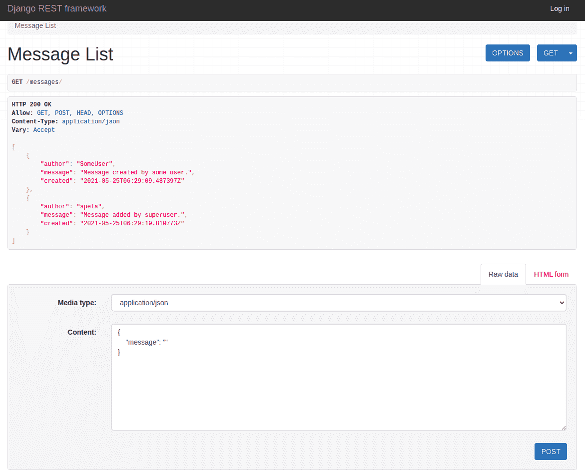

# Django REST 框架中的权限

> 原文：<https://testdriven.io/blog/drf-permissions/>

本文着眼于 Django REST 框架(DRF)中权限的工作方式。

--

**Django REST 框架权限系列:**

1.  [Django REST 框架中的权限](/blog/drf-permissions)(本文！)
2.  [Django REST 框架中内置的权限类](/blog/built-in-permission-classes-drf)
3.  [Django REST 框架中的自定义权限类](/blog/custom-permission-classes-drf)

## 目标

在本文结束时，你应该能够解释:

1.  DRF 权限如何工作
2.  `has_permission`和`has_object_permission`的异同
3.  何时使用`has_permission`和`has_object_permission`

## DRF 权限

在 DRF，[权限](https://www.django-rest-framework.org/api-guide/permissions/)，以及[认证](https://www.django-rest-framework.org/api-guide/authentication/)和[节流](https://www.django-rest-framework.org/api-guide/throttling/)，用于授予或拒绝不同类别的用户访问 API 的不同部分。

身份验证和授权是相辅相成的。身份验证总是在授权之前执行。

身份验证是检查用户身份的过程(发出请求的用户、签名的令牌)，而授权是检查请求用户是否有执行请求的必要权限的过程(他们是超级用户，还是对象的创建者)。

DRF 的授权过程是由权限覆盖的。

## 查看权限

APIView 有两种检查权限的方法:

1.  `check_permissions`根据请求数据检查请求是否被允许
2.  `check_object_permissions`根据请求和对象数据的组合检查请求是否被允许

```py
`# rest_framework/views.py

class APIView(View):
    # other methods
    def check_permissions(self, request):
        """
 Check if the request should be permitted.
 Raises an appropriate exception if the request is not permitted.
 """
        for permission in self.get_permissions():
            if not permission.has_permission(request, self):
                self.permission_denied(
                    request,
                    message=getattr(permission, 'message', None),
                    code=getattr(permission, 'code', None)
                )

    def check_object_permissions(self, request, obj):
        """
 Check if the request should be permitted for a given object.
 Raises an appropriate exception if the request is not permitted.
 """
        for permission in self.get_permissions():
            if not permission.has_object_permission(request, self, obj):
                self.permission_denied(
                    request,
                    message=getattr(permission, 'message', None),
                    code=getattr(permission, 'code', None)
                )` 
```

当请求进来时，执行身份验证。如果认证不成功，就会出现一个`NotAuthenticated`错误。之后，在一个循环中检查权限，如果其中任何一个失败，就会引发一个`PermissionDenied`错误。最后，对请求执行节流检查。

在执行视图处理程序之前调用`check_permissions`,而不执行`check_object_permissions`,除非您显式调用它。例如:

```py
`class MessageSingleAPI(APIView):

    def get(self, request, pk):
        message = get_object_or_404(Message.objects.all(), pk=pk)
        self.check_object_permissions(request, message) # explicitly called
        serializer = MessageSerializer(message)
        return Response(serializer.data)` 
```

使用[视图集](https://www.django-rest-framework.org/api-guide/viewsets/)和[通用视图](https://www.django-rest-framework.org/api-guide/generic-views/)，从数据库中检索所有详细视图的对象后，调用`check_object_permissions`。

```py
`# rest_framework/generics.py

class GenericAPIView(views.APIView):
    # other methods
    def get_object(self):
        """
 Returns the object the view is displaying.

 You may want to override this if you need to provide non-standard
 queryset lookups.  Eg if objects are referenced using multiple
 keyword arguments in the url conf.
 """
        queryset = self.filter_queryset(self.get_queryset())

        # Perform the lookup filtering.
        lookup_url_kwarg = self.lookup_url_kwarg or self.lookup_field

        assert lookup_url_kwarg in self.kwargs, (
            'Expected view %s to be called with a URL keyword argument '
            'named "%s". Fix your URL conf, or set the `.lookup_field` '
            'attribute on the view correctly.' %
            (self.__class__.__name__, lookup_url_kwarg)
        )

        filter_kwargs = {self.lookup_field: self.kwargs[lookup_url_kwarg]}
        obj = get_object_or_404(queryset, **filter_kwargs)

        # May raise a permission denied
        self.check_object_permissions(self.request, obj)  # HERE

        return obj` 
```

对所有权限进行检查，如果其中任何一个权限返回`False`，就会引发`PermissionDenied`错误。

## 权限类别

DRF 中的权限被定义为权限类列表。你可以创建自己的或者使用七个[内置类](https://www.django-rest-framework.org/api-guide/permissions/#api-reference)中的一个。所有权限类，无论是自定义的还是内置的，都是从`BasePermission`类扩展而来的:

```py
`class BasePermission(metaclass=BasePermissionMetaclass):

    def has_permission(self, request, view):
        return True

    def has_object_permission(self, request, view, obj):
        return True` 
```

如您所见，`BasePermission`有两个方法，`has_permission`和`has_object_permission`，它们都返回`True`。权限类覆盖一个或两个方法来有条件地**返回`True`。**

回到文章开头的`check_permissions`和`check_object_permissions`方法:

*   `check_permissions`为每个权限调用`has_permission`
*   `check_object_permissions`为每个权限调用`has_object_permission`

## 拥有 _ 权限

`has_permission`用于决定是否允许请求和用户访问特定视图

例如:

*   是否允许请求方法？
*   用户是否经过身份验证？
*   用户是管理员还是超级用户？

拥有关于请求的知识，但不知道请求的对象。

如开头所解释的，`has_permission`(由`check_permissions`调用)在视图处理程序执行之前被执行，而不是显式调用它。

## 拥有 _ 对象 _ 权限

`has_object_permission`用于决定是否允许特定用户与特定对象进行交互

例如:

*   谁创建了该对象？
*   它是什么时候创建的？
*   该对象属于哪个组？

除了请求的知识之外，`has_object_permission`还拥有关于请求对象的数据。方法在从数据库中检索到对象后执行。

与`has_permission`不同，`has_object_permission`并不总是默认执行:

*   使用`APIView`，必须显式调用`check_object_permission`来为所有权限类执行`has_object_permission`。
*   对于`ViewSets`(如`ModelViewSet`)或通用视图(如`RetrieveAPIView`)，通过开箱即用的`get_object`方法中的`check_object_permission`来执行`has_object_permission`。
*   对于列表视图(无论从哪个视图扩展)或当请求方法为`POST`时(因为对象尚不存在)，从不执行`has_object_permission`。
*   当任何一个`has_permission`返回`False`时，`has_object_permission`不会被检查。该请求立即被拒绝。

## has _ permission vs has _ object _ permission

*Django REST 框架中的`has_permission`和`has_object_permission`有什么区别？*


同样，对于:

*   列表视图，只有`has_permission`被执行，请求被允许或拒绝访问。如果访问被拒绝，对象就永远不会被检索到。
*   详细视图，执行`has_permission`，然后仅**如果许可，则在检索对象后执行`has_object_permission`。**

## 内置 DRF 权限类

关于内置的 DRF 权限类，它们都覆盖了`has_permission`，只有`DjangoObjectPermissions`覆盖了`has_object_permission`:

| 权限类别 | 拥有 _ 权限 | 拥有 _ 对象 _ 权限 |
| --- | --- | --- |
| 允许任何 | ✓ | ✗ |
| 已认证 | ✓ | ✗ |
| isauthentaicatedorreadonly | ✓ | ✗ |
| IsAdminUser | ✓ | ✗ |
| DjangoModelPermissions | ✓ | ✗ |
| djangodelpermissionsoranonreadonly | ✓ | ✗ |
| DjangoObjectPermissions | 通过扩展`DjangoModelPermissions` | ✓ |

> 有关内置权限类的更多信息，请务必阅读本系列的第二篇文章，[Django REST 框架中的内置权限类](/blog/built-in-permission-classes-drf)。

## 自定义权限类

对于自定义权限类，可以重写一个或两个方法。如果您只覆盖其中一个权限，您需要小心，尤其是当您使用的权限很复杂或者您正在组合多个权限时。`has_permission`和`has_object_permission`都默认为`True`，所以如果你没有显式地设置它们中的一个，请求的拒绝依赖于你显式设置的那个。

> 关于定制权限类的更多信息，请务必阅读本系列的第二篇文章，Django REST 框架中的定制权限类。

### 正确用法

让我们看一个简单的例子:

```py
`from rest_framework import permissions

class AuthorOrReadOnly(permissions.BasePermission):

    def has_permission(self, request, view):
        if request.user.is_authenticated:
            return True
        return False

    def has_object_permission(self, request, view, obj):
        if obj.author == request.user:
            return True
        return False` 
```

此权限类别仅允许对象的作者访问它:

1.  在`has_permission`中，我们只拒绝未认证用户的许可。此时，我们无法访问该对象，因此我们不知道发出请求的用户是否是所需对象的作者。
2.  如果用户通过了身份验证，那么在检索到对象后，`has_object_permission`将被调用，在这里我们检查对象的作者是否与用户相同。

结果:

|  | 列表视图 | 详细视图 |
| 拥有 _ 权限 | 向经过身份验证的用户授予权限 | 向经过身份验证的用户授予权限 |
| 拥有 _ 对象 _ 权限 | 没有影响 | 授予对象作者权限 |
| 结果 | **授予认证用户的访问权限** | **如果对象的所有者通过验证，则授予他们访问权限** |

### 不正确的用法

为了更好地理解发生了什么，让我们来看看一个不符合我们要求的许可:

```py
`from rest_framework import permissions

class AuthenticatedOnly(permissions.BasePermission):

    def has_object_permission(self, request, view, obj):
        if request.user.is_authenticated:
            return True
        return False` 
```

该权限拒绝未经认证的用户访问，但是检查是在`has_object_permission`而不是`has_permission`中完成的。

未经验证的用户的详细视图:


即使自动生成的可浏览 API 显示了 delete 按钮，未经身份验证的用户也不能删除消息。

以及未经验证的用户的列表视图:



**到底怎么回事？**

1.  列表视图只检查`has_permission`。所以，由于自定义类没有，它从`BasePermission`中检查`has_permission`，后者无条件返回`True`。
2.  细节视图首先检查`has_permission`(同样，总是`True`)。然后它检查`has_object_permission`，拒绝未经授权的用户访问。

这就是为什么在这个例子中，未经身份验证的请求不能访问细节视图，但是可以访问列表视图。

|  | 列表视图 | 详细视图 |
| 拥有 _ 权限 | 使用无条件授予权限的默认函数 | 使用无条件授予权限的默认函数 |
| 拥有 _ 对象 _ 权限 | 没有影响 | 向经过身份验证的用户授予权限 |
| 结果 | **许可总是被授予** | **被认证的用户被授予权限** |

> 创建这个权限类只是为了展示这两种方法是如何工作的。你应该使用内置的类`IsAuthenticated`而不是创建你自己的类。

## 结论

Django REST 框架中的所有权限，无论是自定义的还是内置的，都利用`has_permission`或`has_object_permission`或两者来限制对 API 端点的访问。

虽然`has_permission`对于何时可以使用它没有限制，但是它不能访问所需的对象。因此，它更像是一种“通用”权限检查，以确保请求和用户可以访问视图。另一方面，由于`has_object_permission`可以访问对象，所以标准可以更加具体，但是对于何时可以使用它有许多限制。

请记住，如果您不覆盖这些方法，它们将总是返回`True`，授予无限制的访问权限。只有`has_permission`影响对列表视图的访问，而它们都影响对细节视图的访问。

在创建自定义权限类时，了解和理解这两种方法的工作方式尤为重要。

--

**Django REST 框架权限系列:**

1.  [Django REST 框架中的权限](/blog/drf-permissions)(本文！)
2.  [Django REST 框架中内置的权限类](/blog/built-in-permission-classes-drf)
3.  [Django REST 框架中的自定义权限类](/blog/custom-permission-classes-drf)