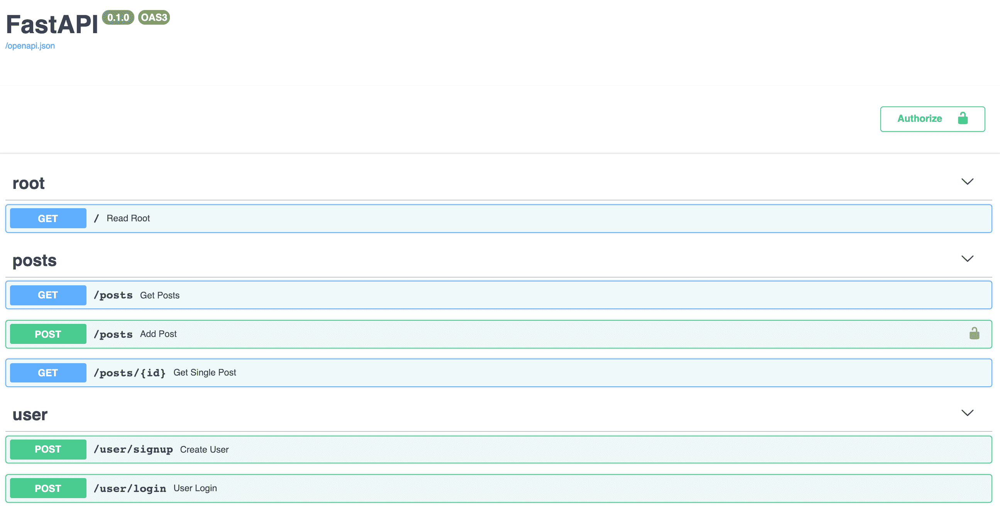
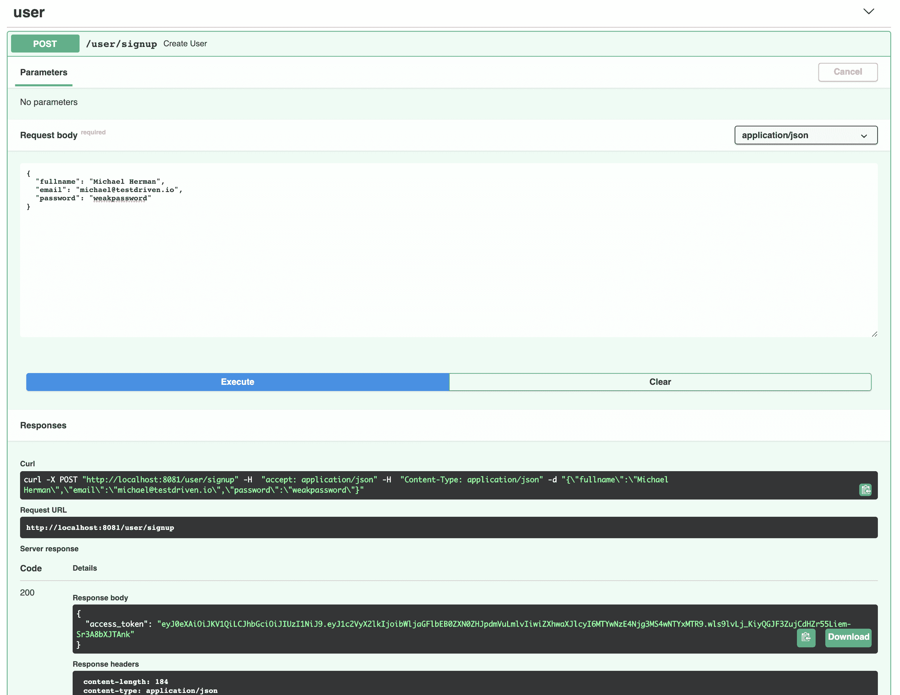
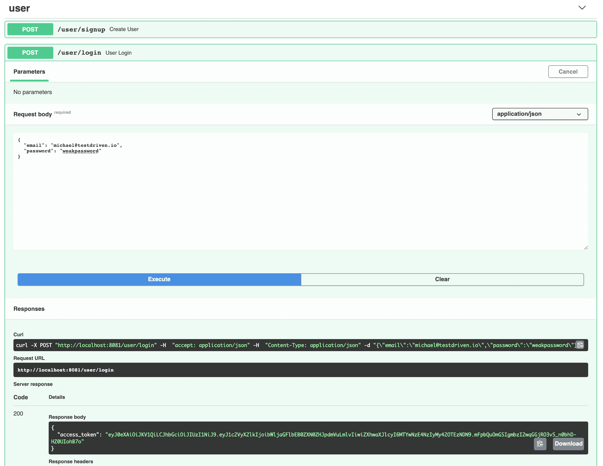
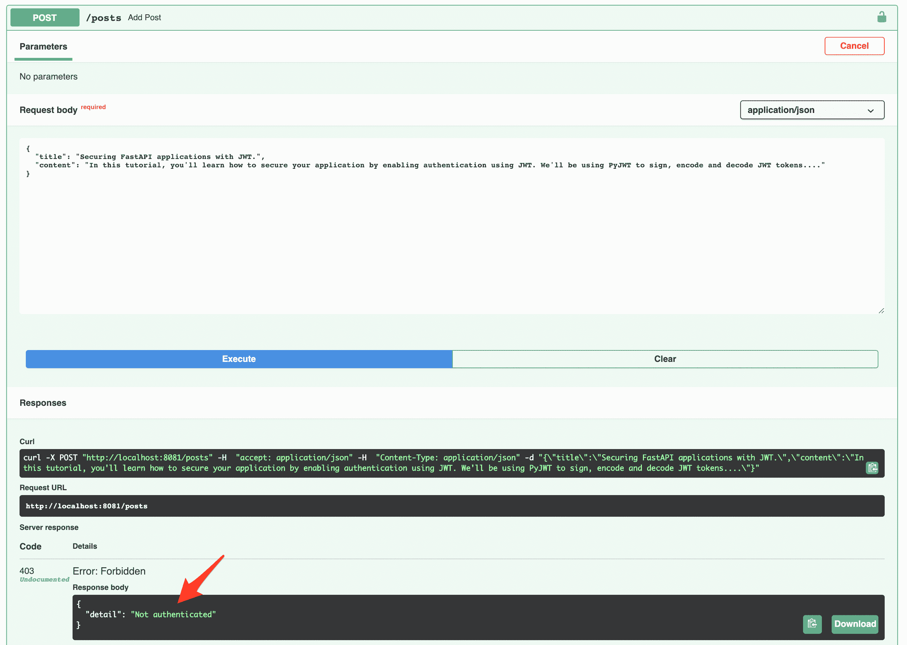
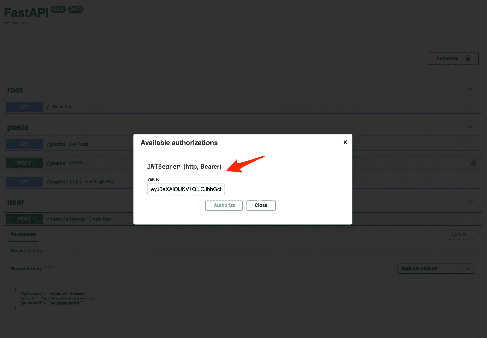

# 通过基于 JWT 令牌的身份验证保护 FastAPI

> 原文：<https://testdriven.io/blog/fastapi-jwt-auth/>

在本教程中，您将了解如何通过使用 JSON Web 令牌(jwt)启用身份验证来保护 [FastAPI](https://fastapi.tiangolo.com/) 应用程序。我们将使用 [PyJWT](https://pyjwt.readthedocs.io/) 对 JWT 令牌进行签名、编码和解码。

## FastAPI 中的身份验证

身份验证是在授予用户访问安全资源的权限之前对用户进行验证的过程。当用户被认证时，用户被允许访问不对公众开放的安全资源。

我们将研究如何使用[不记名](https://swagger.io/docs/specification/authentication/bearer-authentication/)(或基于令牌)认证来认证 FastAPI 应用程序，这涉及到生成称为不记名令牌的安全令牌。在这种情况下，承载令牌将是 jwt。

> [FastAPI](https://fastapi.tiangolo.com/tutorial/security/)中的认证也可以由 OAuth 处理。

## 初始设置

首先创建一个新文件夹来保存名为“fastapi-jwt”的项目:

```py
`$ mkdir fastapi-jwt && cd fastapi-jwt` 
```

接下来，创建并激活虚拟环境:

```py
`$ python3.11 -m venv venv
$ source venv/bin/activate

(venv)$ export PYTHONPATH=$PWD` 
```

> 你可以随意把 virtualenv 和 Pip 换成诗歌[或](https://python-poetry.org) [Pipenv](https://github.com/pypa/pipenv) 。更多信息，请查看[现代 Python 环境](/blog/python-environments/)。

安装 FastAPI 和[uvicon](https://www.uvicorn.org/):

```py
`(venv)$ pip install fastapi==0.89.1 uvicorn==0.20.0` 
```

接下来，创建以下文件和文件夹:

```py
`fastapi-jwt
├── app
│   ├── __init__.py
│   ├── api.py
│   ├── auth
│   │   └── __init__.py
│   └── model.py
└── main.py` 
```

> 以下命令将创建项目结构:
> 
> ```py
> `(venv)$ mkdir app && \
>         mkdir app/auth && \
>         touch app/__init__.py app/api.py && \
>         touch app/auth/__init__.py app/model.py main.py` 
> ```

在 *main.py* 文件中，定义运行应用程序的入口点:

```py
`# main.py

import uvicorn

if __name__ == "__main__":
    uvicorn.run("app.api:app", host="0.0.0.0", port=8081, reload=True)` 
```

这里，我们指示文件在端口 8081 上运行 Uvicorn 服务器，并在每次文件更改时重新加载。

在通过入口点文件启动服务器之前，在 *app/api.py* 中创建一个基本路径:

```py
`# app/api.py

from fastapi import FastAPI

app = FastAPI()

@app.get("/", tags=["root"])
async def read_root() -> dict:
    return {"message": "Welcome to your blog!"}` 
```

从终端运行入口点文件:

在浏览器中导航至 [http://localhost:8081](http://localhost:8081) 。您应该看到:

```py
`{ "message":  "Welcome to your blog!" }` 
```

## 我们在建造什么？

在本教程的剩余部分，您将构建一个安全的微型博客 CRUD 应用程序来创建和阅读博客文章。最后，您将拥有:



## 模型

在我们继续之前，让我们为帖子定义一个 pydantic [模型](https://pydantic-docs.helpmanual.io/usage/models/)。

在 *model.py* 中，添加:

```py
`# app/model.py

from pydantic import BaseModel, Field, EmailStr

class PostSchema(BaseModel):
    id: int = Field(default=None)
    title: str = Field(...)
    content: str = Field(...)

    class Config:
        schema_extra = {
            "example": {
                "title": "Securing FastAPI applications with JWT.",
                "content": "In this tutorial, you'll learn how to secure your application by enabling authentication using JWT. We'll be using PyJWT to sign, encode and decode JWT tokens...."
            }
        }` 
```

## 路线

### 获取路线

首先导入`PostSchema`，然后在 *app/api.py* 中添加一个虚拟帖子列表和一个空用户列表变量:

```py
`# app/api.py

from app.model import PostSchema

posts = [
    {
        "id": 1,
        "title": "Pancake",
        "content": "Lorem Ipsum ..."
    }
]

users = []` 
```

然后，添加路由处理程序，通过 ID 获取所有帖子和单个帖子:

```py
`# app/api.py

@app.get("/posts", tags=["posts"])
async def get_posts() -> dict:
    return { "data": posts }

@app.get("/posts/{id}", tags=["posts"])
async def get_single_post(id: int) -> dict:
    if id > len(posts):
        return {
            "error": "No such post with the supplied ID."
        }

    for post in posts:
        if post["id"] == id:
            return {
                "data": post
            }` 
```

*app/api.py* 现在应该是这样的:

```py
`# app/api.py

from fastapi import FastAPI

from app.model import PostSchema

posts = [
    {
        "id": 1,
        "title": "Pancake",
        "content": "Lorem Ipsum ..."
    }
]

users = []

app = FastAPI()

@app.get("/", tags=["root"])
async def read_root() -> dict:
    return {"message": "Welcome to your blog!"}

@app.get("/posts", tags=["posts"])
async def get_posts() -> dict:
    return { "data": posts }

@app.get("/posts/{id}", tags=["posts"])
async def get_single_post(id: int) -> dict:
    if id > len(posts):
        return {
            "error": "No such post with the supplied ID."
        }

    for post in posts:
        if post["id"] == id:
            return {
                "data": post
            }` 
```

手动测试[http://localhost:8081/posts](http://localhost:8081/posts)和[http://localhost:8081/posts/1](http://localhost:8081/posts/1)的路由

### 邮寄路线

在 GET routes 的正下方，添加以下用于创建新帖子的处理程序:

```py
`# app/api.py

@app.post("/posts", tags=["posts"])
async def add_post(post: PostSchema) -> dict:
    post.id = len(posts) + 1
    posts.append(post.dict())
    return {
        "data": "post added."
    }` 
```

在后端运行的情况下，通过位于[http://localhost:8081/docs](http://localhost:8081/docs)的交互文档测试 POST 路径。

您也可以使用 curl 进行测试:

```py
`$ curl -X POST http://localhost:8081/posts \
    -d  '{ "id": 2, "title": "Lorem Ipsum tres", "content": "content goes here"}' \
    -H 'Content-Type: application/json'` 
```

您应该看到:

```py
`{ "data":  [ "post added." ] }` 
```

## JWT 认证

在这一节中，我们将创建一个 JWT 令牌处理程序和一个处理无记名令牌的类。

开始之前，安装 [PyJWT](https://pyjwt.readthedocs.io/) ，用于编码和解码 JWT。我们还将使用和 [python 解耦](https://github.com/henriquebastos/python-decouple/)来读取环境变量:

```py
`(venv)$ pip install PyJWT==2.6.0 python-decouple==3.7` 
```

### JWT·汉德勒

JWT 处理程序将负责签名、编码、解码和返回 JWT 令牌。在“auth”文件夹中，创建一个名为 *auth_handler.py* 的文件:

```py
`# app/auth/auth_handler.py

import time
from typing import Dict

import jwt
from decouple import config

JWT_SECRET = config("secret")
JWT_ALGORITHM = config("algorithm")

def token_response(token: str):
    return {
        "access_token": token
    }` 
```

在上面的代码块中，我们导入了`time`、`typing`、`jwt`和`decouple`模块。`time`模块负责设置令牌的到期时间。每个 JWT 都有失效日期和/或失效时间。`jwt`模块负责对生成的令牌串进行编码和解码。最后，`token_response`函数是一个助手函数，用于返回生成的令牌。

> JSON Web 令牌被编码成来自[字典负载](https://jwt.io/introduction)的字符串。

### JWT 秘密和算法

接下来，创建一个名为*的环境文件。基本目录中的 env* :

```py
`secret=please_please_update_me_please
algorithm=HS256` 
```

环境文件中的秘密应该替换为更强的内容，并且不应该被泄露。例如:

```py
`>>> import os
>>> import binascii
>>> binascii.hexlify(os.urandom(24))
b'deff1952d59f883ece260e8683fed21ab0ad9a53323eca4f'` 
```

秘密密钥用于编码和解码 JWT 字符串。

另一方面，算法值是编码过程中使用的算法类型。

### 签署和解码 JWT

回到 *auth_handler.py* ，添加 JWT 字符串签名函数:

```py
`# app/auth/auth_handler.py

def signJWT(user_id: str) -> Dict[str, str]:
    payload = {
        "user_id": user_id,
        "expires": time.time() + 600
    }
    token = jwt.encode(payload, JWT_SECRET, algorithm=JWT_ALGORITHM)

    return token_response(token)` 
```

在`signJWT`函数中，我们定义了有效载荷、一个包含传递给函数的`user_id`的字典，以及一个从生成之时起十分钟的到期时间。接下来，我们创建了一个由有效负载、秘密和算法类型组成的令牌字符串，然后返回它。

接下来，添加`decodeJWT`功能:

```py
`# app/auth/auth_handler.py

def decodeJWT(token: str) -> dict:
    try:
        decoded_token = jwt.decode(token, JWT_SECRET, algorithms=[JWT_ALGORITHM])
        return decoded_token if decoded_token["expires"] >= time.time() else None
    except:
        return {}` 
```

`decodeJWT`函数获取令牌并在`jwt`模块的帮助下对其进行解码，然后将其存储在`decoded_token`变量中。接下来，如果到期时间有效，我们返回`decoded_token`，否则，我们返回`None`。

> JWT 没有加密。它是基于 64 位编码和签名的。因此任何人都可以解码令牌并使用其数据。但是只有服务器可以使用`JWT_SECRET`来验证它的真实性。

## 用户注册和登录

接下来，让我们为处理用户注册和登录连接路由、模式和助手。

在 *model.py* 中，添加用户模式:

```py
`# app/model.py

class UserSchema(BaseModel):
    fullname: str = Field(...)
    email: EmailStr = Field(...)
    password: str = Field(...)

    class Config:
        schema_extra = {
            "example": {
                "fullname": "Abdulazeez Abdulazeez Adeshina",
                "email": "[[email protected]](/cdn-cgi/l/email-protection)",
                "password": "weakpassword"
            }
        }

class UserLoginSchema(BaseModel):
    email: EmailStr = Field(...)
    password: str = Field(...)

    class Config:
        schema_extra = {
            "example": {
                "email": "[[email protected]](/cdn-cgi/l/email-protection)",
                "password": "weakpassword"
            }
        }` 
```

接下来，更新 *app/api.py* 中的导入:

```py
`# app/api.py

from fastapi import FastAPI, Body

from app.model import PostSchema, UserSchema, UserLoginSchema
from app.auth.auth_handler import signJWT` 
```

添加用户注册路径:

```py
`# app/api.py

@app.post("/user/signup", tags=["user"])
async def create_user(user: UserSchema = Body(...)):
    users.append(user) # replace with db call, making sure to hash the password first
    return signJWT(user.email)` 
```

因为我们使用的是[电子邮件验证器](https://pydantic-docs.helpmanual.io/usage/types/#pydantic-types)、`EmailStr`，安装[电子邮件验证器](https://github.com/JoshData/python-email-validator):

```py
`(venv)$ pip install "pydantic[email]"` 
```

运行服务器:

通过位于[http://localhost:8081/docs](http://localhost:8081/docs)的交互文档对其进行测试。



> 在生产环境中，在将用户保存到数据库之前，确保使用 [bcrypt](https://github.com/pyca/bcrypt/) 或 [passlib](https://passlib.readthedocs.io/) 散列您的密码。

接下来，定义一个助手函数来检查用户是否存在:

```py
`# app/api.py

def check_user(data: UserLoginSchema):
    for user in users:
        if user.email == data.email and user.password == data.password:
            return True
    return False` 
```

在使用用户的电子邮件创建 JWT 之前，上面的函数会检查用户是否存在。

接下来，定义登录路径:

```py
`# app/api.py

@app.post("/user/login", tags=["user"])
async def user_login(user: UserLoginSchema = Body(...)):
    if check_user(user):
        return signJWT(user.email)
    return {
        "error": "Wrong login details!"
    }` 
```

通过首先创建一个用户，然后登录来测试登录路径:



> 因为用户存储在内存中，所以每次应用程序重新加载以测试登录时，您都必须创建一个新用户。

## 保护路线

身份验证就绪后，让我们来保护创建路由。

### JWT 持票人

现在我们需要通过检查请求是否被授权来验证受保护的路由。这是通过扫描`Authorization`报头中的 JWT 请求来完成的。FastAPI 通过`HTTPBearer`类提供基本的验证。我们可以使用这个类来提取和解析令牌。然后，我们将使用 *app/auth/auth_handler.py* 中定义的`decodeJWT`函数来验证它。

在“auth”文件夹中创建一个名为 *auth_bearer.py* 的新文件:

```py
`# app/auth/auth_bearer.py

from fastapi import Request, HTTPException
from fastapi.security import HTTPBearer, HTTPAuthorizationCredentials

from .auth_handler import decodeJWT

class JWTBearer(HTTPBearer):
    def __init__(self, auto_error: bool = True):
        super(JWTBearer, self).__init__(auto_error=auto_error)

    async def __call__(self, request: Request):
        credentials: HTTPAuthorizationCredentials = await super(JWTBearer, self).__call__(request)
        if credentials:
            if not credentials.scheme == "Bearer":
                raise HTTPException(status_code=403, detail="Invalid authentication scheme.")
            if not self.verify_jwt(credentials.credentials):
                raise HTTPException(status_code=403, detail="Invalid token or expired token.")
            return credentials.credentials
        else:
            raise HTTPException(status_code=403, detail="Invalid authorization code.")

    def verify_jwt(self, jwtoken: str) -> bool:
        isTokenValid: bool = False

        try:
            payload = decodeJWT(jwtoken)
        except:
            payload = None
        if payload:
            isTokenValid = True
        return isTokenValid` 
```

因此，`JWTBearer`类是 FastAPI 的 [HTTPBearer](https://github.com/tiangolo/fastapi/blob/0.89.1/fastapi/security/http.py#L100) 类的一个子类，它将用于在我们的路由上保持身份验证。

#### 初始化

在`__init__`方法中，我们通过将布尔值 [auto_error](https://github.com/tiangolo/fastapi/blob/0.89.1/fastapi/security/http.py#L107) 设置为`True`来启用自动错误报告。

#### 打电话

在`__call__`方法中，我们定义了一个名为`credentials`的变量，类型为[HTTPAuthorizationCredentials](https://github.com/tiangolo/fastapi/blob/0.89.1/fastapi/security/http.py#L20)，它是在调用`JWTBearer`类时创建的。然后，我们继续检查在调用该类的过程中传递的凭证是否有效:

1.  如果凭据方案不是承载方案，我们会引发无效令牌方案的异常。
2.  如果传递了不记名令牌，我们验证 JWT 是有效的。
3.  如果没有收到凭证，我们会引发无效授权错误。

#### 核实

`verify_jwt`方法验证令牌是否有效。该方法获取一个`jwtoken`字符串，然后将其传递给`decodeJWT`函数，并基于`decodeJWT`的结果返回一个布尔值。

### 依赖注入

为了保护路由，我们将通过 FastAPI 的 [Depends](https://fastapi.tiangolo.com/tutorial/dependencies/?h=+depends#import-depends) 来利用依赖注入。

首先通过添加`JWTBearer`类和`Depends`来更新导入:

```py
`# app/api.py

from fastapi import FastAPI, Body, Depends

from app.model import PostSchema, UserSchema, UserLoginSchema
from app.auth.auth_bearer import JWTBearer
from app.auth.auth_handler import signJWT` 
```

在`add_post`路线中，将`dependencies`参数添加到`@app`属性中，如下所示:

```py
`# app/api.py

@app.post("/posts", dependencies=[Depends(JWTBearer())], tags=["posts"])
async def add_post(post: PostSchema) -> dict:
    post.id = len(posts) + 1
    posts.append(post.dict())
    return {
        "data": "post added."
    }` 
```

刷新交互式文档页面:


通过尝试在不传入令牌的情况下访问受保护的路由来测试身份验证:



创建新用户并复制生成的访问令牌:


复制后，单击右上角的授权按钮并粘贴令牌:



现在，您应该能够使用受保护的路线了:


## 结论

本教程讲述了使用 JSON Web 令牌保护 FastAPI 应用程序的过程。您可以在 [fastapi-jwt](https://github.com/testdrivenio/fastapi-jwt) 存储库中找到源代码。感谢阅读。

寻找一些挑战？

1.  在使用 [bcrypt](https://github.com/pyca/bcrypt/) 或 [passlib](https://passlib.readthedocs.io/) 保存密码之前，对密码进行哈希处理。
2.  将用户和帖子从临时存储转移到 MongoDB 或 Postgres 之类的数据库。您可以按照[使用 FastAPI 和 MongoDB](https://testdriven.io/blog/fastapi-mongo/) 构建 CRUD 应用程序中的步骤来设置 MongoDB 数据库并部署到 Heroku。
3.  添加刷新令牌，以便在新 jwt 过期时自动颁发它们。不知道从哪里开始？看看《烧瓶》的作者 JWT 对此的解释。
4.  添加更新和删除帖子的路线。