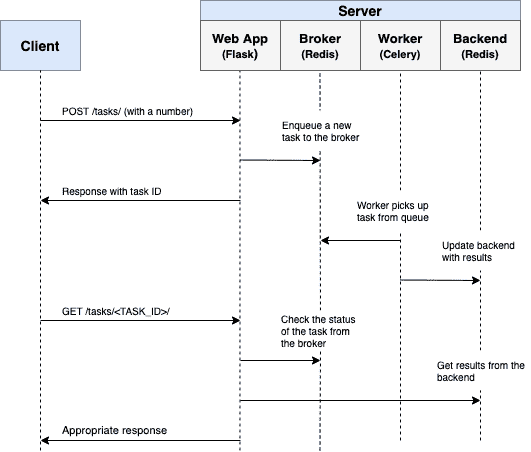
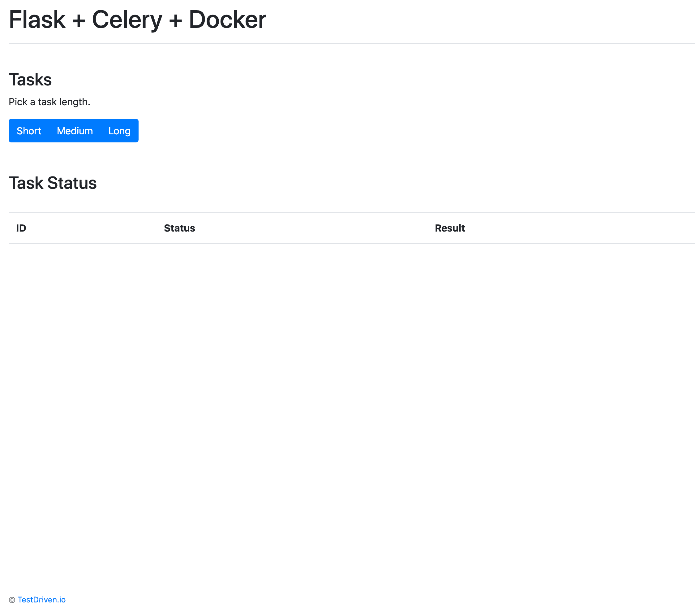
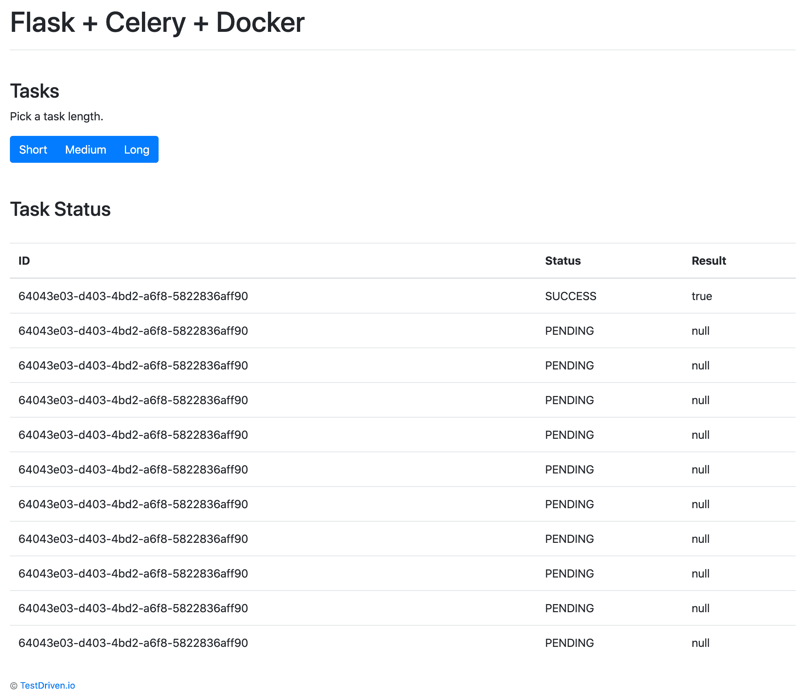

# 烧瓶和芹菜的异步任务

> 原文：<https://testdriven.io/blog/flask-and-celery/>

如果长时间运行的流程是应用程序工作流的一部分，而不是阻塞响应，您应该在后台处理它，在正常的请求/响应流之外。

也许您的 web 应用程序要求用户在注册时提交一个缩略图(可能需要重新调整大小)并确认他们的电子邮件。如果您的应用程序处理图像并直接在请求处理程序中发送确认电子邮件，那么最终用户将不得不在页面加载或更新之前不必要地等待它们完成处理。相反，您会希望将这些进程传递给任务队列，让一个独立的工作进程来处理它，这样您就可以立即将响应发送回客户端。在处理过程中，最终用户可以在客户端做其他事情。您的应用程序也可以自由响应其他用户和客户的请求。

为了实现这一点，我们将带您完成设置和配置 [Celery](https://docs.celeryq.dev/en/stable/) 和 Redis 的过程，以便在 Flask 应用程序中处理长时间运行的流程。我们还将使用 Docker 和 Docker Compose 将所有内容联系在一起。最后，我们将看看如何用单元测试和集成测试来测试 Celery 任务。

> Redis 队列也是一个可行的解决方案。查看带有 Flask 和 Redis 队列的[异步任务了解更多信息。](/blog/asynchronous-tasks-with-flask-and-redis-queue/)

## 目标

本教程结束时，您将能够:

1.  将芹菜集成到 Flask 应用程序中，并创建任务。
2.  用容器装烧瓶，芹菜，和 Redis 与 Docker。
3.  使用单独的工作进程在后台运行进程。
4.  将芹菜日志保存到文件中。
5.  设置 [Flower](https://flower.readthedocs.io/en/latest/) 来监控和管理芹菜作业和工人。
6.  用单元测试和集成测试来测试芹菜任务。

## 后台任务

同样，为了改善用户体验，长时间运行的流程应该在正常的 HTTP 请求/响应流程之外，在后台进程中运行。

示例:

1.  运行机器学习模型
2.  发送确认电子邮件
3.  刮擦和爬行
4.  分析数据
5.  处理图像
6.  生成报告

当你构建一个应用程序时，试着区分应该在请求/响应生命周期中运行的任务(比如 CRUD 操作)和应该在后台运行的任务。

## 工作流程

我们的目标是开发一个 Flask 应用程序，它与 Celery 一起处理正常请求/响应周期之外的长时间运行的流程。

1.  最终用户通过向服务器端发送 POST 请求开始一项新任务。
2.  在路由处理程序中，一个任务被添加到队列中，任务 ID 被发送回客户端。
3.  使用 AJAX，当任务本身在后台运行时，客户机继续轮询服务器以检查任务的状态。



## 项目设置

从[烧瓶-芹菜](https://github.com/testdrivenio/flask-celery) repo 中克隆出基础项目，然后将 [v1](https://github.com/testdrivenio/flask-celery/tree/v1) 标签签出到主分支:

```py
`$ git clone https://github.com/testdrivenio/flask-celery --branch v1 --single-branch
$ cd flask-celery
$ git checkout v1 -b master` 
```

由于我们总共需要管理三个进程(Flask、Redis、Celery worker)，我们将使用 Docker 来简化我们的工作流，方法是将它们连接起来，以便它们都可以通过一个命令从一个终端窗口运行。

从项目根目录，创建映像并启动 Docker 容器:

```py
`$ docker-compose up -d --build` 
```

构建完成后，导航到 [http://localhost:5004](http://localhost:5004) :



确保测试也通过:

```py
`$ docker-compose exec web python -m pytest

================================== test session starts ===================================
platform linux -- Python 3.10.2, pytest-7.0.1, pluggy-1.0.0
rootdir: /usr/src/app
collected 1 item

project/tests/test_tasks.py .                                                       [100%]

=================================== 1 passed in 0.34s ====================================` 
```

在继续之前，快速浏览一下项目结构:

```py
`├── .gitignore
├── Dockerfile
├── LICENSE
├── README.md
├── docker-compose.yml
├── manage.py
├── project
│   ├── __init__.py
│   ├── client
│   │   ├── static
│   │   │   ├── main.css
│   │   │   └── main.js
│   │   └── templates
│   │       ├── _base.html
│   │       ├── footer.html
│   │       └── main
│   │           └── home.html
│   ├── server
│   │   ├── __init__.py
│   │   ├── config.py
│   │   └── main
│   │       ├── __init__.py
│   │       └── views.py
│   └── tests
│       ├── __init__.py
│       ├── conftest.py
│       └── test_tasks.py
└── requirements.txt` 
```

> 想学习如何构建这个项目吗？查看带有 Postgres、Gunicorn 和 Nginx 文章的[dockering 烧瓶。](/blog/dockerizing-flask-with-postgres-gunicorn-and-nginx/)

## 触发任务

在*project/client/templates/main/home . html*中设置了一个`onclick`事件处理程序来监听按钮点击:

```py
`<div class="btn-group" role="group" aria-label="Basic example">
  <button type="button" class="btn btn-primary" onclick="handleClick(1)">Short</button>
  <button type="button" class="btn btn-primary" onclick="handleClick(2)">Medium</button>
  <button type="button" class="btn btn-primary" onclick="handleClick(3)">Long</button>
</div>` 
```

`onclick`调用*project/client/static/main . js*中的`handleClick`，它向服务器发送一个 AJAX POST 请求，并带有适当的任务类型:`1`、`2`或`3`。

```py
`function  handleClick(type)  { fetch('/tasks',  { method:  'POST', headers:  { 'Content-Type':  'application/json' }, body:  JSON.stringify({  type:  type  }), }) .then(response  =>  response.json()) .then(data  =>  getStatus(data.task_id)); }` 
```

在服务器端，已经在*project/server/main/views . py*中配置了一个路由来处理请求:

```py
`@main_blueprint.route("/tasks", methods=["POST"])
def run_task():
    content = request.json
    task_type = content["type"]
    return jsonify(task_type), 202` 
```

现在有趣的部分来了——给芹菜布线！

## 芹菜装置

首先将 Celery 和 Redis 添加到 *requirements.txt* 文件中:

```py
`celery==5.2.3
Flask==2.0.3
Flask-WTF==1.0.0
pytest==7.0.1
redis==4.1.4` 
```

Celery 使用消息[代理](https://docs.celeryq.dev/en/stable/getting-started/backends-and-brokers/index.html) - [RabbitMQ](https://www.rabbitmq.com/) 、 [Redis](https://redis.io/) 或 [AWS 简单队列服务(SQS)](https://aws.amazon.com/sqs/) -来促进 Celery worker 和 web 应用程序之间的通信。消息被添加到代理中，然后由工作人员进行处理。一旦完成，结果被添加到后端。

Redis 将被用作代理和后端。将 Redis 和芹菜[工人](https://docs.celeryq.dev/en/stable/userguide/workers.html)添加到 *docker-compose.yml* 文件中，如下所示:

```py
`version:  '3.8' services: web: build:  . image:  web container_name:  web ports: -  5004:5000 command:  python manage.py run -h 0.0.0.0 volumes: -  .:/usr/src/app environment: -  FLASK_DEBUG=1 -  APP_SETTINGS=project.server.config.DevelopmentConfig -  CELERY_BROKER_URL=redis://redis:6379/0 -  CELERY_RESULT_BACKEND=redis://redis:6379/0 depends_on: -  redis worker: build:  . command:  celery --app project.server.tasks.celery worker --loglevel=info volumes: -  .:/usr/src/app environment: -  FLASK_DEBUG=1 -  APP_SETTINGS=project.server.config.DevelopmentConfig -  CELERY_BROKER_URL=redis://redis:6379/0 -  CELERY_RESULT_BACKEND=redis://redis:6379/0 depends_on: -  web -  redis redis: image:  redis:6-alpine` 
```

请注意`celery --app project.server.tasks.celery worker --loglevel=info`:

1.  `celery worker`是用来开动芹菜[的工人](https://docs.celeryq.dev/en/stable/userguide/workers.html#starting-the-worker)
2.  `--app=project.server.tasks.celery`运行芹菜[应用程序](https://docs.celeryq.dev/en/stable/userguide/application.html)(我们将很快对其进行定义)
3.  `--loglevel=info`将[记录级别](https://docs.celeryq.dev/en/v4.4.7/reference/celery.bin.worker.html#cmdoption-celery-worker-l)设置为信息

接下来，在“项目/服务器”中创建一个名为 *tasks.py* 的新文件:

```py
`import os
import time

from celery import Celery

celery = Celery(__name__)
celery.conf.broker_url = os.environ.get("CELERY_BROKER_URL", "redis://localhost:6379")
celery.conf.result_backend = os.environ.get("CELERY_RESULT_BACKEND", "redis://localhost:6379")

@celery.task(name="create_task")
def create_task(task_type):
    time.sleep(int(task_type) * 10)
    return True` 
```

这里，我们创建了一个新的 Celery 实例，并使用[任务](https://docs.celeryq.dev/en/stable/reference/celery.html#celery.Celery.task)装饰器，我们定义了一个名为`create_task`的新 Celery 任务函数。

> 请记住，任务本身将由芹菜工人执行。

## 触发任务

更新路由处理程序以启动任务，并使用任务 ID 进行响应:

```py
`@main_blueprint.route("/tasks", methods=["POST"])
def run_task():
    content = request.json
    task_type = content["type"]
    task = create_task.delay(int(task_type))
    return jsonify({"task_id": task.id}), 202` 
```

不要忘记导入任务:

```py
`from project.server.tasks import create_task` 
```

构建映像并旋转新容器:

```py
`$ docker-compose up -d --build` 
```

要触发新任务，请运行:

```py
`$ curl http://localhost:5004/tasks -H "Content-Type: application/json" --data '{"type": 0}'` 
```

您应该会看到类似这样的内容:

```py
`{
  "task_id": "14049663-6257-4a1f-81e5-563c714e90af"
}` 
```

## 任务状态

回到客户端的`handleClick`功能:

```py
`function  handleClick(type)  { fetch('/tasks',  { method:  'POST', headers:  { 'Content-Type':  'application/json' }, body:  JSON.stringify({  type:  type  }), }) .then(response  =>  response.json()) .then(data  =>  getStatus(data.task_id)); }` 
```

当响应从最初的 AJAX 请求返回时，我们继续每秒调用带有任务 ID 的`getStatus()`:

```py
`function  getStatus(taskID)  { fetch(`/tasks/${taskID}`,  { method:  'GET', headers:  { 'Content-Type':  'application/json' }, }) .then(response  =>  response.json()) .then(res  =>  { const  html  =  `
 <tr>
 <td>${taskID}</td>
 <td>${res.task_status}</td>
 <td>${res.task_result}</td>
 </tr>`; const  newRow  =  document.getElementById('tasks').insertRow(0); newRow.innerHTML  =  html; const  taskStatus  =  res.task_status; if  (taskStatus  ===  'SUCCESS'  ||  taskStatus  ===  'FAILURE')  return  false; setTimeout(function()  { getStatus(res.task_id); },  1000); }) .catch(err  =>  console.log(err)); }` 
```

如果响应成功，一个新行被添加到 DOM 上的表中。

更新`get_status`路线处理器以返回状态:

```py
`@main_blueprint.route("/tasks/<task_id>", methods=["GET"])
def get_status(task_id):
    task_result = AsyncResult(task_id)
    result = {
        "task_id": task_id,
        "task_status": task_result.status,
        "task_result": task_result.result
    }
    return jsonify(result), 200` 
```

导入[异步结果](https://docs.celeryq.dev/en/stable/reference/celery.result.html):

```py
`from celery.result import AsyncResult` 
```

更新容器:

```py
`$ docker-compose up -d --build` 
```

触发新任务:

```py
`$ curl http://localhost:5004/tasks -H "Content-Type: application/json" --data '{"type": 1}'` 
```

然后，从响应中获取`task_id`并调用更新的端点来查看状态:

```py
`$ curl http://localhost:5004/tasks/f3ae36f1-58b8-4c2b-bf5b-739c80e9d7ff

{
  "task_id": "455234e0-f0ea-4a39-bbe9-e3947e248503",
  "task_result": true,
  "task_status": "SUCCESS"
}` 
```

也在浏览器中测试一下:



## 芹菜原木

更新 *docker-compose.yml* 中的`worker`服务，以便将芹菜日志转储到一个日志文件:

```py
`worker: build:  . command:  celery --app project.server.tasks.celery worker --loglevel=info --logfile=project/logs/celery.log volumes: -  .:/usr/src/app environment: -  FLASK_DEBUG=1 -  APP_SETTINGS=project.server.config.DevelopmentConfig -  CELERY_BROKER_URL=redis://redis:6379/0 -  CELERY_RESULT_BACKEND=redis://redis:6379/0 depends_on: -  web -  redis` 
```

向“项目”添加一个名为“日志”的新目录。然后，将名为 *celery.log* 的新文件添加到新创建的目录中。

更新:

```py
`$ docker-compose up -d --build` 
```

由于我们设置了一个卷，您应该看到日志文件在本地被填满:

```py
`[2022-02-16 21:01:09,961: INFO/MainProcess]  Connected  to  redis://redis:6379/0 [2022-02-16 21:01:09,965: INFO/MainProcess]  mingle:  searching  for  neighbors [2022-02-16 21:01:10,977: INFO/MainProcess]  mingle:  all  alone [2022-02-16 21:01:10,994: INFO/MainProcess]  celery@f9921f0e0b83  ready. [2022-02-16 21:01:23,349: INFO/MainProcess] Task  create_task[ceb6cffc-e426-4970-a5df-5a1fac4478cc]  received [2022-02-16 21:01:33,378: INFO/ForkPoolWorker-7] Task  create_task[ceb6cffc-e426-4970-a5df-5a1fac4478cc] succeeded  in  10.025073800003156s:  True` 
```

## 花卉仪表板

[Flower](https://flower.readthedocs.io/en/latest/) 是一个轻量级的、实时的、基于网络的芹菜监控工具。您可以监控当前正在运行的任务，增加或减少工作池，查看图表和一些统计数据，等等。

添加到 *requirements.txt* :

```py
`celery==5.2.3
Flask==2.0.3
Flask-WTF==1.0.0
flower==1.0.0
pytest==7.0.1
redis==4.1.4` 
```

然后，向 *docker-compose.yml* 添加一个新服务:

```py
`dashboard: build:  . command:  celery --app project.server.tasks.celery flower --port=5555 --broker=redis://redis:6379/0 ports: -  5556:5555 environment: -  FLASK_DEBUG=1 -  APP_SETTINGS=project.server.config.DevelopmentConfig -  CELERY_BROKER_URL=redis://redis:6379/0 -  CELERY_RESULT_BACKEND=redis://redis:6379/0 depends_on: -  web -  redis -  worker` 
```

测试一下:

```py
`$ docker-compose up -d --build` 
```

导航到 [http://localhost:5556](http://localhost:5556) 查看仪表板。您应该看到一名员工准备就绪:


开始几项任务来全面测试仪表板:


试着增加几个工人，看看会有什么影响:

```py
`$ docker-compose up -d --build --scale worker=3` 
```

## 试验

让我们从最基本的测试开始:

```py
`def test_task():
    assert create_task.run(1)
    assert create_task.run(2)
    assert create_task.run(3)` 
```

将上述测试用例添加到*project/tests/test _ tasks . py*中，然后添加以下导入:

```py
`from project.server.tasks import create_task` 
```

单独运行测试:

```py
`$ docker-compose exec web python -m pytest -k "test_task and not test_home"` 
```

运行应该需要大约一分钟:

```py
`================================== test session starts ===================================
platform linux -- Python 3.10.2, pytest-7.0.1, pluggy-1.0.0
rootdir: /usr/src/app
collected 2 items / 1 deselected / 1 selected

project/tests/test_tasks.py .                                                       [100%]

====================== 1 passed, 1 deselected in 60.28s (0:01:00) ========================` 
```

值得注意的是，在上面的断言中，我们使用了`.run`方法(而不是`.delay`)来直接运行任务，而没有芹菜工人。

想要模仿`.run`方法来加快速度吗？

```py
`@patch("project.server.tasks.create_task.run")
def test_mock_task(mock_run):
    assert create_task.run(1)
    create_task.run.assert_called_once_with(1)

    assert create_task.run(2)
    assert create_task.run.call_count == 2

    assert create_task.run(3)
    assert create_task.run.call_count == 3` 
```

导入:

```py
`from unittest.mock import patch, call` 
```

测试:

```py
`$ docker-compose exec web python -m pytest -k "test_mock_task"

================================== test session starts ===================================
platform linux -- Python 3.10.2, pytest-7.0.1, pluggy-1.0.0
rootdir: /usr/src/app
collected 3 items / 2 deselected / 1 selected

project/tests/test_tasks.py .                                                       [100%]

============================ 1 passed, 2 deselected in 0.37s =============================` 
```

快多了！

全面整合测试怎么样？

```py
`def test_task_status(test_app):
    client = test_app.test_client()

    resp = client.post(
        "/tasks",
        data=json.dumps({"type": 0}),
        content_type='application/json'
    )
    content = json.loads(resp.data.decode())
    task_id = content["task_id"]
    assert resp.status_code == 202
    assert task_id

    resp = client.get(f"tasks/{task_id}")
    content = json.loads(resp.data.decode())
    assert content == {"task_id": task_id, "task_status": "PENDING", "task_result": None}
    assert resp.status_code == 200

    while content["task_status"] == "PENDING":
        resp = client.get(f"tasks/{task_id}")
        content = json.loads(resp.data.decode())
    assert content == {"task_id": task_id, "task_status": "SUCCESS", "task_result": True}` 
```

请记住，这个测试使用开发中使用的相同的代理和后端。您可能想要实例化一个新的 Celery 应用程序来进行测试。

添加导入:

确保测试通过。

## 结论

这是关于如何配置 Celery 在 Flask 应用程序中运行长时间运行的任务的基本指南。您应该让队列处理任何可能阻塞或减慢面向用户的代码的进程。

Celery 还可以用于执行可重复的任务，分解复杂的资源密集型任务，以便将计算工作量分布到多个机器上，从而减少(1)完成时间和(2)处理客户端请求的机器上的负载。

最后，如果你想知道如何使用 WebSockets 来检查芹菜任务的状态，而不是使用 AJAX 轮询，请查看[芹菜和烧瓶的权威指南](/courses/flask-celery/)课程。

从[回购](https://github.com/testdrivenio/flask-celery)中抓取代码。