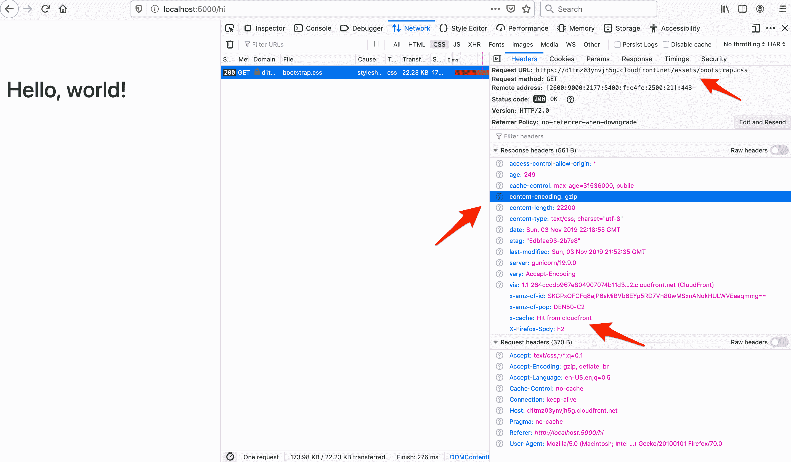
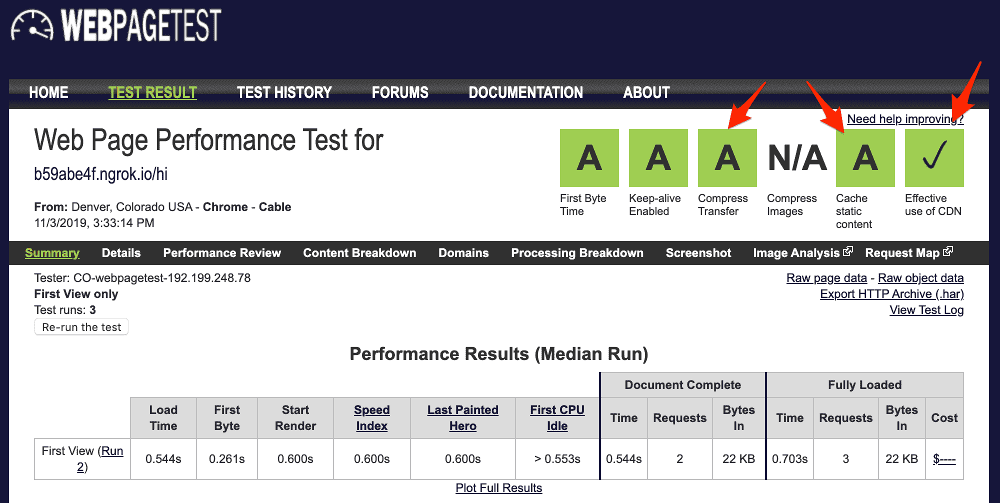

# 使用 WhiteNoise 和 Amazon CloudFront 从 Flask 提供静态文件

> 原文：<https://testdriven.io/blog/flask-static-files-whitenoise-cloudfront/>

由于它使您的 Flask 应用程序能够提供自己的静态文件，因此极大地简化了静态文件管理。将它与像 [CloudFront](https://aws.amazon.com/cloudfront/) 或 [Cloudflare](https://www.cloudflare.com/) 这样的 CDN 结合起来，这是一个方便的解决方案——即简单性和性能之间的良好平衡——用于在像 [Heroku](https://heroku.com/) 或 [PythonAnywhere](https://www.pythonanywhere.com/) 这样的平台即服务(PaaS)上处理静态文件。

本教程详细介绍了如何用 Flask 和 WhiteNoise 管理静态文件。我们还将配置 Amazon CloudFront 以获得最佳性能。

> 值得注意的是，本教程不包括如何处理用户上传的媒体文件。在学习教程的过程中，您可以随意设置。参考[在亚马逊 S3 上存储 Django 静态和媒体文件](/blog/storing-django-static-and-media-files-on-amazon-s3/)教程了解更多信息。

## 白噪声

假设您设置了一个使用[应用程序工厂](https://flask.palletsprojects.com/en/2.2.x/patterns/appfactories/)功能模式的 Flask 项目，导入并配置 WhiteNoise:

```
`import os

from flask import Flask, jsonify
from whitenoise import WhiteNoise

def create_app(script_info=None):

    app = Flask(__name__, static_folder="staticfiles")

    WHITENOISE_MAX_AGE = 31536000 if not app.config["DEBUG"] else 0

    # configure WhiteNoise
    app.wsgi_app = WhiteNoise(
        app.wsgi_app,
        root=os.path.join(os.path.dirname(__file__), "staticfiles"),
        prefix="assets/",
        max_age=WHITENOISE_MAX_AGE,
    )

    @app.route("/")
    def hello_world():
        return jsonify(hello="world")

    return app` 
```

配置:

*   `root`是静态文件目录的绝对路径。
*   `prefix`是所有静态 URL 的前缀字符串。换句话说，基于上面的配置，在`http://localhost:5000/assets/main.css`会有一个 *main.css* 静态文件。
*   `max_age`是浏览器和代理应该缓存静态文件的时间长度，以秒为单位。

> 查看官方 WhiteNoise 文档中的[配置属性](http://whitenoise.evans.io/en/stable/base.html#configuration-attributes)部分，了解关于可选参数的更多信息。

在项目根目录中添加一个“静态”目录，出于测试目的，下载一份 [boostrap.css](https://stackpath.bootstrapcdn.com/bootstrap/4.5.2/css/bootstrap.css) 并将其添加到新创建的目录中。将“staticfiles”目录添加到项目根目录中。

您的项目结构现在应该看起来像这样:

```
`├── app.py
├── static
│   └── bootstrap.css
└── staticfiles` 
```

接下来，将下面的脚本——名为*compress . py*——添加到您的项目根中，该脚本压缩“static”目录中的文件，然后将它们复制到“staticfiles”目录中:

```
`import os
import gzip

INPUT_PATH = os.path.join(os.path.dirname(__file__), "static")
OUTPUT_PATH = os.path.join(os.path.dirname(__file__), "staticfiles")
SKIP_COMPRESS_EXTENSIONS = [
    # Images
    ".jpg",
    ".jpeg",
    ".png",
    ".gif",
    ".webp",
    # Compressed files
    ".zip",
    ".gz",
    ".tgz",
    ".bz2",
    ".tbz",
    ".xz",
    ".br",
    # Flash
    ".swf",
    ".flv",
    # Fonts
    ".woff",
    ".woff2",
]

def remove_files(path):
    print(f"Removing files from {path}")
    for filename in os.listdir(path):
        file_path = os.path.join(path, filename)
        try:
            if os.path.isfile(file_path):
                os.unlink(file_path)
        except Exception as e:
            print(e)

def main():
    # remove all files from "staticfiles"
    remove_files(OUTPUT_PATH)

    for dirpath, dirs, files in os.walk(INPUT_PATH):
        for filename in files:
            input_file = os.path.join(dirpath, filename)
            with open(input_file, "rb") as f:
                data = f.read()
            # compress if file extension is not part of SKIP_COMPRESS_EXTENSIONS
            name, ext = os.path.splitext(filename)
            if ext not in SKIP_COMPRESS_EXTENSIONS:
                # save compressed file to the "staticfiles" directory
                compressed_output_file = os.path.join(OUTPUT_PATH, f"{filename}.gz")
                print(f"\nCompressing {filename}")
                print(f"Saving {filename}.gz")
                output = gzip.open(compressed_output_file, "wb")
                try:
                    output.write(data)
                finally:
                    output.close()
            else:
                print(f"\nSkipping compression of {filename}")
            # save original file to the "staticfiles" directory
            output_file = os.path.join(OUTPUT_PATH, filename)
            print(f"Saving {filename}")
            with open(output_file, "wb") as f:
                f.write(data)

if __name__ == "__main__":
    main()` 
```

这个脚本:

1.  删除“staticfiles”目录中的任何现有文件
2.  遍历“静态”目录中的文件并进行压缩，然后将压缩版本与原始的未压缩版本一起保存到“静态文件”目录中

通过提供压缩和未压缩版本，当客户特别要求时，WhiteNoise 将提供压缩版本。您将很快看到一个这样的例子。

要进行测试，首先安装 WhiteNoise，如果您还没有这样做的话:

接下来，将一个伪 PNG 文件添加到“static”目录中，以确保它在压缩脚本中被跳过，然后运行该脚本:

```
`$ touch static/test.png
$ python compress.py` 
```

您应该看到:

```
`Removing files from staticfiles

Compressing bootstrap.css
Saving bootstrap.css.gz
Saving bootstrap.css

Skipping compression of test.png
Saving test.png` 
```

“staticfiles”目录现在应该被填充:

```
`├── app.py
├── compress.py
├── static
│   ├── bootstrap.css
│   └── test.png
└── staticfiles
    ├── bootstrap.css
    ├── bootstrap.css.gz
    └── test.png` 
```

要验证这是否有效，安装并运行 [Gunicorn](https://gunicorn.org/) :

```
`$ pip install gunicorn
$ gunicorn "app:create_app()" -b 127.0.0.1:5000` 
```

现在，要用 cURL 测试 WhiteNoise 的 [gzip 功能](http://whitenoise.evans.io/en/stable/base.html#compression-support)，运行:

```
`$ curl -I -H "Accept-Encoding: gzip" http://localhost:5000/assets/bootstrap.css` 
```

您应该会看到以下响应:

```
`HTTP/1.1 200 OK
Server: gunicorn
Date: Mon, 13 Feb 2023 18:21:35 GMT
Connection: close
Content-Type: text/css; charset="utf-8"
Cache-Control: max-age=31536000, public
Access-Control-Allow-Origin: *
Vary: Accept-Encoding
Last-Modified: Mon, 13 Feb 2023 18:13:44 GMT
ETag: "63ead238-305f6"
Content-Length: 25881
Content-Encoding: gzip` 
```

记下`Content-Encoding: gzip`。这表明提供了文件的 gzip 版本。

## 云锋

虽然这不是必需的，但是强烈建议使用[内容交付网络](https://en.wikipedia.org/wiki/Content_delivery_network) (CDN)，因为它将在多个地理边缘位置存储静态文件的缓存版本。然后，您的访问者将从离他们最近的位置获得您的静态内容，这将改善 web 服务器的整体响应时间。尤其是 CloudFront，它提供了许多额外的[特性](https://aws.amazon.com/cloudfront/features/)，以及针对 DDoS 攻击的保护和访问控制权限等等。

要进行设置，请登录 AWS 控制台并导航到 [CloudFront 仪表板](https://console.aws.amazon.com/cloudfront/home)。单击“创建分发”。在“Origin domain”字段中添加您的域(没有 http 或 https ),并保留其余的默认值。然后，单击“创建分发”。

> 如果您没有配置域名，请随意使用 [ngrok](https://ngrok.com/) 在本地测试这个设置。在端口 5000 上启动并运行 Gunicorn 服务器，[下载](https://ngrok.com/download)(如有必要)，然后启动 ngrok:
> 
> 一旦启动，您应该会看到一个可以与 CloudFront 一起使用的公共 URL。
> 
> 想看看这方面的演示吗？看看下面的视频。

CloudFront 完全配置您的发行版通常需要大约 15 分钟。但是，您可以在它被完全分发到所有边缘位置之前进行测试，而创建状态仍然是“进行中”。在开始测试之前，可能还需要几分钟。

要进行测试，获取与 CloudFront 发行版相关的 URL 并运行:

```
`$ curl -I -H "Accept-Encoding: gzip" https://dxquy3iqeuay6.cloudfront.net/assets/bootstrap.css` 
```

您应该会看到类似如下的内容:

```
`HTTP/2 200
content-type: text/css; charset="utf-8"
content-length: 25881
access-control-allow-origin: *
cache-control: max-age=31536000, public
content-encoding: gzip
date: Tue, 23 Feb 2021 15:39:01 GMT
etag: "6035739d-305f6"
last-modified: Tue, 23 Feb 2021 15:29:01 GMT
server: gunicorn/20.0.4
vary: Accept-Encoding
x-cache: Miss from cloudfront
via: 1.1 5f09c808a81a33267d5cc58d93ce6353.cloudfront.net (CloudFront)
x-amz-cf-pop: DFW53-C1
x-amz-cf-id: _aLbrgkskBos4G1tjMFR34__rgmmBSkxaCNGiSdMBmxauX4f4CFO1Q==` 
```

现在，您可以使用 Flask 应用程序中提供的 CloudFront 域来处理静态文件请求:

```
`import os
from urllib.parse import urljoin

from flask import Flask, jsonify, render_template
from whitenoise import WhiteNoise

def create_app(script_info=None):

    app = Flask(__name__, static_folder="staticfiles")

    WHITENOISE_MAX_AGE = 31536000 if not app.config["DEBUG"] else 0
    CDN = "https://dxquy3iqeuay6.cloudfront.net"

    app.config["STATIC_URL"] = CDN if not app.config["DEBUG"] else ""

    # configure WhiteNoise
    app.wsgi_app = WhiteNoise(
        app.wsgi_app,
        root=os.path.join(os.path.dirname(__file__), "staticfiles"),
        prefix="assets/",
        max_age=WHITENOISE_MAX_AGE,
    )

    @app.template_global()
    def static_url(prefix, filename):
        return urljoin(app.config["STATIC_URL"], f"{prefix}/{filename}")

    @app.route("/")
    def hello_world():
        return jsonify(hello="world")

    return app` 
```

在你的模板中，应该使用`static_url`而不是 [url_for](https://flask.palletsprojects.com/api/#flask.url_for) 。

## 健全性检查

让我们配置一个模板来测试一下。

添加新的处理程序:

```
`import os
from urllib.parse import urljoin

from flask import Flask, jsonify, render_template
from whitenoise import WhiteNoise

def create_app(script_info=None):

    app = Flask(__name__, static_folder="staticfiles")

    WHITENOISE_MAX_AGE = 31536000 if not app.config["DEBUG"] else 0
    CDN = "https://dxquy3iqeuay6.cloudfront.net"

    app.config["STATIC_URL"] = CDN if not app.config["DEBUG"] else ""

    # configure WhiteNoise
    app.wsgi_app = WhiteNoise(
        app.wsgi_app,
        root=os.path.join(os.path.dirname(__file__), "staticfiles"),
        prefix="assets/",
        max_age=WHITENOISE_MAX_AGE,
    )

    @app.template_global()
    def static_url(prefix, filename):
        return urljoin(app.config["STATIC_URL"], f"{prefix}/{filename}")

    @app.route("/")
    def hello_world():
        return jsonify(hello="world")

    @app.route("/hi")
    def index():
        return render_template("index.html")

    return app` 
```

在项目根目录下创建一个名为“templates”的新目录，并向该目录添加一个*index.html*文件:

```
`<!DOCTYPE html>
<html lang="en">
<head>
  <meta charset="UTF-8">
  <meta name="viewport" content="width=device-width, initial-scale=1.0">
  <meta http-equiv="X-UA-Compatible" content="ie=edge">
  <link rel="stylesheet" href="{{ static_url('assets', filename='bootstrap.css') }}">
  <title>Hello, world!</title>
</head>
<body>
  <div class="container" style="padding-top:100px">
    <h1>Hello, world!</h1>
  </div>
</body>
</html>` 
```

重启 Gunicorn 服务器，然后在 [http://localhost:5000/hi](http://localhost:5000/hi) 进行测试。

在浏览器的开发工具中

1.  *bootstrap.css* 文件应该已经从 CloudFront 加载:`https://dxquy3iqeuay6.cloudfront.net/assets/bootstrap.css`
2.  文件的 gzipped 版本应该已经送达:`content-encoding: gzip`
3.  文件也应该已经从边缘位置的缓存中提供:`x-cache: Hit from cloudfront`



尝试运行一个 [WebPageTest](https://www.webpagetest.org/) 来确保静态文件被正确压缩和缓存:



演示视频:

[https://www.youtube.com/embed/vD-VMMhnqkI](https://www.youtube.com/embed/vD-VMMhnqkI)

VIDEO