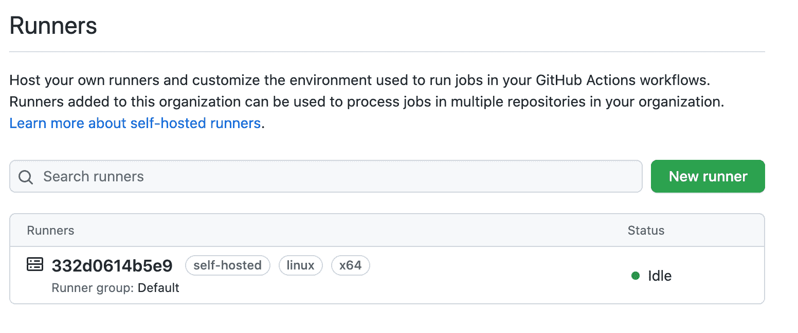
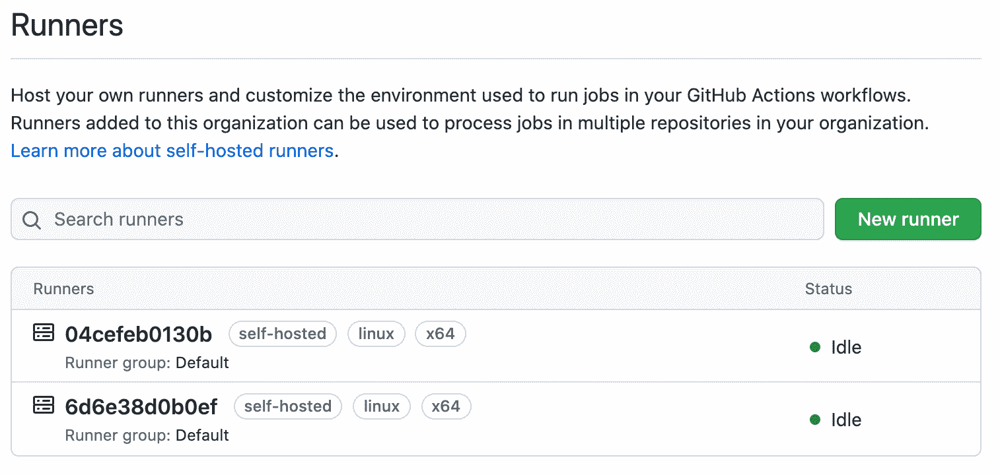
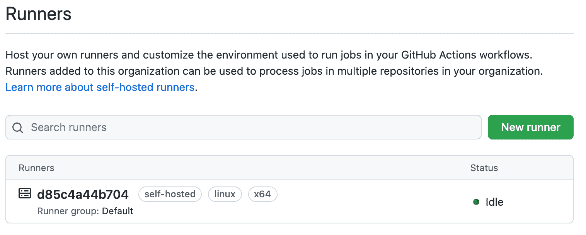
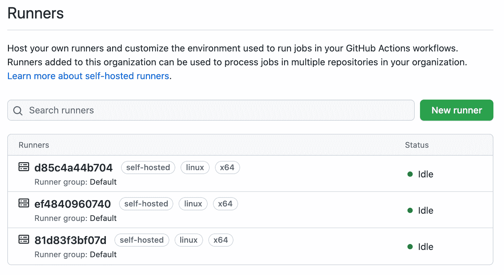
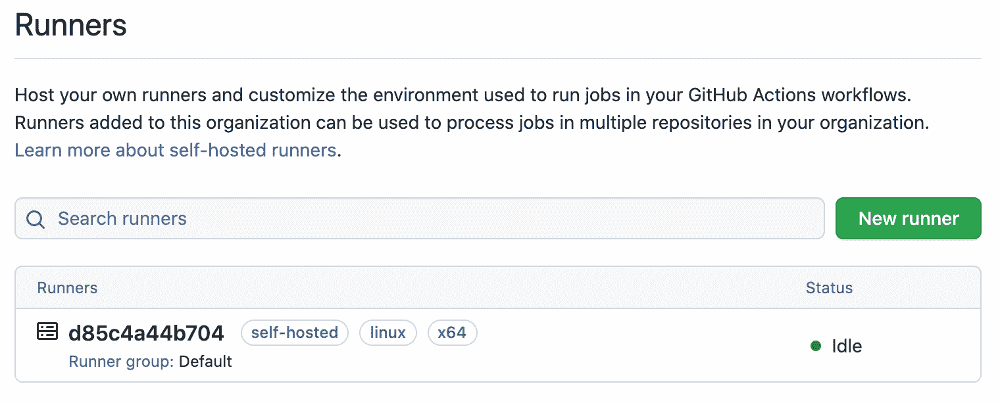

# 使用 Docker 部署自托管 GitHub 动作运行器

> 原文：<https://testdriven.io/blog/github-actions-docker/>

在本教程中，我们将详细介绍如何使用 Docker 将自托管的[GitHub Actions](https://github.com/features/actions)runner 部署到 [DigitalOcean](https://www.digitalocean.com/) 。我们还将看到如何在垂直方向(通过 Docker Compose)和水平方向(通过 Docker Swarm)扩展跑步者。

*依赖关系*:

*   文档编号 v19.03.8
*   坞站-复合 v1.29.2
*   对接机 v0.16.2

## GitHub 操作

GitHub Actions 是一个持续集成和交付(CI/CD)解决方案，与 GitHub 完全集成。GitHub Actions 工作流中的作业在名为 runners 的应用程序上运行。你既可以使用 GitHub 托管的运行程序，也可以在自己的基础设施上运行自己的[自托管运行程序](https://help.github.com/en/actions/hosting-your-own-runners/about-self-hosted-runners)。

跑步者既可以添加到个人存储库中，也可以添加到组织中。我们将采用后一种方法，以便运行人员可以处理来自同一个 GitHub 组织中多个存储库的作业。

开始之前，你需要[创建](https://help.github.com/en/github/authenticating-to-github/creating-a-personal-access-token-for-the-command-line)一个个人访问令牌。在您的[开发者设置](https://github.com/settings/developers)中，点击“个人访问令牌”。然后，单击“生成新令牌”。提供描述性注释并选择`repo`、`workflow`和`admin:org`范围。

## 数字海洋设置

首先，[注册](https://m.do.co/c/d8f211a4b4c2)一个数字海洋账户，如果你还没有的话，然后[生成](https://www.digitalocean.com/docs/apis-clis/api/)一个访问令牌，这样你就可以访问数字海洋 API。

将令牌添加到您的环境中:

```py
`$ export DIGITAL_OCEAN_ACCESS_TOKEN=[your_digital_ocean_token]` 
```

安装 [Docker Machine](https://docs.docker.com/machine/install-machine/) 如果你的本地机器上还没有的话。

旋转出一个叫做`runner-node`的小液滴:

```py
`$ docker-machine create \
    --driver digitalocean \
    --digitalocean-access-token $DIGITAL_OCEAN_ACCESS_TOKEN \
    --digitalocean-region "nyc1" \
    --digitalocean-image "debian-10-x64" \
    --digitalocean-size "s-4vcpu-8gb" \
    --engine-install-url "https://releases.rancher.com/install-docker/19.03.9.sh" \
    runner-node;` 
```

## Docker 部署

SSH 进入 droplet:

```py
`$ docker-machine ssh runner-node` 
```

添加以下 docker 文件，注意注释:

```py
`# base
FROM  ubuntu:18.04

# set the github runner version
ARG  RUNNER_VERSION="2.283.3"

# update the base packages and add a non-sudo user
RUN  apt-get update -y && apt-get upgrade -y && useradd -m docker

# install python and the packages the your code depends on along with jq so we can parse JSON
# add additional packages as necessary
RUN  DEBIAN_FRONTEND=noninteractive apt-get install -y --no-install-recommends \
    curl jq build-essential libssl-dev libffi-dev python3 python3-venv python3-dev python3-pip

# cd into the user directory, download and unzip the github actions runner
RUN  cd /home/docker && mkdir actions-runner && cd actions-runner \
    && curl -O -L https://github.com/actions/runner/releases/download/v${RUNNER_VERSION}/actions-runner-linux-x64-${RUNNER_VERSION}.tar.gz \
    && tar xzf ./actions-runner-linux-x64-${RUNNER_VERSION}.tar.gz

# install some additional dependencies
RUN  chown -R docker ~docker && /home/docker/actions-runner/bin/installdependencies.sh

# copy over the start.sh script
COPY  start.sh start.sh

# make the script executable
RUN  chmod +x start.sh

# since the config and run script for actions are not allowed to be run by root,
# set the user to "docker" so all subsequent commands are run as the docker user
USER  docker

# set the entrypoint to the start.sh script
ENTRYPOINT  ["./start.sh"]` 
```

> 用最新版本的 runner 更新`RUNNER_VERSION`变量，可以在[这里](https://github.com/actions/runner/releases)找到。

同样添加 *start.sh* 文件:

```py
`#!/bin/bash

ORGANIZATION=$ORGANIZATION
ACCESS_TOKEN=$ACCESS_TOKEN

REG_TOKEN=$(curl -sX POST -H "Authorization: token ${ACCESS_TOKEN}" https://api.github.com/orgs/${ORGANIZATION}/actions/runners/registration-token | jq .token --raw-output)

cd /home/docker/actions-runner

./config.sh --url https://github.com/${ORGANIZATION} --token ${REG_TOKEN}

cleanup() {
    echo "Removing runner..."
    ./config.sh remove --unattended --token ${REG_TOKEN}
}

trap 'cleanup; exit 130' INT
trap 'cleanup; exit 143' TERM

./run.sh & wait $!` 
```

`ORGANIZATION`和`ACCESS_TOKEN` (GitHub 个人访问令牌)环境变量用于请求跑步者注册令牌。

> 有关更多信息，请查看文档中的[为组织创建注册令牌](https://docs.github.com/en/rest/reference/actions#create-a-registration-token-for-an-organization)一节。

注意到:

```py
`cleanup() {
    echo "Removing runner..."
    ./config.sh remove --unattended --token ${REG_TOKEN}
}

trap 'cleanup; exit 130' INT
trap 'cleanup; exit 143' TERM

./run.sh & wait $!` 
```

本质上，当容器停止时，用于在容器停止时移除流道的清理逻辑将会执行。

> 关于 shell 信号处理和`wait`的更多信息，请查看这个堆栈交换[答案](https://unix.stackexchange.com/questions/146756/forward-sigterm-to-child-in-bash/146770#146770)。

构建映像并在分离模式下旋转容器:

```py
`$ docker build --tag runner-image .

$ docker run \
  --detach \
  --env ORGANIZATION=<YOUR-GITHUB-ORGANIZATION> \
  --env ACCESS_TOKEN=<YOUR-GITHUB-ACCESS-TOKEN> \
  --name runner \
  runner-image` 
```

> 确保分别用您的组织和个人访问令牌替换`<YOUR-GITHUB-ORGANIZATION>`和`<YOUR-GITHUB-ACCESS-TOKEN>`。

快速查看一下容器日志:

您应该会看到类似如下的内容:

```py
`--------------------------------------------------------------------------------
|        ____ _ _   _   _       _          _        _   _                      |
|       / ___(_) |_| | | |_   _| |__      / \   ___| |_(_) ___  _ __  ___      |
|      | |  _| | __| |_| | | | | '_ \    / _ \ / __| __| |/ _ \| '_ \/ __|     |
|      | |_| | | |_|  _  | |_| | |_) |  / ___ \ (__| |_| | (_) | | | \__ \     |
|       \____|_|\__|_| |_|\__,_|_.__/  /_/   \_\___|\__|_|\___/|_| |_|___/     |
|                                                                              |
|                       Self-hosted runner registration                        |
|                                                                              |
--------------------------------------------------------------------------------

# Authentication

√ Connected to GitHub

# Runner Registration

Enter the name of the runner group to add this runner to: [press Enter for Default]
Enter the name of runner: [press Enter for 332d0614b5e9]
This runner will have the following labels: 'self-hosted', 'Linux', 'X64'
Enter any additional labels (ex. label-1,label-2): [press Enter to skip]
√ Runner successfully added
√ Runner connection is good

# Runner settings

Enter name of work folder: [press Enter for _work]
√ Settings Saved.

√ Connected to GitHub

2021-10-23 22:36:01Z: Listening for Jobs` 
```

然后，在您的 GitHub 组织名称下，点击“设置”。在左侧栏中，点击“动作”，然后点击“跑步者”。您应该会看到一个注册的跑步者:



为了进行测试，将[run-on:[自托管]](https://docs.github.com/en/actions/learn-github-actions/workflow-syntax-for-github-actions#self-hosted-runners) 添加到存储库的工作流 YAML 文件中。

例如:

```py
`name:  Sample Python on:  [push] jobs: build: runs-on:  [self-hosted] steps: -  uses:  actions/[[email protected]](/cdn-cgi/l/email-protection) -  name:  Install dependencies run:  | python3 -m pip install --upgrade pip pip3 install pytest -  name:  Test with pytest run:  | python3 -m pytest` 
```

然后，运行新的构建。回到您的终端，在 Docker 日志中，您应该看到作业的状态:

```py
`2021-10-24 00:46:26Z: Running job: build
2021-10-24 00:46:34Z: Job build completed with result: Succeeded` 
```

> 如果您尝试运行作业的存储库是公共的，那么您必须更新默认的 runner 组以允许公共存储库。更多信息，请查看[公共存储库的自托管跑步者安全性](https://docs.github.com/en/actions/hosting-your-own-runners/about-self-hosted-runners#self-hosted-runner-security-with-public-repositories)。

完成后取下容器:

再次查看日志。您应该看到:

```py
`Removing runner...

# Runner removal

√ Runner removed successfully
√ Removed .credentials
√ Removed .runner` 
```

该跑步者在您的 GitHub 组织的操作设置中应该不再可用:


移除容器:

## 使用 Docker 合成进行垂直缩放

想在一个液滴上旋转多个转轮吗？

首先将下面的 *docker-compose.yml* 文件添加到框中:

```py
`version:  '3' services: runner: build:  . environment: -  ORGANIZATION=<YOUR-GITHUB-ORGANIZATION> -  ACCESS_TOKEN=<YOUR-GITHUB-ACCESS-TOKEN>` 
```

确保分别用您的组织和个人访问令牌替换`<YOUR-GITHUB-ORGANIZATION>`和`<YOUR-GITHUB-ACCESS-TOKEN>`。

按照[官方安装指南](https://docs.docker.com/compose/install/)在 droplet 上下载安装 Docker Compose，然后构建镜像:

启动两个容器实例:

```py
`$ docker-compose up --scale runner=2 -d` 
```

你应该在 GitHub 上看到两个跑步者:



开始两次构建。打开撰写日志:

您应该会看到类似这样的内容:

```py
`runner_2  | 2021-10-24 00:52:56Z: Running job: build
runner_1  | 2021-10-24 00:52:58Z: Running job: build
runner_2  | 2021-10-24 00:53:04Z: Job build completed with result: Succeeded
runner_1  | 2021-10-24 00:53:11Z: Job build completed with result: Succeeded` 
```

你可以像这样缩小:

```py
`$ docker-compose up --scale runner=1 -d` 
```

退出 SSH 会话并销毁机器/液滴:

```py
`$ docker-machine rm runner-node -y
$ eval $(docker-machine env -u)` 
```

## 使用 Docker Swarm 进行水平缩放

想要在多个 DigitalOcean 微滴之间进行水平缩放？

### 配置水滴

将数字海洋访问令牌添加到您的环境中:

```py
`$ export DIGITAL_OCEAN_ACCESS_TOKEN=[your_digital_ocean_token]` 
```

旋转三个新的数字海洋液滴:

```py
`$ for i in 1 2 3; do
    docker-machine create \
      --driver digitalocean \
      --digitalocean-access-token $DIGITAL_OCEAN_ACCESS_TOKEN \
      --digitalocean-region "nyc1" \
      --digitalocean-image "debian-10-x64" \
      --digitalocean-size "s-4vcpu-8gb" \
      --engine-install-url "https://releases.rancher.com/install-docker/19.03.9.sh" \
      runner-node-$i;
  done` 
```

在第一个节点`runner-node-1`上初始化[群模式](https://docs.docker.com/engine/swarm/):

```py
`$ docker-machine ssh runner-node-1 -- docker swarm init --advertise-addr $(docker-machine ip runner-node-1)` 
```

使用上一个命令输出中的 join 令牌将剩余的两个节点作为 workers 添加到群中:

```py
`$ for i in 2 3; do
    docker-machine ssh runner-node-$i -- docker swarm join --token YOUR_JOIN_TOKEN HOST:PORT;
  done` 
```

例如:

```py
`$ for i in 2 3; do
    docker-machine ssh runner-node-$i -- docker swarm join --token SWMTKN-1-4a341wv2n8c2c0cn3f9d0nwxndpohwuyr58vtal63wx90spfoo-09vdgcfarp6oqxnncgfjyrh0i 161.35.12.185:2377;
  done` 
```

您应该看到:

```py
`This node joined a swarm as a worker.
This node joined a swarm as a worker.` 
```

### 构建 Docker 映像

这一次，让我们在本地构建映像，并将其推送到 [Docker Hub](https://hub.docker.com/) 映像注册中心。

Dockerfile:

```py
`# base
FROM  ubuntu:18.04

# set the github runner version
ARG  RUNNER_VERSION="2.283.3"

# update the base packages and add a non-sudo user
RUN  apt-get update -y && apt-get upgrade -y && useradd -m docker

# install python and the packages the your code depends on along with jq so we can parse JSON
# add additional packages as necessary
RUN  DEBIAN_FRONTEND=noninteractive apt-get install -y --no-install-recommends \
    curl jq build-essential libssl-dev libffi-dev python3 python3-venv python3-dev python3-pip

# cd into the user directory, download and unzip the github actions runner
RUN  cd /home/docker && mkdir actions-runner && cd actions-runner \
    && curl -O -L https://github.com/actions/runner/releases/download/v${RUNNER_VERSION}/actions-runner-linux-x64-${RUNNER_VERSION}.tar.gz \
    && tar xzf ./actions-runner-linux-x64-${RUNNER_VERSION}.tar.gz

# install some additional dependencies
RUN  chown -R docker ~docker && /home/docker/actions-runner/bin/installdependencies.sh

# copy over the start.sh script
COPY  start.sh start.sh

# make the script executable
RUN  chmod +x start.sh

# since the config and run script for actions are not allowed to be run by root,
# set the user to "docker" so all subsequent commands are run as the docker user
USER  docker

# set the entrypoint to the start.sh script
ENTRYPOINT  ["./start.sh"]` 
```

*start.sh* :

```py
`#!/bin/bash

ORGANIZATION=$ORGANIZATION
ACCESS_TOKEN=$ACCESS_TOKEN

REG_TOKEN=$(curl -sX POST -H "Authorization: token ${ACCESS_TOKEN}" https://api.github.com/orgs/${ORGANIZATION}/actions/runners/registration-token | jq .token --raw-output)

cd /home/docker/actions-runner

./config.sh --url https://github.com/${ORGANIZATION} --token ${REG_TOKEN}

cleanup() {
    echo "Removing runner..."
    ./config.sh remove --unattended --token ${REG_TOKEN}
}

trap 'cleanup; exit 130' INT
trap 'cleanup; exit 143' TERM

./run.sh & wait $!` 
```

建立形象:

```py
`$ docker build --tag <your-docker-hub-username>/actions-image:latest .` 
```

确保用您的 Docker Hub 用户名替换`<your-docker-hub-username>`。然后，将映像推送到注册表:

```py
`$ docker push <your-docker-hub-username>/actions-image:latest` 
```

### 部署

要部署堆栈，首先添加一个 Docker 合成文件:

```py
`version:  '3' services: runner: image:  <your-docker-hub-username>/actions-image:latest deploy: mode:  replicated replicas:  1 placement: constraints: -  node.role == worker environment: -  ORGANIZATION=<YOUR-GITHUB-ORGANIZATION> -  ACCESS_TOKEN=<YOUR-GITHUB-ACCESS-TOKEN>` 
```

再次更新`<your-docker-hub-username>`以及环境变量。

将 Docker 守护进程指向`runner-node-1`并部署堆栈:

```py
`$ eval $(docker-machine env runner-node-1)
$ docker stack deploy --compose-file=docker-compose.yml actions` 
```

列出堆栈中的服务:

```py
`$ docker stack ps -f "desired-state=running" actions` 
```

您应该会看到类似如下的内容:

```py
`ID                  NAME                IMAGE                         NODE                DESIRED STATE
xhh3r8rfhh46        actions_runner.1    mjhea0/actions-image:latest   runner-node-2       Running` 
```

确保跑步者在 GitHub 上:



让我们再添加两个节点:

```py
`$ docker service scale actions_runner=3

actions_runner scaled to 3
overall progress: 3 out of 3 tasks
1/3: running
2/3: running
3/3: running
verify: Service converged` 
```

验证:



开始几项工作，并确保它们成功完成。

缩小到单个流道:

```py
`$ docker service scale actions_runner=1

actions_runner scaled to 1
overall progress: 1 out of 1 tasks
1/1: running
verify: Service converged` 
```

验证:



完成后，将机器/液滴取下:

```py
`$ docker-machine rm runner-node-1 runner-node-2 runner-node-3 -y` 
```