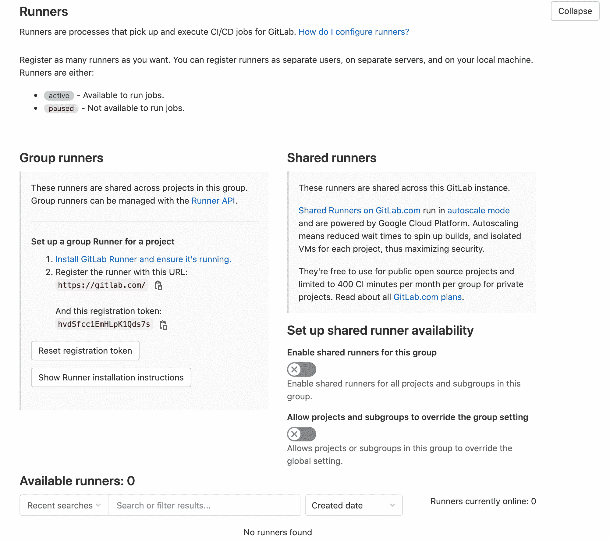
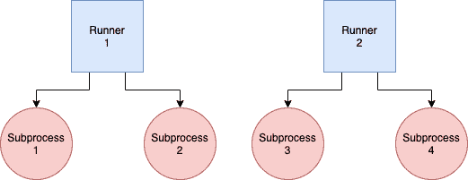

# 使用 Docker 部署自托管 GitLab CI 运行程序

> 原文：<https://testdriven.io/blog/gitlab-ci-docker/>

在本教程中，我们将详细介绍如何使用 Docker 将自托管的 [GitLab CI/CD](https://docs.gitlab.com/ee/ci/) 运行程序部署到[数字海洋](https://www.digitalocean.com/)。

## GitLab CI/CD

[GitLab CI/CD](https://docs.gitlab.com/ee/ci/) 是一个持续集成和交付(CI/CD)解决方案，与 GitLab 完全集成。GitLab CI/CD 管道中的作业在称为 runners 的进程上运行。你既可以使用 GitLab 托管的共享运行器，也可以在自己的基础设施上运行自己的[自托管运行器](https://docs.gitlab.com/runner/install/)。

### 范围

Runners 可以对 GitLab 实例中的所有项目和组可用，也可以对特定的组或特定的项目(存储库)可用。我们将使用第一种方法，这样我们可以用同一个运行器处理来自多个存储库的作业。

您还可以使用[标签](https://docs.gitlab.com/ee/ci/runners/configure_runners.html#use-tags-to-control-which-jobs-a-runner-can-run)来控制运行程序可以运行哪些作业。

> 关于跑步者范围的更多信息，请看官方文件中的[跑步者范围](https://docs.gitlab.com/ee/ci/runners/runners_scope.html)。

### 码头工人

因为您可能想在工作中运行`docker`命令——构建和测试 Docker 容器中运行的应用程序——所以您需要选择以下三种方法之一:

1.  [外壳执行器](https://docs.gitlab.com/ee/ci/docker/using_docker_build.html#use-the-shell-executor)
2.  [码头工人](https://docs.gitlab.com/ee/ci/docker/using_docker_build.html#use-the-docker-executor-with-the-docker-image-docker-in-docker)
3.  [套接字绑定](https://docs.gitlab.com/ee/ci/docker/using_docker_build.html#use-docker-socket-binding)

我们将使用套接字绑定方法(Docker-out-of-Docker？)将对接插座捆绑安装到具有容积的容器上。运行 GitLab runner 的容器将能够与 Docker 守护进程通信，从而产生兄弟容器。

> 虽然我对这些方法没有什么强烈的意见，但我还是推荐阅读[为您的 CI 或测试环境使用 Docker-in-Docker？三思而后行。](https://jpetazzo.github.io/2015/09/03/do-not-use-docker-in-docker-for-ci/)作者 jérme Petazzoni，Docker-in-Docker 的创造者。
> 
> 如果你对 Docker-in-Docker 方法感兴趣，可以看看定制的 Gitlab CI/CD Runner，用 Docker-in-Docker 进行高速缓存。

## 数字海洋设置

首先，[注册](https://m.do.co/c/d8f211a4b4c2)一个数字海洋账户，如果你还没有的话，然后[生成](https://www.digitalocean.com/docs/apis-clis/api/)一个访问令牌，这样你就可以访问数字海洋 API。

将令牌添加到您的环境中:

```
`$ export DIGITAL_OCEAN_ACCESS_TOKEN=[your_digital_ocean_token]` 
```

安装 [Docker Machine](https://docs.docker.com/machine/install-machine/) 如果你的本地机器上还没有的话。

旋转出一个叫做`runner-node`的小液滴:

```
`$ docker-machine create \
    --driver digitalocean \
    --digitalocean-access-token $DIGITAL_OCEAN_ACCESS_TOKEN \
    --digitalocean-region "nyc1" \
    --digitalocean-image "debian-10-x64" \
    --digitalocean-size "s-4vcpu-8gb" \
    --engine-install-url "https://releases.rancher.com/install-docker/19.03.9.sh" \
    runner-node;` 
```

## Docker 部署

SSH 进入 droplet:

```
`$ docker-machine ssh runner-node` 
```

创建以下文件和文件夹:

```
`├── config
│   └── config.toml
└── docker-compose.yml` 
```

将以下内容添加到 *docker-compose.yml* 文件中:

```
`version:  '3' services: gitlab-runner-container: image:  gitlab/gitlab-runner:v14.3.2 container_name:  gitlab-runner-container restart:  always volumes: -  ./config/:/etc/gitlab-runner/ -  /var/run/docker.sock:/var/run/docker.sock` 
```

在此，我们:

1.  使用了官方 [GitLab Runner Docker 图片](https://hub.docker.com/r/gitlab/gitlab-runner)。
2.  增加了 Docker 套接字和“配置”文件夹的容量。
3.  将端口 9252 暴露给 Docker 主机。稍后会有更多内容。

按照[官方安装指南](https://docs.docker.com/compose/install/)在 droplet 上下载并安装 Docker Compose，然后旋转容器:

> 如果您遇到 Docker 编写挂起的问题，请查看这个堆栈溢出问题。

接下来，您需要获得注册令牌和 URL。在您小组的“CI/CD 设置”中，展开“跑步者”部分。一定要禁用共享跑步者。



运行以下命令来注册一个新的跑步者，确保用您的组的注册令牌和 URL 替换`<YOUR-GITLAB-REGISTRATION-TOKEN>`和`<YOUR-GITLAB-URL>`:

```
`$ docker-compose exec gitlab-runner-container \
    gitlab-runner register \
    --non-interactive \
    --url <YOUR-GITLAB-URL> \
    --registration-token <YOUR-GITLAB-REGISTRATION-TOKEN> \
    --executor docker \
    --description "Sample Runner 1" \
    --docker-image "docker:stable" \
    --docker-volumes /var/run/docker.sock:/var/run/docker.sock` 
```

您应该会看到类似如下的内容:

```
`Runtime platform
arch=amd64 os=linux pid=18 revision=e0218c92 version=14.3.2

Running in system-mode.

Registering runner... succeeded
runner=hvdSfcc1

Runner registered successfully. Feel free to start it, but if it's running already
the config should be automatically reloaded!` 
```

同样，我们使用了 [docker 套接字绑定方法](https://docs.gitlab.com/ee/ci/docker/using_docker_build.html#use-docker-socket-binding)，以便`docker`命令可以在运行于 runner 上的作业内部运行。

> 查看 [GitLab Runner 命令](https://docs.gitlab.com/runner/commands/)以了解更多关于`register`命令以及注册和管理跑步者的其他命令。

回到 GitLab，您应该会在您小组的“CI/CD 设置”中看到已注册的跑步者:


通过为您的一个存储库运行 CI/CD 管道来测试它。

回到您的终端，查看一下集装箱日志:

```
`$ docker logs gitlab-runner-container -f` 
```

您应该会看到作业的状态:

```
`Checking for jobs... received
job=1721313345 repo_url=https://gitlab.com/testdriven/testing-gitlab-ci.git runner=yK2DqWMQ

Job succeeded
duration_s=32.174537956 job=1721313345 project=30721568 runner=yK2DqWMQ` 
```

## 配置

记下配置文件 *config/config.toml* :

```
`$ cat config/config.toml

concurrent = 1
check_interval = 0

[session_server]
  session_timeout = 1800

[[runners]]
  name = "Sample Runner 1"
  url = "https://gitlab.com/"
  token = "yK2DqWMQB1CqPsRx6gwn"
  executor = "docker"
  [runners.custom_build_dir]
  [runners.cache]
    [runners.cache.s3]
    [runners.cache.gcs]
    [runners.cache.azure]
  [runners.docker]
    tls_verify = false
    image = "docker:stable"
    privileged = false
    disable_entrypoint_overwrite = false
    oom_kill_disable = false
    disable_cache = false
    volumes = ["/var/run/docker.sock:/var/run/docker.sock", "/cache"]
    shm_size = 0` 
```

> 查看[高级配置](https://docs.gitlab.com/runner/configuration/advanced-configuration.html)，了解更多可用选项。您可以配置许多东西，例如日志和缓存选项、内存限制和 CPU 数量等等。

因为我们没有利用外部缓存，比如亚马逊 S3 或谷歌云存储，所以删除`[runners.cache]`部分。然后，重新启动转轮:

```
`$ docker-compose exec gitlab-runner-container gitlab-runner restart` 
```

尝试同时运行两个作业。由于并发性设置为 1 - `concurrent = 1` -在运行器上一次只能运行一个作业。因此，其中一个作业将保持“挂起”状态，直到第一个作业完成运行。如果您只是为一个小团队设置跑步者，那么您也许可以一次只运行一个任务。随着团队的成长，您会想要尝试并发配置选项:

1.  `concurrent` -限制在所有运行程序中全局同时运行的作业数量。
2.  `limit` -适用于单个跑步者，限制可同时处理的工作数量。默认为`0`，表示不应用限制。
3.  `request_concurrency` -适用于单个跑步者，限制新工作的并发请求数量。默认为`1`。

在我们更新并发选项之前，添加一个新的 runner:

```
`$ docker-compose exec gitlab-runner-container \
    gitlab-runner register \
    --non-interactive \
    --url <YOUR-GITLAB-URL> \
    --registration-token <YOUR-GITLAB-REGISTRATION-TOKEN> \
    --executor docker \
    --description "Sample Runner 2" \
    --docker-image "docker:stable" \
    --docker-volumes /var/run/docker.sock:/var/run/docker.sock` 
```

然后，像这样更新 *config/config.toml* :

```
`concurrent  =  4  # NEW check_interval  =  0 [session_server] session_timeout  =  1800 [[runners]] name  =  "Sample Runner 1" url  =  "https://gitlab.com/" token  =  "yK2DqWMQB1CqPsRx6gwn" executor  =  "docker" limit  =  2  # NEW request_concurrency  =  2  # NEW [runners.custom_build_dir] [runners.docker] tls_verify  =  false image  =  "docker:stable" privileged  =  false disable_entrypoint_overwrite  =  false oom_kill_disable  =  false disable_cache  =  false volumes  =  ["/var/run/docker.sock:/var/run/docker.sock",  "/cache"] shm_size  =  0 [[runners]] name  =  "Sample Runner 2" url  =  "https://gitlab.com/" token  =  "qi-b3gFzVaX3jRRskJbz" limit  =  2  # NEW request_concurrency  =  2  # NEW executor  =  "docker" [runners.custom_build_dir] [runners.cache] [runners.cache.s3] [runners.cache.gcs] [runners.cache.azure] [runners.docker] tls_verify  =  false image  =  "docker:stable" privileged  =  false disable_entrypoint_overwrite  =  false oom_kill_disable  =  false disable_cache  =  false volumes  =  ["/var/run/docker.sock:/var/run/docker.sock",  "/cache"] shm_size  =  0` 
```

现在，我们可以跨两个运行程序同时运行四个作业，每个运行程序有两个子流程:



重新启动:

```
`$ docker-compose exec gitlab-runner-container gitlab-runner restart` 
```


通过运行四个作业来测试它。

请记住，如果您正在构建和测试 Docker 映像，您最终会耗尽磁盘空间。因此，定期删除 Docker 主机上所有未使用的图像和容器是一个好主意。

Example crontab:

```
`@weekly  /usr/bin/docker  system  prune  -f` 
```

--

就是这样！

不要忘记注销跑步者:

```
`$ docker-compose exec gitlab-runner-container gitlab-runner unregister --all-runners` 
```

然后，回到您的本地机器，关闭机器/droplet:

```
`$ docker-machine rm runner-node` 
```