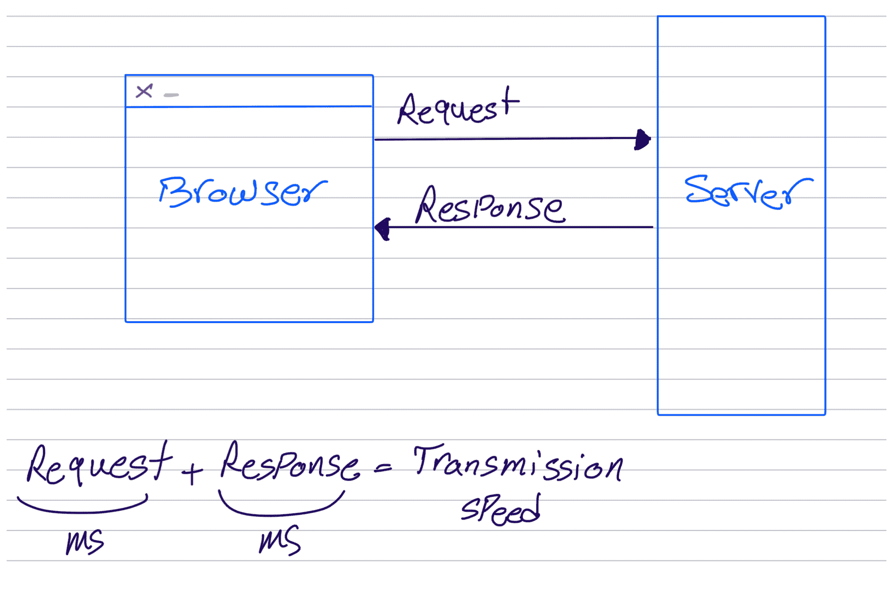
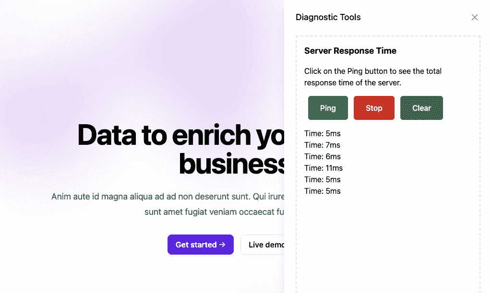

# 多区域 Python 应用程序

> 原文：<https://testdriven.io/blog/python-multi-region/>

本文着眼于如何在 Python 应用程序中启用多区域支持。

## 问题

假设您刚刚使用 Django 完成了基于 Python 的 web 应用程序的开发，并将其投入生产。一段时间后，一些用户报告说应用程序很慢。您可以检查日志和服务器指标，以了解资源使用情况以及其他情况——一切看起来都很好。CPU、内存或磁盘使用率没有峰值。您在本地启动您的本地开发环境，并试图重现该问题，但它工作得很好。这是怎么回事？

你忘记了一些重要但容易忽视的东西:支配我们宇宙的法则。信息从一个地方传到另一个地方只能这么快。

作为开发人员，我们的主要责任是确保信息系统正常运行。这些系统涉及数据在时间和空间中的移动，我们的工作就是管理和协调这一过程。然而，就像任何其他系统一样，有一些基本的规则来管理数据的传输，这可能会使该过程不那么即时。这是潜在问题可能出现的地方，我们的职责是处理和解决这些问题。

例如，当你在浏览器中打开这个页面时，信息是在时间和空间上传递的——这需要一些时间来加载。

请记住，我们的本地开发环境在这种情况下没有帮助我们，因为它位于我们的本地机器上，所以 A 点和 B 点彼此非常接近，因为它们之间的距离非常小。所以传递信息的时间很短。但是在生产中，我们的应用程序位于世界上某个地方的服务器上，我们的浏览器和服务器之间的距离要大得多。因此，传输信息所需的时间要长得多。

哪些工具可以帮助我们测量信息从服务器传输到浏览器所需的时间？我们如何使用这个工具来提高我们的应用程序性能？这是我们将在下一节讨论的内容。

> 本文假设您已经排除了冗长的过程、低效的数据库查询以及其他导致性能下降的潜在原因。换句话说，您已经确定您的用户所经历的延迟可能是由数据包从浏览器到服务器来回传输的距离所导致的延迟。这可能是由多种因素造成的，包括物理距离、网络拥塞和用于传输数据的基础设施的限制。

## 基准

在开始寻找解决方案之前，您应该测量当前的传输速度，即请求+响应时间，并设置一个基准来衡量:



因此，我们需要一个工具，它可以给出向服务器发送请求，然后在浏览器中接收响应所需的总时间。这就是平的概念。ping 测量从发送主机发送到目的计算机的消息回显到源计算机的往返时间。

幸运的是，对于每一个最流行的 Python web 框架- [Django](/blog/topics/django/) 、 [Flask](/blog/topics/flask/) 和 [FastAPI](/blog/topics/fastapi/) -很容易建立一个视图或路由处理程序来解决这个问题。让我们看一些例子...

### 姜戈

```py
`from django.http import JsonResponse

def ping(request):
    data = {
        'message': request.GET.get('ECHOMSG', '')
    }
    return JsonResponse(data)` 
```

### 瓶

```py
`from flask import Flask, request, jsonify

@app.route('/ping')
def ping():
    data = {
        'message': request.args.get('ECHOMSG', '')
    }
    return jsonify(data)` 
```

### FastAPI

```py
`from fastapi import Request
from fastapi.responses import JSONResponse

@app.get('/ping')
def ping(request: Request):
    data = {
        'message': request.query_params.get('ECHOMSG', '')
    }
    return JSONResponse(content=data)` 
```

### 客户端示例

您还需要建立一种机制来计算请求和响应时间。如果您的客户端是浏览器，那么您可以设置一个简单的 JavaScript 函数，如下所示:

```py
`function  ping()  { const  startTime  =  new  Date().getTime();  // start the timer const  xhr  =  new  XMLHttpRequest();  // create a new request xhr.open("GET",  "/ping",  true);  // call the ping endpoint xhr.onreadystatechange  =  function  ()  { if  (xhr.readyState  ==  4)  { const  endTime  =  new  Date().getTime();  // stop the timer const  time  =  endTime  -  startTime;  // calculate the time it took to get the response console.log(time); } } xhr.send(); }` 
```

### 完整示例

如果您想看完整的 Django 实例，请查看 [web 诊断](https://github.com/amirtds/web-diagnostic/tree/master) repo。按照自述文件中的说明将其复制下来并设置项目。

随着 Django 开发服务器的运行，在您选择的浏览器中访问 [http://localhost:8000](http://localhost:8000) 。然后，点击**诊断**和 **Ping** 按钮后，您应该在浏览器中看到 Ping 时间:



> 记下时间，单位为毫秒(ms)。对我来说是 5 到 11 ms 之间，传输时间真的很少，因为客户端和服务器离得很近。

现在访问[https://we b-Diagnostic . fly . dev](https://web-diagnostic.fly.dev)并打开**诊断**并点击 **Ping** 按钮。该服务器位于迈阿密地区，因此根据您的位置，ping 时间应该更长。

例如:

```py
`Time:  71ms Time:  76ms Time:  65ms Time:  67ms Time:  64ms Time:  75ms Time:  71ms Time:  70ms Time:  72ms Time:  75ms` 
```

如果你有一个 VPN，你可以看到世界各地用户的响应时间。以下是西班牙某 IP 的样子:

```py
`Time:  324ms Time:  320ms Time:  320ms Time:  330ms Time:  324ms Time:  319ms Time:  326ms Time:  321ms Time:  320ms Time:  324ms` 
```

> 如您所见，响应时间变得更长了，因为服务器位于美国，而用户在西班牙。所以信息从服务器传到用户手中需要更多的时间。

## 多区域支持

虽然有多种方式来实现多地区支持，但我们将重点关注顶级云提供商:[亚马逊网络服务](https://aws.amazon.com/)(AWS)[谷歌云平台](https://cloud.google.com/) (GCP)，以及[微软 Azure](https://azure.microsoft.com/) 。这些提供商提供了一系列服务，可以帮助我们为 web 应用程序实现多区域架构。

一般来说，部署多区域应用程序的体系结构包括在世界各地的不同区域设置应用程序的多个实例。然后，这些实例可以连接到负载均衡器，负载均衡器根据用户的位置将传入流量分配到最近的实例。


这些提供商提供了一些服务来帮助实现这种架构:

### 亚马逊网络服务

*   [Amazon EC2](https://aws.amazon.com/ec2/) :允许我们在全球多个地区启动和管理虚拟服务器。
*   亚马逊弹性负载均衡器(Amazon Elastic Load Balancer)(ELB):帮助在不同地区的多个应用实例之间分配传入流量。
*   亚马逊 Route 53 :一种域名系统(DNS)服务，可以根据用户的位置将用户路由到最近的实例。

AWS 提供了一系列服务，可以帮助您管理多个地区的基础设施。虽然您可以使用上述服务启动和管理您自己的多区域 EC2 集群和负载平衡器，但是您也可以选择使用像[弹性容器服务](https://aws.amazon.com/ecs/) (ECS)和[弹性豆茎](https://aws.amazon.com/elasticbeanstalk/)这样的服务来为您管理基础设施。这些服务为在不同地区部署和扩展应用程序提供了一个方便且全面管理的解决方案。

### 谷歌云平台

*   [谷歌计算引擎](https://cloud.google.com/compute) (GCE):在全球多个地区提供虚拟机。如果您的应用程序是 Dockerized，而不是 GCE，您可以使用 [Google Kubernetes 引擎](https://cloud.google.com/kubernetes-engine) (GKE)，它允许您运行和管理世界上多个地区的 Kubernetes 集群。
*   [Google Load Balancer](https://cloud.google.com/load-balancing) :在不同地区的应用程序的多个实例之间分配输入流量。
*   [Google Cloud DNS](https://cloud.google.com/dns) :一种 DNS 服务，可以根据用户的位置将用户路由到最近的实例。

### 微软 Azure

*   Azure 虚拟机(Azure Virtual Machines):允许我们在全球多个地区启动和管理虚拟服务器。如果您的应用程序是 Docker 化的，而不是虚拟机，那么您可以使用[容器实例](https://azure.microsoft.com/en-us/products/container-instances)，这允许您在全球多个地区快速部署和管理 Docker 容器。
*   [Azure 负载均衡器](https://azure.microsoft.com/en-us/solutions/load-balancing-with-azure):帮助在不同地区的应用程序的多个实例之间分配传入流量。
*   [Azure Traffic Manager](https://azure.microsoft.com/en-us/products/traffic-manager/) :基于 DNS 的流量管理服务，根据用户的位置将用户路由到最近的实例。

## 结论

当我们将应用程序部署到云中时，有时我们会忽略区域选项，而选择默认选项。到目前为止，您应该意识到让您的应用程序尽可能靠近您的用户以优化性能是多么重要。

许多应用程序的用户遍布世界各地。作为开发人员，我们的责任是问:“我的下一个用户可能在哪里？”。更重要的是，我们应该记住，互联网正在快速发展，我们应该找到合适的架构来支持快速全球连接的需求，以便以用户满意的方式传递信息。