# 使用 Flask、Redis Queue 和 Amazon SES 发送确认电子邮件

> 原文：<https://testdriven.io/blog/sending-confirmation-emails-with-flask-rq-and-ses/>

对于大多数 web 应用程序，在新用户注册后，确认用户提供了他们有权访问的有效电子邮件地址是很重要的。这不仅有助于防止垃圾邮件发送者创建假帐户，而且还为您的应用程序提供了额外的安全层。

例如，在没有首先验证电子邮件地址的情况下，您永远不要发送密码重置电子邮件。假设一个新用户在注册流程中输入了错误的电子邮件地址，并且该用户试图发送一封重置密码的电子邮件。最好的情况是，用户根本收不到邮件。在最坏的情况下，密码重置电子邮件将转到一个有效的电子邮件地址，不属于该用户，他们的帐户就很容易受到威胁。

本教程着眼于如何向 Flask、Redis Queue (RQ)和 Amazon SES (SES)的新注册用户发送确认电子邮件。

> 虽然本教程使用了 RQ 和 ses，但重要的是要关注本教程中的概念和模式，而不是所使用的特定工具和技术。通过使用不同的任务队列(如 Celery)和/或事务性电子邮件服务(如 SendGrid 或 Mailgun)来检查你的理解。

## 目标

完成本教程后，您将能够:

1.  讨论整个客户端/服务器电子邮件确认工作流程。
2.  描述什么是电子邮件确认，以及为什么你想在你的申请注册流程中使用它。
3.  将 Redis 队列集成到 Flask 应用程序中，并创建任务。
4.  用容器装烧瓶并用码头工人重新分发。
5.  使用单独的工作进程在后台运行长时间运行的任务。
6.  使用 itsdangerous 模块对令牌进行编码和解码。
7.  通过 Boto3 与 AWS API 交互。
8.  使用亚马逊简单电子邮件服务(SES)发送交易电子邮件。

## 项目设置

要按照本教程编写代码，请克隆基础项目:

```
`$ git clone https://github.com/testdrivenio/flask-ses-rq --branch base --single-branch
$ cd flask-ses-rq` 
```

快速检查代码和整个项目结构:

```
`├── Dockerfile
├── docker-compose.yml
├── manage.py
├── project
│   ├── __init__.py
│   ├── client
│   │   ├── static
│   │   │   ├── main.css
│   │   │   └── main.js
│   │   └── templates
│   │       ├── _base.html
│   │       ├── footer.html
│   │       └── home.html
│   ├── db
│   │   ├── Dockerfile
│   │   └── create.sql
│   ├── server
│   │   ├── __init__.py
│   │   ├── config.py
│   │   ├── main
│   │   │   ├── __init__.py
│   │   │   ├── forms.py
│   │   │   └── views.py
│   │   └── models.py
│   └── tests
│       ├── __init__.py
│       ├── base.py
│       ├── helpers.py
│       ├── test__config.py
│       └── test_main.py
└── requirements.txt` 
```

然后，启动应用程序:

```
`$ docker-compose up -d --build` 
```

> 本教程使用 Docker 版本 20.10.10。

创建数据库表:

```
`$ docker-compose run users python manage.py create_db` 
```

在浏览器中导航至 [http://localhost:5003](http://localhost:5003) 。您应该看到:

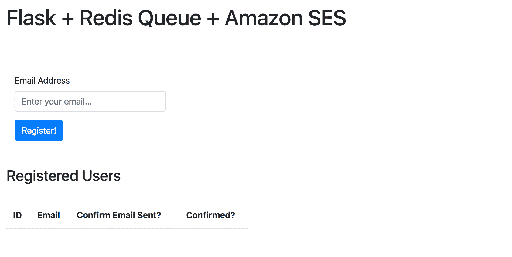

确保您可以添加新用户:

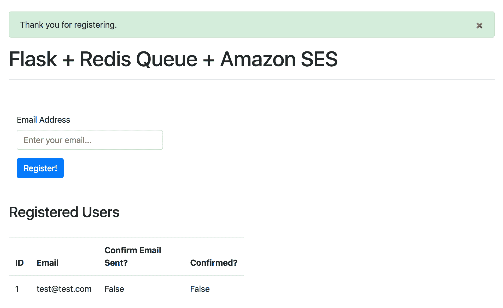

运行测试:

```
`$ docker-compose run users python manage.py test

----------------------------------------------------------------------
Ran 8 tests in 0.225s

OK` 
```

## 工作流程

以下是我们将使用的工作流程:

1.  一个新用户提交注册表单，该表单向服务器端发送 POST 请求。
2.  在 Flask 视图中，在新用户成功添加到数据库之后，一个新任务被添加到队列中，并且一个响应被发送回最终用户，指示他们需要通过电子邮件确认他们的注册。
3.  在后台，一个工作进程选择任务，生成一个惟一的链接，并向 Amazon SES 发送一个发送确认电子邮件的请求。
4.  然后，最终用户可以通过单击唯一链接，从自己的邮箱中确认电子邮件。
5.  当用户单击链接时，GET 请求被发送到服务器端，服务器端更新数据库中的用户记录。

> 如果你试图将电子邮件确认整合到现有的应用程序中，上述工作流程将根据你的应用程序的流程而有所不同。在学习本教程时，请记住这一点。

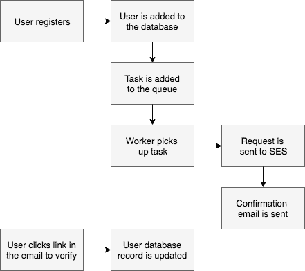

最终应用程序正在运行:

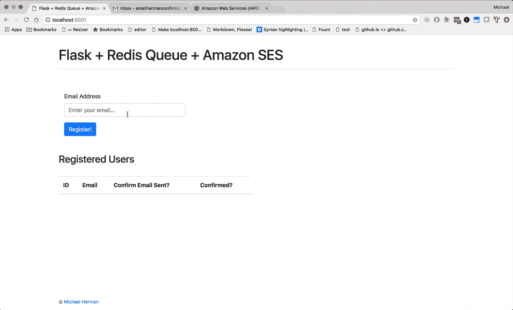

## 重复队列

首先，让我们连接任务队列！

### 码头工人

首先启动两个新流程:Redis 和一个 worker。像这样更新 *docker-compose.yml* 文件:

```
`version:  '3.8' services: users: build:  . image:  users container_name:  users ports: -  5003:5000 command:  python manage.py run -h 0.0.0.0 volumes: -  .:/usr/src/app environment: -  FLASK_DEBUG=1 -  APP_SETTINGS=project.server.config.DevelopmentConfig -  DATABASE_URL=postgresql://postgres:[[email protected]](/cdn-cgi/l/email-protection):5432/users_dev -  DATABASE_TEST_URL=postgresql://postgres:[[email protected]](/cdn-cgi/l/email-protection):5432/users_test -  SECRET_KEY=my_precious depends_on: -  users-db -  redis users-db: container_name:  users-db build: context:  ./project/db dockerfile:  Dockerfile expose: -  5432 environment: -  POSTGRES_USER=postgres -  POSTGRES_PASSWORD=postgres worker: image:  users command:  python manage.py run_worker volumes: -  .:/usr/src/app environment: -  FLASK_DEBUG=1 -  APP_SETTINGS=project.server.config.DevelopmentConfig -  DATABASE_URL=postgresql://postgres:[[email protected]](/cdn-cgi/l/email-protection):5432/users_dev -  DATABASE_TEST_URL=postgresql://postgres:[[email protected]](/cdn-cgi/l/email-protection):5432/users_test -  SECRET_KEY=my_precious depends_on: -  users-db -  redis redis: image:  redis:6-alpine` 
```

将依赖项添加到 *requirements.txt* :

### 工作

在“project/server/main”中的一个名为 *tasks.py* 的文件中添加一个新任务:

```
`# project/server/main/tasks.py

import time

from project.server import db
from project.server.models import User

def send_email(email):
    time.sleep(10)  # simulate long-running process
    user = User.query.filter_by(email=email).first()
    user.email_sent = True
    db.session.commit()
    return True` 
```

这里，我们模拟了一个长时间运行的流程，然后将`User`模型中的`email_sent`字段更新为`True`。我们将很快用发送电子邮件的实际功能取代`time.sleep(10)`。

> `email_sent`设置为`True`后，用户技术上注册但“未确认”。此时，允许用户做什么？换句话说，那个用户对你的应用程序有完全的访问权限，某种形式的受限访问权限，还是根本没有访问权限？想想你会如何在你的应用程序中处理这个问题。

更新视图以连接到 Redis 并对任务进行排队:

```
`@main_blueprint.route('/', methods=['GET', 'POST'])
def home():
    form = RegisterForm(request.form)
    if request.method == 'POST':
        if form.validate_on_submit():
            try:
                user = User(email=form.email.data)
                db.session.add(user)
                db.session.commit()
                redis_url = current_app.config['REDIS_URL']
                with Connection(redis.from_url(redis_url)):
                    q = Queue()
                    q.enqueue(send_email, user.email)
                flash('Thank you for registering.', 'success')
                return redirect(url_for("main.home"))
            except IntegrityError:
                db.session.rollback()
                flash('Sorry. That email already exists.', 'danger')
    users = User.query.all()
    return render_template('home.html', form=form, users=users)` 
```

更新导入:

```
`import redis
from flask import render_template, Blueprint, url_for, \
    redirect, flash, request, current_app
from rq import Queue, Connection
from sqlalchemy.exc import IntegrityError

from project.server import db
from project.server.models import User
from project.server.main.forms import RegisterForm
from project.server.main.tasks import send_email` 
```

将配置添加到 *project/server/config.py* 中的`BaseConfig`:

```
`class BaseConfig(object):
    """Base configuration."""
    SECRET_KEY = os.environ.get('SECRET_KEY')
    SQLALCHEMY_TRACK_MODIFICATIONS = False
    WTF_CSRF_ENABLED = False
    REDIS_URL = 'redis://redis:6379/0'
    QUEUES = ['default']` 
```

注意，我们在`REDIS_URL`中引用了`redis`服务，在 *docker-compose.yml* 中定义，而不是`localhost`。查看 Docker Compose [文档](https://docs.docker.com/compose/networking/)以获得更多关于通过主机名别名连接到其他服务的信息。

### 工人

接下来，让我们向 *manage.py* 添加一个自定义 CLI 命令来触发 worker 进程，该进程用于处理我们添加到队列中的任务:

```
`@cli.command('run_worker')
def run_worker():
    redis_url = app.config['REDIS_URL']
    redis_connection = redis.from_url(redis_url)
    with Connection(redis_connection):
        worker = Worker(app.config['QUEUES'])
        worker.work()` 
```

不要忘记进口:

```
`import redis
from rq import Connection, Worker` 
```

### 试验

旋转新容器:

```
`$ docker-compose up -d --build` 
```

要触发新任务，请注册一个新用户。`Confirm Email Sent?`应该是`False`:

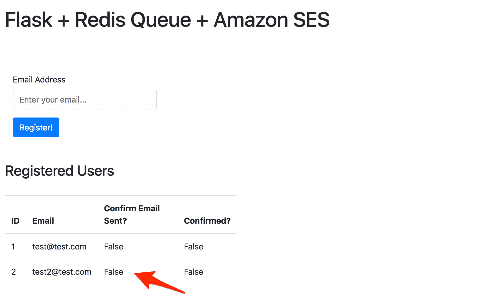

然后，十秒钟后刷新页面。`Confirm Email Sent?`现在应该是`True`，因为任务已经完成，数据库也已经更新。

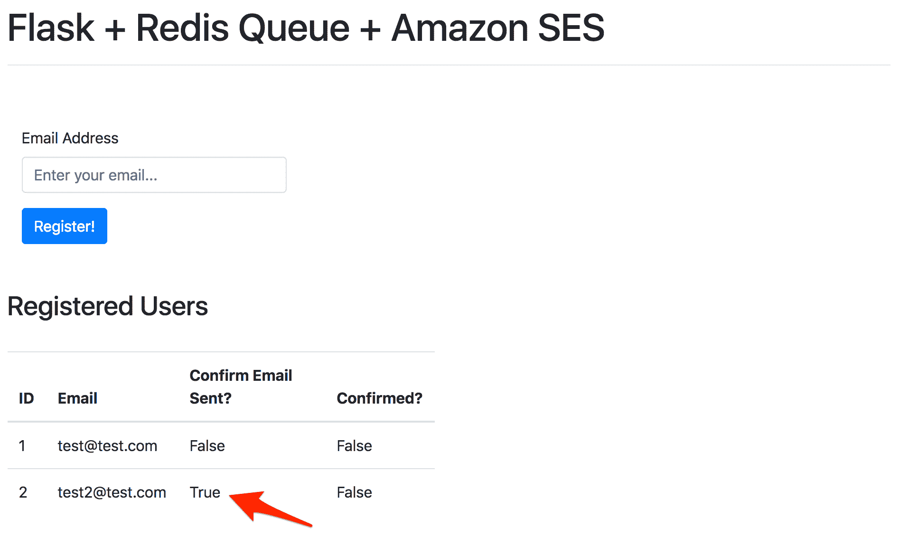

## 电子邮件确认

接下来，让我们从模板开始添加确认电子邮件地址的逻辑。

### 电子邮件模板

我们可以使用 [Jinja](http://jinja.pocoo.org/) 在服务器上生成模板。

```
`Thanks for signing up. Please follow the link to activate your account.
{{ confirm_url }} Cheers!` 
```

将上述文本保存到“项目/客户端/模板”中一个名为 *email.txt* 的新文件中。

> 目前，我们只会发送一封纯文本电子邮件。你可以随意添加 HTML(基本的和/或丰富的)。

### 唯一 URL

接下来，让我们添加一些辅助函数来编码和解码令牌，这将为生成唯一的确认 URL 奠定基础。

将名为 *utils.py* 的新文件添加到“项目/服务器/main”中:

```
`# project/server/main/utils.py

from itsdangerous import URLSafeTimedSerializer
from flask import current_app, url_for

def encode_token(email):
    serializer = URLSafeTimedSerializer(current_app.config['SECRET_KEY'])
    return serializer.dumps(email, salt='email-confirm-salt')

def decode_token(token, expiration=3600):
    serializer = URLSafeTimedSerializer(current_app.config['SECRET_KEY'])
    try:
        email = serializer.loads(
            token,
            salt='email-confirm-salt',
            max_age=expiration
        )
        return email
    except Exception as e:
        return False

def generate_url(endpoint, token):
    return url_for(endpoint, token=token, _external=True)` 
```

这里发生了什么事？

1.  `encode_token`利用[的危险](https://itsdangerous.palletsprojects.com/)包中的`URLSafeTimedSerializer`类来编码令牌中的电子邮件地址和时间戳。
2.  `decode_token`然后解码令牌并返回电子邮件地址，只要令牌不超过 3600 秒(一小时)。
3.  `generate_url`接受一个端点和一个编码的令牌，然后返回一个唯一的 URL。(没错，这是单行函数！这使得测试更加容易。)

> 因为默认情况下，`url_for`创建相对 URL，所以我们将`_external`设置为`True`来生成绝对 URL。如果这是在 Flask 请求上下文之外创建的，您需要在应用配置*和*中定义一个`SERVER_NAME`来提供对应用上下文的访问，以使用绝对 URL。一旦设置了一个`SERVER_NAME`，Flask 就只能*服务来自那个域的请求。查看以下[问题](https://github.com/pallets/flask/issues/998)了解更多信息。*

让我们添加一些快速测试，以确保令牌的编码和解码以及惟一 URL 的生成按预期进行。

*test_utils.py* :

```
`# project/server/tests/test_utils.py

import time
import unittest

from base import BaseTestCase
from project.server.main.utils import encode_token, decode_token, generate_url
from project.server.models import User

class TestUtils(BaseTestCase):

    def test_verify_token(self):
        # Ensure encode and decode behave correctly.
        token = encode_token('[[email protected]](/cdn-cgi/l/email-protection)')
        email = decode_token(token)
        self.assertEqual(email, '[[email protected]](/cdn-cgi/l/email-protection)')

    def test_verify_invalid_token(self):
        # Ensure encode and decode behave correctly when token is invalid.
        token = 'invalid'
        email = decode_token(token)
        self.assertEqual(email, False)

    def test_verify_expired_token(self):
        # Ensure encode and decode behave correctly when token has expired.
        token = encode_token('[[email protected]](/cdn-cgi/l/email-protection)')
        time.sleep(1)
        email = decode_token(token, 0)
        self.assertEqual(email, False)

    def test_token_is_unique(self):
        # Ensure tokens are unique.
        token1 = encode_token('[[email protected]](/cdn-cgi/l/email-protection)')
        token2 = encode_token('[[email protected]](/cdn-cgi/l/email-protection)')
        self.assertNotEqual(token1, token2)

    def test_generate_url(self):
        # Ensure generate_url behaves as expected.
        token = encode_token('[[email protected]](/cdn-cgi/l/email-protection)')
        url = generate_url('main.home', token)
        url_token = url.split('=')[1]
        self.assertEqual(token, url_token)
        email = decode_token(url_token)
        self.assertEqual(email, '[[email protected]](/cdn-cgi/l/email-protection)')

if __name__ == '__main__':
    unittest.main()` 
```

运行测试:

```
`$ docker-compose run users python manage.py test

----------------------------------------------------------------------
Ran 13 tests in 1.305s

OK` 
```

> 我们错过什么测试了吗？现在添加它们。你会如何模拟使用`sleep(1)`的测试？看看[冰枪](https://github.com/spulec/freezegun)！

接下来，对视图进行一些更新:

```
`@main_blueprint.route('/', methods=['GET', 'POST'])
def home():
    form = RegisterForm(request.form)
    if request.method == 'POST':
        if form.validate_on_submit():
            try:
                # add user to the db
                user = User(email=form.email.data)
                db.session.add(user)
                db.session.commit()
                # generate token, confirm url, and template
                token = encode_token(user.email)
                confirm_url = generate_url('main.confirm_email', token)
                body = render_template('email.txt', confirm_url=confirm_url)
                # enqueue
                redis_url = current_app.config['REDIS_URL']
                with Connection(redis.from_url(redis_url)):
                    q = Queue()
                    q.enqueue(send_email, user.email, body)
                flash('Thank you for registering.', 'success')
                return redirect(url_for("main.home"))
            except IntegrityError:
                db.session.rollback()
                flash('Sorry. That email already exists.', 'danger')
    users = User.query.all()
    return render_template('home.html', form=form, users=users)` 
```

确保导入`encode_token`和`generate_url`:

```
`from project.server.main.utils import encode_token, generate_url` 
```

因此，在将用户添加到数据库之后，我们创建了一个令牌、一个惟一的 URL(我们仍然需要为其创建视图)和一个模板。

最后，将`body`作为参数添加到`send_email`中:

```
`def send_email(email, body):
    time.sleep(10)  # simulate long-running process
    user = User.query.filter_by(email=email).first()
    user.email_sent = True
    db.session.commit()
    return True` 
```

我们很快就会用到它。

### 视角

接下来，让我们添加`confirm_email`视图来处理令牌，如果合适的话，更新用户模型:

```
`@main_blueprint.route('/confirm/<token>')
def confirm_email(token):
    email = decode_token(token)
    if not email:
        flash('The confirmation link is invalid or has expired.', 'danger')
        return redirect(url_for('main.home'))
    user = User.query.filter_by(email=email).first()
    if user.confirmed:
        flash('Account already confirmed.', 'success')
        return redirect(url_for('main.home'))
    user.confirmed = True
    db.session.add(user)
    db.session.commit()
    flash('You have confirmed your account. Thanks!', 'success')
    return redirect(url_for('main.home'))` 
```

导入`decode_token`:

```
`from project.server.main.utils import encode_token, generate_url, decode_token` 
```

因此，如果解码成功，数据库记录的`confirmed`字段将更新为`True`,用户将通过一条成功消息被重定向回主页。

### 试验

要手动测试，首先关闭容器和体积。然后，旋转容器，创建数据库表，并打开`worker`的 Docker 日志:

```
`$ docker-compose down -v
$ docker-compose up -d --build
$ docker-compose run users python manage.py create_db
$ docker-compose logs -f worker` 
```

然后，从浏览器中添加一个新的电子邮件地址。您应该看到任务成功启动和完成:

```
`21:16:49 default: project.server.main.tasks.send_email(
  '[[email protected]](/cdn-cgi/l/email-protection)',
  'Thanks for signing up. Please follow the link to activate your account.\nh...
) (af8974f4-c4b7-4db1-ba15-7e2bc57ee058)
21:16:59 default: Job OK (af8974f4-c4b7-4db1-ba15-7e2bc57ee058)
21:16:59 Result is kept for 500 seconds` 
```

## 亚马逊的 SES

首先，你为什么想通过 Gmail 或你自己的电子邮件服务器使用交易型电子邮件服务(比如[亚马逊 SES](https://aws.amazon.com/ses/) 、 [Mailchimp 交易型电子邮件](https://mailchimp.com/features/transactional-email/)(之前的 Mandrill)或 [Mailgun](https://www.mailgun.com/) )。

1.  速率限制:电子邮件服务提供商，如 Gmail、Yahoo、Outlook，有每小时或每天发送邮件的限制。交易型电子邮件服务提供商也有限制，但是要高得多。
2.  *可送达性*:大多数电子邮件服务提供商不允许来自未知 IP 地址的邮件。此类电子邮件被标记为垃圾邮件，通常不会到达收件箱。因此，如果你从你自己的邮件服务器发送交易邮件，在一个共享的服务器上，这些邮件很可能永远不会被你的用户看到。事务性电子邮件服务与互联网服务提供商和电子邮件服务提供商建立关系，以确保电子邮件顺利及时地送达。
3.  *分析*:交易电子邮件服务提供详细的统计和分析，帮助您提高电子邮件的打开率和点击率。

亚马逊 SES 是一项经济高效的电子邮件服务，旨在发送批量和交易电子邮件。电子邮件可以通过简单邮件传输协议(SMTP)界面直接从 SES 控制台发送，也可以通过 API 发送。

在本教程中，我们将使用基于 Python 的 AWS SDK[boto 3](https://github.com/boto/boto3)来调用 API。

### 设置

[如果你还没有 AWS 账户，请注册](https://docs.aws.amazon.com/ses/latest/DeveloperGuide/sign-up-for-aws.html)。

在使用 SES 发送电子邮件之前，您必须首先[验证](https://docs.aws.amazon.com/ses/latest/DeveloperGuide/verify-email-addresses.html)您拥有您希望发送的电子邮件地址。导航到[亚马逊 SES](https://console.aws.amazon.com/ses) ，点击侧边栏中的“已验证身份”，然后点击“创建身份”按钮。

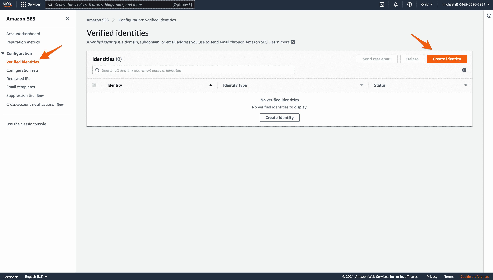

在“身份类型”下，选择“电子邮件地址”。输入您想要使用的电子邮件，然后单击“创建身份”。

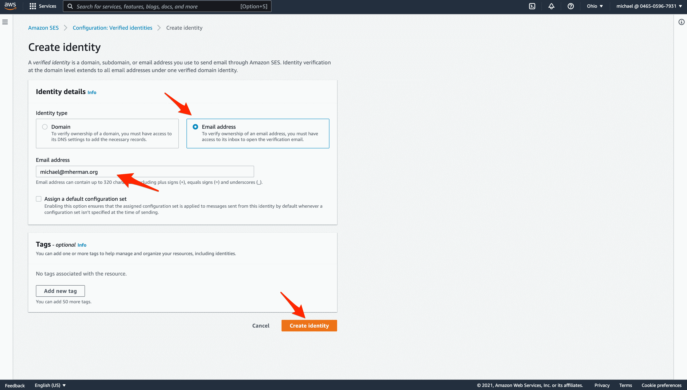

然后，点击电子邮件收件箱中的验证链接后，您应该会看到您的电子邮件在 SES 上得到验证。

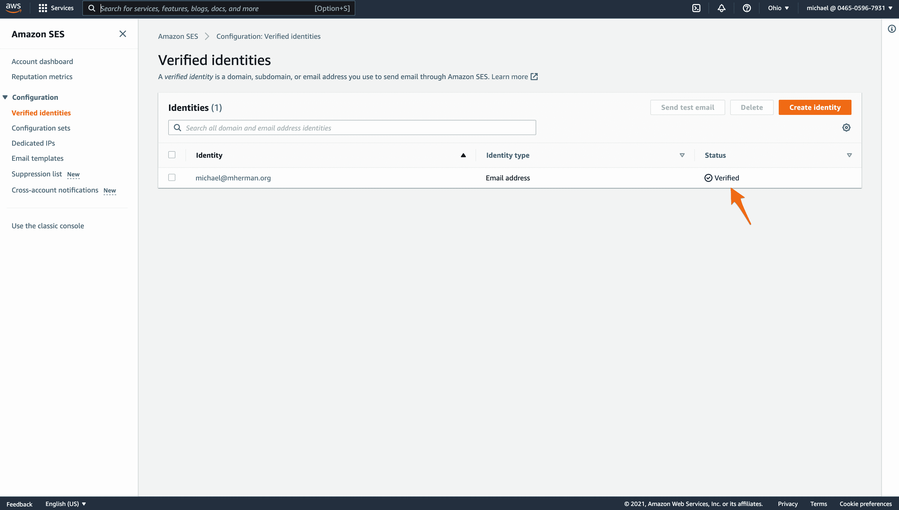

为了帮助防止欺诈，新账户会被自动置于沙盒模式，在这种模式下，你只能向你亲自向亚马逊核实过的地址发送电子邮件。幸运的是，这足以让我们将所有东西连接在一起。

> 你必须向 Amazon 请求退出沙盒模式。这可能需要一两天的时间，所以尽快开始。查看[走出亚马逊 SES 沙盒](https://docs.aws.amazon.com/ses/latest/DeveloperGuide/request-production-access.html)了解更多信息。

### 电子邮件

回到代码中，将`boto3`添加到需求文件中:

更新`send_email`:

```
`def send_email(email, body):
    # time.sleep(10)  # simulate long-running process
    ses = boto3.client(
        'ses',
        region_name=os.getenv('SES_REGION'),
        aws_access_key_id=os.getenv('AWS_ACCESS_KEY_ID'),
        aws_secret_access_key=os.getenv('AWS_SECRET_ACCESS_KEY')
    )
    ses.send_email(
        Source=os.getenv('SES_EMAIL_SOURCE'),
        Destination={'ToAddresses': [email]},
        Message={
            'Subject': {'Data': 'Confirm Your Account'},
            'Body': {
                'Text': {'Data': body}
            }
        }
    )
    user = User.query.filter_by(email=email).first()
    user.email_sent = True
    db.session.commit()
    return True` 
```

这里，我们创建了一个新的 SES 客户机资源，然后尝试发送一封电子邮件。

导入`os`和`boto3`:

更新 *docker-compose.yml* 中`worker`的环境变量，确保更新值:

```
`-  SES_REGION=us-east-2 -  SES_EMAIL_SOURCE=your_email -  AWS_ACCESS_KEY_ID=your_access_key_id -  AWS_SECRET_ACCESS_KEY=your_secret_access_key` 
```

> 值得注意的是，默认情况下，`Boto3`将检查`AWS_ACCESS_KEY_ID`和`AWS_SECRET_ACCESS_KEY`环境变量以获取凭证。因此，在创建 SES 客户端资源时，我们不需要显式地传递它们。换句话说，只要定义了这些环境变量，我们就可以简化代码:
> 
> ```
> ses = boto3.client('ses', region_name=os.getenv('SES_REGION')) 
> ```
> 
> 关于这方面的更多信息，请查看官方 Boto3 [文档](http://boto3.readthedocs.io/en/latest/guide/configuration.html)。

### 试验

更新容器:

```
`$ docker-compose up -d --build` 
```

然后，从浏览器注册一个用户，确保使用与 SES 相同的电子邮件。您应该会在收件箱中看到一封确认邮件。点击链接，您应该会被重定向回 [http://localhost:5003](http://localhost:5003) 。


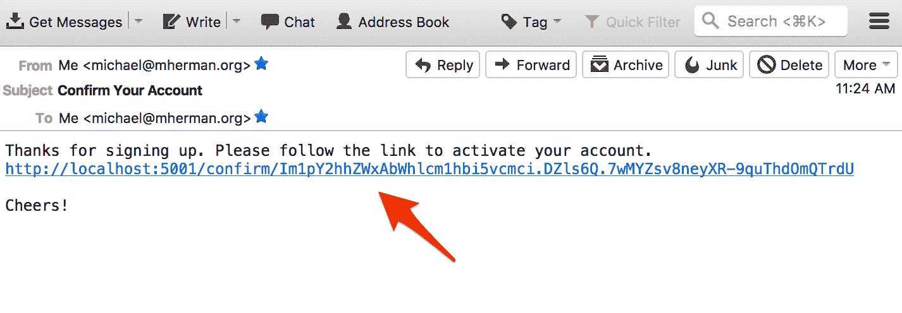


记住:如果你仍然处于沙盒模式，你只能发送电子邮件到验证过的地址。如果您尝试向未经验证的地址发送电子邮件，任务将会失败:

```
`raise error_class(parsed_response, operation_name)
botocore.errorfactory.MessageRejected: An error occurred (MessageRejected) when calling the SendEmail operation:
Email address is not verified. The following identities failed the check in region US-EAST-2: [[email protected]](/cdn-cgi/l/email-protection)` 
```

此外，由于您可能使用单个电子邮件地址进行测试，您可能希望删除模型上的唯一约束。否则，您需要在两次测试之间从数据库中删除用户。

```
`email = db.Column(db.String(255), unique=False, nullable=False)` 
```

虽然惟一的约束是`False`，但是您可能还想确保来自`confirm_email`视图的以下代码有效:

```
`if user.confirmed:
    flash('Account already confirmed.', 'success')
    return redirect(url_for('main.home'))` 
```

想想如何测试这个？

1.  在同一个邮箱下注册两个用户
2.  确认其中一个
3.  从数据库中删除未确认的用户
4.  尝试确认其他用户

您应该看到:

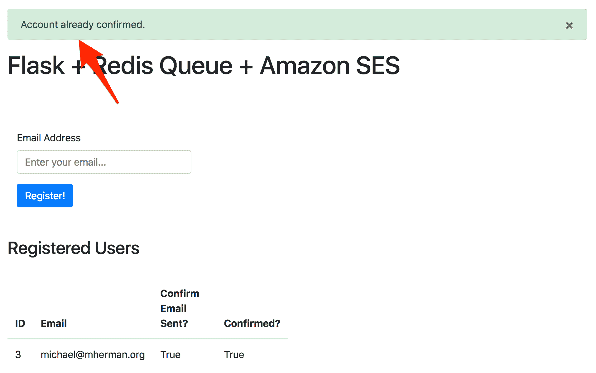

完成测试后，不要忘记将唯一约束添加回去！

> 有关我们通过`Boto3`在 SES 上发送电子邮件的过程的更多信息，请查看[使用用于 Python (Boto)](https://docs.aws.amazon.com/ses/latest/DeveloperGuide/send-using-sdk-python.html) 的 AWS SDK 发送电子邮件指南。

## 结论

在本教程中，我们详细介绍了如何发送确认电子邮件，新注册的用户必须在他们的帐户被完全激活之前点击。

寻找一些挑战？

1.  *Redis 队列*:添加 RQ Dashboard，一个基于 web 的 Redis 队列监控系统。*参见[带 Flask 和 Redis 队列的异步任务](https://testdriven.io/asynchronous-tasks-with-flask-and-redis-queue)了解更多信息。*
2.  *电子邮件模板*:如上所述，与纯文本电子邮件模板一起，生成确认电子邮件模板的 HTML 版本。
3.  工具:不喜欢我们正在使用的工具？把 Redis 队列换成芹菜，或者把 SES 换成 Mailgun。
4.  *重新发送确认电子邮件*:尝试将重新发送确认电子邮件的功能整合到此流程中。
5.  *密码重置*:同样，尝试将通过电子邮件重置密码添加到这个流程中。
6.  *验证码*:想要多一层安全保障？添加验证码或双因素认证(通过短信)。
7.  *处理失败*:如果出现异常会怎样？如果确认邮件发送失败，你可能会失去这个潜在用户。因此，您可能希望设置 Redis 队列的自动重试策略，以防失败。

和往常一样，你可以在 [repo](https://github.com/testdrivenio/flask-ses-rq) 中找到代码。干杯！