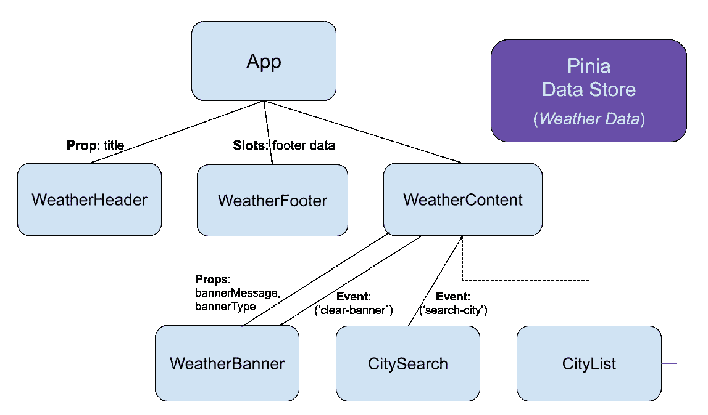
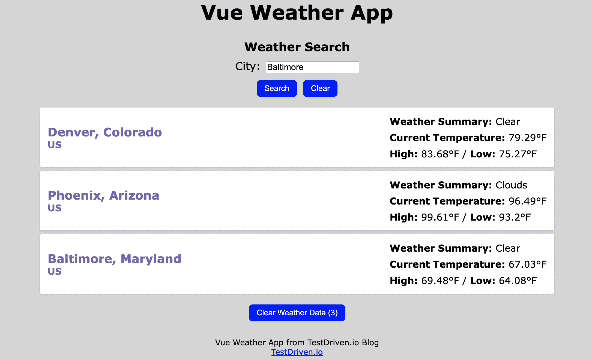

# 测试 Vue 中的 Pinia 数据存储

> 原文：<https://testdriven.io/blog/vue-pinia-testing/>

本教程描述了如何在 [Vue](https://vuejs.org) 应用程序中测试 [Pinia](https://pinia.vuejs.org) 数据存储。

* * *

这是测试 Vue 应用的两部分系列的第二部分:

1.  [Vue 组件单元测试指南](/blog/vue-unit-testing/)
2.  [测试 Vue 中的 Pinia 数据存储](/blog/vue-pinia-testing/)(本文！)

虽然您不必从第一篇文章开始，但建议至少回顾一下，为本文提供一点背景知识。

> 如果你有兴趣了解更多关于 Vue 的知识，可以看看我的课程:[通过构建和部署 CRUD 应用](/courses/learn-vue/)来学习 Vue。

*依赖关系*:

本文中使用的 Vue Weather App 项目的源代码(以及详细的安装说明)可以在 GitLab 上找到: [Vue Weather App](https://gitlab.com/patkennedy79/vue-weather-app) 。

## 目标

完成本文后，您应该能够:

1.  解释 Pinia 数据存储如何管理状态
2.  解释何时在 Vue 应用中使用 Pinia 数据存储
3.  编写用于测试 Pinia 数据存储的单元测试
4.  编写 Vue 组件如何与 Pinia 数据存储交互的测试
5.  使用 Vitest 运行单元测试

## 皮尼亚是什么？

[Pinia](https://pinia.vuejs.org) 是一个状态管理库。术语“状态管理”指的是 Vue 应用程序中通常由多个组件使用的集中式数据。

Pinia 既是一个库，它提供了创建反应式数据存储的工具，也是一组以受控方式访问(读/写)数据的设计模式。此外，Pinia 与 [Vue DevTools](https://devtools.vuejs.org/) 集成在一起，提供了非常好的调试/分析体验。

以下组件图说明了 Pinia 如何适应将在本教程中测试的 Vue 应用程序:



Pinia 数据存储包含 Vue 应用程序的全局数据。`WeatherContent`和`CityList`组件都与 Pinia 数据存储交互，以添加/检索天气数据。

### 何时使用 Pinia

一旦您了解了 Pinia，将所有数据从每个组件转移到一个数据存储中可能会很有诱惑力。但是，我建议将数据添加到由超过 1 个组件使用的数据存储中。

仅在单个组件中使用的数据最好保留在该组件中(以帮助缩小该数据的范围)。

由> 1 个组件共享的任何数据都是添加到数据存储中的良好候选。

当您开始使用 Pinia 时，您会注意到许多使用 props 和定制事件在组件之间传递的数据变得更适合数据存储。

### pinia 诉 Vuex 案

Vuex 是另一个流行的 Vue 项目状态管理库。虽然它在任何版本的 Vue 上都可以很好地工作，但是 Pinia 有一些简化，使得开发体验更简单，生成的代码更容易阅读和理解。

> 根据正在使用的 Vue 版本不同，Vuex 有不同的版本:Vuex 4.x 配合 Vue 3 使用；Vuex 3.x 与 Vue 2 配合使用。相比之下，Pinia 同时支持 Vue 2 和 Vue 3。

最后，Pinia 是 Vue 的[推荐状态管理库](https://pinia.vuejs.org/introduction.html#comparison-with-vuex)。

### 词汇

有几个术语在 Pinia 中有独特的含义，所以在我们深入研究 Pinia 的工作原理之前，我想先看一下每个术语:

*   **状态管理** -以可控的方式管理 Vue 应用的全局数据
*   **存储** -存储全局数据的地方
*   **状态** -商店中的全局数据
*   **Getters** -从存储中检索数据的方法
*   **动作** -修改商店中数据的方法

## Pinia 入门

在讨论如何测试 Pinia 数据存储之前，我想简单介绍一下我们将要测试的 [Vue 天气应用](https://gitlab.com/patkennedy79/vue-weather-app)。

> 要玩 Vue 天气应用，请在 Netlify 上查看该应用: [Vue 天气应用- Netlify](https://snazzy-taffy-cd99f4.netlify.app)

如果你想在你的本地机器上运行这个应用，你需要克隆这个库并使用 [NPM](https://www.npmjs.com) 安装依赖项:

```py
`$ git clone [[email protected]](/cdn-cgi/l/email-protection):patkennedy79/vue-weather-app.git
$ cd vue-weather-app
$ npm install` 
```

完成后，可以通过启动开发服务器来运行应用程序:

应用程序构建完成后，您会看到类似于以下内容的成功消息:

```py
`vite v2.9.14 dev server running at:

 > Local: http://localhost:3000/
 > Network: use `--host` to expose

 ready in 543ms.` 
```

此时，开发服务器将启动并运行。您可以通过在您最喜欢的网络浏览器中导航到 [http://localhost:3000](http://localhost:3000) 来查看该应用程序。您可以按城市名称搜索以查看某个城市的当前天气:



使用 [OpenWeather API](https://openweathermap.org) 检索所搜索城市的天气数据；这些城市按搜索顺序排列。点击“清除天气数据”按钮，可以清除城市列表。

> 有关完整的先决条件和安装说明，请查看 GitLab 上的[自述文件](https://gitlab.com/patkennedy79/vue-weather-app#installation-instructions)。

如果你有兴趣了解更多关于 Pinia 的知识，请查看我的 Vue 课程，该课程教授如何在 Vue 应用中使用 Pinia:[通过构建和部署 CRUD 应用](/courses/learn-vue/)来学习 Vue。

### 装置

应使用 NPM 安装 Pinia:

一旦安装完成，您应该会看到`pinia`已经作为依赖项添加到 *package.json* 中:

```py
`"dependencies":  { "axios":  "^0.27.2", "pinia":  "^2.0.20", "vue":  "^3.2.37" },` 
```

此外，因为我们将测试用 Pinia 创建的数据存储，所以安装 Pinia 测试包:

```py
`$ npm install @pinia/testing --save-dev` 
```

一旦安装完成，您应该会看到`@pinia/testing`已经作为开发依赖项添加到 *package.json* 中:

```py
`"devDependencies":  { "@pinia/testing":  "^0.0.14", }` 
```

### 项目结构

在 Vue 项目中,“src”文件夹包含 Vue 组件和 Pinia 数据存储:

```py
`% tree -L 2 src
src
├── App.vue
├── assets
│   ├── base.css
│   └── main.css
├── components
│   ├── CityList.vue
│   ├── ...
│   ├── WeatherHeader.vue
│   └── __tests__
│       ├── App.spec.js
│       ├── ...
│       └── WeatherHeader.spec.js
├── main.js
└── stores
    ├── __tests__
    │   └── cities.spec.js
    └── cities.js` 
```

Pinia 数据存储在“src/stores”中。每个 Pinia 数据存储应该是“src/stores”文件夹中的一个单独的文件。

Pinia 数据存储的单元测试文件存储在“src/stores/__tests__”中。每个 Pinia 数据存储都应该有一个单独的单元测试文件。

### 数据存储

本教程将测试的 Pinia 数据存储存储不同城市的天气数据:

```py
`import  {  defineStore  }  from  'pinia' export  const  useCitiesStore  =  defineStore('cities',  { // state is the data being stored in the data store state:  ()  =>  ({ // List of Objects representing the weather for cities: //   - cityName: name of the city //   - stateName: name of the state (if applicable) //   - countryAbbreviation: abbreviation of the country //   - weatherSummary: brief description of the current weather //   - currentTemperature: current temperature (in degrees F) //   - dailyHigh: high temperature (in degrees F) for today //   - dailyLow: low temperature (in degrees F) for today weatherData:  [] }), // getters return data from the data store getters:  { getNumberOfCities:  (state)  =>  {  return  state.weatherData.length  } }, // actions are operations that change the state actions:  { addCity(city,  state,  country,  summary,  currentTemp,  high,  low)  { // Check if the city is already saved if  (this.weatherData.find(({  cityName  })  =>  cityName  ===  city)  ===  undefined)  { this.weatherData.push({ 'cityName':  city, 'stateName':  state, 'countryAbbreviation':  country, 'weatherSummary':  summary, 'currentTemperature':  currentTemp, 'dailyHigh':  high, 'dailyLow':  low }) } }, clearAllCities()  { // Setting the `weatherData` array to a length of zero clears it this.weatherData.length  =  0 } } })` 
```

属性定义了被存储的数据，这是一个代表不同城市天气的对象数组。

在`getters`属性中有一个元素用于检索存储的城市数量。

有两个`actions`用于修改正在存储的数据:

1.  `addCity()` -添加城市天气数据的动作
2.  `clearAllCities()` -删除所有城市天气数据的动作

## 单元测试 Pinia 数据存储

### 单元测试结构

当对 Pinia 数据存储进行单元测试时，应通过导入来使用**实际**存储:

```py
`import  {  describe,  it,  expect,  beforeEach  }  from  'vitest' import  {  setActivePinia,  createPinia  }  from  'pinia' import  {  useCitiesStore  }  from  '@/stores/cities'  // <-- !! describe('Data Store Test',  ()  =>  { let  store  =  null beforeEach(()  =>  { // create a fresh Pinia instance and make it active so it's automatically picked // up by any useStore() call without having to pass it to it: // `useStore(pinia)` setActivePinia(createPinia()) // create an instance of the data store store  =  useCitiesStore() }) it('initializes with correct values',  ()  =>  {  ...  }) it('test adding a new city',  ()  =>  {  ...}) it('test adding a duplicate city',  ()  =>  {  ...  }) it('test removing all cities',  ()  =>  {  ...  }) })` 
```

Pinia 数据存储被导入以在单元测试文件中使用:

```py
`import  {  useCitiesStore  }  from  '@/stores/cities'` 
```

> 在`import`语句中使用的`@`是 Vue 项目中“src”文件夹的别名。

在`beforeEach()`函数(在每个单元测试函数之前执行)中，`pinia`实例被创建并激活:

```py
`beforeEach(()  =>  { // create a fresh Pinia instance and make it active so it's automatically picked // up by any useStore() call without having to pass it to it: // `useStore(pinia)` setActivePinia(createPinia()) // create an instance of the data store store  =  useCitiesStore() })` 
```

一旦`pinia`被激活，Pinia 数据存储器的一个实例-即被测单元！-可以使用`useCitiesStore()`创建。

### 单元测试

有了单元测试文件的结构，就可以编写单元测试来测试 getters 和 actions 了。

首先，检查 Pinia 数据存储是否用空数组初始化:

```py
`it('initializes with zero cities',  ()  =>  { expect(store.getNumberOfCities).toEqual(0) })` 
```

接下来，测试使用`addCity()`动作的名义场景:

```py
`it('test adding a new city',  ()  =>  { // Call the 'addCity' action store.addCity('Chicago',  'Illinois',  'US',  'cloudy',  75.6,  78.9,  65.2) // Check that the city was added expect(store.getNumberOfCities).toEqual(1) expect(store.weatherData.length).toEqual(1) expect(store.weatherData[0]).toEqual({ 'cityName':  'Chicago', 'stateName':  'Illinois', 'countryAbbreviation':  'US', 'weatherSummary':  'cloudy', 'currentTemperature':  75.6, 'dailyHigh':  78.9, 'dailyLow':  65.2 }) })` 
```

此外，在使用`addCity()`动作时，测试城市已经在`weatherData`数组中的非名义场景也是一个好主意:

```py
`it('test adding a duplicate city',  ()  =>  { // Call the 'addCity' action store.addCity('New Orleans',  'Louisiana',  'US',  'sunny',  87.6,  78.9,  65.2) // Check that the city was added expect(store.weatherData.length).toEqual(1) expect(store.weatherData[0].cityName).toMatch('New Orleans') // Attempt to add the same city store.addCity('New Orleans',  'Louisiana',  'US',  'sunny',  87.6,  78.9,  65.2) // Check that only 1 instance of the city name is saved expect(store.weatherData.length).toEqual(1) expect(store.weatherData[0].cityName).toMatch('New Orleans') })` 
```

最后，用`clearAllCities()`动作测试从存储中删除所有数据:

```py
`it('test removing all cities',  ()  =>  { // Add two cities to the data store store.addCity('New Orleans',  'Louisiana',  'US',  'sunny',  87.6,  78.9,  65.2) store.addCity('Denver',  'Colorado',  'US',  'windy',  94.5,  95.6,  56.7) // Check that the cities were added expect(store.weatherData.length).toEqual(2) // Remove a city store.clearAllCities() // Check that zero cities remain in the data store expect(store.weatherData.length).toEqual(0) })` 
```

当对 Pinia 数据存储进行单元测试时，测试应该关注 Vue 组件将如何使用数据存储。通常，这些单元测试应该集中在修改数据存储的**状态**的**动作**上。

## 使用 Pinia 数据存储进行测试

### 概观

当测试使用 Pinia 数据存储的 Vue 组件时，应该使用`createTestingPinia`插件来创建一个 Pinia 实例，该实例是为**测试**而设计的。

具体来说，所有的 Pinia 数据存储都将被嘲笑，因此您可以专注于测试 Vue 组件。这种方法意味着 Vue 组件测试应该关注与 Pinia 数据存储的两个关键交互:

1.  安装组件时初始化 Pinia 数据存储
2.  监视 Pinia 数据存储中的动作，以确保它们在适当的时间被调用

### 单元测试

当单元测试使用 Pinia 数据存储的 Vue 组件时，您需要从 Pinia 测试模块导入`createTestingPinia`:

```py
`import  {  describe,  it,  expect,  vi,  beforeEach,  afterEach  }  from  'vitest' import  {  shallowMount  }  from  '@vue/test-utils' import  CityList  from  '@/components/CityList.vue' import  {  createTestingPinia  }  from  '@pinia/testing'  // <-- !! import  {  useCitiesStore  }  from  '@/stores/cities'` 
```

除了`createTestingPinia`之外，还需要从 Pinia 数据存储中导入`useCitiesStore()`函数，以测试数据存储中是否调用了正确的“动作”。

本教程将介绍两个单元测试套件(复杂性逐渐增加)。

第一个单元测试套件测试当 Pinia 数据存储为空时 Vue 组件如何工作:

```py
`describe('CityList.vue Test with empty data store',  ()  =>  { let  wrapper  =  null // SETUP - run prior to each unit test beforeEach(()  =>  { // render the component wrapper  =  shallowMount(CityList,  { global:  { plugins:  [ createTestingPinia({ createSpy:  vi.fn }) ] } }) }) // TEARDOWN - run after each unit test afterEach(()  =>  { wrapper.unmount() }) it('initializes with zero elements displayed',  ()  =>  { // check that zero city cards are displayed expect(wrapper.findAll('h2').length).toEqual(0) // check that the 'Clear Weather Data' button is not displayed expect(wrapper.findAll('button').length).toEqual(1) expect(wrapper.findAll('button')[0].isVisible()).toBeFalsy() }) })` 
```

当安装组件(使用`shallowMount()`)时，利用`createTestingPinia()`创建对所有动作的监视:

```py
`// render the component wrapper  =  shallowMount(CityList,  { global:  { plugins:  [ createTestingPinia({ createSpy:  vi.fn }) ] } })` 
```

该单元测试套件中的单个单元测试检查零卡是否显示，以及“清除天气数据”按钮是否显示:

```py
`it('initializes with zero elements displayed',  ()  =>  { // check that zero city cards are displayed expect(wrapper.findAll('h2').length).toEqual(0) // check that the 'Clear Weather Data' button is not displayed expect(wrapper.findAll('button').length).toEqual(1) expect(wrapper.findAll('button')[0].isVisible()).toBeFalsy() })` 
```

第二个单元测试套件用两个城市的天气数据初始化 Pinia 数据存储:

```py
`describe('CityList.vue Test with filled data store',  ()  =>  { let  wrapper  =  null let  store  =  null // SETUP - run prior to each unit test beforeEach(()  =>  { // render the component and initialize the data store // to contain weather data for (2) cities wrapper  =  shallowMount(CityList,  { global:  { plugins:  [ createTestingPinia({ createSpy:  vi.fn, initialState:  { cities:  { weatherData:  [ { 'cityName':  'New Orleans', 'stateName':  'Louisiana', 'countryAbbreviation':  'US', 'weatherSummary':  'sunny', 'currentTemperature':  77.6, 'dailyHigh':  78.9, 'dailyLow':  65.2 }, { 'cityName':  'Dublin', 'stateName':  '', 'countryAbbreviation':  'IE', 'weatherSummary':  'windy', 'currentTemperature':  64.5, 'dailyHigh':  65.6, 'dailyLow':  46.7 } ] } } }) ] } }) // create the data store using the testing pinia store  =  useCitiesStore() }) // TEARDOWN - run after each unit test afterEach(()  =>  { wrapper.unmount() }) it('displays city weather from the data store',  ()  =>  {  ...  }) it('calls the correct action when the weather data is cleared',  async  ()  =>  {  ...  }) })` 
```

当 Vue 组件被安装(通过`shallowMount()`)时，`createTestingPinia()`用于创建对所有动作的监视。此外，定义了`initialState`属性来初始化 Pinia 数据存储:

```py
`// render the component and initialize the data store // to contain weather data for (2) cities wrapper  =  shallowMount(CityList,  { global:  { plugins:  [ createTestingPinia({ createSpy:  vi.fn, initialState:  { cities:  { weatherData:  [ { 'cityName':  'New Orleans', 'stateName':  'Louisiana', 'countryAbbreviation':  'US', 'weatherSummary':  'sunny', 'currentTemperature':  77.6, 'dailyHigh':  78.9, 'dailyLow':  65.2 }, { 'cityName':  'Dublin', 'stateName':  '', 'countryAbbreviation':  'IE', 'weatherSummary':  'windy', 'currentTemperature':  64.5, 'dailyHigh':  65.6, 'dailyLow':  46.7 } ] } } }) ] } })` 
```

在指定`initialState`属性时，指定的对象需要以 Pinia 数据商店名称开始(在本例中，`cities`是在 *src/stores/cities.js* 中使用`defineStore()`创建商店时指定的名称)。接下来，指定“状态”(在这种情况下，`weatherData`)并指定数据的初始数组。

指定了 Pinia 数据存储的首字母`state`后，该测试套件中的第一个单元测试检查来自存储的数据是否正确显示:

```py
`it('displays city weather from the data store',  ()  =>  { // check that two city cards are displayed const  cityHeadings  =  wrapper.findAll('h2') expect(cityHeadings.length).toEqual(2) expect(cityHeadings[0].text()).toMatch('New Orleans, Louisiana') expect(cityHeadings[1].text()).toMatch('Dublin') const  citySubHeadings  =  wrapper.findAll('h3') expect(citySubHeadings.length).toEqual(2) expect(citySubHeadings[0].text()).toMatch('US') expect(citySubHeadings[1].text()).toMatch('IE') const  cityWeatherData  =  wrapper.findAll('p') expect(cityWeatherData.length).toEqual(6) expect(cityWeatherData[0].text()).toMatch('Weather Summary: sunny') expect(cityWeatherData[1].text()).toMatch('Current Temperature: 77.6') expect(cityWeatherData[2].text()).toMatch('High: 78.9°F / Low: 65.2°F') expect(cityWeatherData[3].text()).toMatch('Weather Summary: windy') expect(cityWeatherData[4].text()).toMatch('Current Temperature: 64.5') expect(cityWeatherData[5].text()).toMatch('High: 65.6°F / Low: 46.7°F') // check that the 'Clear Weather Data' button is displayed expect(wrapper.findAll('button').length).toEqual(1) expect(wrapper.findAll('button')[0].isVisible()).toBeTruthy() expect(wrapper.findAll('button')[0].text()).toMatch('Clear Weather Data (2)') })` 
```

第二个单元测试检查单击“清除天气数据”按钮时是否调用了正确的“操作”:

```py
`it('calls the correct action when the weather data is cleared',  async  ()  =>  { // create the data store using the testing pinia const  store  =  useCitiesStore() // trigger an event when the 'Clear Weather Data' button is clicked wrapper.findAll('button').at(0).trigger('click') // check that the 'clearAllCities' action was called on the data store expect(store.clearAllCities).toHaveBeenCalledTimes(1) })` 
```

请注意，该测试并不检查 Pinia 数据存储中的数据是否发生了变化，因为我们已经在 Pinia 数据存储的单元测试中对此进行了测试。当测试 Vue 组件时，我们关心的是**如何与 Pinia 数据存储交互**(即，是否调用了正确的操作？).

### 其他注意事项

如果您对您的 Vue 应用程序(使用`mount()`)进行顶级测试，它还需要创建一个 Pinia 的测试版本，因为与 Pinia 数据存储交互的 Vue 子组件将在测试期间安装。

下面是一个顶级测试文件的示例，它检查是否呈现了正确的组件:

```py
`import  {  describe,  it,  expect,  vi  }  from  'vitest' import  {  mount  }  from  '@vue/test-utils' import  App  from  '@/App.vue' import  {  createTestingPinia  }  from  '@pinia/testing' describe('App.vue Test',  ()  =>  { it('renders the page',  ()  =>  { // render the component const  wrapper  =  mount(App,  { global:  { plugins:  [ createTestingPinia({ createSpy:  vi.fn }) ] } }) // check that all 3 sub-components are rendered expect(wrapper.getComponent({  name:  'WeatherHeader'  }).exists()).toBeTruthy() expect(wrapper.getComponent({  name:  'WeatherContent'  }).exists()).toBeTruthy() expect(wrapper.getComponent({  name:  'WeatherFooter'  }).exists()).toBeTruthy() }) })` 
```

就像前面的例子一样，`App`组件需要用`createTestingPinia`插件`mount`编辑。这允许与 Pinia 数据存储交互的任何子组件与测试版本的 Pinia 一起执行。

## 运行测试

Vitest 可用于运行单元测试，如下所示:

```py
`$ npm run test:unit
...

 ✓ src/components/__tests__/CitySearch.spec.js (5)
 ✓ src/components/__tests__/WeatherBanner.spec.js (5)
 ✓ src/components/__tests__/WeatherFooter.spec.js (2)
 ✓ src/components/__tests__/CityList.spec.js (3)
 ✓ src/components/__tests__/WeatherHeader.spec.js (1)
 ✓ src/components/__tests__/WeatherContent.spec.js (5)
 ✓ src/components/__tests__/App.spec.js (1)
 ✓ src/stores/__tests__/cities.spec.js (4)

Test Files  8 passed (8)
     Tests  26 passed (26)
      Time  3.44s (in thread 801ms, 429.95%)

 PASS  Waiting for file changes...
       press h to show help, press q to quit` 
```

太棒了。我们可以成功地运行我们的单元测试。

> 通过`npm`为你的 Vue 项目运行的所有可用命令都在 *package.json* 的`scripts`字段中定义。

Vitest 的默认配置是在[监视模式](https://vitest.dev/guide/features.html#watch-mode)下运行测试，这意味着每次保存到一个适用的文件时，测试套件都会被重新执行。要更改此配置，使 Vitest 只运行一次(没有“监视模式”)，请更新 *package.json* 中的`test:unit`配置，以包含`run`参数:

```py
`"test:unit":  "vitest run --environment jsdom",` 
```

运行相同的`npm run test:unit`命令现在将导致 Vitest 运行一次，然后完成其执行(没有“监视模式”)。

## 结论

Pinia 数据存储是在 Vue 应用程序中存储全局数据的好方法。

测试 Pinia 数据存储应分为两类:

*   数据存储的单元测试——测试“getters”和“actions”是否正常工作
*   使用数据存储的 Vue 组件的单元测试——测试检索数据和正确调用“动作”

虽然配置单元测试文件以与 Pinia 一起工作有些复杂，但是测试 Pinia 数据存储可以在您的 Vue 应用程序的一个关键方面提供信心。

> 同样，如果你有兴趣了解更多关于 Vue 的知识，可以看看我的课程:[通过构建和部署 CRUD 应用](/courses/learn-vue/)来学习 Vue。

* * *

这是测试 Vue 应用的两部分系列的第二部分:

1.  [Vue 组件单元测试指南](/blog/vue-unit-testing/)
2.  [测试 Vue 中的 Pinia 数据存储](/blog/vue-pinia-testing/)(本文！)